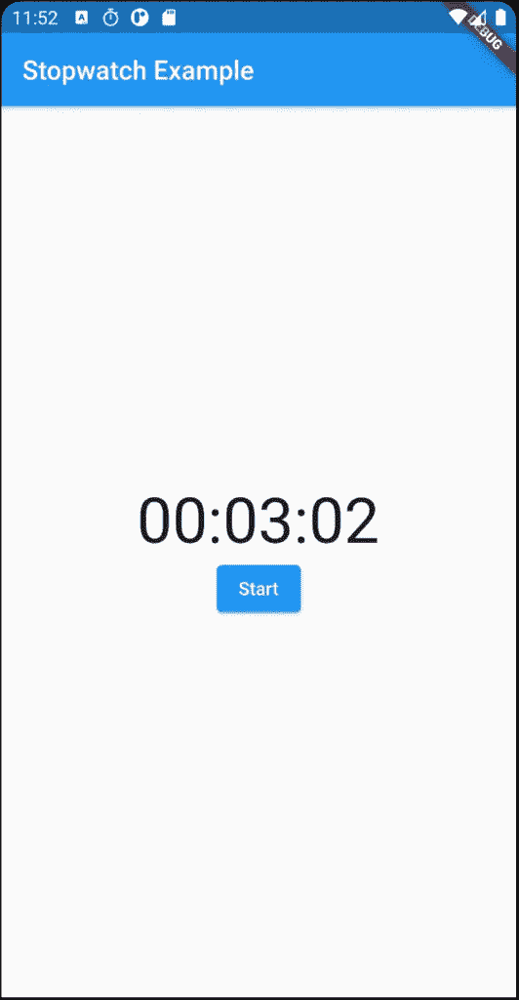

# 使用 Flutter 创建秒表应用程序

> 原文：<https://itnext.io/create-a-stopwatch-app-with-flutter-f0dc6a176b8a?source=collection_archive---------1----------------------->


我最近一直在学习 Flutter 和 Dart 语言，它们给我留下了深刻的印象。Flutter 很大程度上受到 React 的启发，许多概念已经很熟悉了:有状态/无状态、渲染函数、组件层次结构等等。至于支持 Flutter 的 Dart 语言，它继承了其他语言的许多最好的特性，同时避免了不好的东西，所以如果你已经知道 python、JavaScript、C++，你可以很快学会 Dart。

好了，让我们回到这篇文章的主题:创建秒表应用程序。有一些关于如何制作秒表的帖子(像[这个](https://medium.com/analytics-vidhya/build-a-simple-stopwatch-in-flutter-a1f21cfcd7a8)，但是我想分享一个替代的方法。

这篇文章中的例子使用了 Android Studio。如果您还没有这样做，请按照 Flutter 文档中的[“开始”部分来设置 Flutter 和 Android Studio。](https://flutter.dev/docs/get-started/install)

# 这个想法

旋舞提供了一个`[Stopwatch](https://api.flutter.dev/flutter/dart-core/Stopwatch-class.html)` [类](https://api.flutter.dev/flutter/dart-core/Stopwatch-class.html)。可以启动或停止，经过的时间可以从`elapsedMilliseconds`属性中读取。所以从技术上讲，我们可以建立一个带有`Stopwatch`实例的页面，然后简单地显示`stopwatch.elapsedMilliseconds`。

然而，有一个问题:`Stopwatch`不提供任何回调，所以我们不知道何时执行重新渲染。这里`[Timer](https://api.flutter.dev/flutter/dart-async/Timer-class.html)` [级](https://api.flutter.dev/flutter/dart-async/Timer-class.html)前来救援。它以给定的时间间隔触发回调。因此，我们可以使用一个`Timer`来触发重新渲染，读取`stopwatch.elapsedMilliseconds`并重建页面。

# 履行

在 Android Studio 中创建新的 Flutter 项目，然后用下面的代码替换`main.dart`。

```
import 'package:flutter/material.dart';void main() {
  runApp(MyApp());
}String formatTime(int milliseconds) {
  var secs = milliseconds ~/ 1000;
  var hours = (secs ~/ 3600).toString().padLeft(2, '0');
  var minutes = ((secs % 3600) ~/ 60).toString().padLeft(2, '0');
  var seconds = (secs % 60).toString().padLeft(2, '0'); return "$hours:$minutes:$seconds";
}class MyApp extends StatelessWidget {
  @override
  Widget build(BuildContext context) {
    return MaterialApp(title: 'Stopwatch Example', home: StopwatchPage());
  }
}class StopwatchPage extends StatefulWidget {
  @override
  _StopwatchPageState createState() => _StopwatchPageState();
}class _StopwatchPageState extends State<StopwatchPage> {
  Stopwatch _stopwatch; @override
  void initState() {
    super.initState();
    _stopwatch = Stopwatch();
  } void handleStartStop() {
    if (_stopwatch.isRunning) {
      _stopwatch.stop();
    } else {
      _stopwatch.start();
    }
    setState(() {});    // re-render the page
  } @override
  Widget build(BuildContext context) {
    return Scaffold(
      appBar: AppBar(title: Text('Stopwatch Example')),
      body: Center(
        child: Column(
          mainAxisAlignment: MainAxisAlignment.center,
          children: <Widget>[
            Text(formatTime(_stopwatch.elapsedMilliseconds), style: TextStyle(fontSize: 48.0)),
            ElevatedButton(onPressed: handleStartStop, child: Text(_stopwatch.isRunning ? 'Stop' : 'Start')),
          ],
        ),
      ),
    );
  }
}
```

主类`StopwatchPage`是一个`StatefulWidget`，他创建了一个`Stopwatch`实例`_stopwatch`。`_stopwatch.elapsedMilliseconds`由`formatTime`函数格式化并显示在页面上。一个按钮控制`_stopwatch`的启动/停止。非常简单的设置。



运行这个应用程序，你会看到上面的页面。您还会注意到，单击“开始”按钮后，秒表不会增加。它实际上正在运行，因为如果你反复点击“开始”/“停止”按钮，你会看到时间增加。这就是我们在“想法”部分讨论的问题——我们不知道何时重新呈现页面。`_stopwatch`在后台运行，只是不显示。

我们将添加一个`Timer`实例来帮助重新渲染。

```
 **Timer _timer;** @override
  void initState() {
    super.initState();
    _stopwatch = Stopwatch();
    **// re-render every 30ms
    _timer = new Timer.periodic(new Duration(milliseconds: 30), (timer) {
      setState(() {});
    });**
  } **@override
  void dispose() {
    _timer.cancel();
    super.dispose();
  }**
```

在上面的代码中，我们创建了一个每 30 毫秒调用一次`setState`的`Timer`实例。这将帮助我们重新呈现页面并反映实际的秒表值。

现在重启应用程序(由于`initState()`中发生了更改，热重装将不起作用)。单击“开始”按钮，您将看到秒表正常工作。

# 结论

你可以访问我的 GitHub 查看[这篇帖子的完整代码](https://github.com/charlee/stopwatch_example)。

简而言之，秒表由两部分组成:计算时间的`Stopwatch`实例和呈现页面的`Timer`实例。

当然，这个应用程序可以进一步改进，例如改进`Timer`回调，以便只有当格式化的时间字符串改变时才触发重新渲染。为了使这篇文章简短，我将把它留给读者。

但是请记住，如果应用程序转到后台，在 UI 小部件中创建的`Stopwatch`实例将无法存活。我在 Android 上的测试显示，应用程序停止运行几分钟后，秒表就会停止计时。

所以秒表只能在应用程序激活时使用。要创建一个即使应用程序不活动也能运行的真正的秒表，需要一些先进的方法，例如需要在 Android 上创建一个[前台服务](https://developer.android.com/guide/components/foreground-services)。