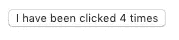
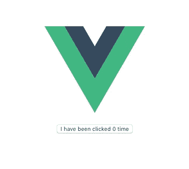

# 创建 Vue.js 组件库(第 1 部分)

> 原文：<https://itnext.io/create-a-vue-js-component-library-as-a-module-part-1-a1116e632751?source=collection_archive---------0----------------------->

我已经做了几个月的 Vue.js 项目了。最初它应该是一个只存在于一个元项目中的项目，但是我们现在正在考虑在其他平台上发布它。

为了不复制粘贴代码和维护它的多个副本，我认为将这个项目打包是一件很棒的事情。显然有很多好处:易于安装，每个人都将从更新中受益，一个错误修复一次将为每个人修复，等等。

有一个不利的想法:我以前从未做过 Vue.js 包。

我是这样做的。

在第一部分中，我们将编写两个 Vue.js 应用程序:

*   包含基本组件的库或包
*   将使用刚刚创建的库的应用程序

# 先决条件

我将使用 [yarn](https://yarnpkg.com/) 作为包管理器，使用 [vue-cli](https://cli.vuejs.org/) 来创建和构建我们的库和应用程序。

如果您的机器上没有纱线，请参考[和](https://yarnpkg.com/lang/en/docs/install/)进行安装。

完成后，安装 vue-cli:

```
yarn global add @vue/cli
```

# 该应用程序

我们将需要一个应用程序来导入我们的库。由于有了 vue-cli，创建一个非常容易:

```
vue create sampleapp
```

你应该有一个关于你想要选择哪个预置的问题。

```
? Please pick a preset: (Use arrow keys)
❯ default (babel, eslint)
  Manually select features
```

让我们在这里选择默认的。创建后，转到该文件夹并运行:

```
yarn serve
```

这将启动一个开发服务器，如果你打开一个浏览器，并前往 [http://localhost:8080/](http://localhost:8080/) 。您应该会看到一个基本的 Vue.js 应用程序

我们现在有了自己的应用程序。耶！

# 图书馆

## 设置

我们现在将创建库，该库将导入到我们刚刚在上面创建的应用程序中。库和其他应用一样是 Vue.js 应用。区别在于它将如何建造。

但是首先要创建库:

```
vue create dummylib
```

一旦完成，打开你最喜欢的编辑器。是时候稍微编码一下了！

打开`package.json`并寻找`scripts`节点。您应该会看到类似这样的内容:

```
"scripts": {
  "serve": "vue-cli-service serve",
  "build": "vue-cli-service build",
  "lint": "vue-cli-service lint"
},
```

这些是可用的命令。我们之前已经使用过`serve`。但是还有另外两个:

*   `build`旨在创建应用程序的生产就绪版本
*   `lint`用于检查你的代码是否遵守了指导方针

如前所述，库与应用程序的不同之处在于它的构建方式。默认情况下，“库模式构建”不可用。我们需要添加它。以下是命令:

```
vue-cli-service build --target lib --name myLib [entry]
```

可以在 vue-cli [官方文档](https://cli.vuejs.org/guide/build-targets.html#library)中找到。

我们将把 lib 重命名为“dummylib”，我们的“入口点”是`src/main.js`。向`package.json`文件添加一个新脚本。你可以随意命名(这里我决定选`build-lib`)。

```
"scripts": {
  "serve": "vue-cli-service serve",
  "build": "vue-cli-service build",
  "build-lib": "vue-cli-service build --target lib --name dummylib src/main.js",
  "lint": "vue-cli-service lint"
},
```

现在尝试运行`yarn build-lib`,您应该会在屏幕上看到类似这样的内容:

```
DONE  Compiled successfully in 1389ms                                                                                      10:15:58 AMFile                        Size                    Gzippeddist/dummylib.umd.min.js    5.43 KiB                1.98 KiB
dist/dummylib.umd.js        19.94 KiB               4.56 KiB
dist/dummylib.common.js     19.46 KiB               4.42 KiB
dist/dummylib.css           0.33 KiB                0.23 KiBImages and other types of assets omitted.✨  Done in 2.91s.
```

这意味着构建成功。如果你看一下`dist`文件夹，你会看到很多文件。

我们现在需要定义导入我们的包的任何应用程序应该使用什么文件。我们打算选择`common.js`这款。为此，在您的`package.json`文件中添加以下行:

```
"main": "./dist/dummylib.common.js"
```

## 创建一个组件

现在我们有了库设置，是时候创建一个组件了。让我们称之为“虚拟按钮”

在`components`文件夹中创建一个名为`DummyButton.vue`的新文件。

在本教程中，我们将创建一个非常简单的组件。这将是一个按钮，显示它被点击了多少次。

下面是`DummyButton.vue`代码:

```
<template>
  <div>
    <button @click="increment">{{ text }}</button>
  </div>
</template><script>
export default {
  data () {
    return {
      count: 0
    }
  },
  computed: {
    times () {
      return this.count > 1
        ? 'times'
        : 'time'
    },
    text () {
      return `I have been clicked ${this.count} ${this.times}`
    }
  },
  methods: {
    increment () {
      this.count += 1
    }
  }
}
</script>
```

这里没什么太复杂的。`vue-cli`甚至提供了一种查看我们组件运行情况的方式:

```
vue serve src/components/DummyButton.vue
```

您应该会看到类似这样的内容



每次你点击按钮，文本都会更新。

最后，为了从另一个应用程序导入我们的库，我们需要告诉它将要暴露什么。

打开您的`main.js`文件，删除所有内容并复制粘贴以下内容:

```
import DummyButton from './components/DummyButton.vue'export default DummyButton
```

上面的代码非常简单:我们导入刚刚创建的组件并公开它。

别忘了重建图书馆。

我们现在有自己的图书馆了！

# 在应用程序中导入图库

我们现在既有我们的图书馆，也有我们的应用程序。大多数情况下，您现在必须发布您的库，然后从 npm 注册表中导入它。多亏了`yarn`,现在不需要做所有的事情。您可以导入本地库。

```
yarn add ../dummylib
```

您的应用程序现在将库作为一个依赖项。如果您检查您的`package.json`文件，您应该在`dependencies`节点中看到它。

```
"dependencies": {
  "core-js": "^2.6.5",
  "dummylib": "../dummylib",
  "vue": "^2.6.10"
},
```

耶！

让我们更新一下`App.vue`组件，看看是否一切都按预期运行

您的`App.vue`文件现在应该看起来像这样:

```
<template>
  <div id="app">
    
    <HelloWorld msg="Welcome to Your Vue.js App"/>
  </div>
</template><script>
import HelloWorld from './components/HelloWorld.vue'
export default {
  name: 'app',
  components: {
    HelloWorld
  }
}
</script><style>
#app {
  font-family: 'Avenir', Helvetica, Arial, sans-serif;
  -webkit-font-smoothing: antialiased;
  -moz-osx-font-smoothing: grayscale;
  text-align: center;
  color: #2c3e50;
  margin-top: 60px;
}
</style>
```

您可以删除与`HelloWorld`组件相关的所有内容，导入`DummyButton`并将其添加到模板中。

您现在应该有以下内容(我省略了 CSS 部分):

```
<template>
  <div id="app">
    
    <dummy-button />
  </div>
</template><script>
import DummyButton from 'dummylib'
export default {
  name: 'app',
  components: {
    DummyButton
  }
}
</script>
```

现在，让我们看看我们的应用程序是否有我们的按钮，并让我们检查这是否按预期工作。

`yarn serve`

看看我们这里有什么！一个从我们刚刚创建的库中导入组件的应用程序！



这是第一部分。我们已经设置好了基础。一个可以在任何 Vue.js 应用中轻松使用的简单组件。

如果您只有单个文件组件要导出，这实际上已经足够了。但在我的案例中，我的组件依赖于 Vuex 商店。我将在第二部分解释如何处理这种情况。

在这里！