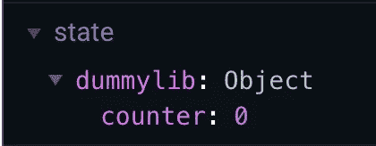

# 创建 Vue.js 组件库(第 2 部分)

> 原文：<https://itnext.io/create-a-vue-js-component-library-part-2-c92a42af84e9?source=collection_archive---------3----------------------->

如果您遵循了本教程的第[部分](https://medium.com/@olivierpicault/create-a-vue-js-component-library-as-a-module-part-1-a1116e632751)，您现在应该已经:

*   带有一个`DummyButton.vue`组件的基本库
*   导入和使用此组件的应用程序

正如在第一部分的结尾所说，我有依赖于 Vuex 商店的组件。我因此有几个问题:

*   如何导出一个 Vuex 店铺？
*   如果我的库有一个名为`A`的变量，而应用程序也有一个，会发生什么？

# 图书馆

你需要知道的一件事是:一个 Vue.js 应用程序只能有一个 Vuex 商店实例，并且这个商店将位于应用程序中。因此，您在此应用程序中导入的任何库都不应该有。

## 但是如果我的库需要 Vuex 存储怎么办？

这仍然是可行的。诀窍是不导入 Vuex，只创建商店的结构。

因此，让我们创建一个基本的存储结构来存储我们的`DummyButton`组件被点击了多少次。

```
const store = {
  state: {
    counter: 0
  },
  getters: {
    counter: *state* => state.counter
  },
  mutations: {
    increment (*state*) {
      state.counter += 1
    }
  }
}export default store
```

现在让我们更新我们的`DummyButton`组件

```
<template>
  <div>
    <button @click="increment">{{ text }}</button>
  </div>
</template><script>
export default {
  computed: {
    times () {
      return this.$store.getters.counter > 1
        ? 'times'
        : 'time'
    },
    text () {
      return `I have been clicked ${this.$store.getters.counter} ${this.times}`
    }
  },
  methods: {
    increment () {
      this.$store.commit('increment')
    }
  }
}
</script>
```

代码没有太大变化。我们移除了`data`部分并更新了`increment`方法，这样它就不会更新`data`中的变量，而是调用一个存储方法。对于`text`计算属性也是如此。

## 作为插件的组件

还记得我们的`main.js`文件有多简单吗？我们现在需要稍微更新一下。下面是它最终的样子:

```
import DummyButton from './components/DummyButton.vue'
import store from './store'export default {
  install (*Vue*, *options*) {
    if (!options || !options.store) {
      throw new Error('Please initialise plugin with a Vuex store.')
    }

    options.store.registerModule('dummylib', store)

    Vue.component('dummy-button', DummyButton)
  }
}
```

一些解释。这一次出口我们的组件是不够的。我们需要让它成为一个插件。

这是插件的使用方式:

```
Vue.use(MyPlugin, { someOption: someValue })
```

我们需要将应用程序 Vuex 商店作为一个选项来传递，这样我们就可以注册我们的 Vuex 模块。所以第一行检查确实是这样。

然后，我们注册我们的 Vuex 模块，并将其命名为`dummylib`(我们可以随意命名它)。它的好处是，我们商店的整个状态将位于`dummylib`名称空间下，所以如果应用程序已经有一个名为`counter`的变量，它不会干扰我们的，因为它被“称为”`dummylib.counter`。

最后，我们导出组件。重新构建包。

```
yarn build-lib
```

# 该应用程序

## 创建 Vuex 商店

回到我们的应用程序！

我们要做的第一件事是导入 Vuex 并创建一个 Vuex 实例。为此，只需添加`vuex`作为依赖项

```
yarn add vuex
```

完成后，创建一个`store.js`文件，并在其中写入以下内容

```
import Vue from 'vue'
import Vuex from 'vuex'Vue.use(Vuex)export default new Vuex.Store({});
```

我们刚刚创建了一个 Vuex 商店，一个空的，是的，但这对于本教程来说已经足够了。

理想情况下，你应该创建一个名为`store`的文件夹，然后在里面放 5 个文件:

*   索引. js
*   状态. js
*   getters.js
*   突变. js
*   actions.js

`index.js`创建商店，导入它的每一部分，最后公开它。但这对于本教程来说绝对是矫枉过正。

现在我们有了自己的商店，让我们确保它可以使用。回到您的`main.js`文件，导入 juste 创建的`store.js`文件，并将其添加到您的 Vue 实例中。

```
import Vue from 'vue'
import App from './App.vue'
import store from './store';Vue.config.productionTip = falsenew Vue({
  store,
  render: *h* => h(App),
}).$mount('#app')
```

`dummylib`包应该已经添加到我们的项目中了。不过，我们需要更新如何导入我们的`DummyButton`。

## 导入我们的库

如前所述，我们的组件现在是一个插件。下面是我们将如何导入它:

```
import DummyButton from 'dummylib';Vue.use(DummyButton);
```

我们首先导入组件，然后告诉`Vue`使用它。

现在让我们运行`yarn serve`看看是否一切正常。如果您在`http://localhost:8080`打开浏览器(或`yarn serve`给出的 URL，如果不同)并打开控制台(MacOS 上的`CMD` + `OPT` + `I`)，您应该会看到以下错误:

```
Uncaught Error: Please initialise plugin with a Vuex store.
```

还记得我们之前写的安装函数吗？我们的组件或插件需要一个`Vuex`实例。因此，让我们更新我们的应用程序`main.js`文件:

```
Vue.use(DummyButton, { store });
```

如果你没有杀死`yarn serve`应用程序应该自动刷新你应该不会看到任何错误。耶！

## 使用我们的组件

你有没有注意到我们的组件已经被初始化了，就像我们用`Vue.use()`初始化`Vuex`一样？这意味着我们的组件现在是在应用程序级别定义的，而不是像第 1 部分中那样在组件级别定义的。所以现在使用我们的组件很简单:

```
<template>
  <div id="app">
    
    <dummy-button />
  </div>
</template><script>
export default {
  name: 'app',
}
</script>
```

因为我们的组件是在应用程序级别定义的，所以我们不再需要像以前那样导入它。

如果你的浏览器上安装了 [Vue 开发工具](https://chrome.google.com/webstore/detail/vuejs-devtools/nhdogjmejiglipccpnnnanhbledajbpd?hl=en)，你可以打开它，进入 Vuex 标签。加载状态。您应该看到这个:



我们的变量`counter`在名称空间调用`dummylib`中定义，就像我们在组件`install`函数中定义它一样。因此，如果应用程序或任何其他插件也有一个`counter`变量，它们就不会冲突。

太棒了，不是吗？