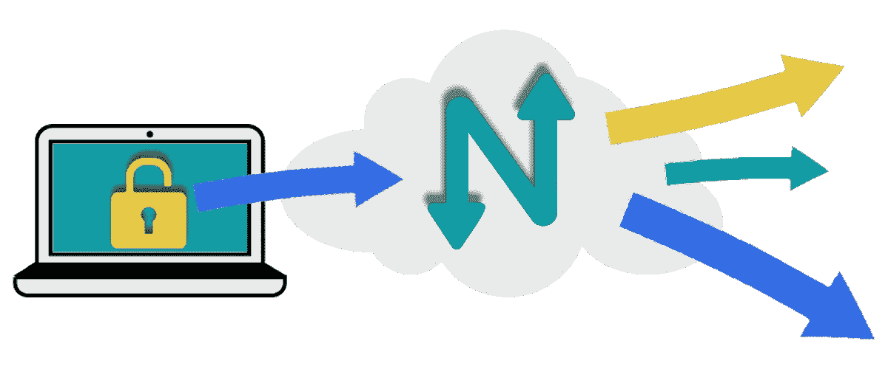
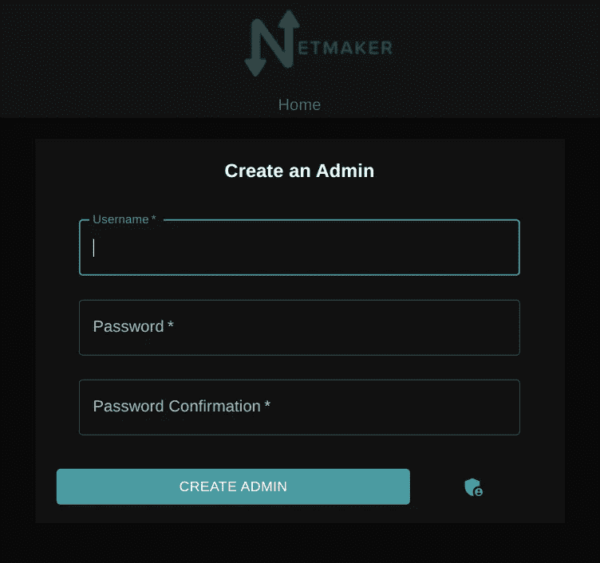
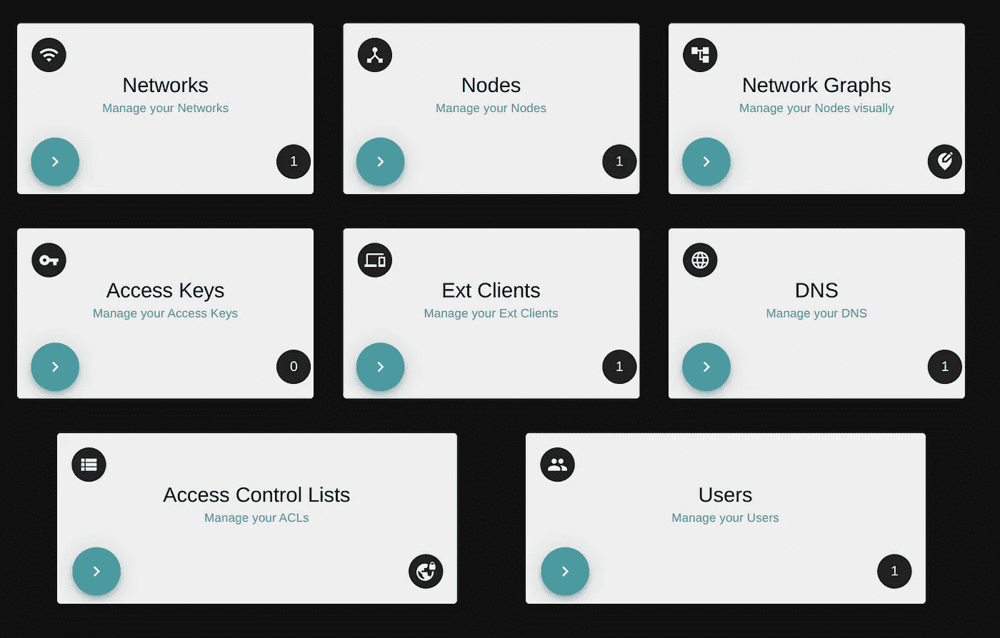
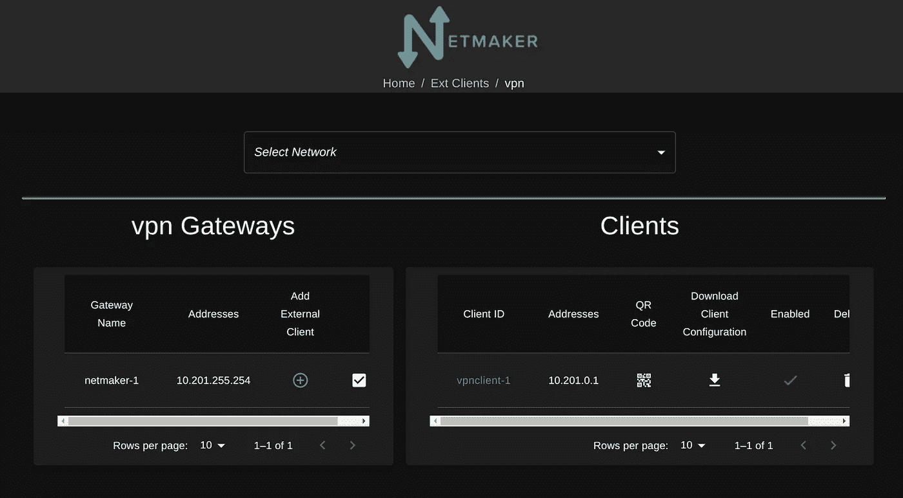

# 用 Netmaker 创建一个 WireGuard VPN

> 原文：<https://itnext.io/create-a-wireguard-vpn-with-netmaker-4f75b0e86bf6?source=collection_archive---------1----------------------->



WireGuard 在 VPN 提供商中越来越受欢迎，这是有充分理由的。它比旧的 VPN 协议要快得多，更不用说更小更高效了。

但是如果你不想为 NordVPN 或者 PrivateInternetAccess 付费呢？好消息是，你可以用 WireGuard 托管你自己的 WireGuard VPN。

有几十篇文章描述了如何使用 WireGuard 创建 VPN，但是我们将介绍如何使用 [**Netmaker**](http://github.com/gravitl/netmaker) 来创建 VPN，它有一些优点。

1.  你不必手动编写配置文件
2.  它会自动缩放
3.  它有一个漂亮的管理界面
4.  从远程访问到网状网络，它能做的比标准的互联网 VPN 多得多。

# 你需要什么

1.  具有公共 IP (VPS)的虚拟机。这台机器应该至少有 1CPU 和 1GB RAM。我们推荐[数字海洋](https://m.do.co/c/496ffcf1e252)，因为他们有一些最好的出站网络价格(你的 VPN 需要很多)。
2.  Linux。我们推荐 Ubuntu 22.04，但是任何基于 Debian 的发行版都可以。
3.  防火墙和安全组配置正确。暴露端口 22、443 和 51821/UDP*。
4.  (可选)如果您有要使用的域，请将通配符指向该计算机(例如:*.netmaker.mydomain.com)。如果您没有提供域名，netmaker 会为您生成一个。

**Netmaker 每个网络需要一个公共端口，从 51821 开始。如果您计划部署额外的网络，您将希望打开一个范围，通常是 51821–51830/UDP*

# 部署 Netmaker

一旦设置好虚拟机，您需要做的就是运行以下脚本:

```
**Option #1 - If you have your own domain configured:**wget -qO - [https://gist.githubusercontent.com/afeiszli/381cb6bbeb69f7e1aa6966d2ccecd2a0/raw/b359112e5021c7f47cae7f2acaf0097e14571851/netmaker-vpn.sh](https://gist.githubusercontent.com/afeiszli/381cb6bbeb69f7e1aa6966d2ccecd2a0/raw/b359112e5021c7f47cae7f2acaf0097e14571851/netmaker-vpn.sh) | sudo bash -s -- -v true -m false -c 3 -d netmaker.mydomain.com -e example@email.com**Option #2 - If you do not:**wget -qO - [https://gist.githubusercontent.com/afeiszli/381cb6bbeb69f7e1aa6966d2ccecd2a0/raw/b359112e5021c7f47cae7f2acaf0097e14571851/netmaker-vpn.sh](https://gist.githubusercontent.com/afeiszli/381cb6bbeb69f7e1aa6966d2ccecd2a0/raw/b359112e5021c7f47cae7f2acaf0097e14571851/netmaker-vpn.sh) | sudo bash -s -- -v true -m false -c 3
```

Netmaker 应该在几分钟内启动并运行。日志会给你地址来访问你的服务器。

# 本地安装 WireGuard

要使用 Netmaker VPN，您接下来必须在您的设备上安装 WireGuard。安装说明可在[这里](https://www.wireguard.com/install/)找到。

# **访问网络制造商**

转到日志中的域，并创建您的管理员用户



**登录后，您可以下载并使用您的 Netmaker 客户端。**



**点击“外部客户”**



**下载 vpnclient-1** 的配置文件，或者使用手机扫描二维码。如果您要将多个设备加入 VPN，您可以单击左侧的“添加外部客户端”来创建更多设备。

# 运行客户端

**在 Linux 或 Mac 上**，一旦安装了 WireGuard，只需运行“wg-quick up /path/to/conf/file”。

**在 Windows** 上，打开 WireGuard app，导入 conf 文件。

**在 iPhone 或 Android 上**，打开 WireGuard app，扫描 UI 中的二维码。

要确认它的工作，去 whatsmyip.com，看看 IPv4 地址现在等于 Netmaker 服务器的 IP。

就是这样！您现在运行的是 Netmaker VPN。

# **接下来的步骤**

如果您将 Netmaker 用作互联网 VPN，您可能需要考虑 Netmaker 的其他使用案例。主要是:远程访问您的设备/服务器/网络。Netmaker 允许您部署“节点”来直接访问任何环境中的设备，包括您的家庭或办公室网络。

将“节点”部署到网络中的服务器上，您的客户端设备就可以立即访问。此外，在该节点上创建一个“出口网关”，现在客户端设备可以访问整个远程网络中的任何内容！查看本指南，了解[如何设置远程访问 AWS 环境](/how-to-deploy-a-wireguard-vpn-for-aws-remote-access-with-netmaker-a3b8d0f59af2)。

# 其他注意事项

默认情况下，Netmaker 服务器不会路由 IPv6。您的 VPS 可能没有启用 IPv6，即使启用了，在 Docker 中设置 IPv6 也非常具有挑战性。如果您想要创建路由 IPv6 流量(除 IPv4 之外)的互联网网关，我们建议您:

1.  创建具有“双栈”的 Netmaker 网络
2.  将第二台虚拟机作为“节点”添加到网络中，作为您的入口/出口网关。此机器必须启用 IPv6
3.  如下所述，将机器设置为入口/出口网关(问题#2)，并记住除了将“0.0.0.0/0”设置为网关范围之外，还要将“::/0”设置为网关范围。

# 可选配置:减少仪表板访问

Netmaker 有一个很棒的管理用户界面来控制你的网络。你可能不希望这件事暴露在公众面前。要将仪表板缩小到您的本地 IP 地址(例如，1.2.3.4)，您可以[遵循这些步骤](https://docs.netmaker.org/server-installation.html#security-settings)。

# 解决纷争

## 问题#1: Traefik 连接不起作用

你的日志里有这个吗？

```
testing Traefik setup (please be patient, this may take 1-2 minutes)
    issue establishing connection...retrying in 15 seconds...
    issue establishing connection...retrying in 20 seconds...
    issue establishing connection...retrying in 25 seconds...
    issue establishing connection...retrying in 30 seconds...
```

Traefik 可能在您的 DNS /证书颁发方面存在问题。然后查看你的 docker 日志

```
docker logs traefik
```

这应该会告诉您证书的问题。如果不使用自己的域，一个常见的问题是“nip.io”是有速率限制的，这意味着你要么需要稍后再试，要么获得自己的域。

## 问题#2:入口/出口没有自动设置

有时安装脚本并不那么聪明。如果你遇到问题。尝试对出口网关执行以下[步骤。](https://docs.netmaker.org/egress-gateway.html#nat-gateway)

接下来，确保设置了“默认外部客户端 DNS”字段。编辑网络并确保该字段已设置(此图中的[# 12](https://docs.netmaker.org/_images/ui-3.jpg))。“地址应该是 10.201.255.254(无论节点 netmaker-1 设置为什么)。

最后，[将 netmaker 服务器设置为入口网关](https://docs.netmaker.org/external-clients.html)以生成 ext 客户端。

## 问题#3:客户端无法连接

如果客户端没有连接到 VPN(不能访问互联网)，这可能是由于 bash 脚本中的竞争条件(客户端配置创建得太快)。在这种情况下，转到 Ext Client 部分并“创建”另一个 VPN 客户端。这应该可以解决竞争情况，并且您的现有客户端配置应该可以工作。

***免责声明:****[*wire guard*](https://wireguard.com/)*是 Jason A. Donenfeld 的注册商标。**