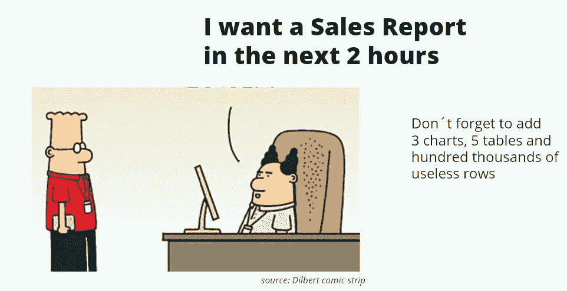
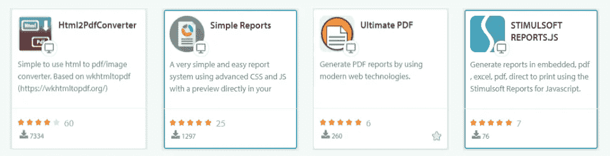
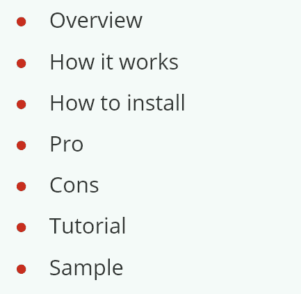
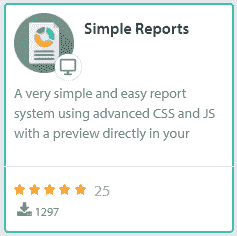
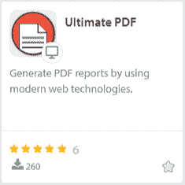
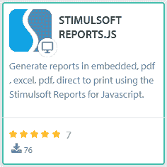

# 在外部系统中创建惊人的报告—简介

> 原文：<https://itnext.io/create-amazing-reports-in-outsystems-intro-7471866c45c2?source=collection_archive---------6----------------------->

欢迎我的朋友，阔别已久的我终于回来了。这一次，我将探索一个经常在我们的外部系统项目中困扰我们的主题:**报告的创建**。

*这是一篇由五部分组成的文章，是我在 Nextstep Amsterdam 2019 上发表的题为“在外部系统中创造惊人的报告”的演讲的更详细版本。请看视频* [*这里*](https://www.outsystems.com/nextstep/2019/?wchannelid=lxt52ix89e&wvideoid=4012p0x5pa#videos) *。*

[*在外部系统中创建惊人的报表—Intro*](/create-amazing-reports-in-outsystems-intro-7471866c45c2)*|*[*第一部分 Html2Pdf*](/create-amazing-reports-in-outsystems-part-i-html2pdf-3d6cf23ae494) *|第二部分简单报表(~正在进行)|第三部分终极 PDF(~正在进行)|第四部分:stimulisoft(~正在进行)|第五部分:结论(~正在进行)*

# 背景

有多少次我们的老板或客户要求我们创建报告。但是他们不想要一份传统的报告。他们想要成千上万的记录，几十种图案，到处都有边框，标题，闪烁的颜色，所有的东西都应该用弧形的纸来包装。相信我，他们很有创造力。

我们的第一反应是记住我们是聪明的开发者，创建报告非常容易。它只是把一切都放在一些表格中，并在页面中放置一个页眉和页脚。但是我们对报道的想法和我们的赞助商完全不同。他们想要更多，更多。

事实上，他们想要的是 ***“一人一报”。*** 他们所有人的主宰。没有希望，我们的第一个愿望开始哭泣。

在我们惊慌失措之前，我们记得 OutSystems 有一个 [Forge Repository](https://www.outsystems.com/forge/) ，在那里，我们肯定可以找到一个组件来解决我们所有的报告问题。

然而，在快速搜索后，我们发现有十几个组件，我们不知道应该从哪里开始。我们的第一个问题是，哪一个最适合我们的用例，或者该组件是否支持真正的报表工具特性？

这是所有关于经验。所以如果你从不尝试，你将永远不知道哪一个适合你的生意。在我为 OutSystems 工作的近 8 年时间里，每当我被要求创建报告时，我总是感到非常头疼。所以，我决定和大家分享我的经历。

# 预期

首先，我们需要记住 OutSystems 不是一个 BI 平台。几乎可以与所有这些工具集成，但在本文中，我们有另一个目的。我们的目标是探索一些替代方案，使用 Forge 组件创建您自己的报告。

为此，我们将探索三个免费组件，允许您直接在 Service Studio 内创建报告，以及基于外部报告工具的第四个组件。

# 让我们去探索

我将这篇文章分成五个部分来深入探讨每个部分。最后一部分是四个组件之间的比较和一些一般注意事项。涵盖每个组件的文章将具有这种结构，并将为您提供大量材料来了解它们如何工作以及它们适合您的位置。

# HTML2PDF(参见第一部分)

[*在外系统创造惊人的报表—第一部分 Html2Pdf*](/create-amazing-reports-in-outsystems-part-i-html2pdf-3d6cf23ae494)

Html2PDF 是 forge 中最古老的创建报告并将其导出为 PDF 文件的组件。它是基于使用外部工具包直接打印任何屏幕到 PDF 文件。

# 简单报告(见第二部分)

*在外部系统中创建惊人的报告—第二部分简单报告*

创建该组件是为了简化报告的创建，它基于浏览器打印功能。可以将您的报告直接设计为 Service Studio 中的常规屏幕。

# 最终 PDF(见第三部分)

*在外部系统中创建惊人的报告—第三部分终极 PDF*

创建最终的 PDF 是为了替代使用 *whtmltopdf* 工具包。这个组件混合了 HTML2PDF 和 SimpleReports 的思想，但是使用了 *Chromium* 项目将文档打印成 PDF 文件。

# 兴奋剂软件(见第四部分)

*在外部系统中创造惊人的报告——第四部分:兴奋剂软件*

Stimulsoft Reports 是一个完整的报告工具，允许我们使用几个专门为报告设计的小部件来创建丰富的报告。尽管这个组件需要一个许可证，但它的好处是很大的，您可以在本地以不同的格式打印您的文档。

# 结论(见第五部分)

*在外系统创造惊人的报告——第五部分:结论*

*感谢阅读。我希望你喜欢它。请让我知道你的想法。留下你的评论。为下一篇文章提供主题建议。我想听听你的意见。如果你喜欢，请关注我的频道，分享吧。可以通过* [*LinkedIn*](https://linkedin.com/in/fantato/) *或* [*OutSystems 简介*](https://www.outsystems.com/profile/40762/) *联系我。*

[***精益生产—您可以依靠的系统外专业知识！***](http://doitlean.com/)