# 在外部系统中创建惊人的报告—第一部分 Html2Pdf

> 原文：<https://itnext.io/create-amazing-reports-in-outsystems-part-i-html2pdf-3d6cf23ae494?source=collection_archive---------3----------------------->

*这是一篇由五部分组成的文章，是我在 Nextstep Amsterdam 2019 上发表的题为“在外部系统中创造惊人的报告”的演讲的更详细版本。请看视频* [*这里*](https://www.outsystems.com/nextstep/2019/?wchannelid=lxt52ix89e&wvideoid=4012p0x5pa#videos) *。*

[*在 OutSystems 中创建惊人的报表—Intro*](/create-amazing-reports-in-outsystems-intro-7471866c45c2)*|*[*第一部分 Html2Pdf*](/create-amazing-reports-in-outsystems-part-i-html2pdf-3d6cf23ae494) *|第二部分简单报表(~正在进行)|第三部分终极 PDF(~正在进行)|第四部分:兴奋剂软件(~正在进行)|第五部分:结论(~正在进行)*

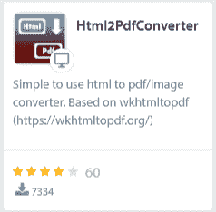

[https://www . out systems . com/forge/component/209/html 2 pdf converter](https://www.outsystems.com/forge/component/209/html2pdfconverter)

# 概观

Html2PDF 是 forge 中最古老的创建报告并将其导出为 PDF 文件的组件。它是基于使用外部工具包直接打印任何屏幕到 PDF 文件。

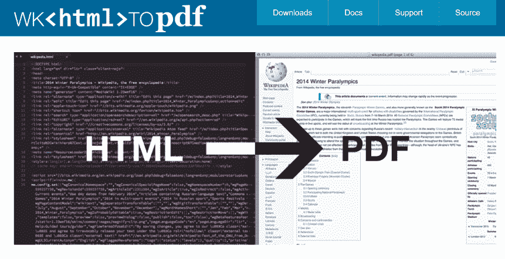

# 它是如何工作的

HTML2PDF 是一个外部[工具包](https://wkhtmltopdf.org/)的包装器，它将 HTML 页面转换成 PDF 文件。基本上，要使用这个组件，您只需要将您的报告创建为一个常规的 web 屏幕，并调用所提供的操作来模拟直接打印到 PDF 文件。

# 如何安装

为了让这个组件工作，我们需要上传工具包正确版本的二进制文件和其他库，如果您使用的是云、本地安装，甚至是在您的个人环境中，都会有一些不同。

工具箱储存库有几个版本，但是你需要完全遵循组件文档中详细描述的版本。如果你使用任何不同的东西，可能会是一场噩梦。

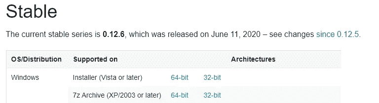

通常，我获取 7z 档案并将其解压到本地文件夹。在文件夹 **wkhtmltox\bin、**里，你会发现文件:*wkhtmltopdf.exe、*wkhtmltoimage.exe、*wkhtmltox.dll。*

在 OutSystems 环境中安装 HTML2PDF 组件，并转到应用程序进行设置。您应该在基础架构中的所有环境中执行设置过程。(开发、质量保证、生产等)

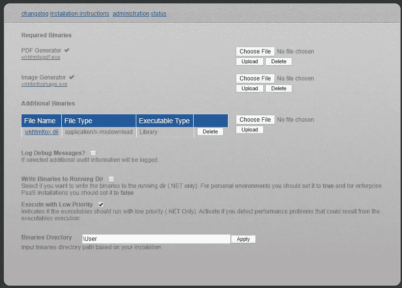

# 赞成

*   **屏幕直接转换成 PDF** —您可以设计网页屏幕并直接打印成 PDF 文件。

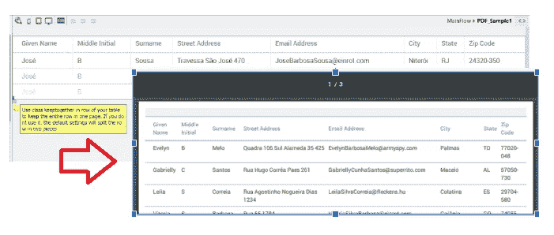

*   **社区上的大量历史—** 很长一段时间以来，这是在外部系统中创建报告的唯一可用选项。因此，您可以找到大量问题和故障排除的历史记录，包括[常见问题解答](https://www.outsystems.com/forums/discussion/17923/html2pdfconverter-faq/)。
*   **它是免费的**——你只需要安装并开始使用它。不需要任何额外的许可证。

# 骗局

*   **匿名屏幕—** 你需要用一个匿名角色来定义你的网页屏幕。这是一个安全漏洞，但它是强制性的。屏幕应该由服务器端的工具包直接呈现，它不会共享任何会话变量，例如用户角色。为了避免这种情况，您可以实现一个一次性令牌来调用您的屏幕并保护您的数据安全。

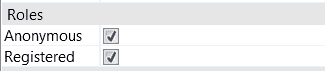

*   **SilkUI / OutSystems UI 模式—** 响应式框架不能很好地与这个工具包一起工作。这是因为工具包不会等待所有的 javascript 都被加载到你的页面中，而且它也不支持 CSS 变量。因此，您需要创建自定义主题，并为您的报告自定义所有 CSS 类。
*   **页面上的最后一行—** 有时您无法控制表格中每页的最后一行。这一行可能会从中间被删除，您将会丢失 pdf 中的信息。

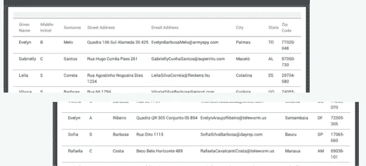

为了避免这种情况，您可以尝试使用这个 CSS 来强制工具箱将整行代码放在一起。

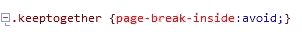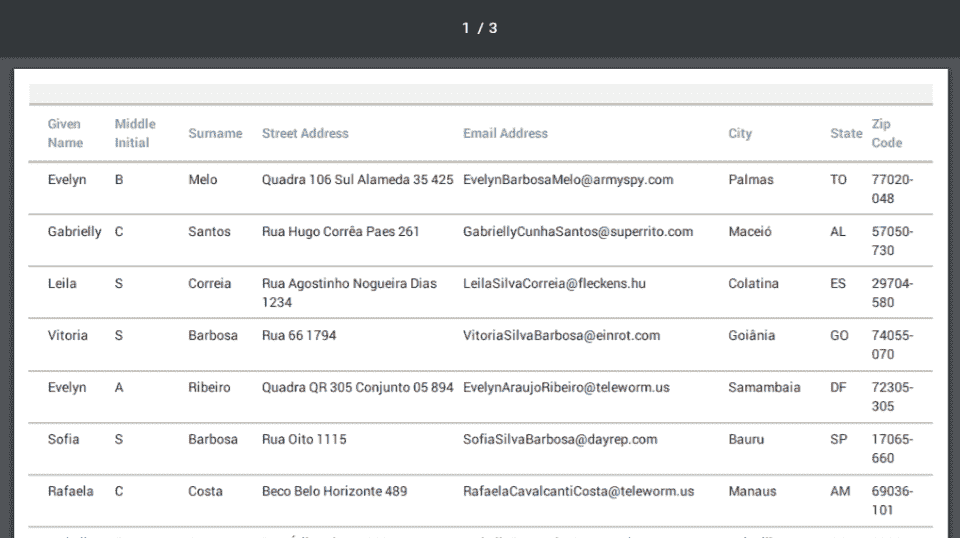

*   **设计技能要求(CSS)-** 创建您的报告是完全手动的。你需要从头开始设计你的屏幕，使用原始的 CSS，通常，正如我已经说过的，UI 模式在这个任务中对你没有帮助。
*   **分页/页眉和页脚—** 这些特性在该组件**中并不是现成的。**

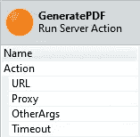

要包含页眉和页脚，您需要包含如下的其他参数，并为页眉和页脚定义 2 个额外的匿名屏幕。

> "—页眉间距 5 —页眉 html <replace with="" url="" header="">—页脚间距 5 —页脚 html <替换为 URL 页脚>"</replace>

要包含分页(页码)，您应该将下面的 javascript 添加到您的页眉(或页脚)中，并用样式类**‘Page’**为**当前页面**定义一个表达式，并用样式类**‘topage’**为**总页数**定义另一个表达式

```
function pagination()
        {
            var vars = {};
            var x = document.location.search.substring(1).split('&'); for (var i in x)
            {
                var z = x[i].split('=', 2);
                vars[z[0]] = unescape(z[1]);
            } var x = ['frompage','topage','page','webpage','section','subsection','subsubsection']; for (var i in x)
            {
                var y = document.getElementsByClassName(x[i]); for (var j = 0; j < y.length; ++j)
                {
                    y[j].textContent = vars[x[i]];
                }
            }
        }
```

**从零开始查询—** 天下没有免费的午餐。您需要创建查询和聚合来操作报表数据。汇总数据可能非常困难，你需要用手拆分数据部分。

# 辅导的

**步骤 1 —** 创建您的“样本”屏幕，并选择匿名角色

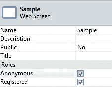

**步骤 2 —** 将查询放入准备屏幕

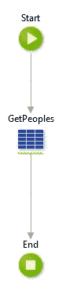

**步骤 3 —** 从该屏幕中删除布局 web 块，向屏幕添加一个表格小部件，并从上面的聚合中添加字段:姓氏、名字、城市、州和电子邮件。

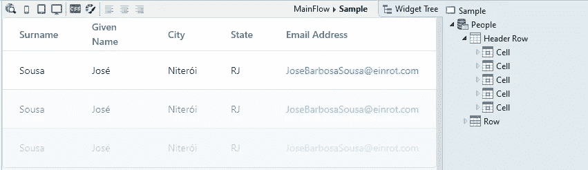

**步骤 4 —** 从 *HtmlToPdfConverter* 添加对 *GeneratePDF* 动作的引用

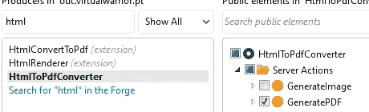

**步骤 5-** 创建一个屏幕来调用您的报告，并在准备阶段调用 GeneratePDF。使用 HTTPRequestHandler 中的 *MakeAbsoluteURL* 和 *GetEntry* 。**工具包需要屏幕的绝对 URL 才能正常运行。**

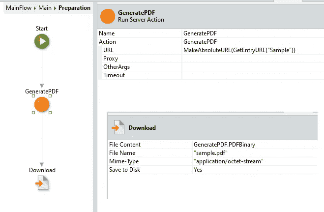

**第 6 步-** 运行您的应用程序，进入此屏幕并下载 PDF。你和你应该看到这样的东西:

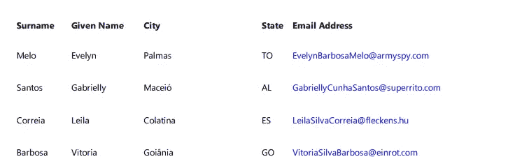

# 样品

你可以在锻造厂找到一个包括自定义主题、页眉和分页的样本，使用 [PDF 页眉和页脚](https://www.outsystems.com/forge/component-overview/1242/pdf-header-and-footer)。

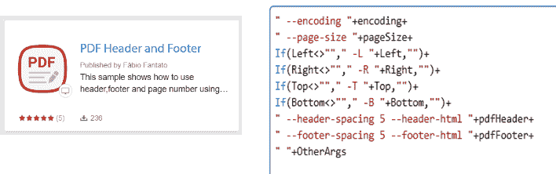

感谢阅读。我希望你喜欢它。请让我知道你的想法。留下你的评论。为下一篇文章提供主题建议。我想听听你的意见。如果你喜欢，请关注我的频道，分享吧。可以通过[*LinkedIn*](https://linkedin.com/in/fantato/)*或者* [*OutSystems 简介*](https://www.outsystems.com/profile/40762/) *联系我。*


[***精益生产——您可以依靠的系统专家！***](http://doitlean.com/)