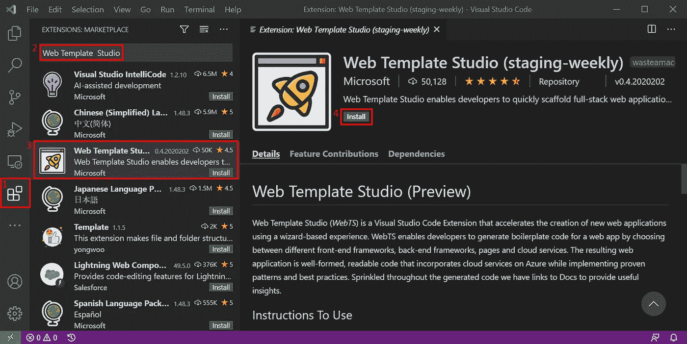
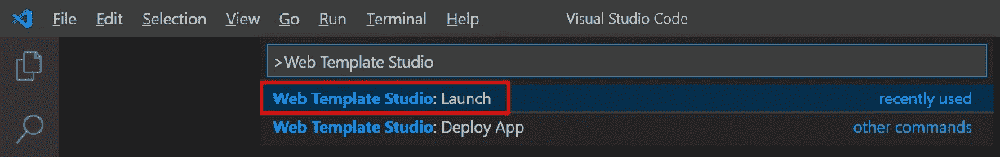
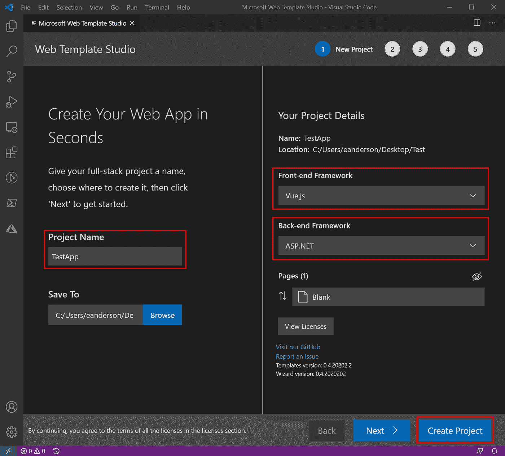
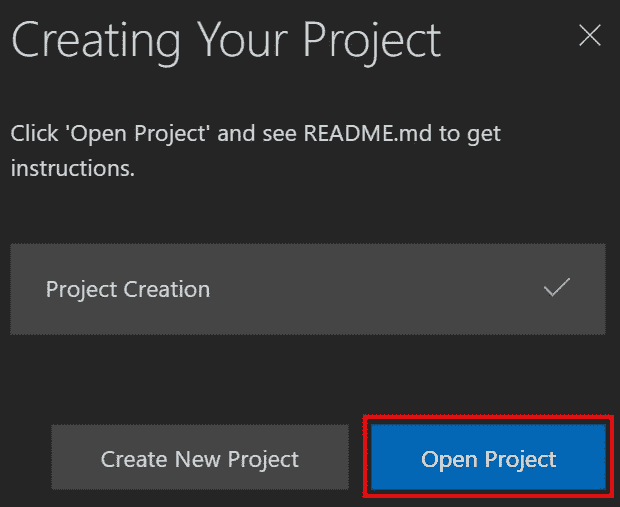
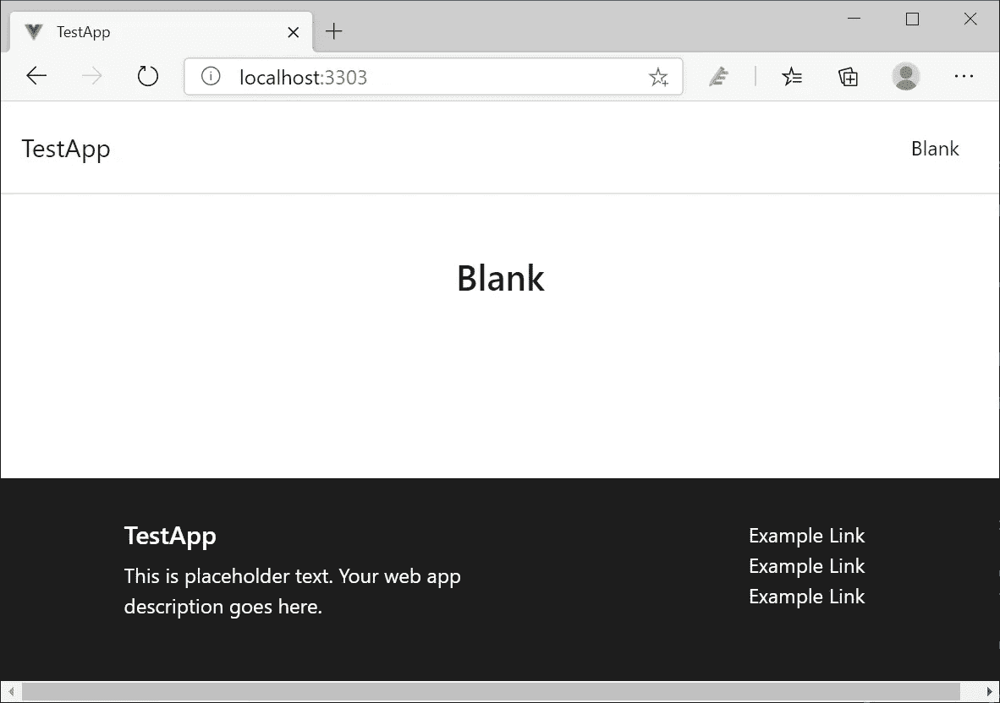

# 使用 Web Template Studio 创建应用程序

> 原文：<https://itnext.io/create-an-application-with-web-template-studio-384f32cc01f?source=collection_archive---------2----------------------->

创建新的应用程序是我经常做的事情。大多数时候，它们是用于测试的一次性项目，或者是用于这个博客的演示项目。随着所有项目创建的进行，我试着留意使过程更容易的工具。这篇文章将涉及一个几周前从微软得到的工具，叫做 [Web Template Studio](https://github.com/Microsoft/WebTemplateStudio/) (WebTS)。


## 什么是 WebTS？

从项目的 GitHub 上读给我听:

> 微软 Web Template Studio ( *WebTS* )是一个 Visual Studio 代码扩展，它使用基于向导的体验来加速新 Web 应用程序的创建。WebTS 使开发人员能够通过在不同的前端框架、后端框架、页面和云服务之间进行选择来为 web 应用程序生成样板代码。最终的 web 应用是格式良好、可读的代码，在 Azure 上整合了云服务，同时实现了成熟的模式和最佳实践。

对于前端，我们有 Angular、React 或 Vue 选项，在后端，有 ASP.NET 核心、Flask、Molecular 或 Node 选项。

## 装置

我们假设你已经安装了 Visual Studio Code (VSCode)的最新版本，但是如果没有，你可以从[这里](https://code.visualstudio.com/download)下载。打开 VSCode，从屏幕左侧选择**扩展**。在顶部的搜索框中输入 **Web Template Studio** ，然后从列表中选择 **Web Template Studio** 。在打开的详细页面中，点击顶部的绿色**安装**按钮。



## 项目创建

现在我们已经安装了扩展，按下 **Ctrl + Shift + P** 打开 VSCode 命令面板，进入**Web Template Studio:Launch**(或者根据需要显示选项)，然后选择**Web Template Studio:Launch**。



这将启动 Web Template Studio 项目创建过程。显示的第一页为您提供了一组非常基本的选项，但对于我们的示例来说已经足够了。要查看 Web Template Studio 提供的所有选项，请在第一个屏幕上点击 next，而不是像本例中那样创建项目。另外，请注意，如果您想要一个 ASP.NET[核心]后端，您需要在此摘要屏幕上选择它，因为它在该过程的后期还不是一个选项。回到我们的例子，在这个页面上，你需要输入一个**项目名**，选择一个**前端框架**，和一个**后端框架**，然后点击**创建项目**。



该过程完成后，将显示一个对话框，让我们知道它已经完成。点击**打开项目**将创建的项目加载到新的 VSCode 实例中。



## 运行项目

在进入可运行状态之前，我们需要先运行几个终端命令。这可以通过 VSCode 的内置终端或您选择的外部终端来完成。在 VSCode 中，如果没有看到终端，可以使用 **Cntrl + Shift + `** 打开一个新的，或者从菜单中选择**终端>新终端**。下面是需要使用 npm 运行的两个命令，但是如果您喜欢，可以调整它们来使用 yarn。第二个命令可能特定于 ASP.NET 核心后端，确保并检查项目 **README.md** 进行验证。

```
npm install
npm run restore-packages
```

现在，可以使用以下命令运行该项目。

```
npm start
```

最终的应用程序将如下所示。



## 包扎

WebTS 似乎是快速启动和运行项目的一个很好的工具。我强烈建议使用完整的项目创建向导，因为它提供了设置 Azure 集成的选项以及向生成的应用程序添加多达 20 个不同页面的能力。此外，请记住，ASP.NET 后端框架选项是相当新的，所以当它通过预览阶段时，我不会惊讶地看到一些变化。确保并检查该项目的 [GitHub repo](https://github.com/microsoft/WebTemplateStudio) 。

*最初发表于* [*埃里克·安德森*](https://elanderson.net/2020/09/create-an-application-with-web-template-studio/) *。*