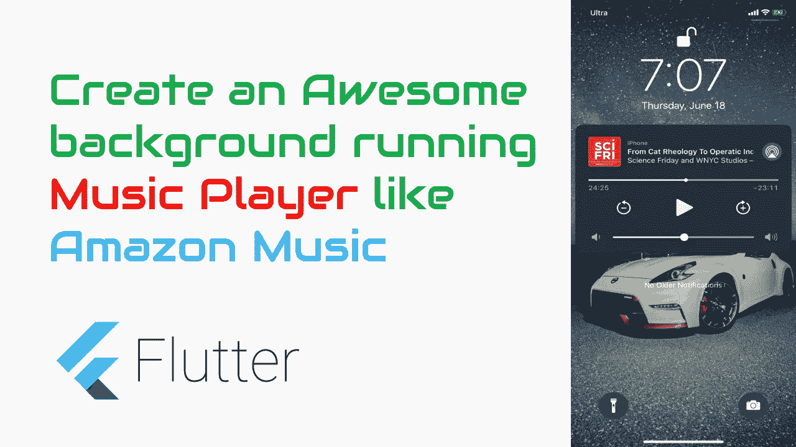

# 创建一个可怕的背景运行音乐播放器像亚马逊音乐在颤振

> 原文：<https://itnext.io/create-an-awesome-background-running-music-player-like-amazon-music-in-flutter-341a59efa936?source=collection_archive---------0----------------------->

我们有时都会在应用程序中播放音频，对吗？

但是，我们可能还没有创建一个完整的音乐播放器，即使应用程序不在前台运行，它也能运行，对吗？



Android 中的音乐播放器

# 观看视频教程

Android 中的音乐播放器

因此，在这篇文章中，我们将看到如何轻松地创建这样一个音乐播放器。

我们的要求是

1.  *即使应用程序没有运行，也应连续播放音频*
2.  *我应该可以通过锁屏或者耳机来控制音乐。*

如果应用程序不在前台，正常的音频播放器会停止，对吗？

那么我们该怎么做才能让它一直运行，直到应用程序被终止。

我们有解决办法

在 Flutter 中，我们有一些方便的库来实现这个功能。

所以让我们开始…

我假设你有一个简单的颤振项目准备好了。

如果是，那么继续打开' *pubspec.yaml* '文件。

# 添加依赖关系

在依赖项部分添加下面的依赖项

```
http: ^0.12.1
audio_service: ^0.11.0
just_audio: ^0.2.1
```

运行'***flutter packages get***'在终端中安装软件包，如果你的 IDE 没有自动安装的话。

这里是[插件](https://pub.dev/packages/audio_service/versions/0.11.0#-readme-tab-)的链接。

请确保遵循 read me，并在 AndroidManifest.xml 和 info.plist 文件中进行适当的更改。

让我们先创建 AudioPlayer 类。

**音频播放器**

AudioPlayer 是一个独立的隔离，扩展了***background audio task***。这意味着它将在独立的*线程/隔离*中运行，而不是在主隔离中运行。

让我们从创建一些显示在锁定屏幕上的媒体按钮开始。

```
MediaControl playControl = MediaControl(
  androidIcon: 'drawable/ic_action_play_arrow',
  label: 'Play',
  action: MediaAction.play,
);
MediaControl pauseControl = MediaControl(
  androidIcon: 'drawable/ic_action_pause',
  label: 'Pause',
  action: MediaAction.pause,
);
MediaControl skipToNextControl = MediaControl(
  androidIcon: 'drawable/ic_action_skip_next',
  label: 'Next',
  action: MediaAction.skipToNext,
);
MediaControl skipToPreviousControl = MediaControl(
  androidIcon: 'drawable/ic_action_skip_previous',
  label: 'Previous',
  action: MediaAction.skipToPrevious,
);
MediaControl stopControl = MediaControl(
  androidIcon: 'drawable/ic_action_stop',
  label: 'Stop',
  action: MediaAction.stop,
);
```

请确保在您的 android 项目的 drawable 文件夹中添加相应的 Android 图像。

这里是完整的音频播放器类代码。

```
class AudioPlayerTask extends BackgroundAudioTask {
  //
  var _queue = <MediaItem>[];
  int _queueIndex = -1;
  AudioPlayer _audioPlayer = new AudioPlayer();
  AudioProcessingState _skipState;
  bool _playing;
  bool get hasNext => _queueIndex + 1 < _queue.length;
  bool get hasPrevious => _queueIndex > 0;
  MediaItem get mediaItem => _queue[_queueIndex];
  StreamSubscription<AudioPlaybackState> _playerStateSubscription;
  StreamSubscription<AudioPlaybackEvent> _eventSubscription;[@override](http://twitter.com/override)
  void onStart(Map<String, dynamic> params) {
    //
  }[@override](http://twitter.com/override)
  void onPlay() {
    //
  }[@override](http://twitter.com/override)
  void onPause() {
    //
  }[@override](http://twitter.com/override)
  void onSkipToNext() async {
    //
  }[@override](http://twitter.com/override)
  void onSkipToPrevious() {
    //
  }void skip(int offset) async {
    //
  }

  [@override](http://twitter.com/override)
  Future<void> onStop() async {
    //
  }[@override](http://twitter.com/override) 
  void onSeekTo(Duration position) {
    //
  }[@override](http://twitter.com/override)
  void onClick(MediaButton button) {
    //
  }[@override](http://twitter.com/override)
  Future<void> onFastForward() async {
    //
  }[@override](http://twitter.com/override)
  Future<void> onRewind() async {
    //
  }

}
```

让我们看看它能做什么。

这里我们声明了一个 _queue，它实际上是我们将在音频播放器中播放的音频数据或媒体项队列。

```
_queueIndex - takes care of the index of the item that is playing
_audioPlayer - Plays the audio.
_skipState - state of the audio, like Audio is connecting or ready..
mediaItem - current media item to play.
```

第一件事是在 AudioPlayerTask 中设置队列。

```
AudioServiceBackground.setQueue(_queue);
```

当 UI 调用 AudioService.play 时，相应的 onPlay()被覆盖的函数将被调用，您可以让您的逻辑在那里播放音频。这同样适用于所有其他被重写的方法，如 onPause、onSkipToNext 等。

例如，onPlay 可能是这样的…

```
[@override](http://twitter.com/override)
  void onPlay() {
    if (_skipState == null) {
      _playing = true;
      _audioPlayer.play();
    }
  }
```

同样，您可以为所有其他方法实现。

现在开始音频服务。

```
await AudioService.start(
          backgroundTaskEntrypoint: _audioPlayerTaskEntrypoint,
          androidNotificationChannelName: 'Audio Player',
          androidNotificationColor: 0xFF2196f3,
          androidNotificationIcon: 'mipmap/ic_launcher',
          params: params,
        );
```

这里'*_ audioPlayerTaskEntrypoint*'是音频播放器的入口点。

如果你注意到这里有一个额外的参数叫做“params”。这是从外部向 AudioTask 发送数据。确保它是基本数据类型。

如果您想发送自定义事件，您甚至可以这样做。

```
await AudioService.customEvent('key',<DATA>
```

如果要在 AudioPlayer 中获取自定义数据，请重写 onCustomEvent 方法。

您还可以像这样向 UI 发送自定义事件。

```
AudioServiceBackground.sendCustomEvent('just played');
```

*因此，在 AudioService.dtart 中，' _ audioPlayerTaskEntrypoint '【T1]应该是一个顶级函数或静态函数，因为它是一个单独的隔离。这是一个简单的函数，看起来像这样。*

```
void _audioPlayerTaskEntrypoint() async {
  AudioServiceBackground.run(() => AudioPlayerTask());
}
```

# 在用户界面中监听状态变化

那么我们如何在 UI 中监听音频播放器的状态变化呢？

AudioPlayer 使用**流**向 UI 发送数据。

AudioService 包公开了一个名为***audioservicebackground . setstate***的方法，向 UI 发送数据。

例如，AudioPlayer 类中的 setState 方法可能如下所示。

```
Future<void> _setState({
    AudioProcessingState processingState,
    Duration position,
    Duration bufferedPosition,
  }) async {
    print('SetState $processingState');
    if (position == null) {
      position = _audioPlayer.playbackEvent.position;
    }
    await AudioServiceBackground.setState(
      controls: getControls(),
      systemActions: [MediaAction.seekTo],
      processingState:
          processingState ?? AudioServiceBackground.state.processingState,
      playing: _playing,
      position: position,
      bufferedPosition: bufferedPosition ?? position,
      speed: _audioPlayer.speed,
    );
}
```

为了让它出现在 UI 中以更新我们的显示，我们需要在 UI 中有一个 StreamBuilder。

音频播放器输出不同类型的数据，例如

> *媒体项目列表— AudioService.queueStream*
> 
> *当前播放的媒体项—audioservice . currentmediaitemstream*
> 
> *播放状态—audioservice . playbackstatestream*

我们可以使用 RX dart 将三个不同的流构建器合并成一个，而不是在 UI 中创建三个不同的流构建器。

让我们创建一个简单的类来保存 3 个流数据，我将它命名为 AudioState。

```
class AudioState {
  final List<MediaItem> queue;
  final MediaItem mediaItem;
  final PlaybackState playbackState;   AudioState(this.queue, this.mediaItem, this.playbackState);
}
```

以及创建该流的方法。

```
Stream<AudioState> get _audioStateStream {
  return Rx.combineLatest3<List<MediaItem>, MediaItem, PlaybackState,
      AudioState>(
    AudioService.queueStream,
    AudioService.currentMediaItemStream,
    AudioService.playbackStateStream,
    (queue, mediaItem, playbackState) => AudioState(
      queue,
      mediaItem,
      playbackState,
    ),
  );
}
```

在用户界面中

```
[@override](http://twitter.com/override)
  Widget build(BuildContext context) {
    return Scaffold(
      appBar: AppBar(
        title: Text('Audio Player'),
      ),
      body: Container(
        padding: EdgeInsets.all(20.0),
        color: Colors.white,
        child: StreamBuilder<AudioState>(
          stream: _audioStateStream,
          builder: (context, snapshot) {
            final audioState = snapshot.data;
            final queue = audioState?.queue;
            final mediaItem = audioState?.mediaItem;
            final playbackState = audioState?.playbackState;
            final processingState =
                playbackState?.processingState ?? AudioProcessingState.none;
            final playing = playbackState?.playing ?? false;
```

这里我们有所有要在 UI 中处理的数据。

下面是完整的 AudioPlayer.dart 的样子。

```
import 'dart:async';import 'package:audio_service/audio_service.dart';
import 'package:just_audio/just_audio.dart';MediaControl playControl = MediaControl(
  androidIcon: 'drawable/ic_action_play_arrow',
  label: 'Play',
  action: MediaAction.play,
);
MediaControl pauseControl = MediaControl(
  androidIcon: 'drawable/ic_action_pause',
  label: 'Pause',
  action: MediaAction.pause,
);
MediaControl skipToNextControl = MediaControl(
  androidIcon: 'drawable/ic_action_skip_next',
  label: 'Next',
  action: MediaAction.skipToNext,
);
MediaControl skipToPreviousControl = MediaControl(
  androidIcon: 'drawable/ic_action_skip_previous',
  label: 'Previous',
  action: MediaAction.skipToPrevious,
);
MediaControl stopControl = MediaControl(
  androidIcon: 'drawable/ic_action_stop',
  label: 'Stop',
  action: MediaAction.stop,
);class AudioPlayerTask extends BackgroundAudioTask {
  //
  var _queue = <MediaItem>[];
  int _queueIndex = -1;
  AudioPlayer _audioPlayer = new AudioPlayer();
  AudioProcessingState _skipState;
  bool _playing;
  bool get hasNext => _queueIndex + 1 < _queue.length;
  bool get hasPrevious => _queueIndex > 0;
  MediaItem get mediaItem =>    _queue[_queueIndex];
  StreamSubscription<AudioPlaybackState> _playerStateSubscription;
  StreamSubscription<AudioPlaybackEvent> _eventSubscription; [@override](http://twitter.com/override)
  void onStart(Map<String, dynamic> params) {
    _queue.clear();
    List mediaItems = params['data'];
    for (int i = 0; i < mediaItems.length; i++) {
      MediaItem mediaItem = MediaItem.fromJson(mediaItems[i]);
      _queue.add(mediaItem);
    }
    _playerStateSubscription = _audioPlayer.playbackStateStream
        .where((state) => state == AudioPlaybackState.completed)
        .listen((state) {
      _handlePlaybackCompleted();
    });
    _eventSubscription = _audioPlayer.playbackEventStream.listen((event) {
      final bufferingState =
          event.buffering ? AudioProcessingState.buffering : null;
      switch (event.state) {
        case AudioPlaybackState.paused:
          _setState(
              processingState: bufferingState ?? AudioProcessingState.ready,
              position: event.position);
          break;
        case AudioPlaybackState.playing:
          _setState(
              processingState: bufferingState ?? AudioProcessingState.ready,
              position: event.position);
          break;
        case AudioPlaybackState.connecting:
          _setState(
              processingState: _skipState ?? AudioProcessingState.connecting,
              position: event.position);
          break;
        default:
      }
    });
    AudioServiceBackground.setQueue(_queue);
    onSkipToNext();
  }[@override](http://twitter.com/override)
  void onPlay() {
    if (_skipState == null) {
      _playing = true;
      _audioPlayer.play();
    }
  }[@override](http://twitter.com/override)
  void onPause() {
    _playing = false;
    _audioPlayer.pause();
  }[@override](http://twitter.com/override)
  void onSkipToNext() async {
    skip(1);
  }[@override](http://twitter.com/override)
  void onSkipToPrevious() {
    skip(-1);
  }void skip(int offset) async {
    int newPos = _queueIndex + offset;
    if (!(newPos >= 0 && newPos < _queue.length)) {
      return;
    }
    if (null == _playing) {
      _playing = true;
    } else if (_playing) {
      await _audioPlayer.stop();
    }
    _queueIndex = newPos;
    _skipState = offset > 0
        ? AudioProcessingState.skippingToNext
        : AudioProcessingState.skippingToPrevious;
    AudioServiceBackground.setMediaItem(mediaItem);
    await _audioPlayer.setUrl(mediaItem.id);
    print(mediaItem.id);
    _skipState = null;
    if (_playing) {
      onPlay();
    } else {
      _setState(processingState: AudioProcessingState.ready);
    }
  }[@override](http://twitter.com/override)
  Future<void> onStop() async {
    _playing = false;
    await _audioPlayer.stop();
    await _audioPlayer.dispose();
    _playerStateSubscription.cancel();
    _eventSubscription.cancel();
    return await super.onStop();
  } [@override](http://twitter.com/override)
  void onSeekTo(Duration position) {
    _audioPlayer.seek(position);
  } [@override](http://twitter.com/override)
  void onClick(MediaButton button) {
    playPause();
  }[@override](http://twitter.com/override)
  Future<void> onFastForward() async {
    await _seekRelative(fastForwardInterval);
  }[@override](http://twitter.com/override)
  Future<void> onRewind() async {
    await _seekRelative(rewindInterval);
  }Future<void> _seekRelative(Duration offset) async {
    var newPosition = _audioPlayer.playbackEvent.position + offset;
    if (newPosition < Duration.zero) {
      newPosition = Duration.zero;
    }
    if (newPosition > mediaItem.duration) {
      newPosition = mediaItem.duration;
    }
    await _audioPlayer.seek(_audioPlayer.playbackEvent.position + offset);
  }_handlePlaybackCompleted() {
    if (hasNext) {
      onSkipToNext();
    } else {
      onStop();
    }
  }void playPause() {
    if (AudioServiceBackground.state.playing)
      onPause();
    else
      onPlay();
  }Future<void> _setState({
    AudioProcessingState processingState,
    Duration position,
    Duration bufferedPosition,
  }) async {
    print('SetState $processingState');
    if (position == null) {
      position = _audioPlayer.playbackEvent.position;
    }
    await AudioServiceBackground.setState(
      controls: getControls(),
      systemActions: [MediaAction.seekTo],
      processingState:
          processingState ?? AudioServiceBackground.state.processingState,
      playing: _playing,
      position: position,
      bufferedPosition: bufferedPosition ?? position,
      speed: _audioPlayer.speed,
    );
  }List<MediaControl> getControls() {
    if (_playing) {
      return [
        skipToPreviousControl,
        pauseControl,
        stopControl,
        skipToNextControl
      ];
    } else {
      return [
        skipToPreviousControl,
        playControl,
        stopControl,
        skipToNextControl
      ];
    }
  }
}class AudioState {
  final List<MediaItem> queue;
  final MediaItem mediaItem;
  final PlaybackState playbackState;AudioState(this.queue,       this.mediaItem, this.playbackState);
}
```

而我们的主 UI 会是这样的。

```
import 'dart:math';
import 'package:audio_service/audio_service.dart';
import 'package:flutter/material.dart';
import 'package:rxdart/rxdart.dart';import 'AudioPlayerTask.dart';class BGAudioPlayerScreen extends StatefulWidget {
  [@override](http://twitter.com/override)
  _BGAudioPlayerScreenState createState() => _BGAudioPlayerScreenState();
}class _BGAudioPlayerScreenState extends State<BGAudioPlayerScreen> {
  final BehaviorSubject<double> _dragPositionSubject =
      BehaviorSubject.seeded(null);final _queue = <MediaItem>[
    MediaItem(
      id: "[https://s3.amazonaws.com/scifri-episodes/scifri20181123-episode.mp3](https://s3.amazonaws.com/scifri-episodes/scifri20181123-episode.mp3)",
      album: "Science Friday",
      title: "A Salute To Head-Scratching Science",
      artist: "Science Friday and WNYC Studios",
      duration: Duration(milliseconds: 5739820),
      artUri:
          "[https://media.wnyc.org/i/1400/1400/l/80/1/ScienceFriday_WNYCStudios_1400.jpg](https://media.wnyc.org/i/1400/1400/l/80/1/ScienceFriday_WNYCStudios_1400.jpg)",
    ),
    MediaItem(
      id: "[https://s3.amazonaws.com/scifri-segments/scifri201711241.mp3](https://s3.amazonaws.com/scifri-segments/scifri201711241.mp3)",
      album: "Science Friday",
      title: "From Cat Rheology To Operatic Incompetence",
      artist: "Science Friday and WNYC Studios",
      duration: Duration(milliseconds: 2856950),
      artUri:
          "[https://media.wnyc.org/i/1400/1400/l/80/1/ScienceFriday_WNYCStudios_1400.jpg](https://media.wnyc.org/i/1400/1400/l/80/1/ScienceFriday_WNYCStudios_1400.jpg)",
    ),
  ]; bool _loading; [@override](http://twitter.com/override)
  void initState() {
    super.initState();
    _loading = false;
  }[@override](http://twitter.com/override)
  Widget build(BuildContext context) {
    return Scaffold(
      appBar: AppBar(
        title: Text('Audio Player'),
      ),
      body: Container(
        padding: EdgeInsets.all(20.0),
        color: Colors.white,
        child: StreamBuilder<AudioState>(
          stream: _audioStateStream,
          builder: (context, snapshot) {
            final audioState = snapshot.data;
            final queue = audioState?.queue;
            final mediaItem = audioState?.mediaItem;
            final playbackState = audioState?.playbackState;
            final processingState =
                playbackState?.processingState ?? AudioProcessingState.none;
            final playing = playbackState?.playing ?? false;
            return Container(
              width: MediaQuery.of(context).size.width,
              child: Column(
                mainAxisAlignment: MainAxisAlignment.center,
                crossAxisAlignment: CrossAxisAlignment.center,
                mainAxisSize: MainAxisSize.max,
                children: [
                  if (processingState == AudioProcessingState.none) ...[
                    _startAudioPlayerBtn(),
                  ] else ...[
                    //positionIndicator(mediaItem, playbackState),
                    SizedBox(height: 20),
                    if (mediaItem?.title != null) Text(mediaItem.title),
                    SizedBox(height: 20),
                    Row(
                      mainAxisAlignment: MainAxisAlignment.center,
                      children: [
                        !playing
                            ? IconButton(
                                icon: Icon(Icons.play_arrow),
                                iconSize: 64.0,
                                onPressed: AudioService.play,
                              )
                            : IconButton(
                                icon: Icon(Icons.pause),
                                iconSize: 64.0,
                                onPressed: AudioService.pause,
                              ),
                        IconButton(
                        //   icon: Icon(Icons.stop),
                        //   iconSize: 64.0,
                        //   onPressed: AudioService.stop,
                        // ),
                        Row(
                          mainAxisAlignment: MainAxisAlignment.center,
                          children: [
                            IconButton(
                              icon: Icon(Icons.skip_previous),
                              iconSize: 64,
                              onPressed: () {
                                if (mediaItem == queue.first) {
                                  return;
                                }
                                AudioService.skipToPrevious();
                              },
                            ),
                            IconButton(
                              icon: Icon(Icons.skip_next),
                              iconSize: 64,
                              onPressed: () {
                                if (mediaItem == queue.last) {
                                  return;
                                }
                                AudioService.skipToNext();
                              },
                            )
                          ],
                        ),
                      ],
                    )
                  ]
                ],
              ),
            );
          },
        ),
      ),
    );
  } _startAudioPlayerBtn() {
    List<dynamic> list = List();
    for (int i = 0; i < 2; i++) {
      var m = _queue[i].toJson();
      list.add(m);
    }
    var params = {"data": list};
    return MaterialButton(
      child: Text(_loading ? "Loading..." : 'Start Audio Player'),
      onPressed: () async {
        setState(() {
          _loading = true;
        });
        await AudioService.start(
          backgroundTaskEntrypoint: _audioPlayerTaskEntrypoint,
          androidNotificationChannelName: 'Audio Player',
          androidNotificationColor: 0xFF2196f3,
          androidNotificationIcon: 'mipmap/ic_launcher',
          params: params,
        );
        setState(() {
          _loading = false;
        });
      },
    );
  }Widget positionIndicator(MediaItem mediaItem, PlaybackState state) {
    double seekPos;
    return StreamBuilder(
      stream: Rx.combineLatest2<double, double, double>(
          _dragPositionSubject.stream,
          Stream.periodic(Duration(milliseconds: 200)),
          (dragPosition, _) => dragPosition),
      builder: (context, snapshot) {
        double position =
            snapshot.data ?? state.currentPosition.inMilliseconds.toDouble();
        double duration = mediaItem?.duration?.inMilliseconds?.toDouble();
        return Column(
          children: [
            if (duration != null)
              Slider(
                min: 0.0,
                max: duration,
                value: seekPos ?? max(0.0, min(position, duration)),
                onChanged: (value) {
                  _dragPositionSubject.add(value);
                },
                onChangeEnd: (value) {
                  AudioService.seekTo(Duration(milliseconds: value.toInt()));
                  // Due to a delay in platform channel communication, there is
                  // a brief moment after releasing the Slider thumb before the
                  // new position is broadcast from the platform side. This
                  // hack is to hold onto seekPos until the next state update
                  // comes through.
                  // TODO: Improve this code.
                  seekPos = value;
                  _dragPositionSubject.add(null);
                },
              ),
            Text("${state.currentPosition}"),
          ],
        );
      },
    );
  }
}Stream<AudioState> get _audioStateStream {
  return Rx.combineLatest3<List<MediaItem>, MediaItem, PlaybackState,
      AudioState>(
    AudioService.queueStream,
    AudioService.currentMediaItemStream,
    AudioService.playbackStateStream,
    (queue, mediaItem, playbackState) => AudioState(
      queue,
      mediaItem,
      playbackState,
    ),
  );
}void _audioPlayerTaskEntrypoint() async {
  AudioServiceBackground.run(() => AudioPlayerTask());
}
```

在 AudioPlayer.dart 的完整示例中，您可以看到数据是作为参数从主 UI 发送的。

# **完整的源代码**

[https://bit bucket . org/vipinvijayan 1987/tutorial projects/src/BGMusicPlayer/fluttertutorial projects/flutter _ demos/](https://bitbucket.org/vipinvijayan1987/tutorialprojects/src/BGMusicPlayer/FlutterTutorialProjects/flutter_demos/)