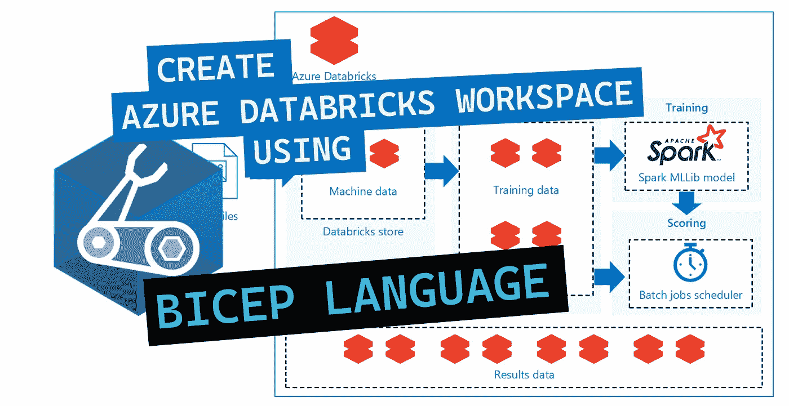
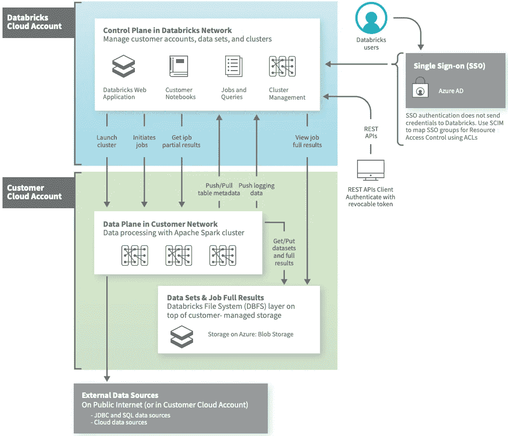
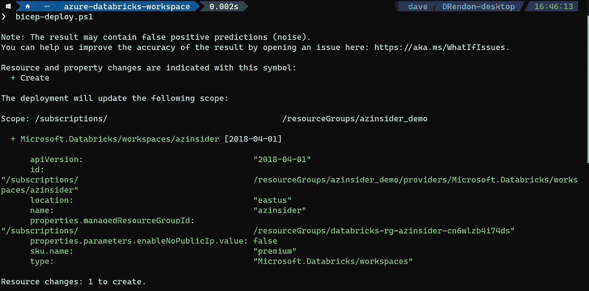
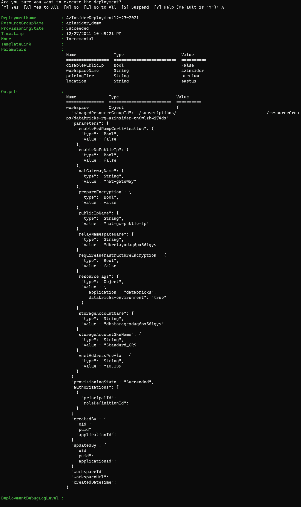
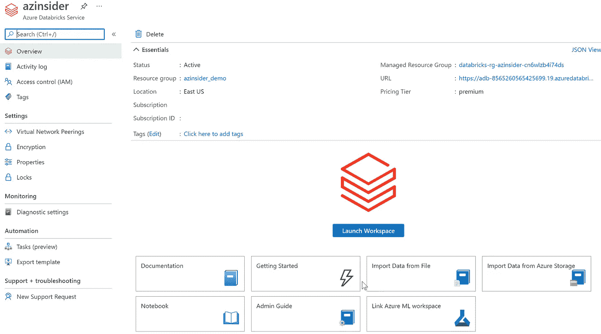
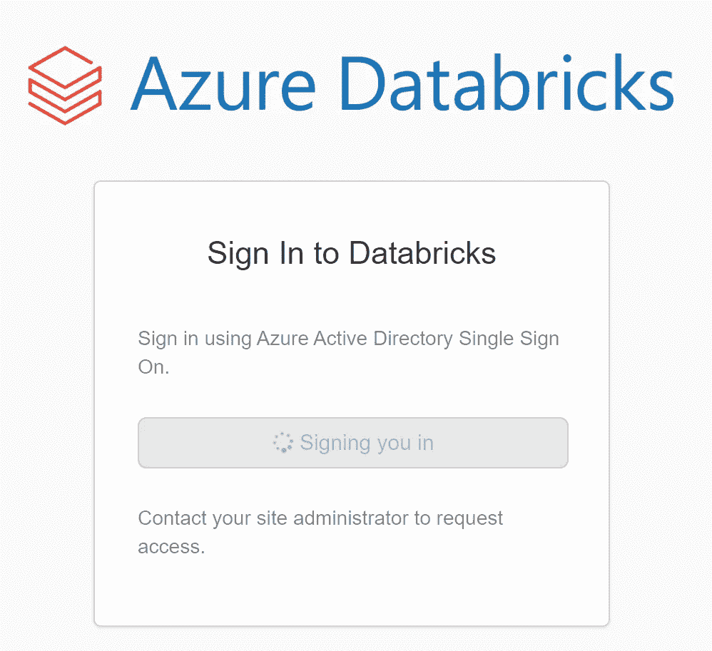
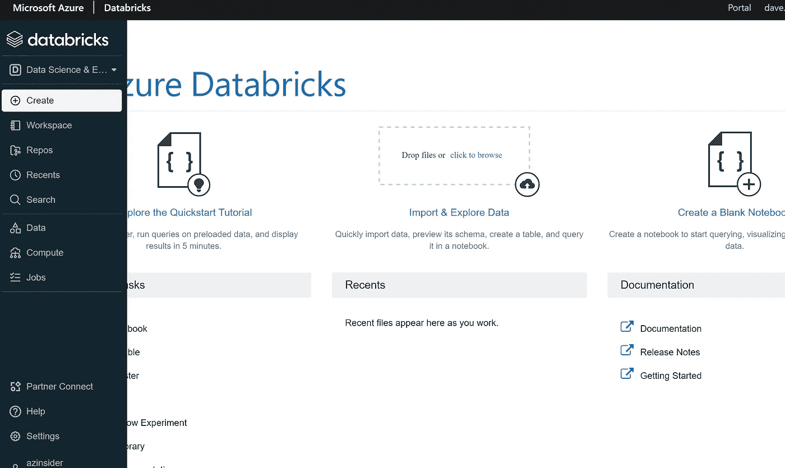

# 使用 Bicep 语言创建 Azure Databricks 工作区

> 原文：<https://itnext.io/create-an-azure-databricks-workspace-using-bicep-language-60d86e97fda4?source=collection_archive---------2----------------------->

学习利用基础设施即代码来创建 Azure Databricks 工作区。



使用 Bicep 语言创建 Azure Databricks 工作区

在本文中，我们将使用 Bicep 语言创建一个 Azure Databricks 工作区，Bicep 语言是一种特定于领域的**语言** (DSL)，它使用声明性语法来部署 Azure 资源。

# 为什么选择 Azure Databricks？

**Azure Databricks** 旨在与 Azure 数据存储和服务无缝集成。 **Azure Databricks** 是一个快速、简单、协作的基于 Apache Spark 的大数据分析服务，专为数据科学和数据工程而设计。

您可以利用三种环境来开发数据密集型应用程序:

*   数据块 SQL
*   Databricks 数据科学与工程
*   数据块机器学习

# azure data bricks——高级架构

Azure Databricks 在*控制平面*和*数据平面之外运行。*

*   控制平面包含 Azure 帐户中管理的后端服务。
*   数据层是您的数据所在的位置，将由您的 Azure 帐户管理。



Azure Databricks 架构

在使用 Azure Databricks 之前，您需要有一个*工作空间*。

这个工作区是访问所有数据块资产的基本组件。工作区将包含多个对象，您可以将它们组织到文件夹中，并支持对这些对象和计算资源的粒度访问。

*工作空间*包括:

*   笔记本电脑
*   仪表盘
*   图书馆
*   被卖方收回的汽车
*   实验

现在我们将使用 Bicep 语言创建一个 Azure Databricks 工作区。

# 使用 Bicep 语言创建 Azure Databricks 工作区

## 先决条件。

*   有效的 Azure 订阅
*   在订阅中创建资源的权限
*   Azure Biccep 已安装—[bit.ly/bicep-install](https://bit.ly/bicep-install)
*   Azure PowerShell

# 解决方案概述

我们将创作一个 Bicep 模板，创建一个 Azure Databricks workspace 的实例，用于访问所有 Azure Databricks 资产。

该解决方案将包括以下文件:

*   **📄 *main.bicep*** :这是二头肌模板
*   **📄*azure deploy . parameters . JSON***:这个参数文件包含用于部署 Bicep 模板的值。

我们开始吧！

# 创建 Azure 权限的 Azure Bicep 文件

第一步是创建一个名为' *main.bicep* '的文件，我们将从定义 Azure Databricks workspace 实例的几个参数开始。

# Azure Bicep 文件-参数

在您的工作目录中创建一个新文件，并将其命名为' *main.bicep* '。我们将定义以下参数:

```
@description('Specifies whether to deploy Azure Databricks workspace with Secure Cluster Connectivity (No Public IP) enabled or not')
param disablePublicIp bool = false@description('The name of the Azure Databricks workspace to create.')
param workspaceName string@description('The pricing tier of workspace.')
@allowed([
  'standard'
  'premium'
])
param pricingTier string = 'premium'@description('Location for all resources.')
param location string = resourceGroup().location
```

现在，我们将为托管资源组名称定义一个变量:

```
var managedResourceGroupName = 'databricks-rg-${workspaceName}-${uniqueString(workspaceName, resourceGroup().id)}'
```

# Azure Bicep 模板—参考资料部分

我们将定义 Azure Databricks 工作区的实例:

```
resource workspaceName_resource 'Microsoft.Databricks/workspaces@2018-04-01' = {
  name: workspaceName
  location: location
  sku: {
    name: pricingTier
  }
  properties: {
    managedResourceGroupId: subscriptionResourceId('Microsoft.Resources/resourceGroups', managedResourceGroupName)
    parameters: {
      enableNoPublicIp: {
        value: disablePublicIp
      }
    }
  }
}
```

或者，您可以为工作区属性定义一个输出，如下所示:

```
output workspace object = workspaceName_resource.properties
```

# 参数文件

创建一个名为“*azure deploy . parameters . JSON*”的新文件。下面的代码显示了参数文件的定义:

```
{
    "$schema": "[https://schema.management.azure.com/schemas/2019-04-01/deploymentParameters.json#](https://schema.management.azure.com/schemas/2019-04-01/deploymentParameters.json#)",
    "contentVersion": "1.0.0.0",
    "parameters": {
      "disablePublicIp": {
        "value": false,
        "allowedValues": [
            false,
            true
          ]
      },
      "workspaceName": {
        "value": "Your-Workspace-Name"
      },
      "pricingTier": {
        "value": "premium"
      }
    }
  }
```

# Azure Bicep 模板-部署

我们将使用下面的命令来部署我们的二头肌模板:

```
$date = Get-Date -Format "MM-dd-yyyy"
$deploymentName = "AzInsiderDeployment"+"$date"New-AzResourceGroupDeployment -Name $deploymentName -ResourceGroupName azinsider_demo -TemplateFile .\main.bicep -TemplateParameterFile .\azuredeploy.parameters.json -c
```

提示:您可以创建一个 script.ps1 并运行该脚本来执行这个部署。

注意:在执行实际部署操作之前，我们利用假设操作来验证我们的部署。

下图显示了部署的预览:



Azure Databricks 工作区— BIcep 语言部署

然后，我们将执行部署。下图显示了部署输出:



Azure Databricks 工作区— BIcep 语言部署操作

您可以在下面的 URL 中找到这个解决方案的代码，请随意投稿！

[](https://github.com/daveRendon/azinsider/tree/main/application-workloads/azure-databricks-workspace) [## azin sider/应用程序-工作负载/azure-数据块-主 daveRendon/azinsider 上的工作区

### 在 GitHub 上创建一个帐户，为 daveRendon/azinsider 开发做出贡献。

github.com](https://github.com/daveRendon/azinsider/tree/main/application-workloads/azure-databricks-workspace) 

现在，在 Azure 门户中，您应该会看到 Azure Databricks 服务的实例，如下所示:



Azure 门户— Azure 数据块

从这里，您可以启动您的工作区，并登录到 Databricks:



数据块登录

登录后，您将访问 Azure Databricks UI，这是一个工作区文件夹及其包含的对象、数据对象和计算资源的图形界面。



Azure 数据砖块用户界面

# 结论

在本文中，我们回顾了如何使用 Bicep 语言利用基础设施即代码来创建 Azure Databricks 工作区，并验证了部署。

[](https://www.buymeacoffee.com/drbmc)

👉 [*在此加入****azin sider****邮箱列表。*](http://eepurl.com/gKmLdf)

*-戴夫·r*