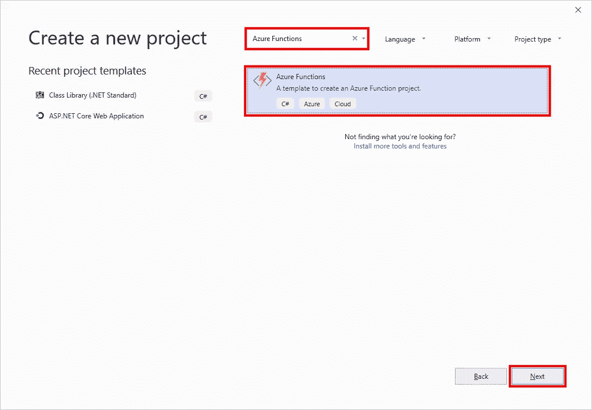
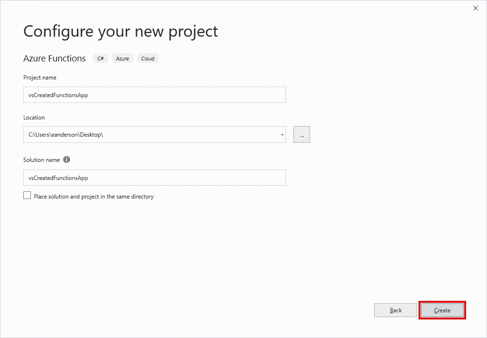
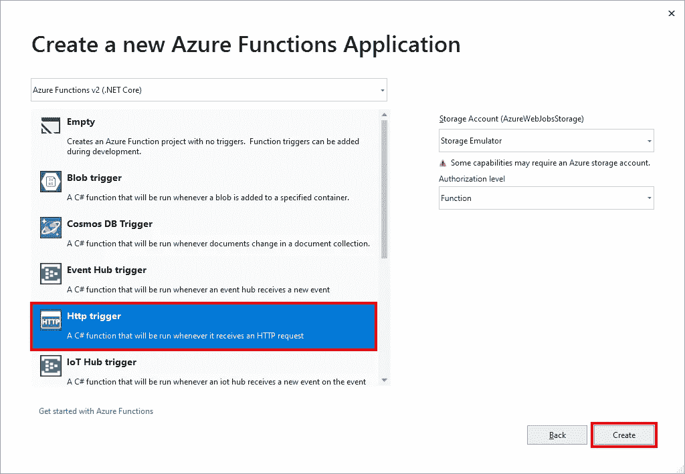
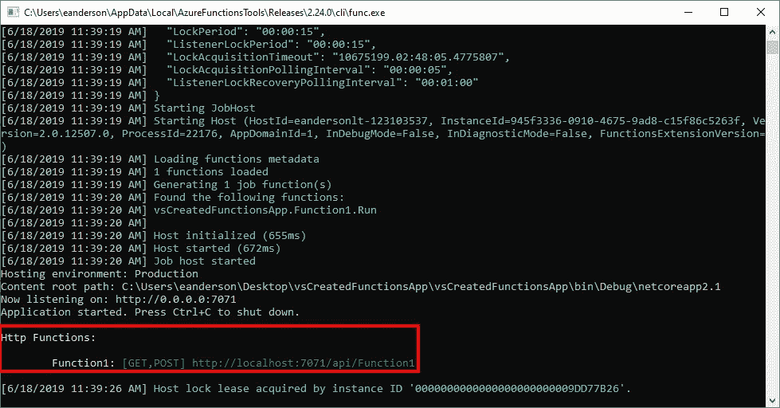
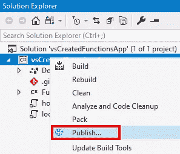
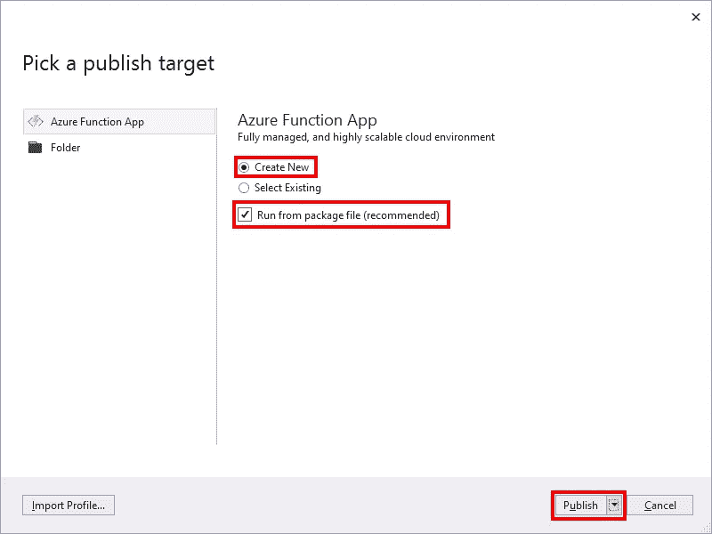
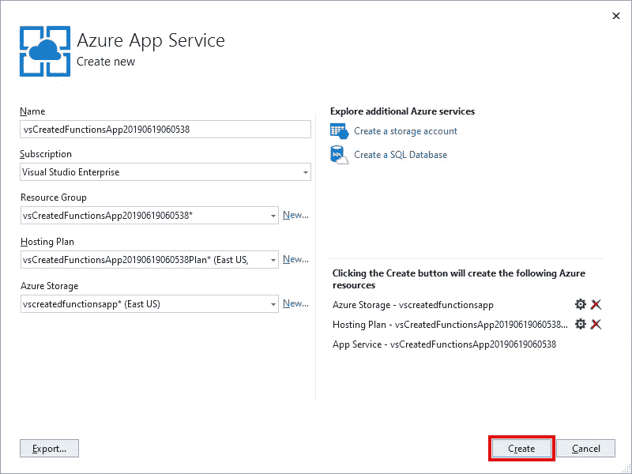

# 从 Visual Studio 创建 Azure 函数应用程序

> 原文：<https://itnext.io/create-an-azure-function-app-from-visual-studio-477c16a184d9?source=collection_archive---------5----------------------->

当我开始在帖子中查看 Azure 功能应用时， [Azure 功能介绍](https://elanderson.net/2019/06/azure-functions-introduction/)，我使用 Azure 门户创建了帖子中使用的示例功能应用。在后续的文章中，[在 Visual Studio 中打开 Azure 门户创建的函数](https://elanderson.net/2019/07/open-an-azure-portal-created-function-in-visual-studio/)，我展示了如何在 Visual Studio 中打开门户创建的函数。从 Azure 门户网站下载的代码是 csx 格式，而不是 Visual Studio 通常处理的 cs 格式，所以很多 Visual Studio 都无法工作。

这篇文章将介绍如何在 Visual Studio 中创建一个新的 Azure 函数应用。我希望从 Visual Studio 开始会产生对 Visual Studio 更友好的代码。本帖将使用 Visual Studio 2019。

## 应用程序创建

打开 Visual Studio，在开始对话框中点击**创建新项目**。


在下一个屏幕上搜索来自 **Azure Functions** 。点击 **Azure Functions** 项，点击**下一步**按钮。



输入一个**项目名称**，并根据需要更改任何其他设置，然后点击**创建**。



下一个对话框将询问要使用的触发器类型。为了匹配我们几周前在 Azure 门户上创建的功能，我们将使用一个 **Http 触发器**并点击 **Create** 。



单击最后一个创建按钮将启动项目创建过程。完成后，你将有一个项目，其中有一个函数与文件 **Function1.cs** 中的以下内容相匹配。

```
public static class Function1
{
    [FunctionName("Function1")]
    public static async Task<IActionResult> Run(
        [HttpTrigger(AuthorizationLevel.Function, "get", "post", Route = null)] HttpRequest req,
        ILogger log)
    {
        log.LogInformation("C# HTTP trigger function processed a request.");

        string name = req.Query["name"];

        string requestBody = await new StreamReader(req.Body).ReadToEndAsync();
        dynamic data = JsonConvert.DeserializeObject(requestBody);
        name = name ?? data?.name;

        return name != null
            ? (ActionResult)new OkObjectResult($"Hello, {name}")
            : new BadRequestObjectResult("Please pass a name on the query string or in the request body");
    }
}
```

以下是几周前门户网站创建的功能。

```
public static async Task<IActionResult> Run(HttpRequest req, ILogger log)
{
    log.LogInformation("C# HTTP trigger function processed a request.");

    string name = req.Query["name"];

    string requestBody = await new StreamReader(req.Body).ReadToEndAsync();
    dynamic data = JsonConvert.DeserializeObject(requestBody);
    name = name ?? data?.name;

    return name != null
        ? (ActionResult)new OkObjectResult($"Hello, {name}")
        : new BadRequestObjectResult("Please pass a name on the query string or in the request body");
}
```

你会注意到两者的身体是一样的。Visual Studio 版本使用属性来让 Azure 知道名称、触发器类型以及一旦函数发布到 Azure 将需要的其他信息。

## 本地测试

使用 Visual Studio 进行函数开发的一个非常好的地方是，您可以在本地调试它们。如果您点击播放按钮(或 F5 ), Visual Studio 将在本地启动您的功能。您将看到如下所示的内容。



突出显示的部分列出了应用程序中的所有 Http 函数以及可用于测试它们的 URL。对于这个例子，下面的 URL 可以用来获得响应“Hello，Eric”。

```
[http://localhost:7071/api/Function1?name=Eric](http://localhost:7071/api/Function1?name=Eric)
```

据我所知，到目前为止，Visual Studio 的所有正常调试功能在本地运行函数时似乎都工作正常。

## 应用程序发布

现在，我们已经在本地创建并测试了我们的函数应用程序，是时候将它发布到 Azure 了。在解决方案资源管理器中右键单击项目文件，然后单击 **Publish** 。



在发布对话框中，我们将从程序包文件中**创建新的**和**运行，因为建议这样做(参见[文档](https://docs.microsoft.com/en-us/azure/azure-functions/run-functions-from-deployment-package)了解为什么建议这样做)。最后，点击**发布**按钮。**



下一个对话框是将在 Azure 中创建的应用服务的配置。您可以使用默认设置并点击 **Create** ，但是我总是花费额外的时间来创建一个新的资源组，这样当我使用完我的示例时，就可以很容易地删除它们。



单击“创建”按钮将开始部署到 Azure，这将需要几分钟时间。部署完成后，您可以使用 Azure 门户来测试您的功能 App。关于从 Azure 门户运行一个函数的更多信息可以在 [Azure 函数介绍](https://elanderson.net/2019/06/azure-functions-introduction/)帖子中找到。

## 包扎

虽然通过 Azure 门户创建功能是最快的入门方式，但我建议您从本地开始。稍微长一点的入门时间对于它提供的更好的工具和灵活性来说是值得的。

*最初发表于* [*埃里克·安德森*](https://elanderson.net/2019/07/create-an-azure-function-app-from-visual-studio/) *。*