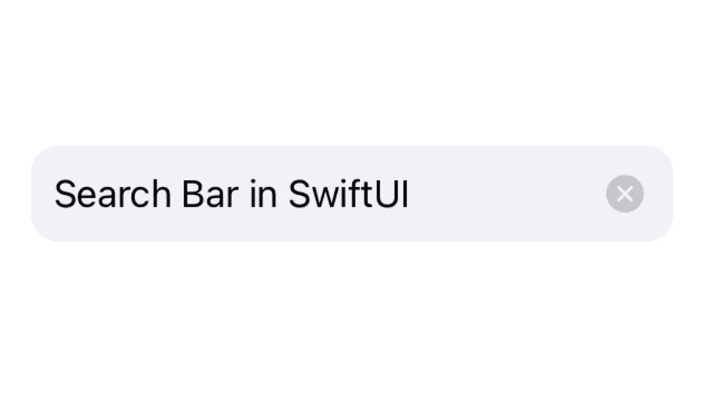
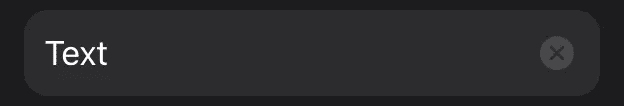
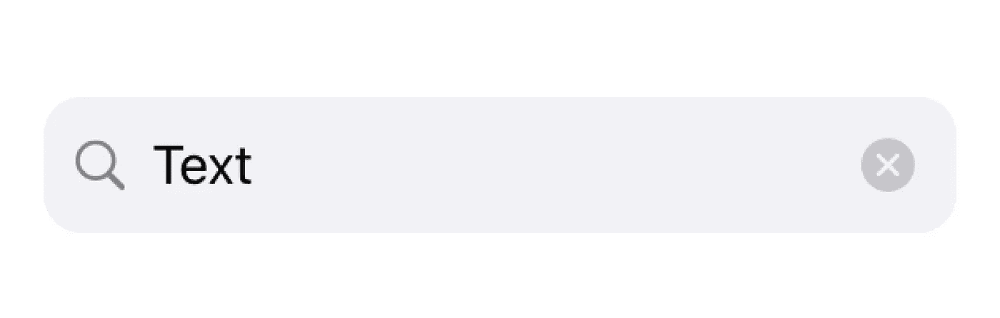
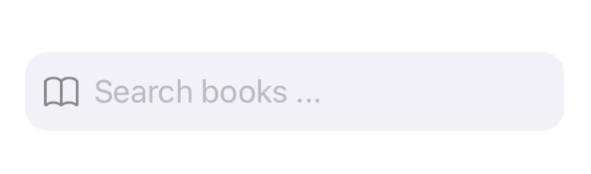

# 在 SwiftUI 中创建一个 iOS 风格的搜索栏

> 原文：<https://itnext.io/create-an-ios-styled-search-bar-in-swiftui-3127b890af56?source=collection_archive---------1----------------------->

*IOs 15 及更高版本上的⚠️，使用* `*.searchable()*` *。*

在这篇文章中，我将向你展示如何在 SwiftUI 中创建一个可重用的类似 iOS 的搜索栏，你可以随心所欲地设计风格。

# 基本结构

为了可重用性，我将搜索栏创建为一个单独的视图，但是你也可以在你的视图中实现它。

现在您有了一个简单的 TextField，但是它还没有任何样式。

搜索栏(占位符:“搜索…”文本:$text)

# 清除按钮

接下来我们将添加一个清除按钮，将`text`设置回`""`。

当用户开始书写时(`text`不再为空)，紧挨着文本字段会出现一个带有系统符号的`Image`。它有一点填充，点击一下它会将`self.text`设置回`""`。想用`withAnimation {}`可以试试，看`text`在你的视野里有什么效果。

# 背景

现在我们创建背景。将此修改器添加到 HStack。

您可以根据自己的喜好更改填充、颜色和圆角半径。除了颜色，你还可以根据应用程序的风格使用图像或渐变。

就是这样。它看起来很棒，拥有我们想要的所有功能。

# 额外的

当您将搜索栏添加到工作表中时，在浅色模式下看起来很棒，但在深色模式下，搜索栏背景的颜色与视图背景的颜色相同。

将此添加到您的视图，并将`.background(Color(.systemGray6))`更改为`.background(backgroundColor)`。现在你可以看到背景。根据你的`SearchBar()`是什么级别，事后可以换颜色。

# 额外 2

如果需要，您还可以在文本字段旁边添加一个图标。只需在`HStack`中的`TextField`前加一个`Image(systemName: "magnifyingglass").foregroundColor(.secondary)`。根据您的搜索栏搜索的内容，您还可以将图像更改为更具体的系统图像，以使搜索栏感觉更自然。

图书应用程序的搜索栏示例