# 创建和发布 React 组件库——最简单的方法

> 原文：<https://itnext.io/create-and-publish-a-react-component-library-the-easy-way-6d1798974bc6?source=collection_archive---------2----------------------->

在不到 10 分钟的时间内将您自己的组件库发布到 npm。

我们将创建一个简单的 React 组件库，我们可以通过 npm 发布它并在其他 React 项目中使用它。出于教程的目的，我将创建一个组件，它采用一个`color`属性并显示一个具有该颜色的`h1`元素。我们开始吧！

创建 React 组件库最简单的方法是使用名为`create-react-library`的 CLI 工具。

```
npx create-react-library
```

这将开始一个小的互动过程:

1.  软件包名称将是 npm 中您的库的名称

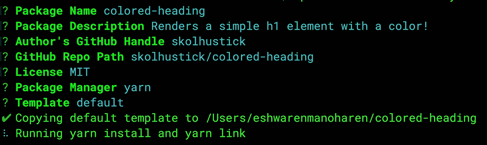

完成后，您将在终端上看到两个命令。

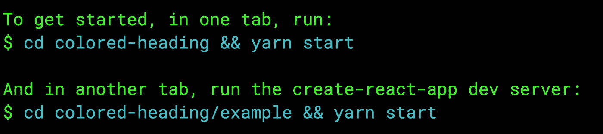

在不同的终端选项卡上运行以上两个命令。他们两个都必须跑。第一个命令监视更改并打包您的库，第二个命令在基本的 React 应用程序中预览您的库，该应用程序将在您的浏览器中打开。

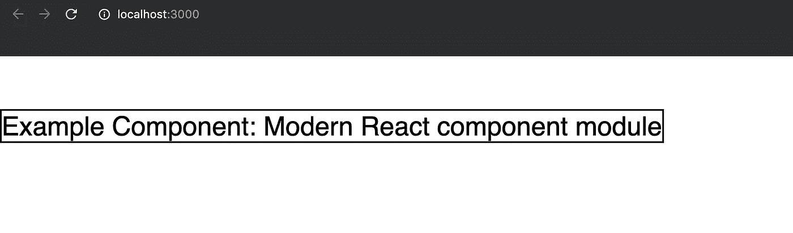

现在，在文本编辑器中打开您的项目目录，让我们看看其中的几个文件:

## /src/索引. js

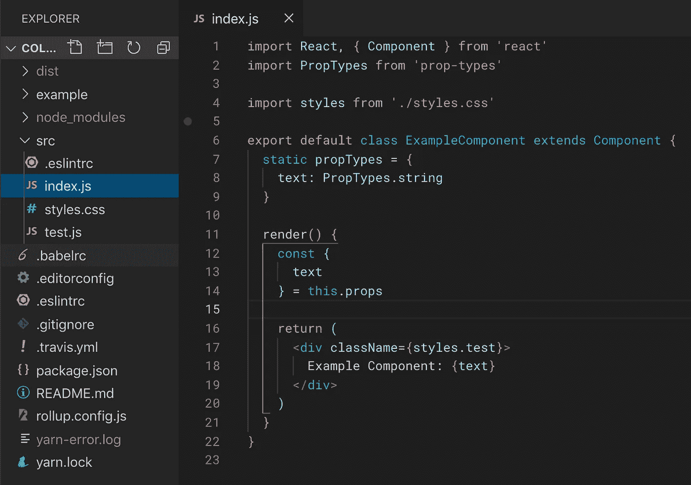

如您所见，这是您的库的起始文件。这是您将导出所有组件的地方。现在，一个名为**的组件 ExampleComponent** 被默认导出。

## /example/src/App.js

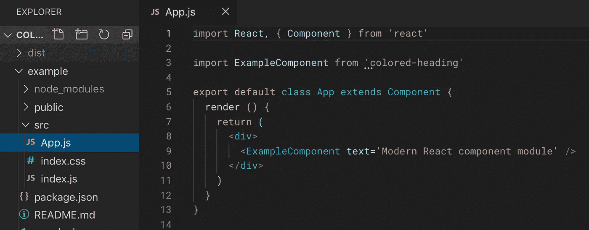

在“example”文件夹中，你可以看到同样的 **ExampleComponent** 是从“colored-heading”导入的，我在上面使用了这个项目名。

## 返回到/src/index.js

我要对`/src/index.js`做一些改动。

1.  删除了`style.css`的导入和文件。
2.  将元件名称更改为`ColoredHeadingOne`。
3.  增加了颜色道具和道具类型。
4.  将`<div>`组件更改为`h1`组件，并将颜色属性作为样式传递。

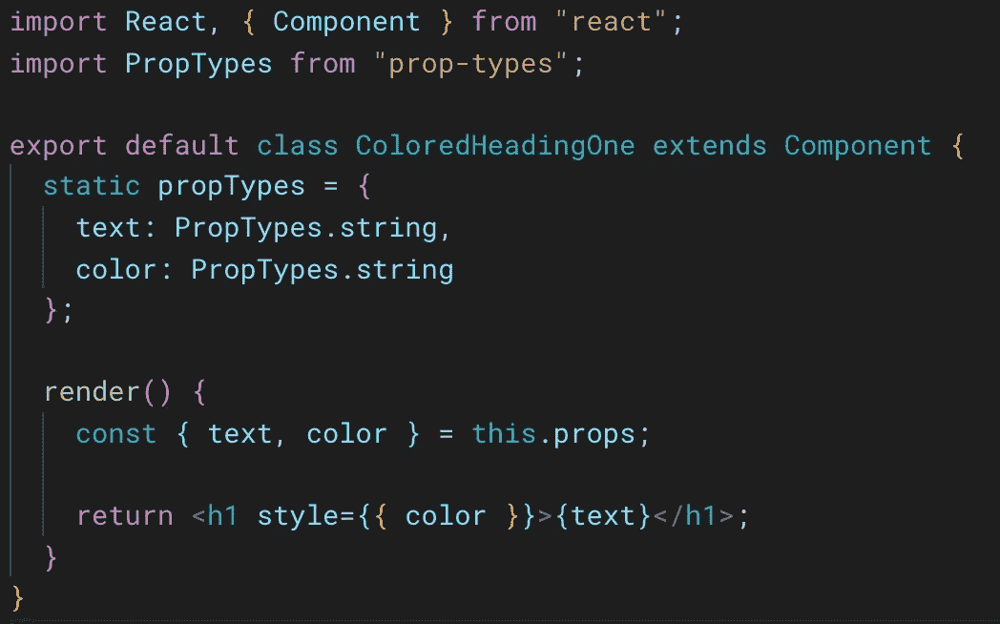

## 在/example/src/App.js 中测试

现在，我想导入我的 **ColoredHeadingOne，而不是导入 **ExampleComponent** 。**我还会传一个`color`道具。

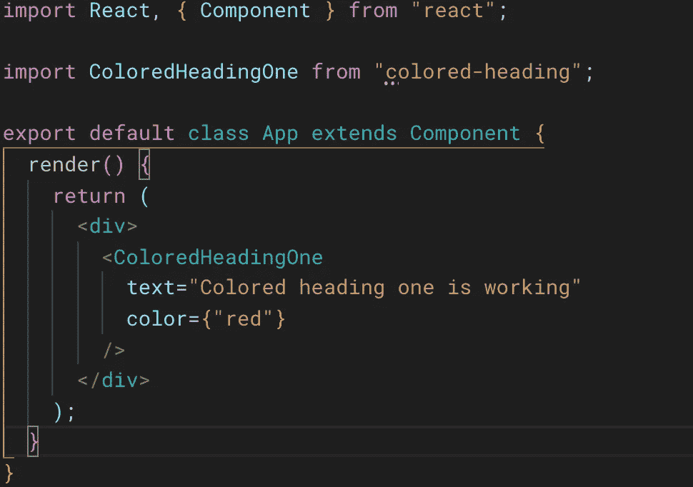

## 在浏览器中测试

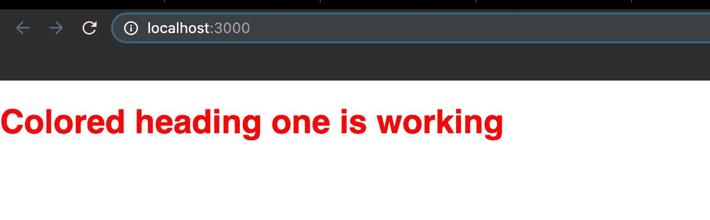

起作用了！

## 导出多个组件

在`/src/index.js`中，我们可以导出多个组件。

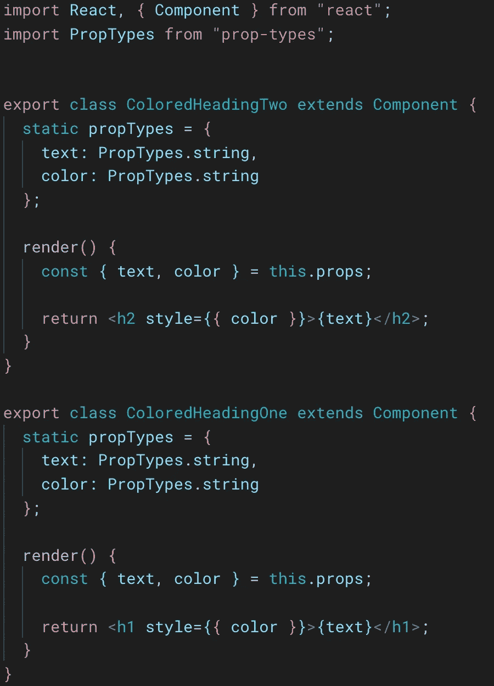

为了简洁起见，我复制了 **ColoredHeadingOne** 并将名称改为 **ColoredHeadingTwo** ，并且**删除了两个组件的默认关键字**。

让我们将第二个组件导入到`/example/App.js`

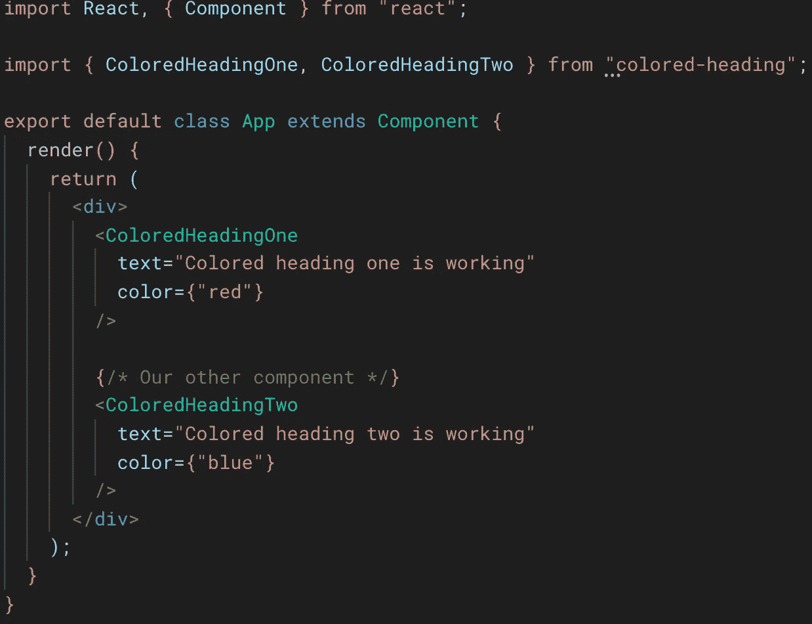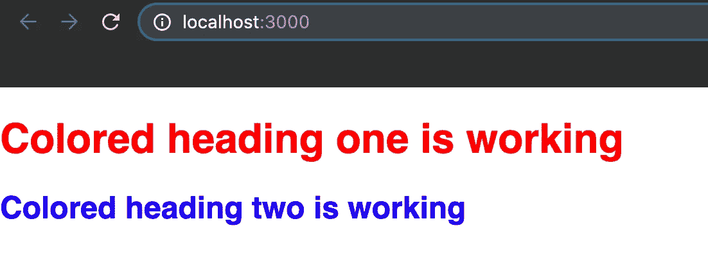

ColoredHeadingTwo 起作用了！

# 推送至 Github

仅仅为了额外的东西，让我们把我们的代码推到 Github。

首先，在 Github 中创建一个 repo。[导轨](https://help.github.com/en/articles/create-a-repo)

现在复制您的库 HTTPS 克隆 URL

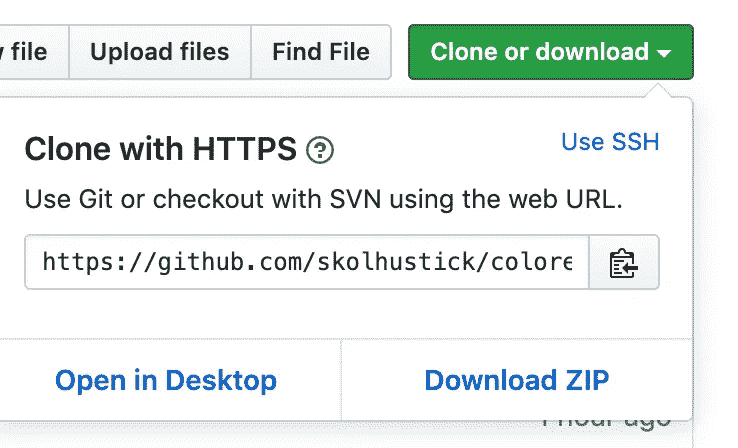

现在，在您的项目目录中(在终端中)执行以下操作:

```
 git add -A
git commit -m"Initial Commit"
git git remote add origin <YourRepoHTTPSURL>
// e.g git remote add origin [https://github.com/.../....git](https://github.com/skolhustick/colored-heading.git)
git push origin masterUsername : <-- Enter your Github username
Password : <-- Enter your Github password
```

你的 Github repo 现在应该更新了。

# 发布到 npm

只需在终端中进入您的项目目录并执行以下命令:

```
npm publish
```

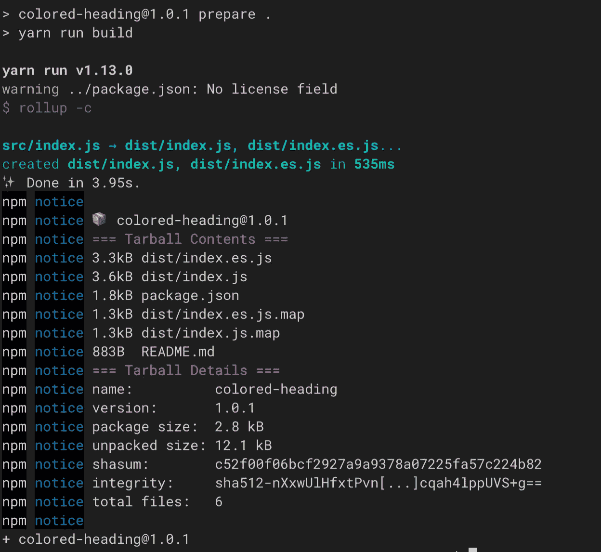

搞定了！

您现在可以在 npm 中查看新的 React 组件库了！

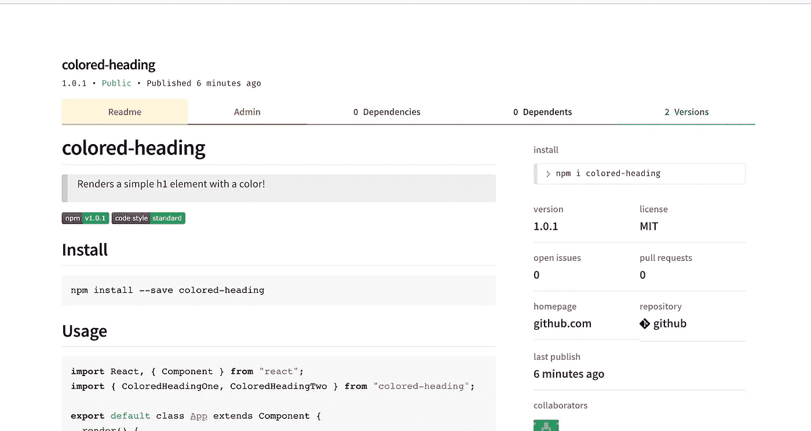

# 主持一个演示网站

您可以轻松地将示例文件夹部署到 Github 页面。在同一个目录中，只需运行:

```
npm run deploy
```

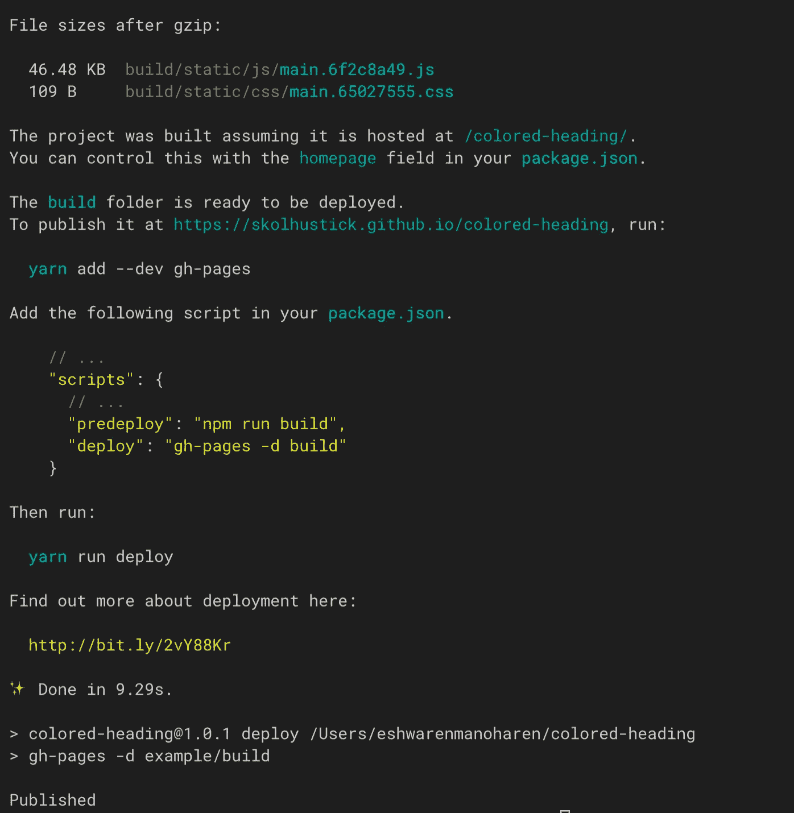

转到你在“发布于”后看到的链接，你的演示页面就应该出来了！😍

这是我们辅导项目的报告:

[](https://github.com/skolhustick/colored-heading) [## skolhustick/彩色标题

### 用颜色渲染一个简单的 h1 元素！通过创建帐户，为 skolhustick/彩色标题开发做出贡献…

github.com](https://github.com/skolhustick/colored-heading) 

这是 npm 包:

[](https://www.npmjs.com/package/colored-heading) [## 彩色标题

### 用颜色渲染一个简单的 h1 元素！

www.npmjs.com](https://www.npmjs.com/package/colored-heading) 

这是演示页面；

 [## 彩色标题

### 编辑描述

skolhustick.github.io](https://skolhustick.github.io/colored-heading/) 

希望不久能看到你的图书馆！祝你好运！👍