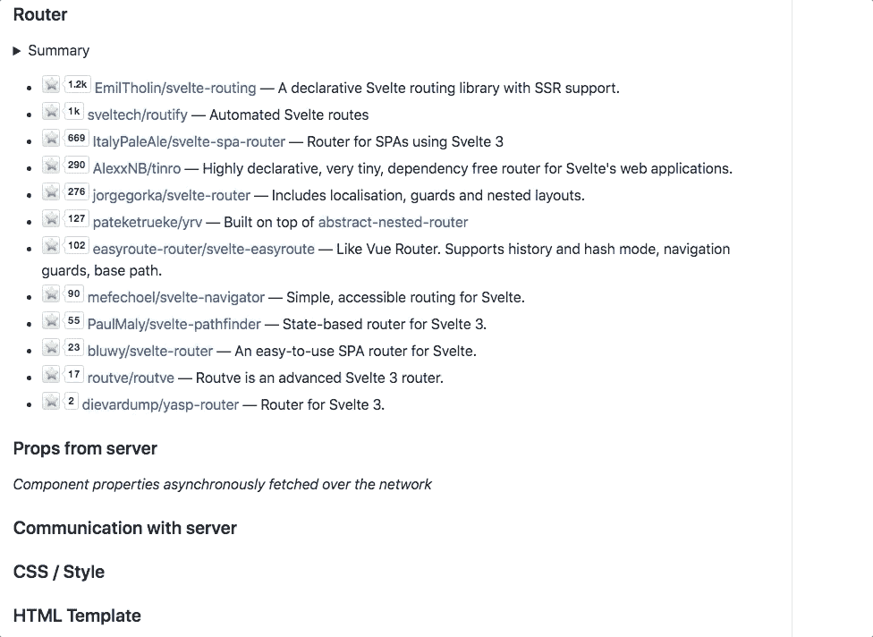
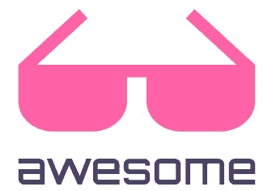

# 创建一个引人注目的 GitHub 自述文件(🅰🆆🅴🆂🅾🅼🅴·斯维尔特)

> 原文：<https://itnext.io/create-awesome-list-ae72aa4da605?source=collection_archive---------1----------------------->

随着新技术的出现，有时很难找到学习和提高技能的资源。大约 6 年多前，当我第一次学习围棋时，可以学习的资源很少。由于 Go 在很多方面是一种古怪的语言，学习曲线比它应该有的更陡峭——尽管它故意简单。

从那时起，几乎每项技术都出现了令人敬畏的列表。它们通常组织良好，非常有用。有些是策划好的。

大约一年前，我发现了革命性的前端 JS 框架，名为[svelet](https://svelte.dev/)。它最近超越了*婴儿期*。它是 rollup.js 的创建者做的一个*编译时*框架，相比 React，我被它的**优越的性能、更小的捆绑文件大小、开发者体验**([2020 最高开发者满意度](https://2020.stateofjs.com/en-US/technologies/front-end-frameworks/))惊呆了。

在仔细研究了代码库和关键数字后，我相信 3 年后将只存在 2 个主要框架。没有 Vue。没有棱角。我唯一担心的是 Rich Harris(创建者)可能会失去兴趣，或者某个对 React 有影响力的人决定将 React 彻底改造成一个编译时框架。

我又一次把公司押在了苗条上。为了帮助苗条身材的上升轨迹，我推出了一个 [**非常棒的苗条身材**](https://github.com/rocketlaunchr/awesome-svelte) 页面。之前有两个很棒很苗条的页面，但是都失败了。我想创建一个惊人的列表，以确保苗条爱好者总能找到有用的资源。

这篇文章展示了我对如何创建这个令人敬畏的页面的想法和考虑。

它的目标是具有这些特性:
。更快地找到组件。
使用直播星计数订购(**小说**)。
·对比竞争组件特性的汇总表。

如果你正在为你的图书馆做一个自述，这里只有一些是相关的。

# 介绍会；展示会

> 当两个政客在市政厅解释他们将如何创造就业机会时，普通听众不会理解先进的经济理论。最终，他们会投票给更有魅力和更漂亮脸蛋的政治家。

当谈到评估 GitHub 上任何东西的“质量”时，许多人使用的两个因素是明星数量和总体介绍。我不能直接控制星级计数，但我可以使网页尽可能抛光。

## 标志；徽标

我想要一个像[sweetaler 2](https://sweetalert2.github.io/)一样醒目的标志。这意味着它必须是动画。通常的选择是动画 gif(难看的)或动画 png(大，并且不总是被浏览器支持)。我还希望这个标志看起来简洁，不管它是手机还是 50 英寸的显示器。这意味着矢量图形。

他们似乎喜欢对立的考虑，但结果是你可以将 HTML 和 CSS 作为 **< foreignObject >** 嵌入到 SVG 图像中。在对 CSS 动画(以及我找到的一些代码)进行了快速入门之后，我想到了:


令人敬畏的苗条标志

前景在任何分辨率下看起来都很清晰，背景有电影“失焦”的感觉。我对我的创作很满意。

## 恒星计数

大多数人都没有认识到星数有多重要。搜索引擎用它来排名。人们根据它来判断一个图书馆的质量和受欢迎程度。长话短说——这非常重要！

我不能强迫人们开始回购，但我可以通过努力创造一个有价值的免费产品，然后提出建议来推动他们。

我的解决方案是在自述文件的右上角放置一个*准* **行动号召**。


```
<p align="right">
  ⭐ &nbsp;&nbsp;<strong>the project to show your appreciation.</strong> :arrow_upper_right:
</p>
```

# 物质

一场伟大的演讲只能让你到此为止(除非你是特朗普)。你需要用事实来支持它。

不同的 Awesome 列表强调各自生态系统的不同方面。我可以把它做成一个百科全书，里面有文章、博客文章、组件等等，以迎合完全的初学者和经验丰富的专家。这样做的代价是，不管页面组织得有多好，它都会使页面变得杂乱无章。作为一个踢球者，你可能会输给谷歌搜索。

因为你只是一个很短时间内的初学者，所以我决定在新手阶段之后尽可能地对大多数开发者有用。这样，随着开发者经验水平的提高，它仍然是有价值的。

既然 Svelte 和 React 差不多，那就没有必要重新发明轮子了。已经有两个非常受欢迎的牛逼反应名单[https://github.com/enaqx/awesome-react](https://github.com/enaqx/awesome-react)和[https://github.com/brillout/awesome-react-components](https://github.com/brillout/awesome-react-components)。作为一个有 4-5 年经验的前 React 开发人员，我也发现自己稍微倾向于后一个列表，它更侧重于组件。使用 Ctrl/Cmd+F 查找东西也稍微容易一些。

我决定在删除 Redux 相关链接后复制那个列表(Svelte 不需要外部库进行状态管理)。

# 有用

目前，Svelte 有一个非常小(但活跃)的社区。这意味着与 React 和 Vue 相比，没有太多的资源和第三方组件。一方面，这意味着在将其添加到列表中之前，需要评估的内容较少。另一方面，我发现发现高质量的库更加困难和耗时。我花了大量的时间和精力搜索互联网和非官方-官方的社区代码列表。

## 明星

因为 star count 是开发人员用来判断库的一个因素，所以我决定根据 star count 而不是字母顺序来排序组件和库。这很新颖，因为我以前从未见过有人这样做过。我用 [shields.io](https://shields.io/) 创建了实时的明星计数徽章。


星级计数是实时更新的(但列表需要重新排序，直到我自动化)

## 汇总表

一些组件在表中评估更好，因为它们在功能上竞争。所以我创建了一个汇总表。



# 当（博物馆、美术馆、图书馆）馆长

我决定，由于苗条的生态系统仍然是新生的，在短期内将有最低限度的监管，因为人们提交他们的链接公关。我假设许多人都是新手(可能是大学生)，他们很乐意展示他们的工作(他们投入了大量的时间和精力)。在这个阶段阻止潜在的优秀开发者是没有意义的。

将来，我会更积极地清除“低质量”链接列表。这是我在研究了那里的情况后做出的行政决定。

# 结论

看看 https://github.com/rocketlaunchr/awesome-svelte 的[](https://github.com/rocketlaunchr/awesome-svelte)**。**

**要学会苗条:**

*   **[https://svelte.dev/tutorial/basics](https://svelte.dev/tutorial/basics)**
*   **[https://svelte.dev/tutorial/making-an-app](https://svelte.dev/tutorial/making-an-app)**

**当我刚开始学习的时候，我还发现 developer.mozzila.org 很有用。**

****