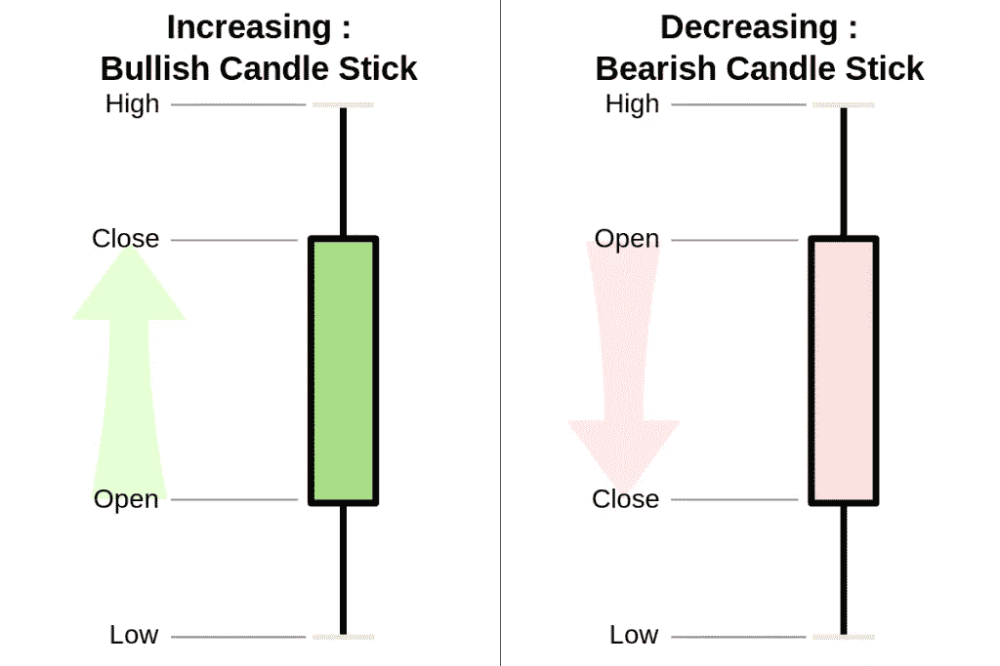
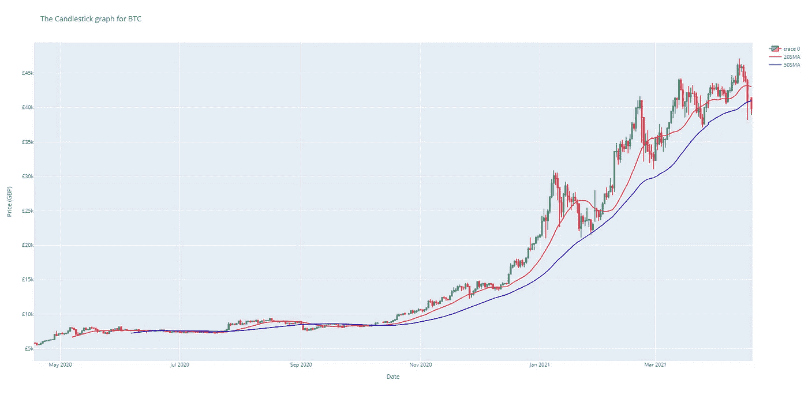
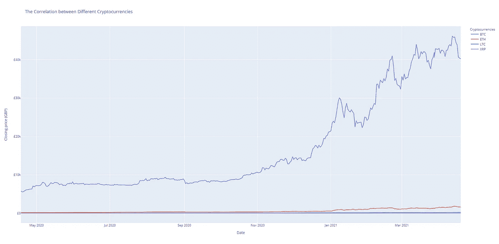
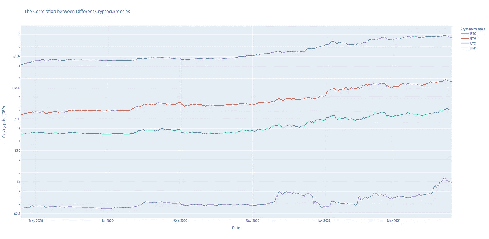

# 如何用 Python 创建漂亮的加密货币图

> 原文：<https://itnext.io/create-beautiful-cryptocurrency-graphs-in-python-bec7b9cbc21a?source=collection_archive---------2----------------------->

随着加密货币开始作为一种规范进入我们的社会，越来越多的人对它们感兴趣。人们与它们进行交易，投资它们，甚至用它们来创造更多的产品。在今天的文章中，我将向你展示如何使用 Plotly 绘制漂亮的图表来显示关键的价格数据。我们将绘制两个图表:一个是简单的蜡烛图和 2 个简单的移动平均线，另一个是 4 种不同的加密货币，以了解它们如何相互关联:

1.  绘制比特币的蜡烛图
2.  绘制多个加密货币图

开始之前，我们需要熟悉几个术语:

**什么是简单均线？**

*简单移动平均线是可用于显示易变数据*的当前趋势的值，其计算方法是将最近价格的总和除以我们计算总和的时间段数。短期平均线，时间周期较短，对市场的变化反应更快。长期平均线的反应要慢得多，但显示了市场更普遍的运行方向。

**什么是蜡烛图？**

*蜡烛图是一种能够提供大量价格变动信息的金融图表，*如某一证券在特定时间段内的开盘价、收盘价、最高价、最低价。



[https://www . newtraderu . com/2020/06/01/how-to-read-烛台图表/](https://www.newtraderu.com/2020/06/01/how-to-read-candlestick-charts/)

[这里的](https://www.investopedia.com/trading/candlestick-charting-what-is-it/)是一篇非常好的关于了解烛台以及如何解读其图案的文章，如果你想了解更多信息的话。

我们还需要安装我们今天将使用的 3 个不同的库。这可以通过一个简单的命令来完成:

```
pip install pandas pandas-datareader plotly
```

现在我们开始吧，好吗！

# 绘制比特币的蜡烛图:

为了绘制蜡烛图，我们可以首先将所需的库导入到我们的文件中，并建立我们要查看的加密货币和货币:

如果需要，您显然可以将货币兑换成当地货币。

我们需要做的第一件事是创建一个函数，我们可以调用它来获取数据。为此，我们将使用 *pandas_datareader* 库从 Yahoo Finance 收集数据，并以 pandas dataframe 对象的形式返回给我们:

在 getData 函数的前几行中，我们以格式`YYYY-MM-DD`计算今天和一年前的日期字符串(这是 get_data_yahoo 方法所必需的。然后，我们可以使用这两个日期通过 pandas_datareader 库从 Yahoo Finance 获取加密货币的历史数据，并将其返回。

在我们的主代码中，我们将创建主图表并在其上绘制数据:

我们可以从刚才创建的函数中获取加密货币数据，并用它来创建蜡烛图。在蜡烛图中，除了与日期相关联的 *x* 值(由索引指示)之外，有 5 个不言自明的必需参数。请注意，我们还在同一个图上添加了两个散点图。这些将是我们的简单移动/滚动平均值，并根据我们数据的收盘价计算。我还选择了两种颜色(粉色和蓝色)来区分每条线，尽管图表上会有一个图例，以便您可以检查哪个是哪个。要更改平均值的时间周期，您可以改变滚动方法中“窗口”的整数值。

然后，我们可以向图表和轴添加标题，并删除图表底部的范围滑块，因为这不是很有用。最后，在我们展示图表之前，我们添加了一个符号(把它改成你想要的任何货币符号)作为前缀到 y 轴上的价格数据。

运行程序时，我们应该看到浏览器打开，屏幕上显示的图形如下:



比特币的蜡烛图

我们可以使用图表右上方的按钮来放大和缩小、平移图表，甚至将图表保存为图像。

# 绘制多个加密货币图表:

我们将在同一个图表上绘制多个加密货币图表，作为简单的线图，这是因为许多蜡烛图有时会变得相当混乱。从这个图中，我们可以看到不同的加密货币是如何相互关联的。

首先，我们像以前一样导入相同的库，并再次定义我们的常数。这一次，我们将它们定义为加密货币列表，因为我们将绘制这些内容。我们还可以像以前一样复制相同的 getData 函数:

在代码的主要部分，我们可以获得数据并使用它创建一个字典，关键字是加密货币的名称，值是从 getData 函数返回的熊猫数据帧:

这种语法对您来说可能有点奇怪，但它所做的只是执行与下面 3 行注释相同的代码。这里使用的技巧叫做字典理解，如果你想了解更多，你可以点击这里的。

为了绘制我们的多个图表，我们可以像以前一样制作一个新的图形，但是这次遍历字典中的每一项，并在图表中添加一个“trace”(本质上是数据)。在这里，我们将使用散点图来绘制我们的数据的收盘价，以简化事情(一个图表上的许多烛台可能会混淆):

我们还可以向轴、图例和图表添加标题。这里我们还更新了我们的 y 轴，使其成为对数刻度。这是因为 BTC 的价格比其他地方高得多，如果我们有一个线性标度，那么这将看起来非常奇怪，因为我们会将其他加密货币图视为直线:



具有线性 *y* 轴的示例关联图

请注意，由于 *y* 轴的这一变化，要检查加密货币的价格，您必须更加关注图表。

在将 *y* 轴设置为对数后运行该程序，您应该有望得到如下所示的图形:



多个加密货币图表并排显示，以比较相关性

从图表中可以看出，BTC、瑞士联邦理工学院和长期技术学院的趋势非常相似。但是 ETH 和 LTC 比 BTC 和 ETH 有更强的正相关性，你可以通过观察不同图表中的模式来了解这一点，并了解它们在相互比较中是如何变化的。另一方面，你可以看到 BTC 和 XMR 是负相关的，因为 XMR 在 11 月 25 日左右达到峰值，但 BTC 在那时略有下降。这在交易时非常有用，因为你可以看到哪些加密货币彼此相关，你可以选择它们进行投资。

# 最后的想法

当我第一次了解 Plotly 时，我从来没有想到它是如此简单和容易绘制的图形，但不仅仅是普通的图形，还有许多其他功能的美丽精确的图形。注意:请不要把我说的任何话当成财务建议，我不是经济学家，只是个程序员。

我希望我教了你一些新东西。如果您有任何问题或反馈，请不要犹豫在下面评论，我会尽力回答他们。

感谢您的阅读！💖