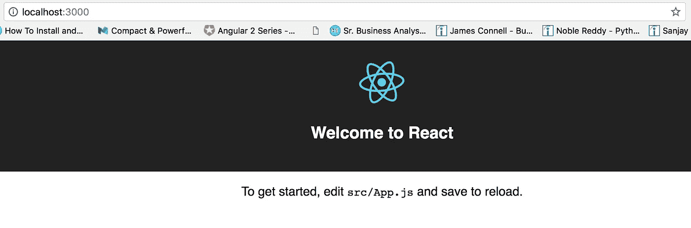
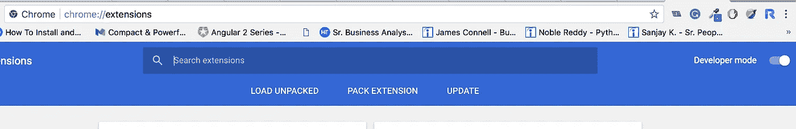
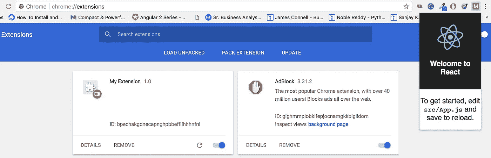
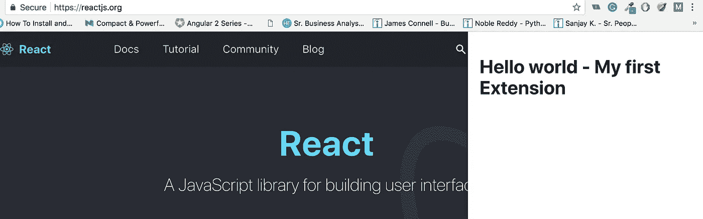

# 使用注入页面策略创建带有 ReactJs 的 chrome 扩展

> 原文：<https://itnext.io/create-chrome-extension-with-reactjs-using-inject-page-strategy-137650de1f39?source=collection_archive---------0----------------------->


Chrome 是谷歌推出的一款非常棒的浏览器，速度非常快，重量轻，但功能也非常强大。Chrome 还有一个非常好的扩展性模型，允许开发人员只需要 HTML、CSS 和 JavaScript 技能就可以创建强大的扩展。

我将向您展示如何将我们自己的 JavaScript 和 CSS 注入到现有页面中，以增强其功能。

# 目录

1.  [创建和设置 React 应用](https://medium.com/p/137650de1f39#e3f1)
2.  [给 Chrome 添加 React 应用扩展](https://medium.com/p/137650de1f39#6021)
3.  [将 React 应用作为内容脚本注入页面](https://medium.com/p/137650de1f39#3996)
4.  [如何利用 Chrome 消息 API](https://medium.com/p/137650de1f39#1440)
5.  [使用 Iframe 隔离扩展 CSS](https://medium.com/p/137650de1f39#6186)
6.  [路由内线 react 分机](https://medium.com/p/137650de1f39#c659)
7.  [快速入门 Github 回购](https://medium.com/p/137650de1f39#98ad)
8.  [使扩展与 Create React App v2.x 兼容](https://github.com/satendra02/react-chrome-extension/issues/2)

# 创建和设置 React 应用程序

在命令行中，转到您的工作区目录并运行`npx create-react-app my-extension`。这将建立一个名为`my-extension`的示例 React 应用程序，其中内置了所有构建步骤。

一旦创建了基本的 react 应用程序，转到`my-extension`目录并运行`yarn start`以确保应用程序工作正常。如果一切正常，您将看到一个浏览器页面，加载了 React 应用程序。



## 设置 react 应用程序以用作扩展

我们的`create-react-app`有`manifest.json`。我们只需要在里面增加一些细节，让它兼容 Chrome 的`manifest.json`。打开文件`[PROJECT_HOME]/public/manifest.json`并用下面的代码替换它。

```
{
    "name": "My Extension",
    "version": "1.0",
    "manifest_version": 2,
    "browser_action": {
        "default_popup": "index.html"
    },
    "content_security_policy": "script-src 'self' 'sha256-GgRxrVOKNdB4LrRsVPDSbzvfdV4UqglmviH9GoBJ5jk='; object-src 'self'"
}
```

# 向 Chrome 添加 React 应用扩展

让 React app 作为 Chrome 的扩展。像平常用`yarn build`构建 react 应用一样构建这个应用。这会生成应用程序并将文件放在`[PROJECT_HOME]/build`中。

在 Chrome 浏览器中，进入`chrome://extensions`页面，打开*开发者模式*。这使得能够在本地安装 Chrome 扩展。



现在点击`LOAD UNPACKED`并浏览到`[PROJECT_HOME]/build`，这将安装 React 应用作为 Chrome 扩展。



当您单击扩展图标时，您将看到 React 应用程序，呈现为一个扩展弹出窗口。

# 将 React 应用程序作为内容脚本注入页面

Chrome extension 使用`content_scripts`在`manifest.json`中提到一个 JS 和 CSS 文件，需要注入到底层页面中。那么这个脚本将可以访问页面 DOM。

> 我们的`create-react-app`的问题是，构建步骤每次都会以不同的名称生成输出 JS 文件(如果内容发生了变化)。所以我们没有办法知道 JS 文件的实际文件名，因此我们不能在我们的`manifest.json`文件中提到它。

作为一种变通方法，您可以直接退出`create-react-app`，手动修改 webpack 配置，为内容脚本创建一个单独的入口点。

## 弹出 create-react-app 并配置内容脚本

[弹出**创建-反应-app**会发生什么](https://github.com/satendra02/react-chrome-extension/wiki/What-happens-when-you-eject-Create-React-App)

首先，在命令行上运行`yarn run eject`。这将弹出`create-react-app`，然后在你的项目文件夹中创建所有必要的构建脚本。

现在运行`yarn install`来安装所有的依赖项

退出完成后，转到`[PROJECT_HOME]/config/webpack.config.prod.js`文件，并在其中进行以下更改:

将选项`entry`更改为具有多个入口点。这里，我们的内容脚本将被命名为`content.js`

```
entry: {
    **app**: [require.resolve('./polyfills'), paths.appIndexJs],
    **content**: [require.resolve('./polyfills'), './src/content.js']
},
```

 [## 使扩展与 Create React App v2 . x Issue # 2 satendra 02/React-chrome-extension 兼容

### 错误:找不到模块“”。/polyfills '运行纱线运行弹出后

github.com](https://github.com/satendra02/react-chrome-extension/issues/2) 

同样，搜索`.[contenthash:8]`、`.[chunkhash:8]`并将其从 CSS 和 JS 输出文件名中删除。这将确保生成的文件中没有随机散列，因此我们可以在清单 JSON 中提到文件名。

在`webpack.config.prod.js`文件中完成上述更改后，现在是创建内容脚本文件的时候了。在`src`文件夹中创建一个名为`content.js`和`content.css`的文件。

```
*/* src/content.js */*
**import** React from 'react';
**import** ReactDOM from 'react-dom';
**import** "./content.css";

**class** Main **extends** React.Component {
    render() {
        **return** (
            **<**div className**=**{'my-extension'}**>**
                <h1>Hello world - My first Extension**<**/h1>
            **<**/div>
        )
    }
}

**const** app **=** document.createElement('div');
app.id = "my-extension-root";document.body.appendChild(app);
ReactDOM.render(**<**Main **/>**, app);
```

```
*/* src/content.css */***.my-extension** {
   padding: 20px;
}
**.my-extension h1** {
    **color**: #000;
}
```

并将下面的 CSS 添加到`index.css`，我将在后面解释为什么我们将两个 CSS 保存在单独的文件中。

```
*/* src/index.css */***#my-extension-root** {
    **width**: 400px;
    **height**: 100%;
    **position:** fixed;
    **top:** 0px;
    **right:** 0px;
    **z-index:** 2147483647;
    **background-color:** white;
    **box-shadow:** 0px 0px 5px #0000009e;
}
```

现在我们已经配置了 React 构建管道并创建了内容脚本，让我们更新`manifest.json`来获取这些文件。将以下代码添加到`manifest.json`文件中。

```
"content_scripts" : [
    {
      "matches": [ "<all_urls>" ],
      "css": ["/static/css/app.css", "/static/css/content.css"],
      "js": ["/static/js/content.js"]
    }
]
```

 [## 使扩展与 Create React App v2 . x Issue # 2 satendra 02/React-chrome-extension 兼容

### 错误:找不到模块“”。/polyfills '运行纱线运行弹出后

github.com](https://github.com/satendra02/react-chrome-extension/issues/2) 

现在构建你的应用，进入`chrome://extensions`并重新加载扩展，当你进入任何网站并刷新它时，你可以看到我们的扩展在那里注入。



> 现在，在这个阶段，当你点击扩展图标时，你可以看到一个弹出窗口也将出现，该窗口包含页面上注入的相同组件，但是可接受的行为应该是，在点击扩展图标时，注入的页面必须表现为弹出窗口(点击时切换)

为此，我们不得不使用`Chrome messaging API`

# 如何利用 Chrome 消息 API

为了访问 chrome API，我们需要在`[PROJECT_HOME/public/app/background.js`中添加[后台脚本](https://developer.chrome.com/extensions/background_pages)，并添加以下代码。

```
*// Called when the user clicks on the browser action* chrome.browserAction.onClicked.**addListener**(function(tab) {
   *// Send a message to the active tab* chrome.tabs.**query**({active: true, currentWindow:true},
      function(tabs) {
         var activeTab = tabs[0];
         chrome.tabs.**sendMessage**(activeTab.id, 
             {"message": "clicked_browser_action"}
         );
   });
});
```

该代码将在点击扩展图标时执行，它将找到当前选项卡，并使用 chrome 选项卡的[**sendMessage**](https://developer.chrome.com/extensions/tabs#method-sendMessage)**API 在该选项卡内广播消息。**

**将`background`条目添加到`public/manifest.json`**

```
"background": {
    "scripts": ["app/background.js"]
}
```

**并从`browser_action`上取下`default_popup`键**

> ****注意:**不要去掉`browser_action`键，保持空白否则扩展图标点击不起作用**

```
"browser_action": {}
```

**现在我们需要创建一个接收器，它将接收单击浏览器操作的消息。将以下代码添加到`src/content.js`文件**

```
app.style.display = "none";chrome.runtime.onMessage.**addListener**(
   function(request, sender, sendResponse) {
      if( request.message === "clicked_browser_action") {
        **toggle**();
      }
   }
);function **toggle**(){
   if(app.style.display === "none"){
     app.style.display = "block";
   }else{
     app.style.display = "none";
   }
}
```

> ****注意:**不要忘记在 React 组件的顶部添加`/*global chrome*/`，这样构建才会成功**

**现在构建你的应用程序，进入`chrome://extensions`并重新加载扩展，当你进入任何网站并刷新它时，点击扩展图标，注入的页面将会切换**

# **使用 iframe 隔离扩展 CSS**

**当你开始为你的组件编写样式时，你会发现 CSS 在一些网站上完全失效了。所以为了保持 CSS 的隔离，我相信今天最好的解决方案是 iframe，iframe 中的所有东西都将在一个隔离的环境中运行。**

**为此，我使用了 [**反应帧组件**](https://github.com/ryanseddon/react-frame-component)**

**[](https://github.com/ryanseddon/react-frame-component) [## ryanseddon/react-frame-组件

### react-frame-component -将 react 应用程序渲染为 iFrame

github.com](https://github.com/ryanseddon/react-frame-component) 

使用`yarn add`安装**反应框架组件**

```
yarn add react-frame-component
```

现在使用`Frame`组件来包装你的`Main`组件。

```
/*global chrome*/
*/* src/content.js */***import** React from 'react';
**import** ReactDOM from 'react-dom';
**import** Frame, { FrameContextConsumer }from 'react-frame-component';
**import** "./content.css";**class** Main **extends** React.Component {
    render() {
        **return** (
            <**Frame** *head*={[<link *type*="text/css" *rel*="stylesheet" *href*={chrome.runtime.**getURL**("/static/css/content.css")} ></link>]}>               <**FrameContextConsumer**>
               {
               *// Callback is invoked with iframe's window and document instances* ({document, window}) => {
                      *// Render Children* **return** ( **<**div className**=**{'my-extension'}**>** <h1>Hello world - My first Extension**<**/h1>
                         **<**/div>
                      )
                   }
                }
               </**FrameContextConsumer**>
            </**Frame**>
        )
    }
}
```

> **注意:**如果你想使用 iframe 文档或者窗口你可以使用 **FrameContextConsumer** ，你可以把它作为道具传递给子组件，如果不清楚可以在评论里问我。

在上面的代码中你可以看到我使用了[**getURL**](https://developer.chrome.com/extensions/runtime#method-getURL)**chrome API，将`content.css` 添加到 iframe 文档的`head`中，这样就不会影响到主页面 CSS。**

**为了让 getURL chrome API 工作，我们需要在我们的`manifest.json`中的`web_accessible_resources`键下添加`content.css`，并将其从`content_scripts`键中移除。**

```
"content_scripts" : [{
    "matches": [ "<all_urls>" ],
    "css": ["/static/css/app.css"],
    "js": ["/static/js/content.js"]
  }
],
"web_accessible_resources":[
   "/static/css/content.css"
]
```

**我们需要定义 iframe 的`height`和`width`，否则，它将不可见，添加在`index.css`中的 CSS 下面**

```
#my-extension-root iframe {
  width: 100%;
  height: 100%;
  border: none;
}
```

> **我们保留了两个独立的文件`index.css`将被编译为`app.css`，用于在 iframe 之外的 HTML 元素上应用样式，而`content.css`将被编译为`content.css`，用于在 iframe 之内的元素上应用样式，以防止 css 泄漏到主页面**

**现在构建你的应用，进入`chrome://extensions`并重新加载扩展，当你进入任何网站并刷新它。React 组件在 iframe 中呈现。**

# **react 扩展内的路由**

**如果你有两个以上的子组件，你必须要求在它们之间导航，但是使用 **react-router** 有点冒险，这种方法有一些问题。**

1.  **当您在组件之间导航时，组件路由将对主机页面地址栏可见，如果您重新加载它，将会破坏主机页面，因此这是不可接受的。**
2.  **可以找`hashLocationStrategy`，但是那样的话，主机页面浏览器后退按钮会受到影响。**

**因此，解决方案必须是提供基于堆栈的路由器，允许通过推入和弹出路由器状态进行基本导航，为此有[**route-lite**](https://github.com/Scout-NU/route-lite)**包。****

****[](https://github.com/Scout-NU/route-lite) [## Scout-NU/route-lite

### route-lite——一个轻量级的、无 URL 的路由器，用于 Chrome 扩展或电子应用中的 React 应用

github.com](https://github.com/Scout-NU/route-lite) 

> 我不会在这个博客中讨论它的实现，但是如果你有任何疑问，你可以在评论中问我。

# 克隆 git repo 以快速启动

[](https://github.com/satendra02/react-chrome-extension) [## satendra 02/react-chrome-extension

### ReactJs 使用注入页面策略的 chrome 扩展样板文件

github.com](https://github.com/satendra02/react-chrome-extension) 

# 重要说明

如果你有任何关于实现的问题，不要忘记查看下面的评论和 [Github 问题](https://github.com/satendra02/react-chrome-extension/issues)部分，也许我已经回答了你的问题。

(帮助其他人找到我在 Medium 上的文章👏🏽下面。)******