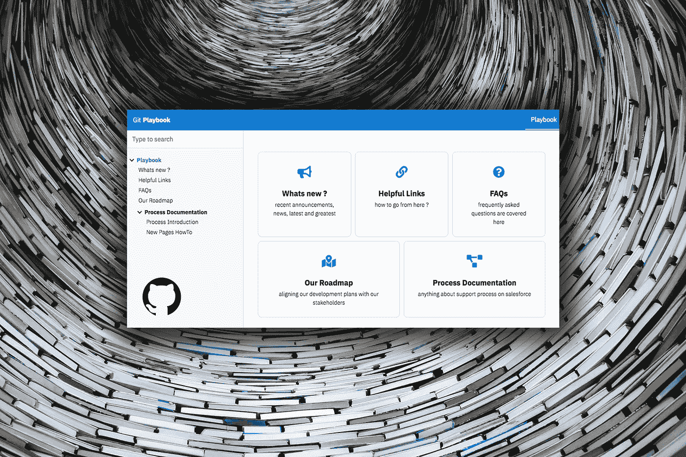
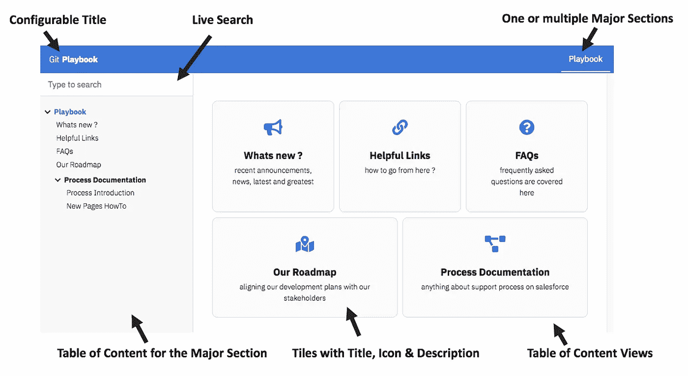
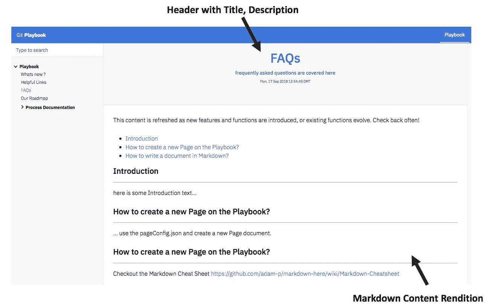
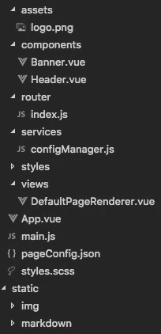
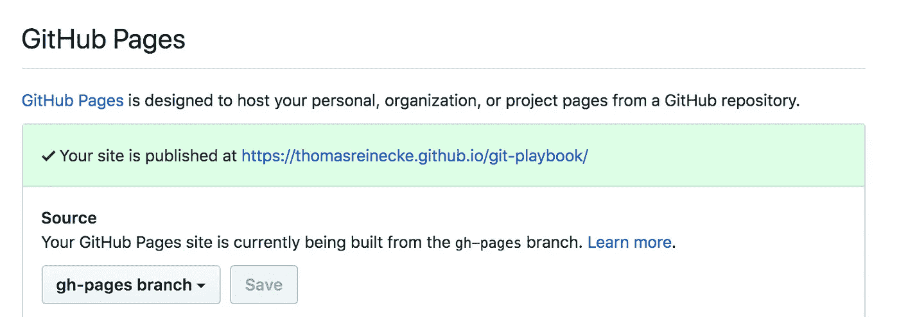
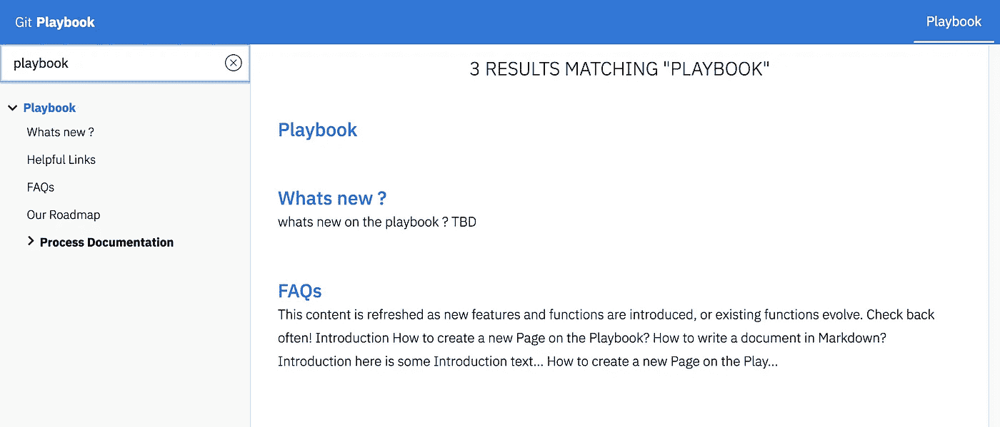
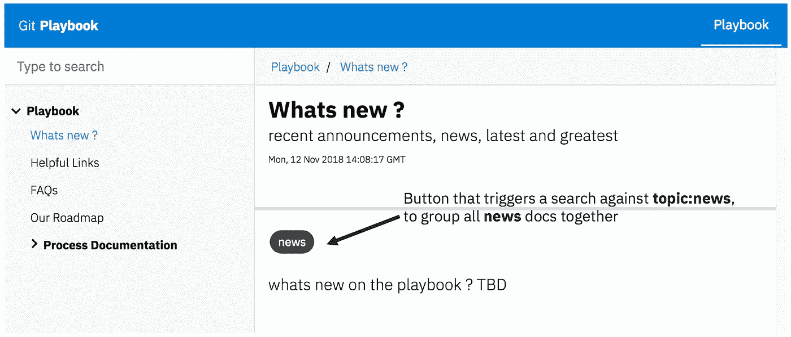

# 使用 Github 页面创建引人注目的文档

> 原文：<https://itnext.io/create-compelling-documentation-with-github-pages-16e4149efe9e?source=collection_archive---------0----------------------->

## 一步一步的指南，创建您的下一个无服务器 docu 应用程序，支持任何内容层次结构，降价，搜索，导航，面包屑和主题分组

在本文中，您将学习如何使用 Github pages 作为项目文档的新家。该文档描述了 GitHub 上托管的 [GIT Playbook](https://github.com/thomasreinecke/git-playbook) 项目。剧本的现场演示在这里[进行](https://thomasreinecke.github.io/git-playbook/#/playbook)。



照片由[吕山德](https://unsplash.com/photos/wk833OrQLJE?utm_source=unsplash&utm_medium=referral&utm_content=creditCopyText)在 [Unsplash](https://unsplash.com/collections/952999/documentation?utm_source=unsplash&utm_medium=referral&utm_content=creditCopyText) 拍摄，经作者修改

在我们最近在 IBM 的一个项目中，我们发现了对文档整合的强烈需求。我们面临许多典型的问题:

*   **支离破碎，不一致，重复，**在某种程度上**矛盾**和**不完整**文档**——我们已经有太多，但同时又不够**
*   **交付在**多种文档类型** (pdf、ppt、word、excel、txt)上进行，并通过**多种渠道** (wikis、box、社区文件等)进行，并且没有将所有这些整合在一起的搜索功能**
*   **我们交付了不同质量的(取决于作者)和不一致的外观&感觉(颜色、字体、字号)——我们没有交付统一的 UX 文档**

**听起来很熟悉，不是吗？本文不是关于糟糕的文档的原因的故事，也不是关于它为什么重要的讨论。如果你需要更多的见解，请阅读下面的文章**

**[](https://medium.com/@oswebguy/why-documentation-matters-7152d46448e1) [## 为什么文档很重要

### 通过编写更好的文档吸引新用户

medium.com](https://medium.com/@oswebguy/why-documentation-matters-7152d46448e1) 

这篇文章也不是围绕技术写作的实际艺术，如果你对这个领域感兴趣，可以在这里深入研究:

[](https://medium.com/@limedaring/five-tips-for-improving-your-technical-writing-and-documentation-47353723c8a7) [## 提高技术写作和文档的五个技巧。

### 通过改进您的写作和技术文档，获得更多的用户和更少的支持请求。

medium.com](https://medium.com/@limedaring/five-tips-for-improving-your-technical-writing-and-documentation-47353723c8a7) 

本文是关于**交付平台**的技术文档。

> 你想把你的内容放在哪里，你想通过什么渠道消费它，你如何有效地管理你的内容，即使有成千上万的页面，你的用户如何搜索它？

以下是我们希望归档的一些想法:

*   End-2-end 一站式采购我们所有的文档
*   轻松创建新页面和内容结构
*   集中管理和控制观感
*   实时搜索
*   响应式 UX(用于侧边栏和移动演示)

# 布局

上面的剧本页面看起来非常漂亮，但仍然非常强大。我们在布局中加入的主要组件有:



Git-行动手册的主要布局

*   **可配置标题**——无论你想叫它什么，你都可以轻松配置
*   **Live Search** —内容被完全编入索引，用户可以利用该组件根据关键字和主题进行过滤(主题:myTopic 查找包含该主题的所有文档)
*   **在一个或多个主要部分**——当你实际上需要不止一个行动手册时，你可以在这里添加它们，或者你可以参考你将创建的一个页面，并在页眉的这个显著位置展示它们
*   **内容视图表** —没有内容但只有子文档的文档显示为包含许多图块的 ToC 页面。您可以使用这些图片更深入地研究文档
*   **带标题、图标的标题块&描述** —位于 ToC 页面上的标题块可以是实际的文档或嵌套的 ToC 页面。一个图块带有一个标题、一个非常简短的描述和一个来自字体 Awesome 5 库的[免费图标](https://fontawesome.com/icons)
*   **主要部分的目录** —这是一个组件，它为行动手册配置的完整内容层次结构提供了一个很好的目录

实际的内容呈现页面如下所示:



行动手册上的降价内容再现页面

# 技术

Git-Playbook 作为一个 [VueJS](https://vuejs.org/) 应用程序出现，它是纯粹的前端——不需要任何后端或 API 服务，因此它能够很容易地部署到 [Github 页面](https://pages.github.com/)、 [Gitlab 页面](https://about.gitlab.com/features/pages/)或您选择的一些简单的 web 容器。

从 *package.json* 的角度来看，Git-Playbook 基于以下主要依赖项(除其他之外): **fontawesome、axios、vue、vue-markdown、vue-tree-navigation。**



代码结构

Git-Playbook 附带了一个**横幅**和**标题** Vue 组件、一个从 **configManager 获取文档层次结构的**路由器**、**多个 css 样式、 **DefaultPageRenderer** 视图(这是渲染剧本 UX 的主要核心组件)、定义我们想要的字体图标的 **main.js** 和保存

# 页面配置

这个 JSON 文件包含 Git-Playbook 的高级配置和文档结构。

```
{
 ** # configures the name of the app on the top-left corner**
  "**appName**": "Git",   **# configures the header (showing up on the top-right)**
  "**headerNavigation**": [
    {
      "name": "Playbook",
      "path": "/playbook"
    }
  ], **# which of the pages on the playbook is the default landing** 
  "**landingPage**": "/playbook", **# configuration of the default page hierarchy**
  "**pages**": [ 
    {
     ** # the URL route we use to directly navigate to this page**
      "**route**": "/playbook",

   **   # title of this page**
      "**name**": "Playbook", ** # description that shows up on the tile**
      "**description**": "This is the playbook",

     **# font awesome 5 icon from** [**https://fontawesome.com/icons**](https://fontawesome.com/icons)
      "**icon**": "address-book", # array of topics this document should carry
      "topics" : ["content", "main", "topic1"],**# nested children that belong to this document**
      "**children**": [
        {
        **  # relative route to this nested doc, absolute route is
          # /playbook/whatsNew**
          "**route**": "/whatsNew",
          "name": "Whats new ?",
          "description": "recent announcements, news, ...",
          "icon": "bullhorn",
          "topics" : ["topic1"],**# reference to the actual content (markdown on static)**
          "**markdown**" : "/static/markdown/whatsnew/Current.md"
        },
        {
          "route": "/links",
          "name": "Helpful Links",
          "description": "how to go from here ?",
          "icon": "link",
          "topics" : ["links", "topic2"],
          "markdown" : "/static/markdown/Links.md"
        },
        {
          "route": "/faq",
          "name": "FAQs",
          "description": "frequently asked questions are ...",
          "icon": "question-circle",
          "topics" : ["links", "topic2"],
          "markdown" : "/static/markdown/FAQ.md"
        },
        {
          "route": "/roadmap",
          "name": "Our Roadmap",
          "description": "aligning our development plans ...",
          "icon": "map-marked-alt",
          "markdown" : "/static/markdown/Roadmap.md"
        },
        {
          "route": "/process",
          "name": "Process Documentation",
          "description": "anything about support process ...",
          "icon": "project-diagram", ** # grand-children from the root node perspective**
          "**children**": [
            {
              "route": "/introduction",
              "name": "Process Introduction",
              "description": "how to read the process doc",
              "icon": "project-diagram",
              "markdown" : "/static/markdown/process/Intro.md"
            },
            {
              "route": "/newPagesHowto",
              "name": "New Pages HowTo",
              "description": "how to create new Pages on ...",
              "icon": "file-alt",
              "markdown" : "/static/markdown/process/NewPages.md"
            }
          ]
        }
      ]
    }
  ]
}
```

要将新页面添加到文档层次结构中，只需从**页面**中复制一个对象，并填充其适当的值。如果你想要一个 ToC 页面，你需要使用嵌套的**子页面**。如果您想要一个内容页面，您需要创建存储在**静态**文件夹中的实际内容文件(在 Markdown 中),然后在“ **markdown** 字段中引用其路径。此过程允许您为产品文档创建所需的任何复杂程度的深度。

如果您克隆“Git-Playbook”存储库，这是您需要接触的唯一文件。

# ConfigManager

这个服务文件为**默认页面提交器**和**路由器**公开了许多实用程序

*   **generateRoutingConfig**—递归遍历 **pageConfig.json** 给出的文档层次结构(基于 **processElement** 函数)。正在为 Vue 路由器和 Vue 树导航组件创建兼容的配置结构。

```
/**
  * **generateRoutingConfig** - generates the routing for VueRouter out
  * of the pageConfig.pages
  */
function generateRoutingConfig (baseConfig) {
  let pages = JSON.parse(JSON.stringify(baseConfig.pages))
  for (let i in pages) {
    let element = pages[i]
    processElement(element, null)
  } // configure the default landing page
  pages.push(
    {
      path: '/',
      redirect: baseConfig.landingPage
    }
  )
  return pages
}
```

# DefaultPageRenderer

这个 vue 组件实际上是 Git-Playbook 的核心，因为它根据期望显示的文档的性质来呈现主视图区域。目录页面将在上述基于磁贴的体验中呈现，而对于包含实际内容的页面，将呈现其降价内容。该组件的完整源代码可以在 GH repo 中查看，这里只是 HTML 模板部分。

```
<template>
  <div class="container" @scroll="handleScroll"> ** <!-- display the banner on the page -->**
    <section class="banner"
      :class="{ active: isActive }"
      v-if="pageConfig && !pageConfig.tiles"
      :data-name="pageConfig.name"> <h2 class="banner__title heading-1">{{pageConfig.name }}</h2>
      <h4 class="banner__title heading-4">{{pageConfig.description}}
      </h4>
      <p class="banner__text banner__text--timestamp">
        {{ lastModified }}
      </p>
    </section> ** <!-- render the markdown when content is available -->**
    <vue-markdown class="content" :source="markdown"></vue-markdown> **<-- display the tiles, when children are available -->**
    <ul class="cards" v-if="pageConfig.tiles">
      <li class="card" @click="switchPage(tile)" 
       v-for="tile in pageConfig.tiles" 
       v-bind:style="{ backgroundColor: tile.bgColor }">
        <font-awesome-icon class="card__icon" 
         size="2x" 
         :icon="tile.icon"/>
        <h4 class="card__title">{{tile.name}}</h4>
        <p class="card__text">{{tile.description}}</p>
      </li>
    </ul>
  </div>
</template>
```

# 部署到 GH 页面和搜索索引生成

构建包括搜索索引在内的 GIT Playbook 非常简单:

```
npm run build 
```

要将您的行动手册部署到 GH 页面，请运行

```
npm run gh-pages
```

在你的 GH 库>设置>向下滚动到“Github 页面”，确保它指向你的“gh-pages”分支。您还可以在该屏幕上找到 GH 页面部署的链接:



行动手册的 GH 页面配置

点击查看剧本[的演示。您会注意到搜索索引现在也起作用了(除非您在本地提供它，否则它通常在您的开发环境中不可用):](https://thomasreinecke.github.io/git-playbook/#/playbook)



# 使用主题将文档组合在一起

在 1.1.0 版本中，我们刚刚引入了一个名为“主题”的新特性，它允许将文档分组在一起。在 pageConfig.json 上，在任何文档范围内，添加一个新的 JSON array“topics ”,其中包含作为主题标签的术语列表。文档现在将主题呈现为文档页面中的按钮:



单击此链接将打开带有搜索词“topic:news”的搜索屏幕，其中将列出带有此主题标签的所有文档。

# Git 行动手册的替代方案

对于 Git 剧本，有许多值得注意的替代方案，我也建议您查看一下，以便更深入地了解:

[](https://vuepress.vuejs.org/) [## VuePress

### Vue 供电的静态现场发电机

vuepress.vuejs.org](https://vuepress.vuejs.org/) [](https://www.gitbook.com/?t=2) [## GitBook

### GitBook 让您的团队可以轻松编写和维护高质量的文档。分享知识，提升你的…

www.gitbook.com](https://www.gitbook.com/?t=2) 

我在这里并不评价它们的区别，总体来说 Git Playbook 比这些提到的替代品更轻量级和/或功能更丰富。自己决定吧。

有问题吗？反馈。欢迎在评论栏或 [GitHub](https://github.com/thomasreinecke/git-playbook) 上联系我们。谢谢你

*如果你喜欢这个故事，并想在 medium 上阅读成千上万个这样的故事，你可以成为 medium 会员，每月仅需 5 美元。如果你愿意支持我的写作，请使用我下面的推荐链接，我将免费获得你的一部分会员资格。*

[**https://medium.com/@thomas.reinecke/membership**](https://medium.com/@thomas.reinecke/membership)**