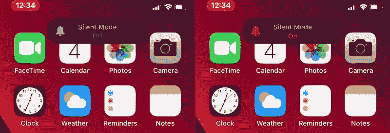
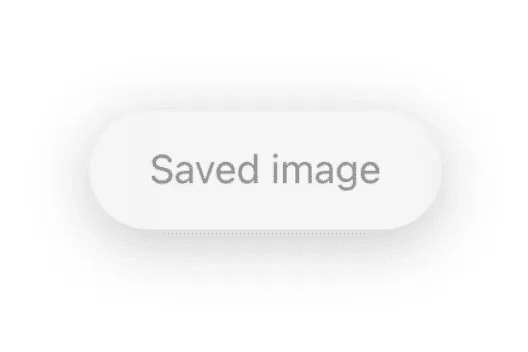
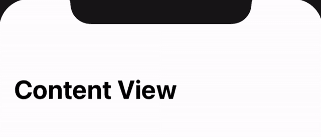
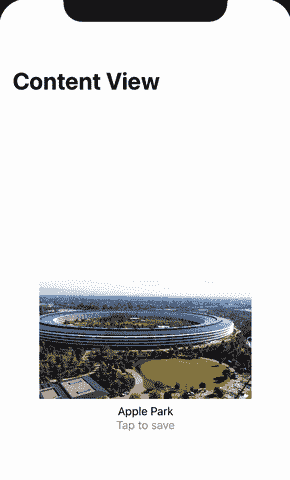

# 在 SwiftUI 中创建自定义信息 hud

> 原文：<https://itnext.io/create-custom-info-huds-in-swiftui-a3c2baabbddb?source=collection_archive---------1----------------------->

图片来源 iphonehacks.com

随着 iOS 13 的推出，苹果从一个巨大的、破坏性的静音模式和音量用户界面变成了更小、更专注的用户界面，不会占据整个屏幕。在你的应用程序中有按钮，在那里反馈对用户来说更直观，但是用一个`ActionSheet`来扰乱整个屏幕不是那么重要。例如“添加到收藏夹”或“保存的图像”。为此，在顶部有一个简单的信息表是很好的。

# 构建您的快速信息表

HUD 将显示在主应用程序界面上方的一个层中。为此，将您的`ContentView`中的视图元素包装在一个`ZStack`中。然后我们可以在`ZStack`中添加 HUD。首先，我们创建一个简单的 HUD，只有一个`Text`作为内容。修改器创建 iOS-HUD 样式。作为背景，我们使用模糊`UIViewRepresentable`，但你也可以使用`Color(.systemBackground)`或任何其他颜色。

这看起来棒极了！当我们将`HUD()`放入`ContentView`时，HUD 位于视图的中间，而不是顶部。只需将`ZStack`的`alignment`设置为`.top`，操作系统会完成剩下的工作。通过安全边距，HUD 总是被放置在右边。

# 制作 HUD 动画

我们希望 HUD 默认隐藏，当我们点击`Button`时从顶部移动。

动画很漂亮，但是我们希望这个按钮只激活`HUD()`，并且 HUD 在一段时间后自动关闭。

增加功能后，按钮只显示 HUD，2 秒后自行关闭。根据您显示的内容，您可以在`dismissHUDAfterTime()`方法中更改时间。

# 更改 HUD 的内容

HUD 应该只包含有限的内容。要放大信息，请将系统图像添加到 HUD。

将`Text`换成`Label`，HUD 立刻变得更有吸引力，信息也更丰富。如果你想知道更多关于`LabelStyles`的事情，可以看看[我关于这个话题的文章](https://medium.com/@luca.jon/make-more-with-swiftuis-label-94ef56924a9d?source=friends_link&sk=0680a9f759ffd9b50acb92bd50206dc7)。

# 将操作添加到 HUD

HUD 不应该用来添加动作，但是简单的功能会非常有用。例如，当轻按 HUD 时，它会自行关闭。

或者您可以添加特定于消息的操作，如打开照片应用程序。

# 在详细视图中使用 HUD

当你在一个细节视图中使用 HUD，而不是在主视图中，你仍然应该把主视图放在`ZStack`中。然后在细节视图中添加一个`@Binding`和一个`Button`,效果非常好。

# 更多想法

对于在 HUD 中显示什么，您有有限的，但仍然有许多选项。例如，当你有一个`Slider`或`Picker`来改变应用程序的亮度时，你可以在 HUD 中显示亮度值。

当您有自定义音量控制时，可以使用相同的方法。与`.matchedGeometryEffect()`一起，你可以创造出这样的精彩过渡:

虽然这看起来很复杂，但这非常非常简单，只需要几行代码。

最多只是造型，但重要的部分是`@Namespace`、`.matchedGeometryEffect()`修改器和`if showHUD {}`。

# 结论

当你想给用户一个快速的反馈，一个动作发生了，hud 是你的理想元素。它们不像`ActionSheets`那样容易中断，但是可以用更少的内容显示更多的信息。