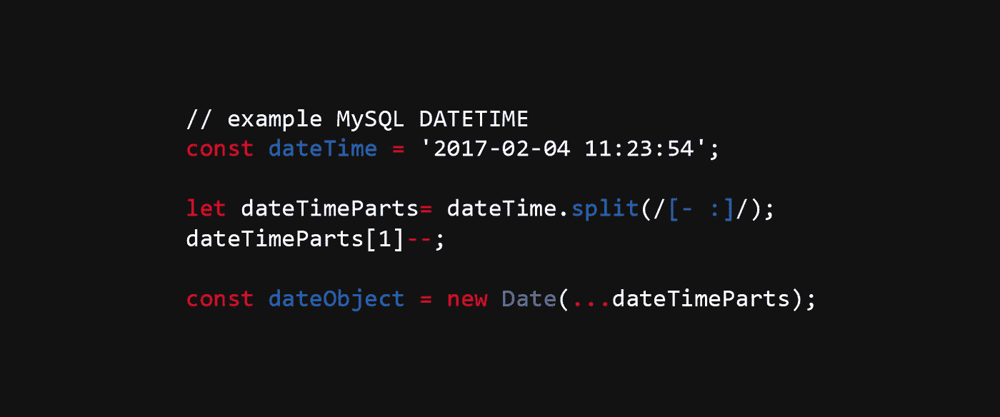

# 用 JavaScript 从 MySQL DATETIME 格式创建日期

> 原文：<https://itnext.io/create-date-from-mysql-datetime-format-in-javascript-912111d57599?source=collection_archive---------3----------------------->

在 JavaScript 中，我们可以通过构造函数(`new Date()`)或使用`Date.parse()` [方法](https://developer.mozilla.org/en-US/docs/Web/JavaScript/Reference/Global_Objects/Date/parse)来创建[日期对象](https://developer.mozilla.org/en-US/docs/Web/JavaScript/Reference/Global_Objects/Date)。

在这两种情况下(可选)，我们都可以提供 **dateString** 。 [MDN 备注](https://developer.mozilla.org/en-US/docs/Web/JavaScript/Reference/Global_Objects/Date/parse)应该是:

> 代表 [RFC2822](http://tools.ietf.org/html/rfc2822#section-3.3) 或(ISO 8601 日期的变体)的字符串(可能使用其他格式，但结果可能出乎意料)。

虽然 Chrome 浏览器似乎可以解析很多格式，包括 MySQL 的**DATETIME**(*YYYY-MM-DD HH:MM:SS*)，但 Safari 在理解它方面存在问题，并且`new Date('2017–02–04 11:23:54')`导致了*无效日期*错误。

如果您想轻松地将 MySQL DATETIME 解析为 JS Date，您可以使用这种技术:

我在 split 中使用了正则表达式来创建包含年、月、日、小时、分钟和秒值的数组。
由于 JS 日期中的 monthIndex 从 0(一月)开始，我们需要将数组中的第二个值减 1。

最后，我在日期调用中使用了[扩展操作符](https://developer.mozilla.org/pl/docs/Web/JavaScript/Referencje/Operatory/Spread_operator)，它只调用带有 6 个参数的日期:年、月(减 1)、日、小时、分钟和秒。

**2019 年 1 月 29 日更新**

如果您只需要解析日期( *YYYY-MM-DD* )而不需要时间，您实际上可以使用更简单(也更好)的😎)代码: