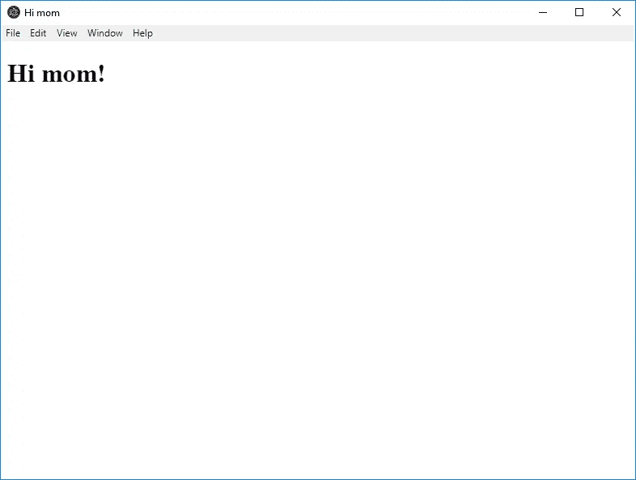
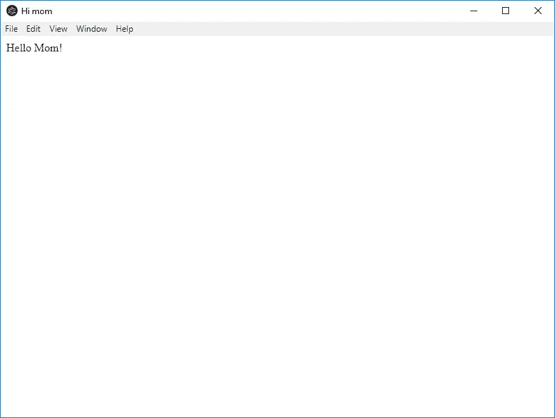
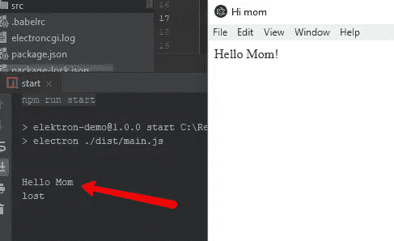
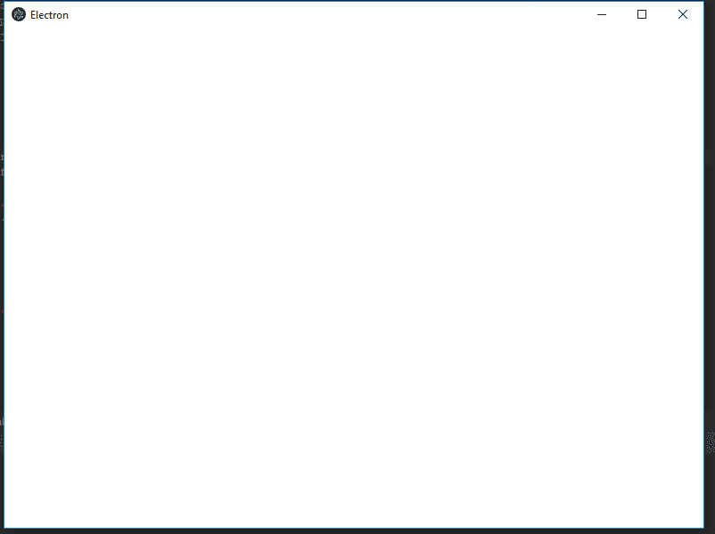

# 用 Electron，React 和 C#创建一个桌面应用程序

> 原文：<https://itnext.io/create-desktop-with-electron-react-and-c-86f9765809b7?source=collection_archive---------1----------------------->


我从事软件技术的第一年是从 Delphi 7 开始的。太神奇了，那是互联网半空的时候。很难找到例子，寻求帮助，基本上，你只能靠自己。哦，美好的旧时光，我不会改变这种体验，但我不想再做一次。

随着时间的推移，一切都在发展，新技术不断涌现。我不时停下来看看发生了什么变化。这太酷了，总是有一些新的东西值得研究。改变我自己的偏见，是的，很痛苦，但是这个世界没有被时间扭曲。

女士们先生们，我给你们带来了我使用[电子](https://electronjs.org/)的经历。

# 什么是电子

Electron 是一个为 Windows、MacOS 和 Linux 创建本地桌面应用程序的框架。你可以使用普通的 javascript 或任何其他 javascript 框架来构建 UI。

这太神奇了，你可以成为一名 web 应用开发者，通过重用相同的技能，你可以构建一个桌面应用。

> 如果你能建立一个网站，你可以建立一个桌面应用程序。Electron 是一个使用 web 技术(如 JavaScript、HTML 和 CSS)创建本地应用程序的框架。它负责处理困难的部分，因此您可以专注于应用程序的核心。

# 该项目

让我们创建一个空的 npm 项目

```
**npm** init --yes
```

添加电子材料和启动命令

```
**npm** i -D electron
```

在`package.json`中添加开始脚本

```
"start":"electron ."
```

如果我们执行 npm start，我们应该从 electronic 得到一个弹出错误。没关系，这只意味着电子是活的，我们不知道如何启动它。

# 主进程和渲染器进程

在我们深入编码之前，理解[电子架构](https://electronjs.org/docs/tutorial/application-architecture)的基础很重要。

> 在 electronic 中，运行`package.json`的`main`脚本的进程被称为**主进程**。在主进程中运行的脚本可以通过创建网页来显示 GUI。一个电子应用程序总是有一个主进程，但不会更多。
> 
> 由于 Electron 使用 Chromium 来显示网页，因此也使用了 Chromium 的多进程架构。Electron 中的每个网页都运行在自己的进程中，这个进程被称为**呈现器进程**。
> 
> 在普通浏览器中，网页通常运行在沙箱环境中，不允许访问本地资源。然而，电子用户有权在网页中使用 Node.js APIs，允许较低级别的操作系统交互。

我过于简单的解释是。有一个主要的进程创建了一个窗口，这个窗口就是 Chromium。Chromium 本身就是一个进程，也就是渲染器。

# 以打字打的文件

从 2017 年 6 月 1 日开始，[电子支持打字稿](https://electronjs.org/blog/typescript)。好，让我们使用它。

```
**npm** i -D typescript
**npm** i -D tslint
**npm** i -D prettier
```

在项目根中添加`tslint.json`

在项目的根中添加`tsconfig.json`

对于类型脚本编译，可以使用 [tsc](https://www.typescriptlang.org/docs/handbook/compiler-options.html) ，但是最终目的是使用 React 和操纵模板。Webpack 是这次要走的路。

# 网络包

web 包的设置

```
**npm** i -D webpack webpack-cli
**npm** i -D html-webpack-plugin
**npm** i -D @babel/cli @babel/core @babel/preset-env babel-loader @babel/plugin-proposal-class-properties @babel/plugin-transform-arrow-functions
**npm** i -D @babel/preset-typescript
```

在项目的根中添加`.babelrc`

到目前为止一切顺利，现在让我们创建一个电子的主进程，并向妈妈问好！

创建一个文件夹`src`

在`src`文件夹中添加`main.ts`文件

`line 8`创建一个窗口并将`index.html`加载到窗口中，又名 Chromium。

将`index.html`添加到`src`文件夹

在根中添加`webpack.config.js`。web pack 如何处理电子主流程构建的说明。[重要](https://webpack.js.org/configuration/target/)重要`target:"electron-main"`

稍微调整一下`package.json`

执行命令

```
**npm** run build
**npm** run start
```

这就是了。一个全功能的桌面应用程序。也就是向妈妈问好。

这实际上是您的前端开发人员技能发挥作用的地方。因为它是一个 Chromium，你可以使用任何种类的前端技术，React，Vue，Angular，普通 javascript。



# 的反应

React 将存在于电子渲染器进程中，因此我们必须创建一个单独的 web pack 构建配置。并教巴贝尔使用反应装载机

```
**npm** i -D @babel/preset-react
**npm** i -S react react-dom
**npm** i -D @types/react @types/react-dom
```

调整`.babelrc`

通过移除`index.html`模板生成的职责来调整`webpack.config.js`。这是渲染器构建过程的责任。

添加新的 web pack 配置文件`webpack.react.config.js`。该配置负责编译 react 素材，并确保编译结果注入到`index.html`内部

调整`index.html`使其包含一个 React 可以放置其组件的容器。

在`src`中创建一个文件夹`app`并创建`renderer.tsx`

现在让我们再次说你好妈妈，只是现在我们将使用 React 来这样做。

在`app`中创建一个文件夹`components`并创建`Dashboard.tsx`

调整`package.json`并添加一个新命令，这样我们就可以编译渲染器了。

```
**npm** run build:react
**npm** run build
**npm** run start
```



这不是我每天都能看到的。一个运行 React 的本地桌面应用程序。也许我知道，我只是不知道，因为电子是一个流行的框架，到处都在使用。比如 [Visual Studio 代码](https://code.visualstudio.com/)，试着猜猜它的动力是什么；).

# C#什么？

Rui Figueiredo 的一篇博客点燃了我对电子的兴趣。

使用 C#的电子。这是一个有趣的协同作用。因为它是 C#核心，所以也是跨平台的。

使用 React for UI 和 C# goodness 扩展功能的跨平台桌面应用程序。现在你不仅可以使用前端技能，也可以使用后端技能。

为 npm 项目安装新包

```
npm i -D electron-cgi
```

调整`main.ts`为了测试运行，我们将发送妈妈到 C#控制台应用程序，它将返回你好妈妈回来。我们将控制台日志记录下来。

创建一个简单的 [dotnet](https://dotnet.microsoft.com/download/dotnet-core/3.0) C#核心控制台应用程序。添加`ElectronCgi.DotNet` nuget。

```
**npm** run build
**npm** run start
```



令人惊奇不是吗？Rui 做了额外的工作，并把它加入到 C#中

```
connection.OnAsync();
```

现在我们在谈正经事。Imagen 这会带来什么样的可能性？与数据库、Rest API、队列的异步通信，所有适用于云、Amazon、Azure 等的优秀包。所有来自 C#的好东西触手可及。

而且不仅限于发送字符串，在 C#中可以是强类型对象。

这里是如何

> ElectronCGI 的灵感来自于第一个动态 web 请求是如何在 web 早期成为现实的。
> 
> 在早期，web 服务器能够提供的唯一服务是静态网页。为了提供动态页面，有人提出了让外部可执行程序接受 web 请求的表示并产生响应的想法。
> 
> 可执行文件获取 web 请求头的方式是通过环境变量，请求体通过标准输入流(stdin)发送。
> 
> 处理完请求后，可执行文件会通过标准输出流(stdout)将结果 html 发送回 web 服务器

大量使用 stdout。这不一定是坏事，例如，`php.exe`和围绕它的框架；).

我总的来说喜欢这种方法，干净，聪明，有创意。我支持读完芮的博客文章。

# React 和 C#的额外优势

让我们把它变得更有趣，从 C#中发送消息以作出反应。

为此，通过将仪表板功能组件更改为具有状态的组件，在呈现器中进行更改。

那里发生了什么？我们订阅了通道`greeging`,当从主进程接收到消息时，我们将消息放入状态。从那时起，React 接管权力，注意到状态变化并呈现消息。

主进程通过发送从 C#接收到的消息来做出反应



# 创建合法的 EXE 文件

添加包

```
**npm** i -D electron-packager
```

添加`package-win`命令，将`main`指向`dist`文件夹文件`main.js`，调整`package.json`文件。

所有平台构建命令的教程[在这里](https://www.christianengvall.se/electron-packager-tutorial/)。

```
**npm** run package-win
```

将 C#文件夹“`core`复制到“`release-builds\electron-demo-win32-ia32`”中，运行`electron-demo.exe`

# 结束了

我这段从 Delphi 7 到 React，electronic，C#的旅程太牛逼了。正如我之前说过的，没有什么是一成不变的，每天都有新技术出现，让我们变得更好，打破了我们的个人偏见。

保持开放的心态是我们最大的挑战。

[GitHub](https://github.com/alzuma/electron-demo) 中演示的源代码

关于完整的 Ract 管道，请在此处阅读。