# 用 Unity Bolt 可视化语言在 10 分钟或更短时间内创建 Flappy Bird 克隆

> 原文：<https://itnext.io/create-flappy-bird-clone-in-unity-bolt-visual-language-in-10-minutes-or-less-f9d623298bfd?source=collection_archive---------1----------------------->

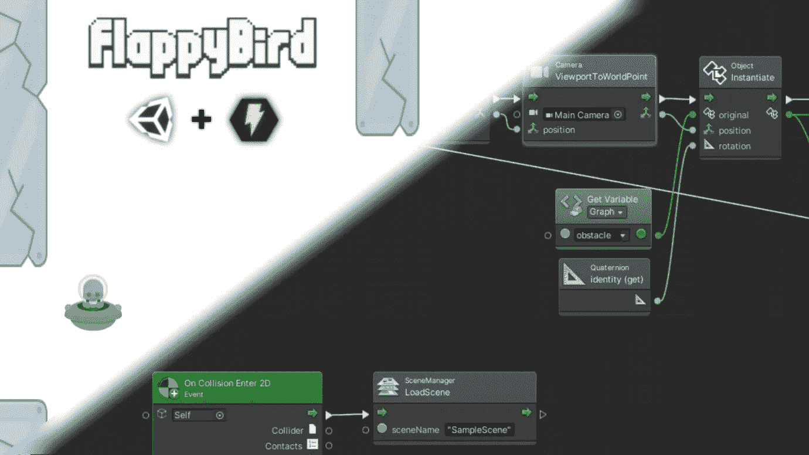

如果你想成为一名游戏开发人员，但总是害怕学习编程语言，Bolt 可视化脚本语言可能是你游戏开发之旅的正确起点！

业界两个主要的游戏引擎，虚幻引擎 4 和 Unity 现在都可以选择使用可视化脚本语言，而不是经典的编程语言。在 UE4 的情况下，它一直是 blueprint 系统(主要用于代替 C++ ),在 Unity 的情况下，它是 Bolt。

在本教程中，我们将制作一个流行的游戏 Flappy Bird 的克隆，我们将复制原来的控制和障碍发生器。障碍物将在屏幕外无限生成并向左移动(这是无限滚动游戏中创造主角移动幻觉的常用技巧)。我们开始吧！

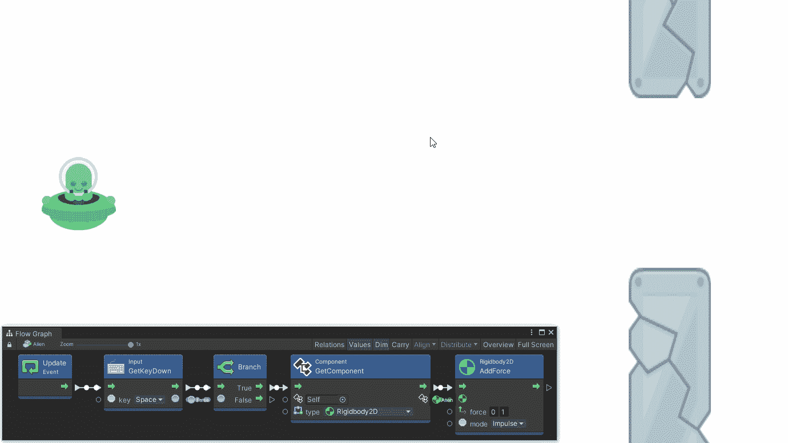

最终游戏+玩家控制器 Bolt 图

# 安装螺栓

首先，我们在 Unity 2020 中创建新的 2D 项目，并安装 Bolt ( [link](https://assetstore.unity.com/packages/tools/visual-scripting/bolt-163802) )。如果你不确定如何创建一个新项目或安装一个新包，请查看我的游戏开发[系列](/basics-of-3d-animation-in-unity-tutorial-d2d6ff3bc6b7)的第一部分。

选择“2D”作为新项目的类型。从资产商店导入 Bolt 后，通过*包管理器→我的资产→下载*在 Unity 中下载。

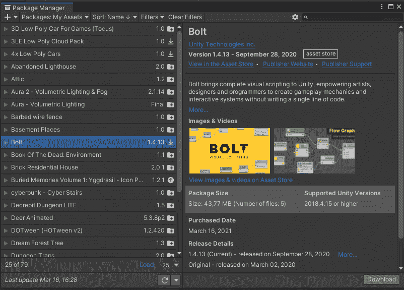

然后用*工具安装→安装螺栓*。遵循设置向导(*下一步→编程器命名→下一步→生成*)。

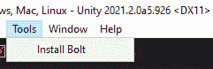

# 玩家角色

我们将使用一个外星人作为主要玩家角色。你可以选择任何你喜欢的精灵，我在[肯尼的游戏资产页面](https://kenney.nl/assets/alien-ufo-pack)找到了外星人。

但是首先我们需要为它创建一个新的游戏对象。在层次窗口中点击并选择 *2D 对象* → *精灵。*

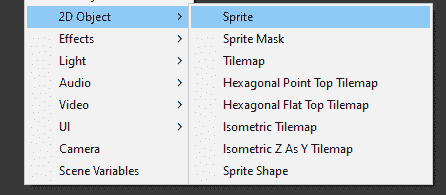

将新对象重命名为*外星人*。

在 *Sprite 渲染器*组件中，将 Sprite 更改为 *shipGreen_manned* (您也可以从我的 github repo 下载该资产以及完整的项目解决方案。下面的链接)。

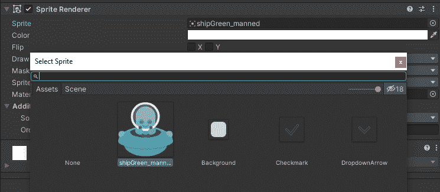

按下*添加组件*按钮，添加一个*多边形碰撞器 2D。通过这种方式，我们将确保使用完美的障碍物碰撞检测。接下来我们添加*刚体 2D* 进行重力模拟。将*质量*和*拖动*参数分别更改为 0.1 和 1，以便玩家移动与原始 Flappy Bird 的移动相匹配。*

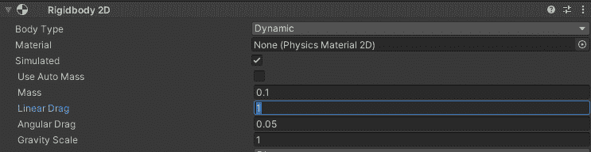

在场景视图中，将对象移动到屏幕视口的左侧。

接下来我们添加最重要的组件，*流机*。它将控制控制角色的逻辑。

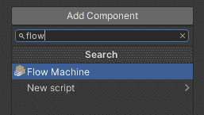

让我们把*源*改成*嵌入。*改名为*外星人*并添加描述。

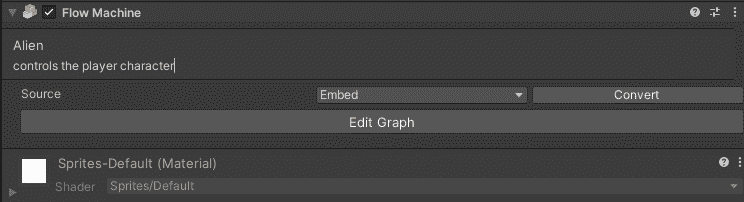

点击*编辑图形*按钮后，出现一个新界面。我们将使用这个图形编辑器进行可视化脚本编写。

该图有 *Start* 和 *Update* 方法，就像任何实现*monobhavior*接口的新脚本一样。

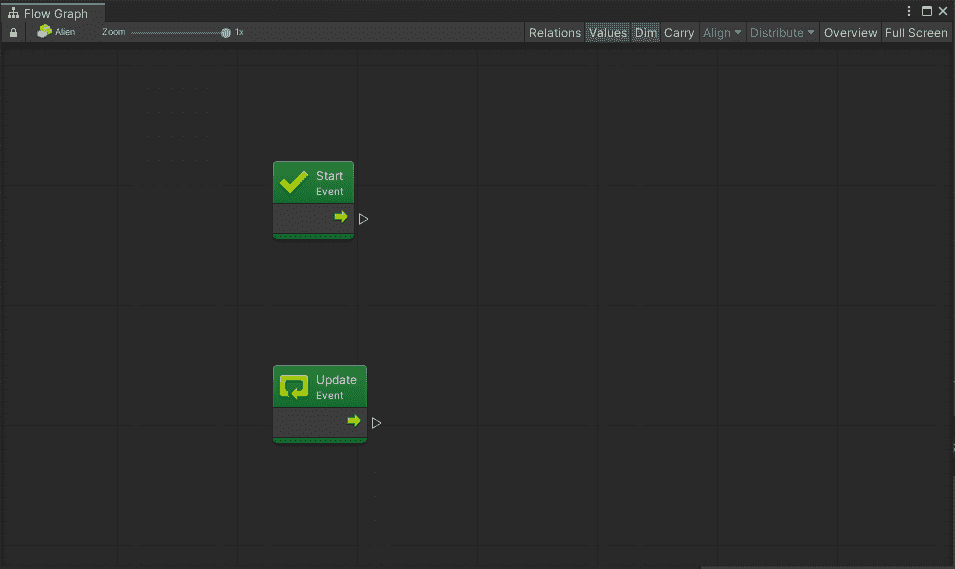

您可以使用输出箭头或点击空白处来添加新功能。拖动节点输出箭头将加载一个对话框，用于搜索现有的方法。所以让我们为键盘输入(*输入)找到一个方法。GetKeyDown* )，这样我们就可以控制我们的角色了。

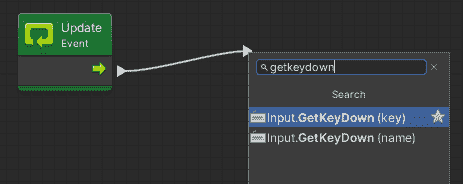

让我们用空格键飞行。选择*空格*作为*键*参数。

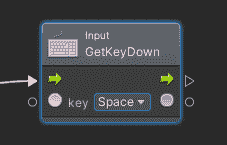

继续*控制→分支*(如果条件相同)。

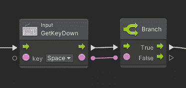

接下来，我们需要玩家对象的 RigidBody2D 组件的引用。

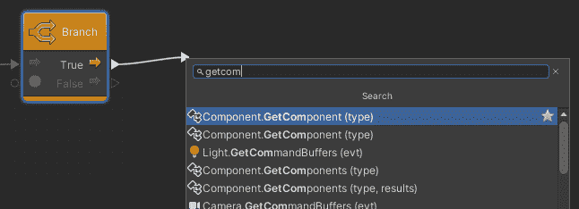

选择*刚体 2D* 作为*类型*。

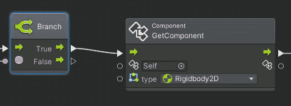

让我们通过*刚体 2D 添加一个动力脉冲。AddForce* 功能。这将模仿 Flappy Bird 的运动——每次按下都会向上“踢”鸟。

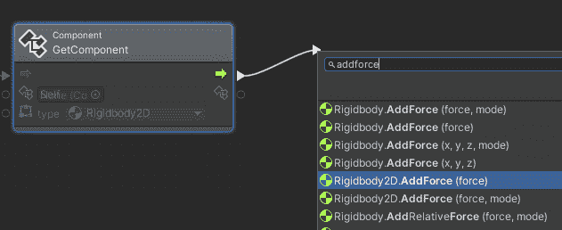

我们希望外星人“跳”起来，那么我们就把 *y 坐标*改成 1，把*模式*改成*脉冲*。

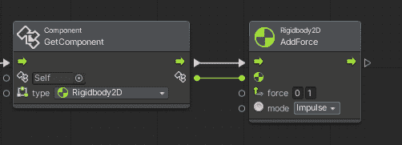

玩家角色的完整逻辑如下所示:

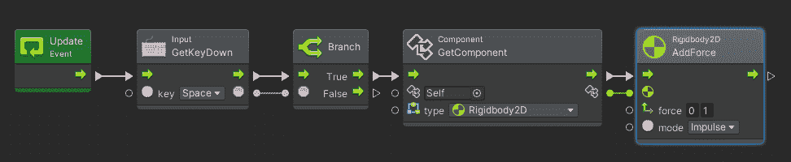

现在当我们运行游戏时，我们可以使用空格键控制外星人。

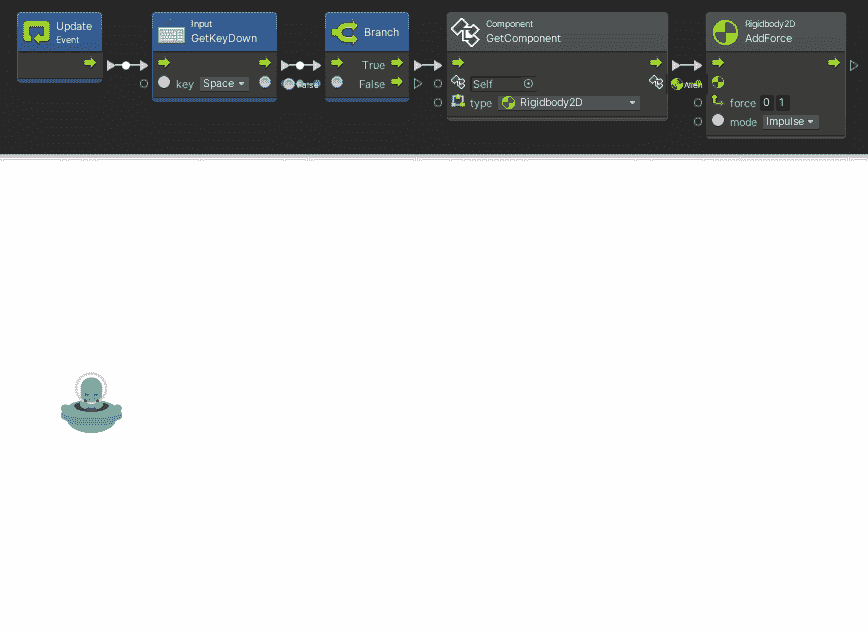

如果你喜欢这个教程，看看我的 udemy 课程，我可以教你如何在 Unity 中制作一个 3D 动作恐怖游戏！以下是 50%折扣的优惠券代码，它将在未来 30 天内可用。

 [## 完整指南:Unity 2020 中的动作恐怖 3D 游戏

### 大家好，我叫 Jan Jileč ek，是一名拥有计算机科学硕士学位的专业游戏开发人员，我…

www.udemy.com](https://www.udemy.com/course/make-a-3d-game-in-unity-2020-from-scratch-with-free-assets/?couponCode=9F7413B32A5AC0DC7973) 

# 障碍

与外星人一样，我们通过 *2D 对象→精灵*菜单添加一个新的精灵，并将其重命名为障碍。在*精灵渲染器*组件中，我们选择 *elementMetal055* 精灵(也来自 kenney.nl 或 my github)。

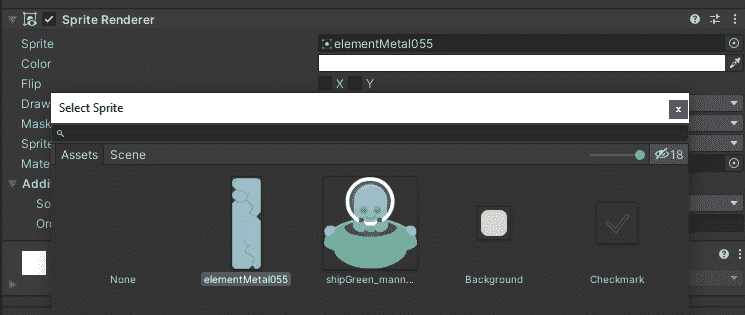

并且我们增加了一个*2D*箱对撞机。

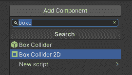

使用*矩形*工具，我们改变障碍物对象的尺寸，以匹配 Flappy Bird 的原始障碍物。我们将障碍物稍微移出视口(我们将通过流图操纵新障碍物的生成实例的位置)。

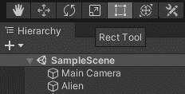

矩形工具

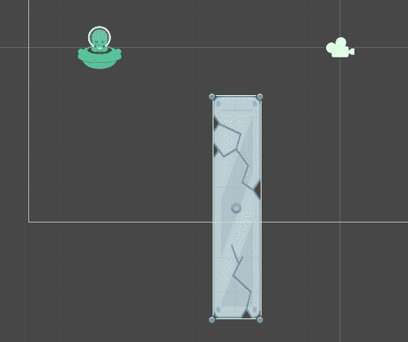

现在我们复制这个对象(在层次窗口中点击它→ *复制*)并把它移动到屏幕的上方，这样我们就在两个面板之间创建了一个间隙。

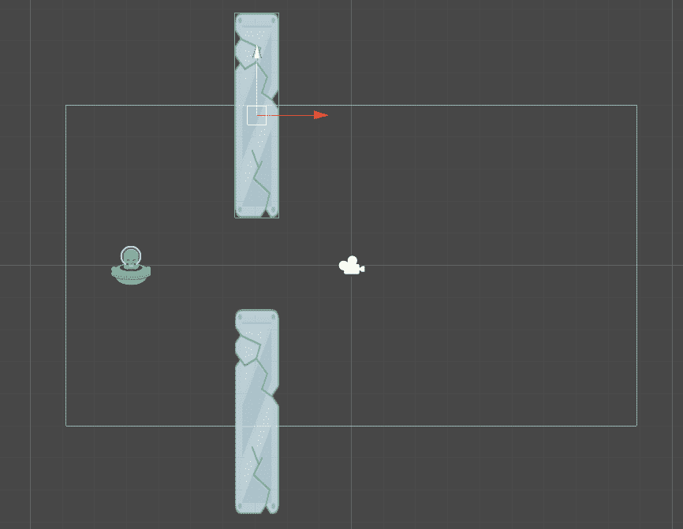

接下来我们创建一个新的“父”对象，将其重命名为 *ObstacleHolder* ，并通过将之前的 2 个*障碍物*对象拖到 *ObstacleHolder* 上，将它们关联起来。

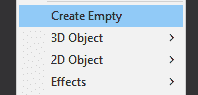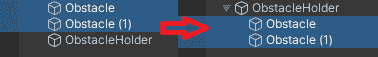

我们还必须创建一个所谓的*障碍物*物体的“预设”。你所需要做的就是将 ObstacleHolder 对象从*层次*窗口拖到*资产*窗口。

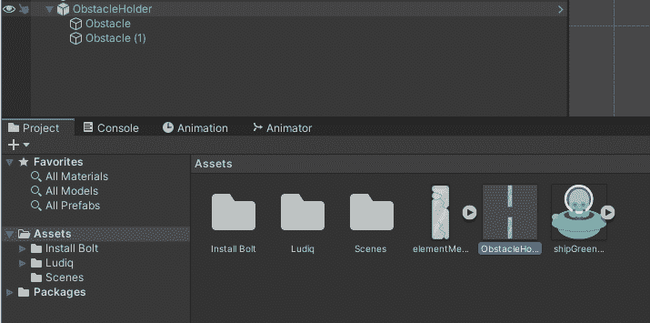

这样，我们将能够从生成器脚本中创建对象的实例。现在，当我们准备好预设，我们可以删除原来的*障碍物*。从现在开始，我们将只使用预制组件。

# 障碍发生器

让我们为障碍物生成器创建一个空对象( *Create Empty* )。将其重命名为*发电机。*接下来添加一个*流机器*组件，方式与外星人相同，并打开图形编辑器。

在编辑器的左侧子窗口中，我们可以看到变量管理器。这里我们创建了一个新的场景变量，类型为*游戏对象*，它将包含一个对*障碍物控制者*预设的引用。命名新变量后，只需将预置从*资产*拖到*值*字段。

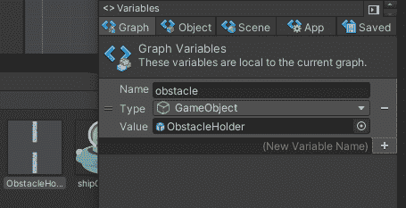

接下来我们添加一个新的图节点， *Timer* 。它将负责周期性障碍生成。我们需要定时器在创建生成器后立即开始计数，这就是为什么我们从 *Start* 方法调用它。让我们将*持续时间*设置为 4 秒。

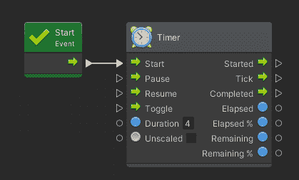

每个障碍物实例将在 *y* 轴上随机偏移生成。为此，我们使用*随机数。Range* 函数，我们将其设置为生成一个从 0.2 到 0.7 的随机数(我已经测试了这些值，它们最适合普通的屏幕分辨率)。

然后，我们将该值传递给一个新的 *Vector3* 节点，在这里我们将 x 值编辑为 1.4(我们需要在可见屏幕空间之外生成障碍物，在这种情况下，它将告诉下一个方法将其生成宽度的 40%到右边)。

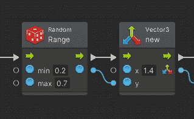

接下来，我们将这个 *Vector3* 传递给 *ViewportToWorldPoint* 函数，该函数将提供的值转换为屏幕坐标。我们还需要编辑主摄像机的摄像机参数。

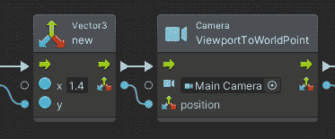

现在我们有了实际的屏幕坐标，我们可以在这里生成一个新的障碍。为此，我们将使用实例化函数。我们将之前创建的引用传递给 *ObstacleHolder* (通过使用*获取变量→图形→障碍物*)、计算出的 Vector3 位置和默认旋转(*获取四元数恒等式*)。

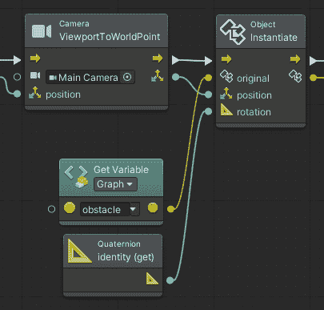

接下来，我们将一个 RigidBody2D 组件添加到实例化的 *ObstacleHolder* 中，并将其设置为 kinematic(*set rigid body 2d . body type*，并将 x 轴上的速度设置为-2(*set rigid body 2d . velocity*)。这将确保正确的碰撞处理和移动到屏幕的左侧。

这里我们需要做的另一件事是将所有这些连接到 *Destroy* 方法，该方法将在 20 秒后自动删除对象——当对象已经在视图之外并且不再需要时。我们需要向它传递一个我们在前面几步创建的对象实例。

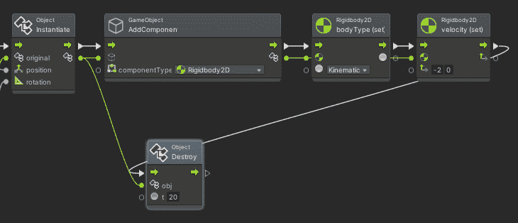

最后一步是将流连接回*定时器*，这样我们刚刚创建的整个序列在一个循环中重复(4 秒定时器= 4 秒循环)。

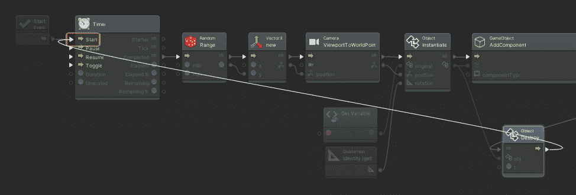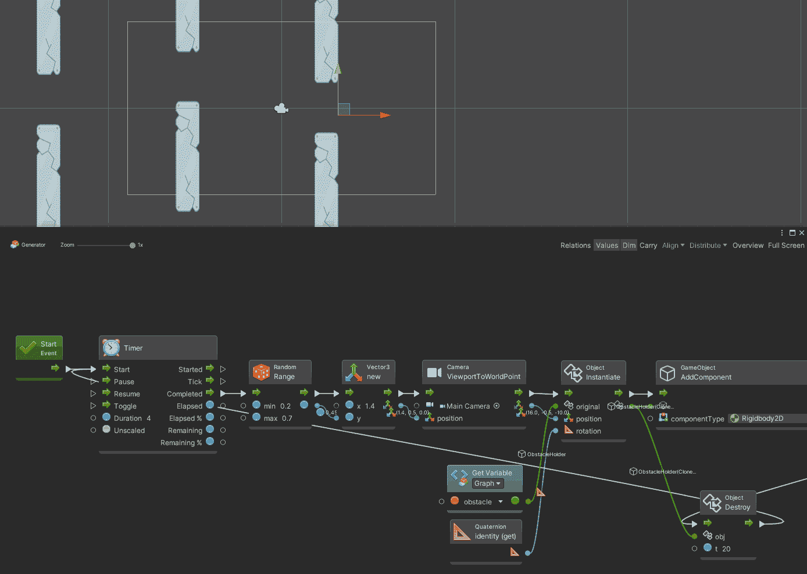

让我们也添加一个玩家与障碍物的碰撞检测。一旦发生这种情况，整个场景重新加载，有效地重新开始游戏。我们不需要担心我们要碰撞的物体的细节，因为在这个游戏中我们只能碰撞 2 个物体。

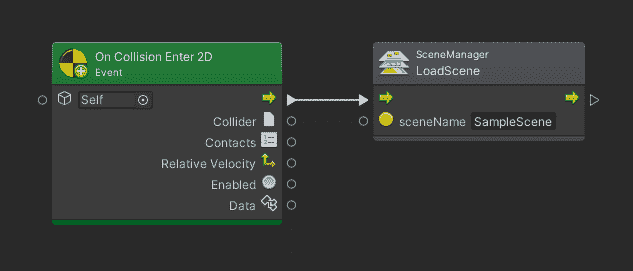

决赛！

这整个游戏项目在我的 [github](https://github.com/janjilecek/flappy_bird_clone_in_unity_bolt/tree/master) 上都有。