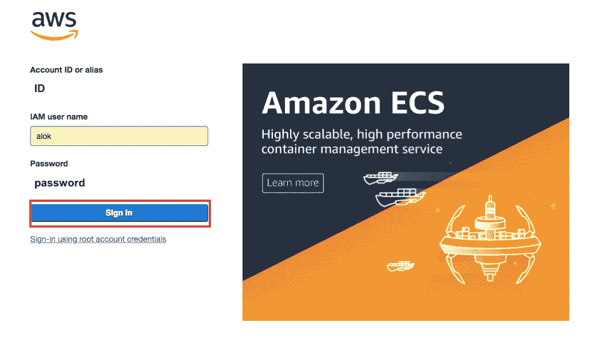
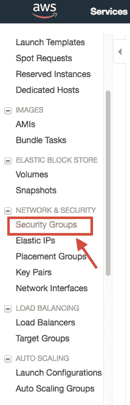
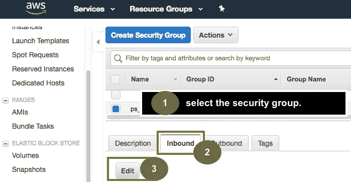
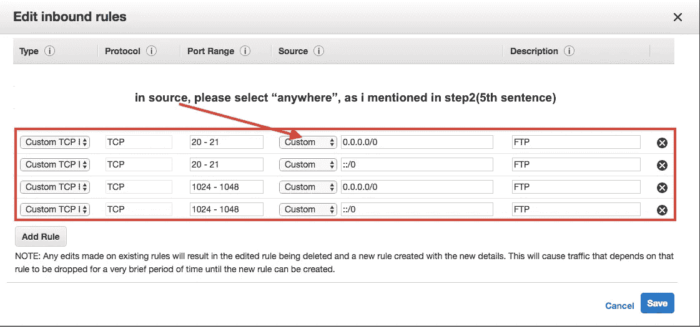

# 在 AWS EC2 上设置 FTP

> 原文：<https://itnext.io/create-ftp-on-aws-ec2-f6e57d4d7f25?source=collection_archive---------4----------------------->


> [*点击这里在 LinkedIn* 上分享这篇文章](https://www.linkedin.com/cws/share?url=https%3A%2F%2Fitnext.io%2Fcreate-ftp-on-aws-ec2-f6e57d4d7f25%3Futm_source%3Dmedium_sharelink%26utm_medium%3Dsocial%26utm_campaign%3Dbuffer)

当我需要以安全的方式从一个系统向另一个系统发送或接收数据/文件时，有许多协议，即 FTP(文件传输协议)，SFTP(安全文件传输协议)。

这篇文章属于 FTP。
我通常在 Windows 机器上做设置，但现在这次我必须在 ubuntu AWS EC2 上设置 FTP。

下面是在 AWS EC2 上设置 FTP 的基本步骤。

通过终端登录 AWS 服务器。本教程假设您可以作为 ec2 用户登录。
命令运行

```
sudo -i 
// to access as root.yum update -y 
// to update your AWS server to latest stable release of *everything*. The -y means when it asks if you want to install you’ve already said “yes”yum install vsftpd 
// to install the ftp gubbins you will need to say yes
```

# 第二步—打开安全组中的端口

您需要在浏览器中打开 AWS 帐户，打开 FTP 访问所需的端口。
这通过以下方式实现:

```
1) Login to AWS account. 
2) Open up the EC2 panel from the service menu.
3) Select “security groups” from the left menu and find the relevant one. 
4) Press “Edit” on the relevant security group INBOUND rules 
5) Add two rules Type > Custom TCP Rules – port ranges 20-21 and 1024-1048 (all from source “anywhere” if you want to allow FTP from anywhere, otherwise secure by locking down to just your IP, assuming a) you know this and b) it won’t change!)
```

请检查所附的图片。

1)



2)


3)



4)



5)



# 步骤 3 —确保 vsftpd 在服务器重新启动时启动

您希望确保您的新服务将在将来服务器重新启动时启动。
在终端中输入以下内容

```
chkconfig --level 345 vsftpd on 
// This makes sure that vsftpd starts when the instance reboots (note it will need starting initially, which a restart we do below will achieve!)
```

# 步骤 4-更新 vsftpd.conf 文件

回到您的终端窗口，运行以下命令，使用 vi 更新您的
vsftpd.conf 文件。

```
vi /etc/vsftpd/vsftpd.conf 
// this uses the vi editor to edit the vsftpd.conf file.
```

按 insert 键或“I”开始在 vi 中插入(删除、替换等等),或使用其他方法实现以下操作:

变化

```
anonymous_enable=YES 
to 
anonymous_enable=NO 
// this prevents ananymous access over FTP.
```

然后将以下内容添加到文件的底部

```
pasv_enable=YES 

pasv_min_port=1024
 
pasv_max_port=1048 

pasv_address=[YOURPUBLICIP]
```

请务必将[YOURPUBLICIP]替换为您的公共 IP。它启用被动连接，指定要使用的端口和 IP。

```
Press escape type
:wq Hit enter
```

// :wq 告诉 vi“写”这个文件，“退出”冒号表示“命令来了”，escape 键预先表示“我要说一些命令，停止插入文件”。

接下来重新启动 vsftpd

```
sudo /etc/init.d/vsftpd restart
```

# 步骤 5-创建 FTP 用户

在“终端”中键入以下内容来创建此用户/密码——用您想要的用户名替换“awsftpuser ”!

```
adduser awsftpuser 

passwd awsftpuser
```

# 步骤 6 —将用户限制在主目录中

你需要防止一个 FTP 用户在他的站点上获得想法，并把他或她“引导”到他们的目录(意味着他们不能“超越”他们的主目录并试图修改(例如)服务器设置)。
在终端中再次编辑 vsftpd.conf，并再次使用 vi:

```
vi /etc/vsftpd/vsftpd.conf
```

取消注释(删除前面的#),如下所示:

```
chroot_local_user=YES
```

然后像以前一样保存并退出。//点击 escape :wq，然后再次输入//通过写入 vi 并退出来保存您的新设置

通过在终端中输入以下命令来重新启动 vsftpd:

```
sudo /etc/init.d/vsftpd restart
```

# 步骤 7-更改/设置用户的 FTP 主目录并授予组权限

在终端中输入以下命令来设置用户(在本例中是我们的 awsftpuser 用户——用您的实际用户名替换它！)主目录。在这个例子中，我说 ftp_data 是用户的根。

```
usermod -d /var/www/ftp_data awsftpuser
```

然后，确保 awsftpuser 是拥有该文件夹中的文件的组的一部分，以允许他们按照您的意愿上传/更改/删除。你可能要小心允许 FTP 用户修改你的服务器上的文件！
首先，通过执行以下操作，检查 ftp_data 文件夹中文件的所有权状态:

```
cd /var/www/ftp_data/ 
// navigate to the folder ls -l
```

//将输出该目录中文件的权限、所有权和组。在我们的例子中，我们将把用户添加到这个相关的组中。

```
usermod -a -G <your group name> awsftpuser
```

//上面将用户 awsftpuser 添加到组中，这意味着该用户将获得与该组相同的访问权限。这将有助于您处理一些权限问题，否则您会在 FTP 上上下下时遇到这些问题。
最后，重启应用一切，你应该完成了！

```
sudo /etc/init.d/vsftpd restart
```

就这么定了。现在你可以访问你的 FTP 了。干得好！

# 两个更有用的命令:

更改默认 FTP 上传文件夹
T3 第一步:

```
edit /etc/vsftpd/vsftpd.conf
```

**第二步:在页面底部创建一个新条目:**

```
local_root=/var/www/ftp_data
```

要对文件夹下的文件应用读、写、删除权限，以便您可以使用 FTP 设备进行管理，请查找/var/www/FTP _ data-type d-exec chmod 777 { } \；

# 问题？？？

如果您在将文件复制到 FTP 服务器时遇到问题，请尝试以下解决方案:在 vsftpd 中修复远程 FTP 用户的写权限

默认情况下，Ubuntu 12.04 Precise 附带的 vsftpd 版本不允许 chrooted 本地用户写入。默认情况下，您会在/etc/vsftpd.conf 中找到它:

```
chroot_local_user=YES 
write_enable=YES
```

为了允许本地用户写入，您需要添加以下参数:

```
allow_writeable_chroot=YES
```

ref:
https://silicon dales . com/tutorials/AWS-ec2-tutorials/setup-FTP-sftp-AWS-ec2-instance/

如果你有任何担心，请尽管问。

享受


**感谢&最诚挚的问候，
Alok Rawat**

*原载于*[*qiita.com*](https://qiita.com/alokrawat050/items/abb814dc9796d7f025b4)*。*