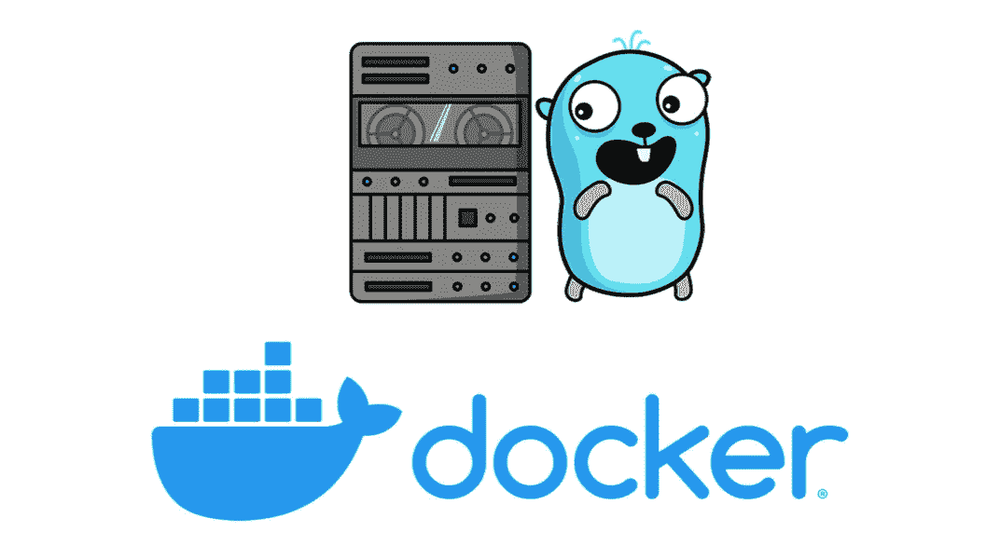
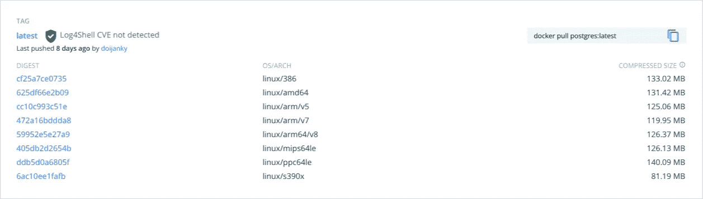

# 以简单的方式创建基于 Go 的 Docker 多架构图像

> 原文：<https://itnext.io/create-go-based-docker-multiarch-images-the-easy-way-74a35cf62c0?source=collection_archive---------2----------------------->

不使用多阶段 Dockerfile

由 Renee French 创建的原始地鼠图像，使用由 Maria Letta 创建的地鼠图像

这篇文章是写给那些使用 Docker 和 Go 的人的。准确地说……对那些在 Docker 中使用 Go 的人来说。

这篇文章的目的是给你一个想法，如何在不使用多阶段 Docker 文件的情况下，尽可能小和尽可能快地制作多架构 Docker 图像。

目标是让您的 Docker 图像就像下面的 **Postgres** 的图像一样，您可以看到 8 种不同的架构。

截图来自 DockerHub，Postgres 图片

这里的主要思想是预先构建二进制文件，然后使用尽可能简单的 Dockerfile。从那个 docker 文件开始构建将会非常快，并且你的图像将会尽可能的小。
这样做的原因:你**能**让你的二进制文件尽可能的小，看看下面的文章就知道了。

 [## 收缩 Go 可执行文件

### 使用 Go 1.18 和 UPX

itnext.io](/shrinking-go-executable-9e9c17b47a41) 

我们将这篇文章分为两个主要部分:二进制准备和 docker 映像构建。

因为该方法使用了`buildx`命令，所以您需要事先运行`docker buildx create`(前提是您之前没有运行过它)。

# 二元制备

以您喜欢的方式构建您的二进制文件，并将它们放入适当的目录中。通过*正确的目录*我的意思是:如果你想让你的 Docker 镜像成为一个`linux/amd64`镜像，你需要把二进制文件放到`linux/amd64`目录中。

关键是将二进制文件生成到与 Docker OS/ARCH 描述相匹配的目录中。

# Docker 形象大厦

然后，您的 Docker 文件将使用这种“匹配”来生成带有适当的二进制文件的 Docker 映像。

# 如何用最简单的方法做这件事

为了使它尽可能自动化，你可以使用一个简单的名为`create.sh`的脚本。

我使用目录名作为二进制文件和 Docker 映像的名称，因此你可以在第**行**中看到脚本正在获取实际的目录名。
在**第 2 行和第 3 行**你可以看到脚本正在为`amd64`和`arm64`生成两个二进制文件，并将它们放入适当的目录，匹配 Docker 平台架构(来自第 9 行)。
在**第 5 行和第 6 行**上，该脚本使用 UPX 使那些构建的二进制文件尽可能小(参见本文开头的链接文章)。
**第 8 行**删除之前的 Docker 图像。
**第 9 行**，最后创建合适的 Docker 多 arch 映像，并将其推送到 DockerHub。

Dockerfile 文件非常简单。它只是复制正确的二进制文件，仅此而已。

在这种情况下，`system_service`是目录的名称和生成的二进制文件的名称。

当你运行这个脚本时，它会使用 docker 文件并为你做好一切。

# 摘要和两个现实世界例子的链接。

通过使用这种方法，您可以利用您的机器的能力(构建二进制文件，使它们更小，等等。)并使整个过程尽可能快，你的图像尽可能小。

*例如(截至 2022 年 4 月)，Alpine linux 没有针对 arm64 的 UPX，因此在使用多阶段 Dockerfile 时，您不能使用 UPX。*

# 例子

这是一个使用这种方法的服务的 Github 存储库(这个脚本有几行代码，比如用正确的版本更新文件等等。，但那是我内部的事情)。

 [## GitHub-petrjahoda/system _ service

### Go 服务会在第一次运行时自动创建数据库，检查数据库大小和磁盘可用空间。发送电子邮件，当…

github.com](https://github.com/petrjahoda/system_service) 

这是使用相同方法的第二个 Github 库。但是在这种情况下，我们讨论的是作为服务运行的 web 服务器，所以您需要将必要的目录(html、css、…)复制到映像中。docker 文件“更丰富”，它使用 alpine(不是从头开始)，因为软件使用时区数据。

 [## GitHub-petrjahoda/system _ web service

### 此时您不能执行该操作。您已使用另一个标签页或窗口登录。您已在另一个选项卡中注销，或者…

github.com](https://github.com/petrjahoda/system_webservice) 

因为我只创建 linux 映像，所以我的 docker 文件中没有 TARGETOS。

如果你发现一个问题，怪癖或者废话，请在评论里告诉我。