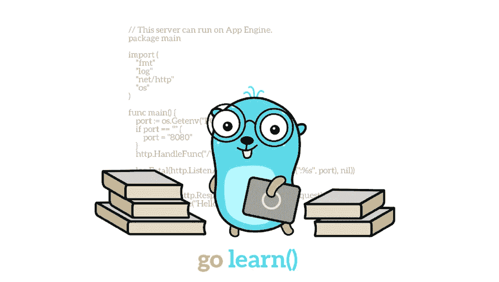
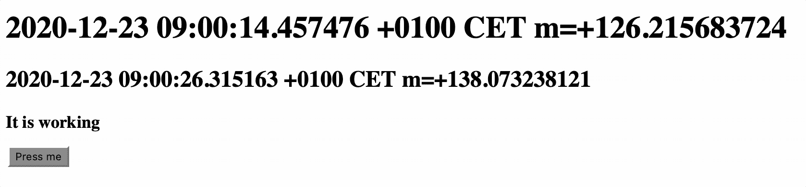
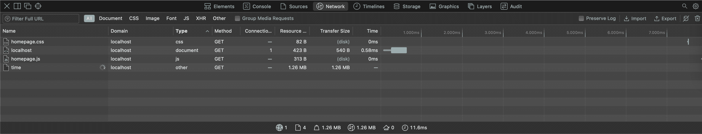
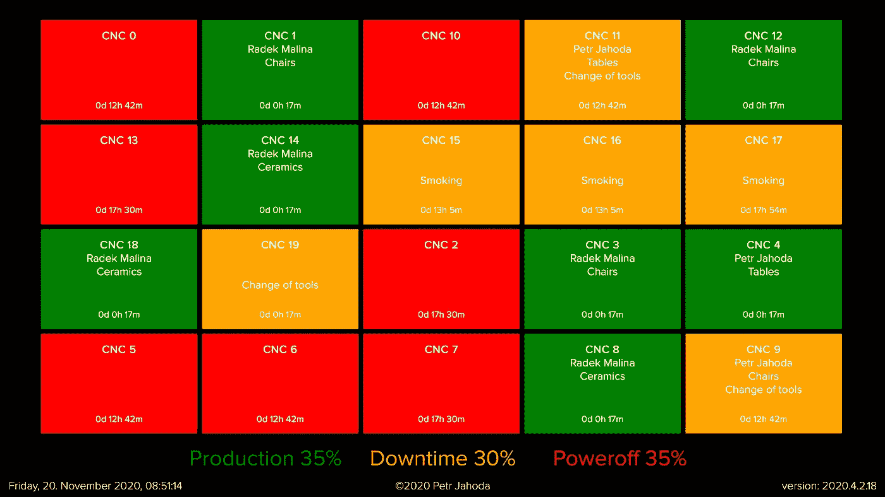

# 在 Go web 服务器中使用 SSE

> 原文：<https://itnext.io/create-go-service-the-easy-way-iv-c1f6b91401c1?source=collection_archive---------0----------------------->

## 服务器以最简单的方式发送事件

由 Renee French 创建的原始地鼠图像，使用由 Maria Letta 创建的地鼠图像

1.  部分:[创建服务](https://petrjahoda.medium.com/create-go-service-the-easy-way-de827d7f07cf)
2.  part: [改善服务](https://petrjahoda.medium.com/create-go-service-the-easy-way-ii-c397fd17875)
3.  part: [网页升级](https://medium.com/swlh/create-go-service-the-easy-way-iii-c84489cc1ee0)
4.  part: **你现在正在读**
5.  部分:[简单的 javascript 前端功能](https://petrjahoda.medium.com/create-go-service-the-easy-way-v-63c260594ed9)
6.  零件:[前端—后端通信](https://petrjahoda.medium.com/create-go-service-the-easy-way-vi-1fc383d435bd)
7.  部分:[服务器端日志](https://petrjahoda.medium.com/create-go-service-the-easy-way-vii-2a550c9204a6)
8.  零件:[在 docker](https://petrjahoda.medium.com/create-go-service-the-easy-way-viii-157427e7cd35) 中运行所有零件
9.  零件:[添加数据库容器](https://petrjahoda.medium.com/test-story-618d1cfca0cd)
10.  零件:[数据库—服务通信](https://petrjahoda.medium.com/communication-between-go-service-and-postgres-database-both-running-in-docker-ae0fd53a25b8)

追加 1: [函数、方法、指针和接口](/go-functions-methods-pointers-and-interfaces-1c034fd198d3)
追加 2: [websocket 通信](/websocket-communication-between-two-go-programs-the-easy-way-d8c9cf40043f)
追加 3: [socket 通信](https://petrjahoda.medium.com/plain-socket-communication-between-two-go-programs-the-easy-way-bd5ac5819eb6)

# 这是什么意思，SSE？我为什么要用它？

SSE 代表[服务器发送事件](https://en.wikipedia.org/wiki/Server-sent_events)，标准化的**推送**技术，非常容易使用。

如果你想更新网页上的内容，你可以使用 SSE。无论是发送时间、表格、颜色、通知徽章，…

在本文中，我们将使用一个简单的例子，在这里您将看到 SSE 的强大功能。

# 准备项目

从添加正确的模块开始，该模块已经在程序的服务器端内置了该功能。

我们将再次使用 julienschmidt 的存储库，这次是来自`github.com/julienschmidt/sse`的模块。所以添加新模块并导入它。您的导入代码块应该类似于下面的代码。

# 添加 SSE 功能

然后导航到`run()`方法，并在您的`router := httprouter.New()`下添加一行新代码。这行代码将创建一个名为 timer 的新流。忽略红色曲线，因为我们将立即使用该飘带。

## 在服务器端实现 SSE

再添加两行代码:`router.Handler(“GET”, “/time”, timer)`和`go streamTime(timer)`，这样最后你的`run()`方法应该看起来像下面的代码。第一个新行将为这个 streamer 注册一个句柄，第二个行将运行新的 **goroutine** ，它将流式传输时间，直到服务停止。

使用 ALT+ENTER 创建那个`streamTime()`函数，并将其移动到您的**主页。go** 文件。用下面的代码更新这个函数。只要您的服务在运行，这段代码就会以每毫秒的时间流传输实际时间。

## 在客户端实现 SSE

现在我们将向您的**homepage.html**文件添加一个新元素，它将显示流时间。是 id 为 actual-time 的元素:`<h2 id=”actual-time” ></h2>.`

最后，给你的 **homepage.js** 文件添加几行新代码。这几行代码访问我们在`router.Handler(“GET”, “/time”, timer)`中定义的 `**/time**`句柄。每次——在本例中是每毫秒——它都会用实际时间更新 html 元素。

## 测试一下，SSE 能工作多快

现在您可以测试它，但是不要忘记从您的`serveHomepage()`函数中移除那个`**time.Sleep()**`方法。你应该看到你的 SSE 工作得很好。时间每毫秒刷新一次。

**现在你看到 SSE 的威力了吧。**

## 立正！

但是，请，这只是作为一个例子，如何发送数据从后端到前端。不要使用 SSE 每毫秒发送一次时间。看下面的截图，当测量这个*每毫秒传输时间*的数据传输量时，看起来是什么样子。

# 摘要

SSE 技术只能单向传输数据流。从服务器到客户端。用它在你的网页上显示毫秒时间是不明智的，你可以在客户端用 javascript 完全做到这一点。

我专门用发送时间向您展示，有多少数据和多快可以从服务器传输到客户端，但在实际应用程序中，我用它来通知和更新各种数据。

总结一下，读完这篇文章，你知道如何…

*   在 Go 中的服务器端实现 SSE
*   用 HTML 和 Javascript 在客户端实现 SSE
*   SSE 的优势是什么(快速且易于使用)
*   SSE 的缺点是什么(仅限于服务器到客户端)

# 现实生活中的例子

举个例子，这是我使用 SSE 的方式。

这是一个大屏幕的截图，挂在某工厂的一个生产大厅里。SSE 用于更新这张截图上的几乎每一条数据。颜色、文本、百分比，在这种情况下，甚至是时间(因为客户希望每个面板上的时间同步)。

## 整洁的特征

使用 SSE 的一个非常简洁的特征是我称之为*“连续性”*。当你停止服务，即使用 SSE 发送所有数据，但**让页面打开**，你会立即看到，页面上的数据没有刷新。

在这种 LCD 面板的情况下，您看不到新的更新…但页面仍然打开。在我们关于时间的例子中，时间停止了。但是当您再次启动该服务时，您会看到时间又开始运行了。你自己检查一下。如果是 LCD 面板，它会自动刷新新数据。

*附:你可以在这里* *看到液晶面板* [*的完整代码，但该服务只是项目的一部分，所以忽略与 SSE 无关的一切:-)*](https://github.com/petrjahoda/display_webservice)

 [## petrjahoda/中型服务

### 中等 _ 服务。在 GitHub 上创建一个帐户，为 petrjahoda/medium-service 的发展作出贡献。

github.com](https://github.com/petrjahoda/medium_service/tree/Chapter_4)