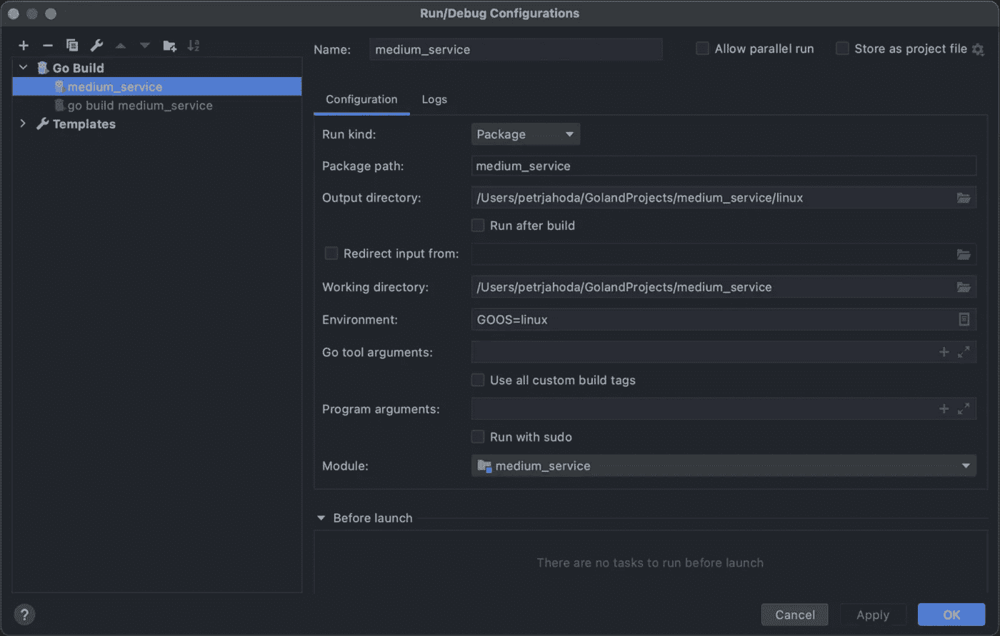
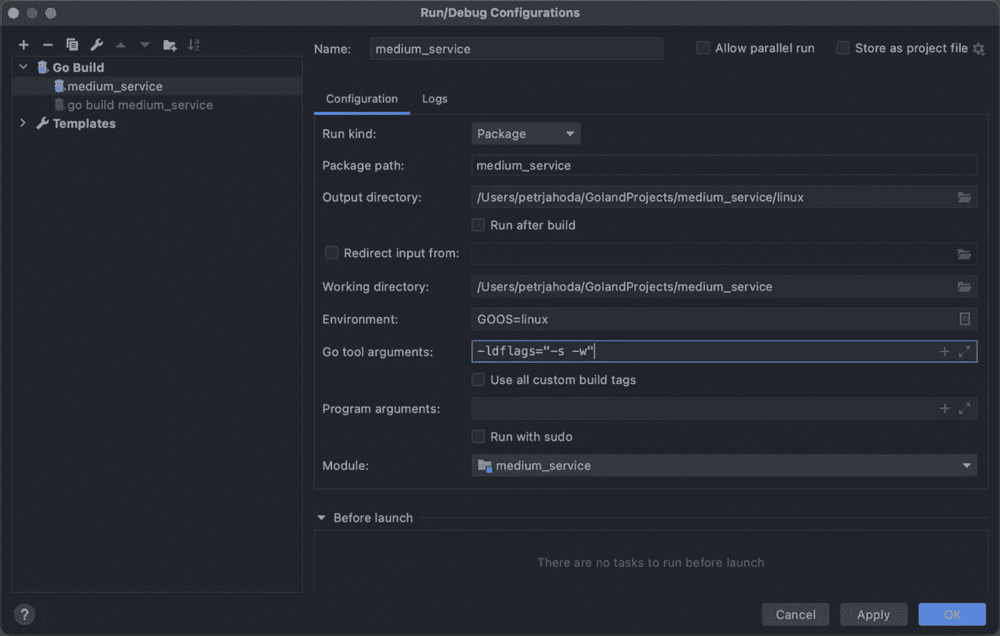
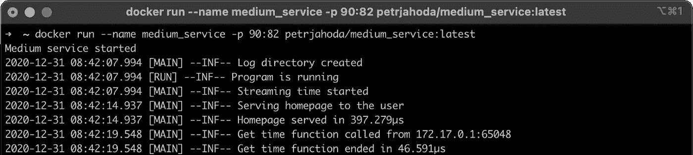
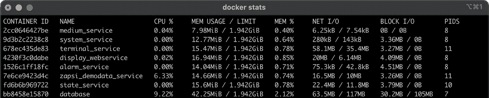

# 在 Docker 中运行 Go 服务

> 原文：<https://itnext.io/create-go-service-the-easy-way-viii-157427e7cd35?source=collection_archive---------2----------------------->

## 额外的好处是可执行文件的大小减少了大约 73%


由 Renee French 创建的原始地鼠图像，使用由 Maria Letta 创建的地鼠图像

1.  部分:[创建服务](https://petrjahoda.medium.com/create-go-service-the-easy-way-de827d7f07cf)
2.  部分:[改善服务](https://petrjahoda.medium.com/create-go-service-the-easy-way-ii-c397fd17875)
3.  部分:[网页升级](https://petrjahoda.medium.com/create-go-service-the-easy-way-iii-c84489cc1ee0)
4.  零件:[添加 SSE](https://petrjahoda.medium.com/create-go-service-the-easy-way-iv-c1f6b91401c1)
5.  部分:[简单的 javascript 前端功能](https://petrjahoda.medium.com/create-go-service-the-easy-way-v-63c260594ed9)
6.  部分:[前端—后端通信](https://petrjahoda.medium.com/create-go-service-the-easy-way-vi-1fc383d435bd)
7.  部分:[服务器端日志](https://petrjahoda.medium.com/create-go-service-the-easy-way-vii-2a550c9204a6)
8.  part: **你现在正在看**
9.  零件:[添加数据库容器](https://petrjahoda.medium.com/test-story-618d1cfca0cd)
10.  零件:[数据库—服务通信](https://petrjahoda.medium.com/communication-between-go-service-and-postgres-database-both-running-in-docker-ae0fd53a25b8)

追加 1: [函数、方法、指针和接口](/go-functions-methods-pointers-and-interfaces-1c034fd198d3)追加 2: [websocket 通信](/websocket-communication-between-two-go-programs-the-easy-way-d8c9cf40043f)追加 3: [socket 通信](https://petrjahoda.medium.com/plain-socket-communication-between-two-go-programs-the-easy-way-bd5ac5819eb6)

# 为什么要使用 Docker 呢？

当然，您可以为每个系统创建 Go 可执行文件，并且可以在任何您想要的地方运行它。确实如此。

通过使用 Docker，您可以为自己创建一个整洁的部署系统。你不关心最终的机器上实际运行的是什么系统。你只想让机器运行 Docker。您可以轻松地停止和启动多个程序(如果您喜欢这个术语，可以选择多个服务)。您可以轻松地更改 Go web 服务器的端口，而无需更改 Go 代码本身。您可以同时运行多个不同的数据库。

你可以使用 Docker 做很多事情，我建议你花时间去学习它。

对于不熟悉 Docker 的人，我推荐 Bret Fisher 的 [Docker Mastery](https://www.udemy.com/course/docker-mastery/) 。这帮助我从*“Docker 是什么鬼东西”*到*“太好了，我还能用 Docker 做什么”*。

对于那些已经熟悉 Docker，但还想了解更多的人来说，[这个讲座](https://www.youtube.com/watch?v=8fi7uSYlOdc)可以让你对容器有更多的了解。

# 准备项目

打开 Goland 并在项目目录中创建名为 **Dockerfile** 的新文件。在下面插入代码。这些命令将使用`FROM scratch`创建空图像，然后从 css、html、js 和 linux 目录中复制内容。

但是等等，现在还没有 linux 目录。原因是，我们没有开发我们的软件。我们没有制作任何可执行文件。

## 创建 Go 可执行文件

有许多方法，如何构建我们的软件…如何创建这个可执行文件。一种方法是使用 Goland 的内置功能。

通过复制第一个配置来创建新配置。在这一新配置中，有四项变化:

1.  名称…这个名称将被用作可执行文件的名称，并且必须与`CMD [“/medium_service”]`匹配，所以我们使用 medium_service，Goland 将自动在文件名中添加 _linux
2.  选择输出目录(linux，因为我们将使用 linux 容器)
3.  在构建后运行时取消勾选
4.  *将环境设置为`GOOS=linux`*

**

****旁注:*** *通过定义 GOOS 你可以为*[](https://gist.github.com/asukakenji/f15ba7e588ac42795f421b48b8aede63)**可用的任何系统和任何架构构建可执行文件。***

## **将可执行文件缩减了 73%**

**当您运行这个配置时，您会立即看到一个新的可执行文件出现在这个 linux 目录中。这个可执行文件大约有 **9.6MB** ，我们将做两个小技巧让它变得更小。首先给 Go 工具参数添加两个标志`-ldflags=”-s -w”`，如下图所示。**

****

**再次运行这个配置，您可以看到，可执行文件大约为 **6.9MB，**减少了大约 28%。第二个技巧是使用任何可用的可执行打包程序。我使用 UPX，我也在生产中使用它，没有任何影响。使用命令`upx medium_service_linux`，可执行文件的大小将缩小到大约 **2.6MB** ，减少了 73%。**

## **使用脚本创建 Go 可执行文件**

**我更喜欢使用的另一种方法是使用脚本，无论是 bash 还是 powershell 脚本。由于我使用苹果设备，所以下面你可以看到我的 bash 脚本。这个脚本名为 **create.sh** ，放在项目目录中。它做了很多事情。**

**首先，它将通过使用`name=${PWD##*/}`获得当前工作目录的名称，然后它将更新所有模块(没有必要，但我喜欢所有模块的最新版本)，然后它将使用`GOOS=linux go build -ldflags=”-s -w” -o linux/”$name”`构建我们的可执行文件，然后移动到那个 linux 文件夹，将可执行文件与 UPX 打包并移出。**

**这一切做完之后，它终于会用 docker 做点什么了。通过使用`docker rmi -f petrjahoda/”$name”:latest`，它将删除之前已经创建的任何图像，通过使用`docker build -t petrjahoda/”$name”:latest .`，它将创建图像。这个**点**表示它将在执行该命令的目录中搜索 Dockerfile。最后，它会使用`docker push petrjahoda/”$name”:latest`将该图像推送到 docker hub。为了让这个最后的命令工作，你需要让你自己的库工作，并且你必须在你的机器上登录 Docker。**

*****旁注:*** *不要忘记* `chmod +x create.sh` *并删除前面的可执行文件，以****_ Linux****结尾。***

## **运行脚本**

**当您运行这个脚本时，您会看到许多事情正在发生(见下文)。一切完成后，您可以在 docker hub 存储库中找到您的映像。在我的箱子里，它在这里。**

```
**go: golang.org/x/sys upgrade => v0.0.0–20201223074533–0d417f636930
 Ultimate Packer for eXecutables
 Copyright © 1996–2020
UPX 3.96 Markus Oberhumer, Laszlo Molnar & John Reiser Jan 23rd 2020File size Ratio Format Name
 — — — — — — — — — — — — — — — — — — — — — — — — -
 6901760 -> 2630120 38.11% linux/amd64 medium_servicePacked 1 file.
Error: No such image: petrjahoda/medium_service:latest
[+] Building 0.4s (8/8) FINISHED 
 => [internal] load build definition from Dockerfile 0.0s
 => => transferring dockerfile: 135B 0.0s
 => [internal] load .dockerignore 0.0s
 => => transferring context: 2B 0.0s
 => [internal] load build context 0.2s
 => => transferring context: 5.26MB 0.1s
 => [1/4] COPY /css /css 0.0s
 => [2/4] COPY /html html 0.0s
 => [3/4] COPY /js js 0.0s
 => [4/4] COPY /linux / 0.0s
 => exporting to image 0.0s
 => => exporting layers 0.0s
 => => writing image sha256:1df9b9adbc1167cb1fcb1fc66d74cf33964c35530dc04fa4f5434e917bc50a53 0.0s
 => => naming to docker.io/petrjahoda/medium_service:latest 0.0s
The push refers to repository [docker.io/petrjahoda/medium_service]
bc5cf960a3a7: Pushed 
6eec7c2c219c: Pushed 
2038e7a8e302: Pushed 
95541ba72fa1: Pushed 
latest: digest: sha256:4584ba804f99d001a57d84bc85b6624eb8f9ab2b8edc9e226e43e670a0ce51b3 size: 1149**
```

## **测试将 Go 服务作为 Docker 容器运行**

**看来我们做的一切都是对的。是时候测试一下了。**

**打开你的终端，或者控制台，或者使用 Goland 的内置终端运行`docker run — name medium_service -p 90:81 petrjahoda/medium_service:latest`。这将运行一个名为 **medium_service** 、**的新容器，将内部端口 81 映射到外部端口 90** ，并使用已经创建的带有`latest`标签的映像。当您运行该命令时(在我的示例中，我必须使用端口 82，因为我在我的应用程序中使用了它),您会看到来自应用程序的日志。**

**打开浏览器，导航到 [http://localhost:90](http://localhost:90) 。你的网页必须运行。如果您尝试点击**询问数据**按钮，您会立即看到，它已被成功记录。**

****

## **让 Docker 容器在后台运行**

**为了让这个 docker 容器一直运行，现在使用 CTRL+C 结束它，并使用`docker rm medium_service`删除它。现在再次运行它，这次添加了 **-d 参数:** `docker run — name medium_service -p 90:81 -d petrjahoda/medium_service:latest`。这将运行容器并且**从容器上分离**。因此，现在您的控制台可以自由使用或关闭，您的 web 服务器在后台工作。**

**你可以通过使用`docker ps -a`来检查你的容器是否工作，它将显示你所有未移除的*容器，或者通过使用`docker stats`(见下图)来实时监控你正在运行的容器。在我的情况下，我有更多的运行容器，中型服务在顶部。***

****

****恭喜**。您有自己的 web 服务运行在 Docker 容器中。软件的每个部分都在正常运行，通过使用`FROM scratch`，我们使我们的容器非常安全(但另一方面，你不能从容器内部 ping 命令)。**

**通过使用`docker image ls`，你可以看到我们的图像大约有 5.26MB(去可执行文件和所有其他文件)。**

# **额外功能**

**下面是我的 **create.sh** 文件，我用在每个软件的生产中。有两件不同的事情。首先你会看到，它运行`./update`，最后还有三个 docker 命令。**

**这样做的原因是，我喜欢我的软件有一个正确的版本，不需要考虑它。所以在 main.go 的每个软件中我都有一个常量 T7，当服务启动时，我喜欢使用类似 T8 的东西。**

**这个**。/更新**做两件事。更新这个常量并更新 create.sh 中的最后三行代码，包含 version。**

**结果是，**最新的 docker 映像实际上总是最新的**，并且由于我的软件是用正确的版本号构建的，所以会有更多的映像。例如，版本 2020.4.3.13 是这样组合的:**

*   **2020 年是一年**
*   **4 是一年的第四季度**
*   **3 是本季度的第三个月**
*   **13 是一个月中的第几天**

**你可以看到使用这种方法，例如这里的。更新后可执行文件也在项目目录中。**

# **摘要**

**这篇文章帮助你知道，如何…**

*   **使用两种不同的方法创建 Go 可执行文件**
*   **创建 Docker 映像并将其推入 Docker Hub**
*   **使用不同的参数运行 Docker 映像**
*   **在后台运行 Docker image(并检查日志)**
*   **将 Go 可执行文件缩减约 73%**
*   **添加一些自动版本控制作为额外的功能**

**[](https://github.com/petrjahoda/medium_service/tree/Chapter_8) [## petrjahoda/中型服务

### 中等 _ 服务。在 GitHub 上创建一个帐户，为 petrjahoda/medium-service 的发展作出贡献。

github.com](https://github.com/petrjahoda/medium_service/tree/Chapter_8)**