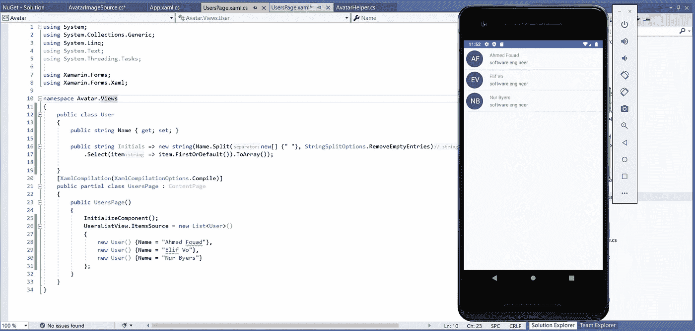

# 使用 skiasharp 和 xamarin 表单创建图标文本头像

> 原文：<https://itnext.io/create-iconic-text-avatars-using-skiasharp-and-xamarin-forms-e1334ae263d8?source=collection_archive---------2----------------------->



在现代设计中，文字头像是个人资料图片最优雅的替代品，它们的使用不仅仅限于个人资料图片丢失或未加载的情况，而且在一些系统和移动应用程序中，它们被用作个人资料图片的完全替代。

这篇短文将向您展示如何使用 skiasharp 在 xamarin 表单中实现可重用的 AvatarImageSource。

# 步骤 1:创建 AvatarImageSource 类

```
public class AvatarImageSource : StreamImageSource
{
}
```

# 步骤 2:添加可绑定属性

```
public string Name
        {
            get => (string) GetValue(NameProperty);
            set => SetValue(NameProperty, value);
        }

public Color Background
        {
            get => (Color) GetValue(BackgroundProperty);
            set => SetValue(BackgroundProperty, value);
        }public Color Foreground
        {
            get => (Color)GetValue(ForegroundProperty);
            set => SetValue(ForegroundProperty, value);
        }public int Size
        {
            get => (int) GetValue(SizeProperty);
            set => SetValue(SizeProperty, value);
        }
```

我们将需要这些属性是用户定义的，所以我们可以在以后重用我们的 AvatarImageSource。

# 第三步:用 SkiaShap 绘制文本

在执行这一步之前，请确保 skiasharp NuGet 包已经安装在您的所有项目中

[](https://www.nuget.org/packages/SkiaSharp/) [## SkiaSharp 1.68.3

### SkiaSharp 是一个跨平台的 2D 图形 API。NET 平台基于 Google 的 Skia 图形库。它提供了一个…

www.nuget.org](https://www.nuget.org/packages/SkiaSharp/) 

现在我们需要创建一个新的方法绘制

```
private Stream Draw()
        {
            var bitmap = new SKBitmap(Size * 2, Size * 2,   
                         SKImageInfo.PlatformColorType,  
                         SKAlphaType.Premul); var canvas = new SKCanvas(bitmap);
            canvas.Clear(SKColors.Transparent);

            var midy = canvas.LocalClipBounds.Size.ToSizeI().Height / 2;
            var midx = canvas.LocalClipBounds.Size.ToSizeI().Width / 2;
            var radius = midx-midx/5; var circleFill = new SKPaint
            {
                IsAntialias = true,
                Style = SKPaintStyle.Fill,
                StrokeJoin = SKStrokeJoin.Miter,
                Color = SKColor.Parse(Background.ToHex())
            };
            canvas.DrawCircle(midx, midy, radius, circleFill); var family = SKTypeface.FromFamilyName("Arial",   
                SKFontStyleWeight.Normal, SKFontStyleWidth.Normal,
                SKFontStyleSlant.Upright); var textSize = midx/1.5f;
            var paint = new SKPaint
            {
                IsAntialias = true,
                Style = SKPaintStyle.Fill, 
                Color = SKColor.Parse(Foreground.ToHex()),
                TextSize = textSize,
                TextAlign = SKTextAlign.Center,
                Typeface = family
            };
            var rect=new SKRect();
            paint.MeasureText(Name,ref rect);

            canvas.DrawText(Name, radius + rect.Height / 2,  
                                  radius+rect.Width/2, paint);
            var skImage = SKImage.FromBitmap(bitmap);

           var result = 
                     (skImage.Encode(SKEncodedImageFormat.Png,100))
                       .AsStream();
            return result;
        }
```

基本上，这个方法创建一个具有规定大小的画布，然后在中间画一个圆。

midy 和 midx 是垂直和水平的中点，半径按 midx-5%(边距)计算。

```
 var midy = canvas.LocalClipBounds.Size.ToSizeI().Height / 2;
            var midx = canvas.LocalClipBounds.Size.ToSizeI().Width / 2;
            var radius = midx-midx/5; var circleFill = new SKPaint
            {
                IsAntialias = true,
                Style = SKPaintStyle.Fill,
                StrokeJoin = SKStrokeJoin.Miter,
                Color = SKColor.Parse(Background.ToHex())
            };
            canvas.DrawCircle(midx, midy, radius, circleFill);
```

现在让我们在圆圈中间画出文字

```
var textSize = midx/1.5f;
            var paint = new SKPaint
            {
                IsAntialias = true,
                Style = SKPaintStyle.Fill, 
                Color = SKColor.Parse(Foreground.ToHex()),
                TextSize = textSize,
                TextAlign = SKTextAlign.Center,
                Typeface = family
            };
            var rect=new SKRect();
            paint.MeasureText(Name,ref rect);
            canvas.DrawText(Name, radius + rect.Height / 2, radius+rect.Width/2, paint);
```

文本大小是半径的 75%,您可以将其更改为任何百分比，或者您可以使用静态字体大小。

我们在渲染之前测量文本，以了解它在垂直和水平方向需要多少空间，然后我们通过将一半的空间添加到圆半径来计算文本位置。

下面是完整的方法

```
private Stream Draw()
        {
            var bitmap = new SKBitmap(Size * 2, Size * 2, SKImageInfo.PlatformColorType, SKAlphaType.Premul);
            var canvas = new SKCanvas(bitmap);
            canvas.Clear(SKColors.Transparent);

            var midy = canvas.LocalClipBounds.Size.ToSizeI().Height / 2;
            var midx = canvas.LocalClipBounds.Size.ToSizeI().Width / 2;
            var radius = midx-midx/5;var circleFill = new SKPaint
            {
                IsAntialias = true,
                Style = SKPaintStyle.Fill,
                StrokeJoin = SKStrokeJoin.Miter,
                Color = SKColor.Parse(Background.ToHex())
            };
            canvas.DrawCircle(midx, midy, radius, circleFill); var family = SKTypeface.FromFamilyName("Arial",      
                                    SKFontStyleWeight.Normal,  
                                    SKFontStyleWidth.Normal,
                                    SKFontStyleSlant.Upright);
            var textSize = midx/1.5f;
            var paint = new SKPaint
            {
                IsAntialias = true,
                Style = SKPaintStyle.Fill, 
                Color = SKColor.Parse(Foreground.ToHex()),
                TextSize = textSize,
                TextAlign = SKTextAlign.Center,
                Typeface = family
            };
            var rect=new SKRect();
            paint.MeasureText(Name,ref rect);
            canvas.DrawText(Name, radius + rect.Height / 2, 
                                  radius+rect.Width/2, paint);
            var skImage = SKImage.FromBitmap(bitmap);
            var result = (skImage.Encode(SKEncodedImageFormat.Png,100)).AsStream();
            return result;
        }
```

如果你不明白，考虑读几遍，然后试着从头开始写。

# 步骤 4:当需要图像数据时，调用 draw 方法

这一步是最简单的，我们需要做的就是覆盖基类 StreamImageSource 的 stream 属性

```
public override Func<CancellationToken, Task<Stream>> Stream => GetStreamAsync;public Task<Stream> GetStreamAsync(CancellationToken userToken = new CancellationToken())
        {
            base.OnLoadingStarted();
            userToken.Register(CancellationTokenSource.Cancel);
            var result = Draw();
OnLoadingCompleted(CancellationTokenSource.IsCancellationRequested);
            return Task.FromResult(result);}
```

并重写 OnPropertyChanged 方法

```
protected override void OnPropertyChanged(string propertyName)
        {
            if (propertyName == NameProperty.PropertyName ||
                propertyName == BackgroundProperty.PropertyName ||
                propertyName == SizeProperty.PropertyName ||
                propertyName == ForegroundProperty.PropertyName)
            {
                OnSourceChanged();
            }
        }
```

当我们的任何属性改变时，我们将需要触发源改变，Onsourcechanged 是基类中触发重绘的方法。

最终覆盖 IsEmpty

```
public override bool IsEmpty => string.IsNullOrEmpty(Name);
```

# 第五步:把所有东西放在一起

# 第七步:测试和消费

```
<ListView x:Name="UsersListView">
            <ListView.ItemTemplate>
                <DataTemplate>
                    <ImageCell Text="{Binding Name}" Detail="software engineer">
                        <ImageCell.ImageSource>
                            <avatar:AvatarImageSource  
                                       Background="DarkSlateBlue" 
                                       Foreground="White" Size="48"  
                                       Name="{Binding Initials}"/>
                        </ImageCell.ImageSource>
                    </ImageCell>
                </DataTemplate>
            </ListView.ItemTemplate>
        </ListView>
```

Csharp 的消费者呢

```
public class User
    {
        public string Name { get; set; }public string Initials => new string(Name.Split(new[] {" "}, StringSplitOptions.RemoveEmptyEntries)
            .Select(item => item.FirstOrDefault()).ToArray());}
    [XamlCompilation(XamlCompilationOptions.Compile)]
    public partial class UsersPage : ContentPage
    {
        public UsersPage()
        {
            InitializeComponent();
            UsersListView.ItemsSource = new List<User>()
            {
                new User() {Name = "Ahmed Fouad"},
                new User() {Name = "Elif Vo"},
                new User() {Name = "Nur Byers"}
            };
        }
    }
```

# 第八步:关注我，分享文章

在 twitter 和 medium 上关注我，了解更多技术和科学内容

https://twitter.com/MCC_Ahmed

如果你想支持我更多的技术和科学内容，你可以在

[](https://ko-fi.com/ahmedfouad) [## 给艾哈迈德·福阿德买杯咖啡。ko-fi.com/ahmedfouad

### 给我买杯咖啡

ko-fi.com](https://ko-fi.com/ahmedfouad) 

和往常一样，书籍推荐请阅读[丹尼尔·希夫曼](https://amzn.to/3dSGTlN)的《Cod 的性质 e 无论你的编码水平如何，这本书都会帮助你用非常简单的方法解决复杂的编码问题。