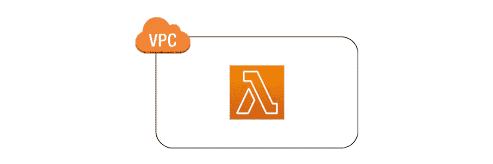

# 使用 CDK 在现有的 VPC 中创建 Lambdas

> 原文：<https://itnext.io/create-lambdas-in-an-existing-vpc-using-cdk-8136f5c2d841?source=collection_archive---------1----------------------->



默认情况下，lambda 不绑定到 VPC，它可以与公共子元素中的所有资源通信。然而，在很多用例中，您需要将 lambda 与 VPC 中私有子网内的数据库、ec2 或内部服务相连接。要使用 lambda 访问 VPC 境内的资源，它应该位于 VPC 内部。

今天我将向你们展示，如何使用 CDK，在 VPC 中发射 lambda。最棘手的是，当您将一个函数连接到 VPC 时，Lambda 会为函数的 VPC 配置中的安全组和子网的每个组合创建一个弹性网络接口。因此，当您配置 VPC 连接时，Lambda 需要权限来创建和验证网络资源。我们开始吧，

1.  得到现存的 VPC

```
from aws_cdk import (
    aws_lambda as lb,
    aws_ec2 as ec2,
    aws_iam as iam,
    core
)dev_vpc = ec2.Vpc.from_vpc_attributes( self, 'dev_vpc',
          vpc_id = "**VPC_ID**",
          availability_zones = core.Fn.get_azs(),
          private_subnet_ids = [**"SUBNET_ID1", "SUBNET_ID2"**]
       )
```

根据您的情况，用适当的值替换 VPC ID 和子网 ID。

2.授予 Lambda 角色权限

```
**lambda_role** = iam.Role( self,'lambda_role',                       assumed_by=iam.ServicePrincipal('lambda.amazonaws.com'),
role_name = "prod_lambda_role"
)iam.ManagedPolicy(self, "managed_policy",
statements = [
              iam.PolicyStatement(
                  effect = iam.Effect.ALLOW,
                  actions = ["ec2:CreateNetworkInterface",
                             "ec2:DescribeNetworkInterfaces",
                             "ec2:DeleteNetworkInterface",
                             "ec2:AssignPrivateIpAddresses",
                             "ec2:UnassignPrivateIpAddresses"],
                  resources = ["*"]
               )
             ],
roles = [**lambda_role**]
)
```

3.创建 Lambda

```
encrypt_db_lambda = lb.Function(self, 'encrypt_db_lambda',
              code = lb.Code.from_asset('lambda'),
              handler = 'encrypt_db_lambda.handler',
              runtime=lb.Runtime.PYTHON_3_6,
              **vpc = dev_vpc,**
              function_name = "base_lambda",
              **role = lambda_role,**
)
```

如上所述，你可以简单地使用 CDK 在 VPC 中创建你的 lambdas。