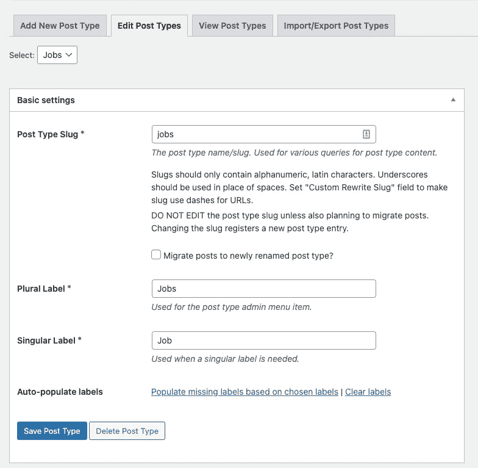
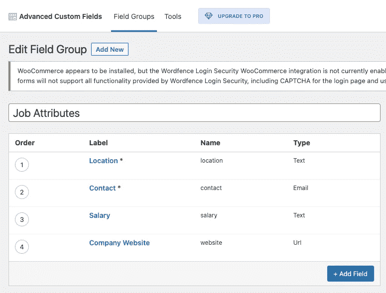
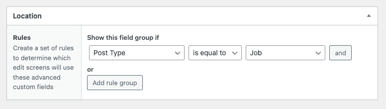
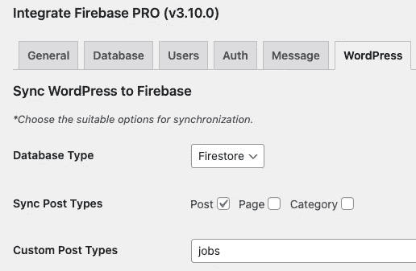
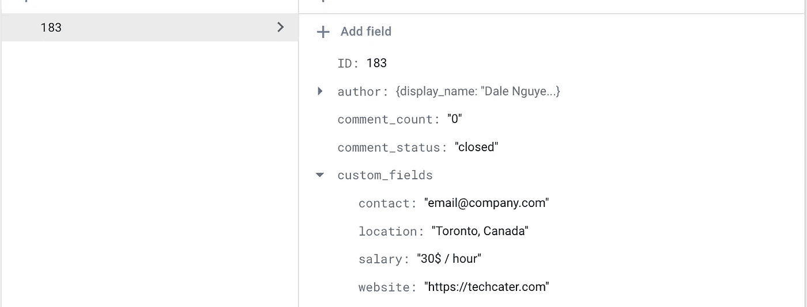

# 从 WordPress 创建和管理 Firebase 数据库

> 原文：<https://itnext.io/create-manage-firebase-database-from-wordpress-13347d8ffb2e?source=collection_archive---------1----------------------->

> 如果你对 Integrate Firebase PRO 版本感兴趣，请阅读完整的更新文档:[https://firebase-wordpress-docs.readthedocs.io/](https://firebase-wordpress-docs.readthedocs.io/)

【https://wordpress.dalenguyen.me/】演示:[T5](https://wordpress.dalenguyen.me/)

*   文章 1: [如何将 Firebase 集成到 WordPress](/how-to-integrate-firebase-and-wordpress-b017ee274687)
*   第 2 篇:[如何从 Firestore 检索数据并显示在 WordPress 上](/how-to-retrieve-data-from-firestore-and-display-on-wordpress-8638854a762e)
*   第 3 篇:[如何在 WordPress 中使用 Firebase 自定义声明](https://medium.com/@dalenguyen/how-to-work-with-firebase-custom-claims-in-wordpress-aaf83965bd20?sk=85786e3739d42b18c3e2c7344bc5f436)
*   第 4 条:[从 WordPress 保存数据到 Firebase(实时+ Firestore)](/how-to-save-data-from-wordpress-to-firebase-realtime-firestore-2eda917d01fb)
*   第五篇: [Firebase WordPress 用户集成](/firebase-wordpress-user-integration-c18a28e41cbd)
*   第 6 篇:[如何在 WordPress Dashboard 中管理 Firebase 用户](/firebase-users-management-in-wordpress-dashboard-61b4a1ca066#d4c2-1605c6edec5f)
*   第 7 条:[如何将数据从 WordPress 同步到 Firebase](/sync-data-from-wordpress-to-firebase-d6e5860d3a06)
*   第 8 条:[一键登录 WordPress & Firebase 或通过电子邮件链接](https://medium.com/@dalenguyen/one-click-login-to-wordpress-firebase-or-via-email-link-d7610d71cd23)
*   第 9 条:[从 WordPress 上传文件到云存储](https://medium.com/@dalenguyen/upload-files-to-cloud-storage-from-wordpress-e8acc8ce70cd)
*   第十条:[远程 URL 登录到 Firebase & WordPress](/remote-url-login-to-firebase-wordpress-2027fad7c159)
*   第 11 条: [2 种给 WordPress 添加 Firebase 认证的方法& WooCommerce](https://dalenguyen.medium.com/2-ways-to-add-firebase-authentication-to-wordpress-woocommerce-df500c3b104e)
*   第 12 条:[如何将 WooCommerce 购买数据发送到 Firebase](https://dalenguyen.medium.com/how-to-send-woocommerce-purchase-data-to-firebase-8c8b4c8cff39)
*   第十三条: [**从**创建&管理 Firebase 数据库](https://dalenguyen.medium.com/create-manage-firebase-database-from-wordpress-13347d8ffb2e)

在发现希望从 WooCommerce 购买数据(订单、产品、会员或订阅)到 Firebase 的客户的使用案例的过程中，允许他们的 Firebase 应用程序(WebApp、移动应用程序、桌面应用程序)有权访问该应用程序。

**集成 Firebase PRO** 已经处理了 Firebase &之间的 [**集中认证**](https://firebase-wordpress-docs.readthedocs.io/en/latest/auth/wordpress-user-integration.html) 。剩下的就是允许购买的用户访问 Firebase 应用程序。

我们都知道 Firebase 是一个强大的 Firebase 数据库(Realtime / Firestore)是一个灵活的、可伸缩的数据库，用于 Firebase 和 Google Cloud 的移动、web 和服务器开发。然而，它不具备传统的 CMS，让你可以有效地管理数据。

在这篇具体的文章中，我将为你提供一个选项，你可以从 WordPress 创建和管理 Firebase 数据库。我将使用一个简单的工作发布数据模型作为例子。

如果你喜欢看教程，这里有 [YouTube 视频](https://youtu.be/JGVVBAfimuk)。

## 先决条件

确保您有这三个插件:

*   [集成 Firebase PRO](https://techcater.com/) (已付费)
*   [高级自定义字段](https://wordpress.org/plugins/advanced-custom-fields/)(免费)
*   [自定义帖子类型 UI](https://wordpress.org/plugins/custom-post-type-ui/) (免费)

**简单的职位发布数据模型**

我将使用这个简单的工作发布数据模型来显示我想要创建和管理的信息。

*   职称
*   工作说明
*   位置
*   接触
*   网站(全球资讯网的主机站)
*   薪水

**创建工作自定义岗位类型**

高级自定义字段插件将帮助定义一个新的帖子类型，与 WordPress 的默认帖子相比，你在管理方面有一个分离。

工作自定义职位类型

## 为文章类型创建自定义字段

工作自定义职位类型带有职位名称和描述。剩下的是我们想要创建的其他字段。

作业的自定义字段

自定义字段必须适用于职位发布类型

**定义在 Firebase 中保存数据的位置**

整合 Firebase PRO 将有助于从 WordPress 到 Firebase 的同步。

作业自定义发布类型将被保存到 Firebase Firestore 数据库

之后，您的配置就完成了。你已经准备好从 WordPress 的 Firebase 中创建、更新和删除职位发布数据。以下是 Firestore 中数据外观的一个示例。

Firestore 中的职位发布数据结构

**注意:** Integrate Firebase PRO 为[提供了一个过滤挂钩](https://firebase-wordpress-docs.readthedocs.io/en/latest/hooks/pro-filters.html#before-saving-post-data-to-firebase)，如果你想在不同的结构下保存数据，你可以在保存到 Firebase 数据库之前转换数据。