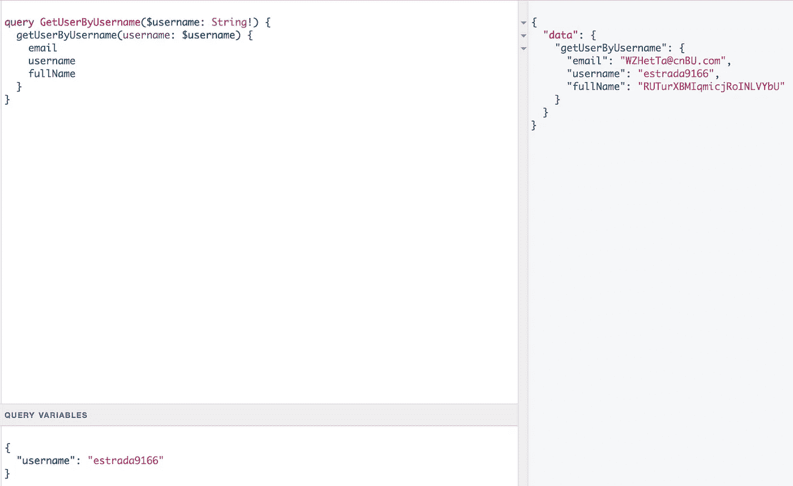

# 用几行代码创建 GraphQL 模式的模型

> 原文：<https://itnext.io/create-mocks-of-your-graphql-schema-with-few-lines-of-code-d368b0a2a359?source=collection_archive---------3----------------------->


[https://github.com/EasyGraphQL](https://github.com/EasyGraphQL)

现在您可以使用`[easygraphql-mock](https://www.npmjs.com/package/easygraphql-mock)`包创建 GraphQL 模式的模拟。要做到这一点，您只需要几行代码，让`[easygraphql-mock](https://www.npmjs.com/package/easygraphql-mock)`来完成剩下的工作。它将模仿你所有的字段，以及**嵌套**类型。

# 怎么做！

*   导入库`const mocker = require('easygraphql-mock')`
*   将`GraphQL`模式读作`schemaCode`
*   将`schemaCode`传递给上下文中的解析器。
*   将`schemaCode`传递给模仿器`const mock = mocker(schemaCode)`或`const mock = mocker(schemaCode, { typeName: { typeField: value } }` **TypeName** 将是模式上设置的类型，而 **TypeField** 是类型上的字段。
*   在解析器回路上`mock.typeName`

# 示例:

## GraphQL 模式:

```
type User {  
  email: String!  
  username: String!  
  fullName: String!
}type Query {
  getUserByUsername(username: String!): User
} 
```

## App.js

```
'use strict' const express = require('express')
const { buildSchema } = require('graphql')
const graphqlHTTP = require('express-graphql')
const bodyParser = require('body-parser')
const fs = require('fs')
const path = require('path')
const root = require('./schema/resolvers') const app = express() app.set('port', 7000)
app.use(bodyParser.json({limit:'10mb'}))
app.use(bodyParser.urlencoded({ extended: true })) const schemaCode = fs.readFileSync(path.join(__dirname, 'schema', 'schema.gql'), 'utf8')const schema = buildSchema(schemaCode) 
app.use('/graphql', (req, res) => {  
  graphqlHTTP({    
    schema,    
    rootValue: root,    
    graphiql: true,    
    context: { schemaCode }  
  })(req, res)
}) const server = app.listen(app.get('port'), () => {     
  console.log(`Server running -> PORT ${server.address().port}`)
}) module.exports = app
```

## 分解器

```
'use strict' const mocker = require('easygraphql-mock') const resolver = {  
  getUserByUsername: async (args, { schemaCode }) => {    
    const mock = mocker(schemaCode, {      
      User: {        
        username: args.username      
      }    
    })     

    return mock.User  
  }
} module.exports = resolver
```

在这种情况下，我们希望将用户名值设置为与参数中的值相同。

*   **TypeName =** 用户
*   类型字段 =用户名

## 结果



**完整演示:**https://github.com/EasyGraphQL/easygraphql-mock-demo

**Npm 包:**[https://www.npmjs.com/package/easygraphql-mock](https://www.npmjs.com/package/easygraphql-mock)