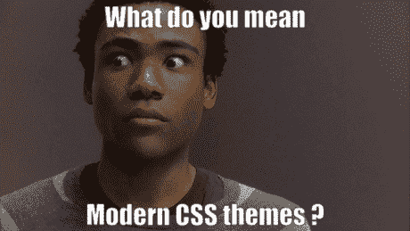

# 使用 ElectronCSS 0.10 新的框架不可知动态特性创建强大的动态主题和布局

> 原文：<https://itnext.io/create-powerful-dynamic-themes-and-layouts-using-electroncss-0-10-4c15654f9e7d?source=collection_archive---------4----------------------->



如果你曾经尝试过在 React 中创建主题，并且发现让它成为一个提供者相当困难，请举手。我看不到你的手，所以我假设你举起来了。

通常，尤其是如果你打算在 JS 中使用 CSS，当你试图为你的 CSS 应用提供主题时，你会遇到一个大问题。为什么？主要是因为你的 CSS 不像你漂亮的 JSX / ng 模板那样动态。我不打算深入描述 React 中的上下文 API，因为它在这里是以一种非常优雅的方式完成的:[https://reactjs.org/docs/context.html](https://reactjs.org/docs/context.html)，而且，令人惊讶的是，使用的例子是，我给你:CSS 主题。

现在，这不仅极大地膨胀了你的组件的代码，突然让一切都由`Consumer`组件驱动，而且这也使它非常固执己见，甚至可能影响性能。解决方案？这是对此的另一种理解:ElectronCSS 现在提出了一个动态的应用编程接口来解决这个问题。

# 入门指南

如果您还没有，您应该从[electronics 的入门文章](/stop-using-css-in-js-and-welcome-proper-styling-in-js-with-electron-css-d28536ba3e85)开始，以便设置您的环境。同样，如果你太懒，你可以用这个 JSFiddle:

# 如何使用它

创建动态属性集的第一步是建立一个您的类可以订阅的对象。

```
const Theme = DynamicCSS();
```

按照惯例，该对象被赋予一个 PascalCase 名称。您还可以为属性提供默认值:

```
const Theme = DynamicCSS({
  mainColor: color.red
});
```

现在我们有了主题，让我们在 CSS 中使用它:

```
const Theme = DynamicCSS({
  mainColor: color.red
});const myButton = CSS({
  backgroundColor: Theme.mainColor
});
```

你可能已经注意到 DynamicCSS 对象并不局限于实际的 CSS 属性，你可以把任何你需要的东西放在里面。你通常想要重构你的颜色代码，就像设计师用他/她自己的调色板那样，这样你就可以在任何地方重用它们。

最后，很明显，您会希望在某个地方使用 CSS 类:

```
const Theme = DynamicCSS({
  mainColor: color.red
});const myButton = CSS({
  backgroundColor: Theme.mainColor
});<div class={myButton}></div>
```

现在怎么办？嗯，这就是神奇之处。假设你的用户想把你的网站切换到夜间模式。您所要做的就是创建一个普通对象，其属性与您的夜间模式相匹配，并使用 Theme.use()来使用它。下面是一个工作示例:

顺便说一下，我已经谈了很多关于主题的内容，但是不要让这阻止你:DynamicCSS 还有很多其他的用途，例如对用户动作做出反应，比如滚动和鼠标移动。

## 使用和注射

有两种方法可以更新你的动态 css 属性。第一个版本，use()，正如我们之前看到的，将完全重置您的 CSS。

```
const Theme = DynamicCSS();
Theme.use({
  color: 'red',
  width: '1px'
})Theme.use({color: 'blue'}); // here the width will be removed from the theme
```

当你想为你的网站加载一个全局的主题/布局，并且你担心旧的属性会弄乱结果，因为新选择的主题实际上不会覆盖它们的时候，这是非常有用的。

在某些情况下，您可能想要加载主题进行更多的本地编辑。

```
const Theme = DynamicCSS();
Theme.use({
  color: 'red',
  width: '1px'
})Theme.inject({someThirdPartyProperty: '123px'});// here the width and color will remain the same
```

如果您有一个更模块化的方法，为特定组件(或第三方组件)提供子主题，这将非常有用。但是不要滥用它，因为它可能会导致意想不到的结果(什么都不会重置！).

# 它是如何工作的

在本文中，我选择更详细地介绍技术背景噪声。如果你对这部分不感兴趣，直接跳到结论！

## 规则

每当创建一个动态对象时，你基本上就创建了一个可观察的对象。它实际上有一个 subscribe()函数！

```
const test = DynamicCSS();// foo is a classname for who is subscribing
test.subscribe('foo', () => {
  console.log('ho ! ho !');
});test.refresh(); // ho ! ho !
```

但是有一个主要的区别:每次通知订阅者时，他们都会被取消订阅！继续阅读了解原因。

## 上层社会

每次你试图在 electronic 中刷新一个 CSS 对象时，它*不会*试图直接在样式表中编辑它:那会是太多的工作，因为你通常有多个规则集用于同一个类(伪元素，如:hover、containments、media-query 等……)，并且过滤所有潜在的候选对象需要遍历整个样式表。相反，ElectronCSS 将简单地交换元素的类名:

```
const test = DynamicCSS({
  foo: 'bar'
});const testCSS = CSS({
  color: test.foo
});console.log(testCSS.toString()) // .class0test.use({foo: 'notbar'});console.log(testCSS.toString()) // .class1
```

它会操纵你的 DOM 来应用这个新类。在呈现时，这个新类将根据它们的定义订阅您的 DynamicCSS 规则。

旧班级会发生什么？它们只是被 ElectronCSS 的内部垃圾收集器删除了！

# 结论

主题和布局有时令人头疼，你的堆栈越复杂，就越难在整个应用程序中正确地更新和传播你的 CSS 定制。就 CSS-in-JS 代码质量而言，electronicss 提出了一个既直观又符合 electronicss 标准的解决方案。如果掌握得好，它将允许重要的 UI 库提供非常灵活的主题选项，而不会牺牲易用性和直观性。

感谢阅读！让我知道你的想法，非常感谢你的反馈！

 [## 扬·斯特皮尼克(@斯特皮尼克)|推特

### Yann Stepienik (@stepienik)的最新推文。土豆工程。纽约州纽约市

twitter.com](https://twitter.com/stepienik)