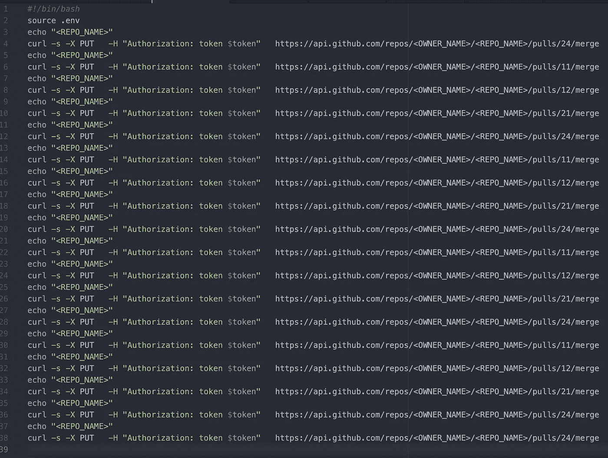

# 创建 Pull 请求，然后从命令行合并多个 GitHub Repos

> 原文：<https://itnext.io/create-pull-requests-and-then-merge-multiple-github-repos-from-the-command-line-ceef76c3cf65?source=collection_archive---------6----------------------->


我试图解决的问题是:如何为多个 GitHub 仓库创建 PRs，然后通过 CLI 合并这些仓库——而不使用 GitHub UI！

我决定利用 GitHub 的 [Hub](https://hub.github.com/) ，GitHub 将其描述为“命令行 git 的扩展”来创建 pull 请求，然后使用 GitHub 的 [API 来合并这些 pr。](https://developer.github.com/v3/pulls/#merge-a-pull-request)我在 Mac 上工作，所以我用 Brew 安装了 Hub: `brew install hub`

为了解决这个问题，我开发了这个 Bash 脚本来创建 Pull 请求(注意，小于/大于括号`<>`中的任何内容都需要修改以匹配您的设置):

```
#!/bin/bashdate=$(date +%F-%H)
curdir=$(pwd)
echo '#!/bin/bash' >> merge_all-${date}.sh
echo 'source .env' >> merge_all-${date}.sh
for path in */<path_goes_here>*
do
  [[ ! -d "$path" ]] && continue
  echo "$path"
  cd "$path"
  pr=$(hub pull-request --base <OWNER>:<base_branch> --head <branch_with_changes> -m "helpful message goes here")
  echo "$pr"
  repo=$(echo "$pr" | awk -F "/" {'print $5'})
  pull_number=$(echo "$pr" | awk -F "/" {'print $7'})
  cd $curdir
  echo "echo \"$repo\"" >> merge_all-${date}.sh
  echo "curl -s -X PUT \
  -H \"Authorization: token \$token\" \
 [https://api.github.com/repos/<OWNER>/$repo/pulls/$pull_number/merge](https://api.github.concur.com/repos/SM/$repo/pulls/$pull_number/merge)" >> merge_all-${date}.sh
done
```

这个脚本位于包含几个 repos 的目录的根目录下。它使用`$path`变量遍历目录，创建 PR，然后将 PR 添加到根目录下生成的新脚本中。生成的脚本将被称为`merge_all-<Date_of_Execution>.sh`，并将包含几个 curl 命令，这些命令使用 GitHub API 来合并 PRs。为了给同行评审留出时间，我将拉取请求和合并分离到不同的脚本中。

请注意，GitHub API 需要一个授权令牌，您可以按照 GitHub 的[文档](https://docs.github.com/en/github/authenticating-to-github/creating-a-personal-access-token)来设置它。这个令牌需要放在一个`.env`文件中，该文件也位于根目录下。下面是那个`.env` 文件的样子:

```
token=“<GitHub_Token_Goes_Here>”
```

如果在运行拉请求创建脚本后一切顺利，您应该有一个类似如下的脚本:



如果这对你有所帮助，那么恭喜你省下了在 GitHub GUI 中手动合并单个回购的时间🙂