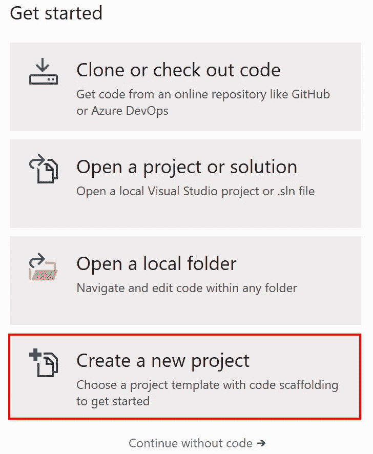
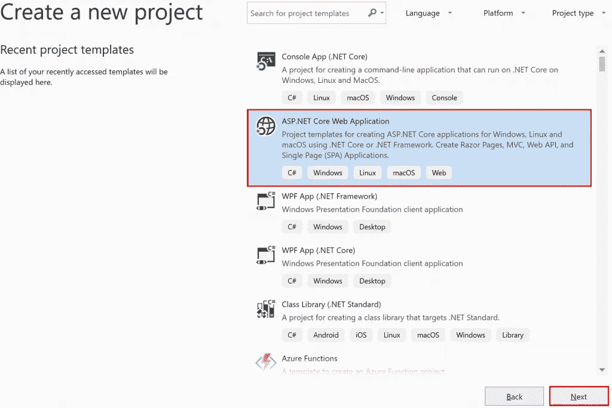
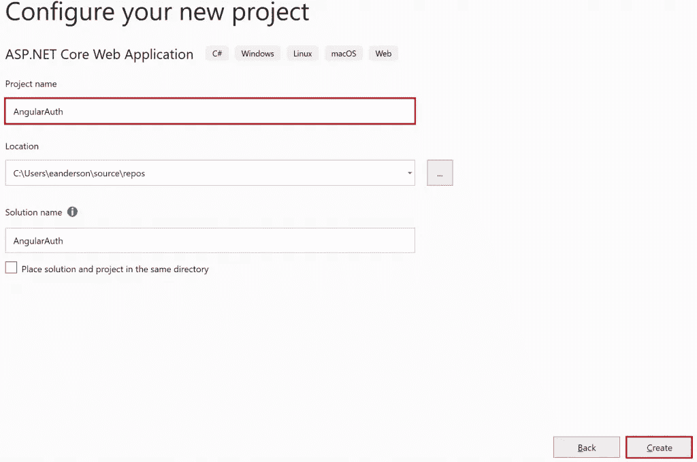
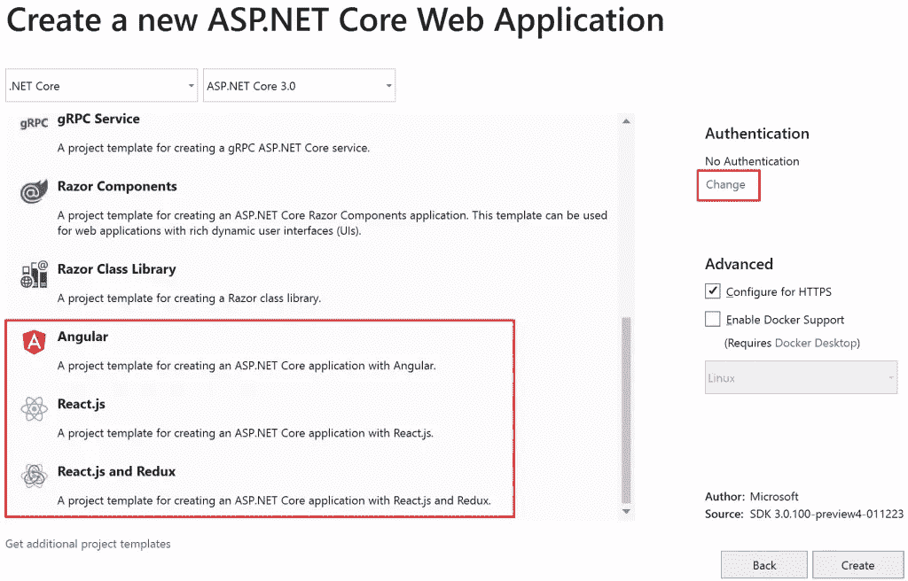
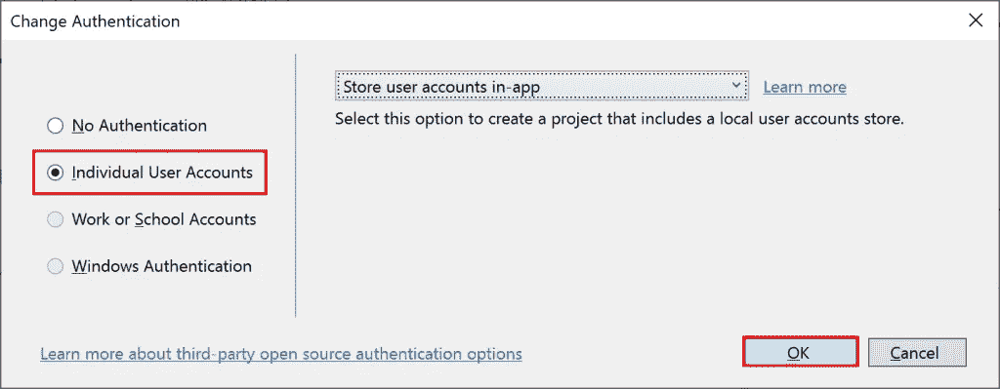

# 通过身份验证从 Visual Studio 创建 React 或 Angular 应用程序

> 原文：<https://itnext.io/create-react-or-angular-application-from-visual-studio-with-authentication-c7fb2eacd2ef?source=collection_archive---------11----------------------->

拥有为新应用程序提供良好起点的模板是微软所提供价值的重要组成部分。没有什么比花一周的时间去寻找建立一个项目的推荐方法更能扼杀进度的了。谢天谢地，模板是微软继续投资的一个领域。

几周前，在我的[ASP.NET Core 3:React Template with Auth](https://elanderson.net/2019/03/asp-net-core-3-react-template-with-auth/)帖子中，我使用。NET CLI。在这篇文章中，我们将使用 Visual Studio 中的 Auth 创建一个 Angular 应用程序。

## 必需的安装

写这篇文章的时候[。NET Core 3 预览版 4](https://devblogs.microsoft.com/dotnet/announcing-net-core-3-preview-4/) 刚刚发布，所以请确保您安装了最新的预览版。另外，确保安装最新的 Visual Studio 的[预览版。本帖截图将来自 Visual Studio 2019 16.1.0 预览版 1 发布。确保至少安装了 ASP.NET 和 web 开发工作负载。](https://visualstudio.microsoft.com/vs/preview/)

## 项目创建

打开 Visual Studio，从左侧的**开始**区域点击**创建一个新项目**。

在下一个屏幕上，选择**ASP.NET 核心网络应用**项目类型，并点击**下一步**。

在下一个屏幕上，至少输入一个**项目名称**并点击**创建**按钮。

在下一个屏幕上，选择您想要使用的模板。我将选择 **Angular** ，但是相同的认证设置将适用于 **React** 或 **React 和 Redux** 模板。在屏幕右侧的**认证**下选择您的模板类型后，点击**更改**链接。

选择**个人用户账户**并点击**确定**。

在**更改认证**对话框关闭后，点击模板选择对话框上的**创建**按钮。

几分钟后，应用程序就可以运行了。您需要做的另一个步骤是应用实体框架迁移。这可以通过。或者首次尝试在调试模式下注册帐户时，系统会提示您应用迁移。

## 包扎

我不确定我是不是一个人在这样做，但是看到微软投入时间让每个版本的入门体验变得更好，我感到非常兴奋。有了由 API 支持的 SAP 的现成身份验证，项目的开始变得非常简单。

*原载于***。**