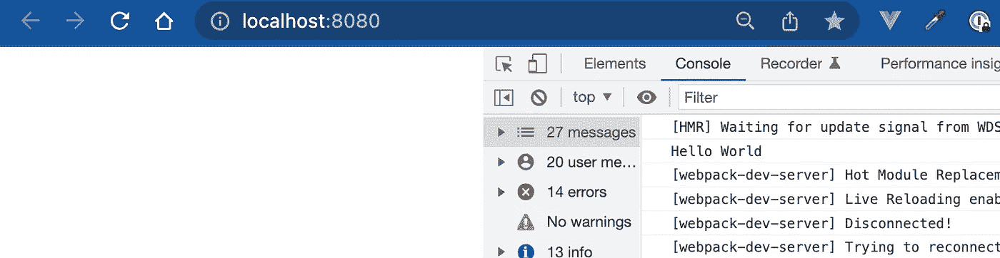
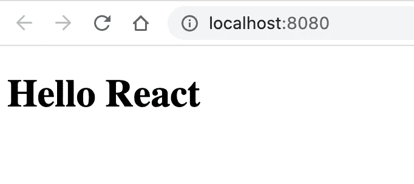
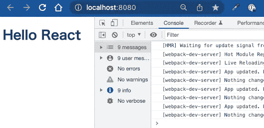

# 使用 webpack 和 Babel 创建 React v18 TypeScript 项目

> 原文：<https://itnext.io/create-react-typescript-project-with-webpack-and-babel-2431cac8cf5b?source=collection_archive---------0----------------------->


使用 create-react-app，您可以非常方便地设置 React TypeScript 项目。但是，如果您预测您的应用程序会变大，该怎么办呢？你会面临许多问题。例如，你需要多个入口点，性能调优，传输到 2022 年的 ES5。

在这种情况下，最好从一开始就使用 webpack 和 Babel。我知道它们是软件工程师不想碰的东西，因为它不是应用程序代码。这只是一个捆绑配置。但是因为看起来很难很无聊，反而加速了你的工程师价值！

因此，让我们从头开始一步一步地学习捆绑配置。

事实上，我在 2020 年写了[一篇类似的文章，这篇文章是反映技术更新的重写版本。](https://medium.com/swlh/2020-settings-of-react-typescript-project-with-webpack-and-babel-403c92feaa06)

# 概观

目标是建立 React 类型脚本项目。要求如下。

*   使用 React with TypeScript
*   使工程师能够编写 ESNEXT 类型脚本
*   捆绑代码必须是 ES5-
*   开发时的实时类型检查

因为 IE11 退役日期是 2022 年 6 月 15 日，所以你们大部分人不需要 E55(我希望)设置。但是运输知识仍然值得学习📝

这些是达到要求的步骤

1.  用 webpack 捆绑 JavaScript
2.  介绍反应
3.  传输和聚合填充至 ES5
4.  添加类型脚本

# 用 webpack 捆绑 JavaScript

首先，让我们初始化你的目录。你可以跳过所有的问题。

```
❯ yarn init
yarn init v1.22.17
question name (bundle): test
question version (1.0.0):
question description:
question entry point (index.js):
question repository url:
question author:
question license (MIT):
question private:
success Saved package.json
✨  Done in 91.17s.
```

那我们就来装一个今天的主角， [webpack](https://webpack.js.org/) ！webpack 是一个模块捆绑器。它解决依赖关系并将文件捆绑到一个文件中。

因为 webpack 提供了称为 webpack dev server 和 webpack-cli 方便的包，所以让我们也安装它们。

*   webpack 开发服务器:热加载的开发服务器
*   web pack-cli:web pack 命令的 CLI 工具

```
❯ yarn add -D webpack webpack-cli webpack-dev-server
```

接下来你应该做的是创建`webpack.config.js`文件。这个文件是 webpack 和您的代码之间的主要连接点。请参见下面的配置。

```
// webpack.config.js
const path = require('path')module.exports = {
  entry: './src/main.js',
  output: {
    path: path.resolve(__dirname, './dist'),
    filename: 'bundle.js'
  },
  devServer: {
    static: {       
      directory: path.resolve(__dirname, './dist')
    }
  }
}
```

有三个主要键，entry、output 和 devServer。当您构建时，webpack 会将您的。/src/main.js 并在。/dist 目录。

另一方面，当您运行 dev 服务器时，会使用 devServer 配置。

实际上，您已经准备好捆绑 js 文件了。让我们试一试。请将 src 设置为 director 和。/src/main.js 文件。写下这个。它现在必须是 JavaScript 文件，因为没有用于 transpile TypeScript 的配置。

```
// ./src/main.jsconsole.log('Hello World');
```

为了进行编译，让我们向 package.json 添加一些命令。

```
{
  // ...
  "scripts": {
    "dev": "webpack serve",
    "build": "webpack --mode production --progress --hide-modules"
  }
  // ...
}
```

最后，用 bundle.js 的脚本标签在`/dist`中创建一个简单的 html 文件，如果没有这个脚本标签，你捆绑的 js 文件将永远不会被读取。

```
// dist/index.html
<!DOCTYPE html>
<html>
  <head>
    <meta charset="utf-8">
    <meta name="viewport" content="width=device-width,initial-scale=1.0">
    <title>TITLE HERE</title>
  </head>
  <body>
    <script src="./bundle.js"></script>
  </body>
</html>
```

回到命令行并键入`yarn dev`。请打开`http://localhost:8080`和 chrome 开发工具。如果你能看到“你好世界”，干得好！



图:使用 webpack 检查初始设置

# 介绍反应

我知道你们想开发一个很酷的应用。所以让我们加上 React。

```
yarn add react react-dom
```

*   `react`是用于定义组件和处理虚拟 DOM 的东西
*   `react-dom`提供了一些与浏览器 DOM 交互的方法。

如你所知，仅仅安装 React 是不够的，因为不可能编译 React JSX。webpack 只是一个捆绑器。没有功能来改变 JSX 的反应。所以是时候用巴别塔了！

Babel 是一个可以编译代码的编译器。举个例子，

*   从新 JavaScript (ESNext)到旧 JavaScript (ES5)
*   从 React JSX 和 Vue SFC 到普通 JavaScript。

首先，让我们创建巴别塔的初始设置！巴别塔的核心图书馆是`@babel/core`。使用 Babel 搭配 webpack，需要使用`babel-loader`。

```
yarn add -D @babel/core babel-loader
```

然后将 babel-loader 添加到 webpack 配置中。如果您想添加加载器，您必须添加一个配置到`module.rules`。

```
// webpack.config.js
const path = require('path')module.exports = {
  ...
  module: {
    rules: [
      {
        test: /\.(js)x?$/,
        exclude: /node_modules/,
        use: {
          loader: 'babel-loader',
        },
      },
    ],
  },
  resolve: {
    extensions: ['.jsx', '.js'],
  },
}
```

就是这样！从这里开始，可以编写复杂的配置。

所以让我们添加 React 编译配置。要变身反应 JSX，你需要`@babel/preset-react`。

```
yarn add -D @babel/preset-react
```

然后在根目录下创建`babel.config.json`。

```
// babel.config.json{
  "presets": [
    "@babel/preset-react"
  ]
}
```

现在 react transpilation 过程被添加到您的 webpack 捆绑包过程中！让我们试试 react 代码，重写`src/main.js`。

```
// src/main.js
import React from 'react';
import { createRoot } from 'react-dom/client';
import { App } from './App';createRoot(document.getElementById('app'))
  .render(<App />);
```

然后加上`App.jsx`！

```
// src/App.jsx
import React from 'react';export const App = () => (
  <h1>Hello React</h1>
);
```

除了第一个 react 组件之外，因为 react 试图挂载在 id 为`#app`的 html 标签上，所以请在 html 中添加 div 标签。

```
// dist/index.html<!DOCTYPE html>
<html>
  <head>
    ...
  </head>
  <body>
    <div id="app" />                       // add here
    <script src="./bundle.js"></script>
  </body>
</html>
```

除了 babel config，建议写一个`.jsx`和`.js`的解析器配置。有了它，你可以像写`import App from "./App";`而不是`import App from “./App.jsx”`一样写导入；

```
// webpack.config.js
const path = require('path')module.exports = {
  ...
  resolve: {
    extensions: ['.jsx', '.js'],
  },
}
```

现在你可以在你的应用中使用 react 了，用`yarn dev`检查一下！



图:React 的初始设置

# 传输和聚合填充至 ES5

到目前为止，您的 JavaScript 文件是用 ES6+编写的。例如`App.jsx`中使用了箭头功能。这意味着您的应用程序不能在旧的浏览器中工作。

要让应用程序在旧浏览器中工作，必须做两件事。

1.  将 ES6+代码转换为 ES5-
2.  聚合填料

Transpile 很好理解。把新的 JavaScript 替换成旧的 JavaScript 就行了。

```
// ES6
const sayHello = () => ("hello")↓ Transpile// ES5function sayHello(){
  return "hello";
}
```

Polyfill 有点不同。它重现了浏览器没有的缺失功能。比如`Array.prototype.find`从 ES6 开始出现。表示`Array.prototype.find`没有 ES5 版本。

有了巴别塔，transpile 和 polyfill 就没那么难了。首先，请安装一些模块。

```
yarn add -D @babel/preset-env core-js regenerator-runtime
```

关键模块是`@babel/preset-env`和`core-js`。因为 JavaScript 发展如此之快，数百个特性必须被转换和填充。但幸运的是，`@babel/preset-env`是一个智能 transpile 预置，涵盖了大部分功能。而`core-js`是 polyfill 预置。当你使用`@babel/preset-env`和`core-js`不支持的功能时，是时候考虑使用插件了。`regenerator-runtime`是为了承诺。

尽管清楚地理解它们很费时间，但配置很容易。

```
// babel.config.json{
  "presets": [
    [
      "@babel/preset-env",
      {
        "useBuiltIns": "usage",
        "corejs": 3
      }
    ],
    "@babel/preset-react"
  ],
}
```

当你使用`@babel/preset-env`时，应该指定两个。对于`corejs`，应该指定 3，因为它是维护的。`useBuiltIns`定义如何添加聚合填充代码。你有如下两种选择。

1.  `usage`:将此文件中使用且目标环境不支持的特征的聚合填充添加到每个文件导入的顶部
2.  `entry`:替换`core-js`的导入，只导入目标环境模块所需。

为了减小束尺寸，`usage`更好。

要检查您的应用程序代码是否成功传输和填充，您可以构建并查看 ES6+功能是否不存在。

# 添加类型脚本

到目前为止，React、webpack 和 Babel 已经设置得很完美了。但是我猜你们大多数人都想使用 TypeScript，因为它可以加快开发速度，减少 bug。所以让我们添加打字稿

要添加 TypeScript，您有两种编译选择。

1.  TypeScript 编译器(tsc)将 TS 转换为 ES5 JS。tsc 也做类型检查
2.  巴别塔隧道。tsc 进行类型检查

本文解释了第二种选择，因为 Babel transpiling 比 tsc 有更大的灵活性。另外，责任明确。

*   巴别塔在运输上有责任
*   tsc 负责类型检查

因此，首先尝试设置 Babel 类型脚本传输！

```
yarn add -D [@babel/preset-typescript](http://twitter.com/babel/preset-typescript)
```

`@babel/preset-typescript`是 TypeScript 的超级预置。因为它没有涵盖 TypeScript 的所有特性，所以如果需要额外的特性，请添加插件，比如 const enum。

配置很简单。只需将模块添加到`babel.config.json`即可。

```
// babel.config.json{
  "presets": [
    "@babel/preset-typescript", // add here
    [
      "@babel/preset-env",
     ...
}
```

就是这样！Babel 类型脚本传输设置完成🎉

因为设置完成了，我们用 TypeScript 写 React app 吧！要用 TypeScript 编写 react，应该添加它们的类型声明。

```
yarn add -D [@types/react](http://twitter.com/types/react) [@types/react-dom](http://twitter.com/types/react-dom)
```

所以还是把 app 代码改成 TypeScript 吧！。首先，将文件名`main.ts`改为`Index.tsx`。因为`main.ts`有 JSX ( `<App />`，所以造成了打字错误。为了防止空类型错误，在 Index.tsx 中添加空检查。

```
// src/Index.tsx
import React from 'react';
import { createRoot } from 'react-dom/client';
import { App } from './App';const rootNode = document.getElementById('app');if(rootNode){
  createRoot(rootNode)
    .render(<App />);
}
```

下一个`App.jsx`。将文件扩展名改为`.tsx`。然后，键入 App.tsx。

```
// App.tsx
import React from 'react';export const App: React.FC = () => (
  <h1>Hello React</h1>
);
```

因为本文不关注类型系统，所以省略了对具体实现的解释。

最后，添加 webpack 配置。

```
// webpack.config.js
const path = require('path')module.exports = {
  entry: './src/Index.tsx', // Changed the entry file name
  ...  
  module: {
    rules: [
      {
        test: /\.(js|ts)x?$/,    // add |ts
        exclude: /node_modules/,
        use: {
          loader: 'babel-loader',
        },
      },
    ],
  },
  resolve: {
    extensions: ['.tsx', '.ts', '.jsx', '.js'], // add .tsx, .ts
  },
  ...
}
```

如果你现在尝试`yarn dev`，你可以看到和以前一样的屏幕，没有控制台错误！



到目前为止，您可以传输 TypeScript 文件，但是检测类型错误并非不可能。所以让我们添加类型检查！

首先加上`typescript`。

```
yarn add -D typescript
```

当您将`typescript`添加到项目中时，您应该创建`tsconfig.json`。

```
// tsconfig.json{
  "compilerOptions": {
    "target": "ESNext",
    "module": "umd",
    "lib": [
      "ESNext",
      "dom"
    ],
    "jsx": "react",
    "noEmit": true,    
    "sourceMap": true, /* Strict Type-Checking Options */
    "strict": true,
    "noImplicitAny": true,
    "strictNullChecks": true,

    /* Module Resolution Options */
    "moduleResolution": "node",
    "forceConsistentCasingInFileNames": true,
    "esModuleInterop": true
  },
  "include": ["src"]
}
```

设置完成！

因为 Babel 确实会转换文件，`noEmit`应该是真的，`target`不一定是旧的 JavaScript。另外，因为你想使用 DOM 最新的 JavaScript/TypeScript 特性，`lib`包括`ESNext`和`dom`。而`jsx`应该是`react`。类型检查规则应该根据您的需要进行定制。但我建议`strict`选项为真。

现在，您可以方便地添加类型检查命令。

```
// package.json
{
  ...,
  "scripts": {    
    "dev": "webpack serve",
    "build": "webpack --mode production --progress --hide-modules",
    "tscheck": "tsc" // add here
  }
  ...
}
```

如果运行`yarn tscheck`，tsc 会检测到类型错误，如下所示。

```
❯ yarn tscheck
yarn run v1.22.17
$ tsc
✨  Done in 1.97s.
```

如果你想尽快得到一个类型错误，你可以添加`-w`选项。它会观察你的代码变化，并通知类型错误。

```
❯ yarn tscheck -w
```

本文解释了 React TypeScript 项目与 webpack 和 Babel 的设置。在设置了一个包配置之后，我强烈推荐设置`eslint`和`prettier`来格式化你的类型脚本以加速你的开发！

[](https://egctoru.medium.com/auto-format-with-eslint-and-prettier-for-react-typescript-project-6526a9d44f81) [## React TypeScript 项目的 ESLint 和更漂亮的自动格式

### 自动格式化是 DX 的一大改进。它节省了您的开发时间，并大大提高了您的生产力…

egctoru.medium.com](https://egctoru.medium.com/auto-format-with-eslint-and-prettier-for-react-typescript-project-6526a9d44f81) 

谢谢大家！

# 参考

*   [打字稿](https://www.typescriptlang.org/)
*   [反应](https://reactjs.org/)
*   [网络包](https://webpack.js.org/)
*   [巴别塔](https://babeljs.io/)