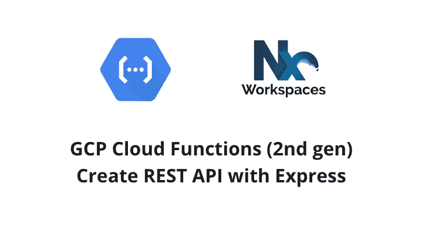

# 使用 Express 和第二代 GCP 云功能创建 REST APIs

> 原文：<https://itnext.io/create-rest-apis-with-express-2nd-gen-gcp-cloud-functions-d244dd9a4717?source=collection_archive---------1----------------------->



用 Express 创建 REST API

> 注意:第二代包含在谷歌云服务条款的[预发布条款](https://cloud.google.com/terms/service-terms#1)中。请避免在产品中使用它，直到它完全发布。

[快速浏览:部署第二代 GCP 云功能与 Nx Workspace](/deploy-2nd-gen-gcp-cloud-functions-with-nx-workspace-5d75fcf21566)[云功能本地测试&开发](https://dalenguyen.medium.com/2nd-gen-cloud-functions-local-testing-development-7c518f7bd0b1)
[**创建 REST APIs 与 Express &第二代 GCP 云功能**](https://dalenguyen.medium.com/create-rest-apis-with-express-2nd-gen-gcp-cloud-functions-d244dd9a4717)[完美匹配:NestJs &云功能(第二代)&Nx Workspace](https://dalenguyen.medium.com/a-perfect-match-nestjs-cloud-functions-2nd-gen-nx-workspace-f13fb044e9a4)
[GCP 云功能(第二代)发布/订阅](https://dalenguyen.medium.com/gcp-cloud-functions-gen-2nd-pub-sub-development-testing-2c498fa4464e)

## 创建新项目

在名称`ng-ssr`下创建一个节点项目——如果需要，您可以更改它。

```
npx nx g [@nrwl/node](http://twitter.com/nrwl/node):application ng-ssr
```

## 安装依赖项

```
yarn add express
```

**添加&服务简单快捷 App**

```
// main.tsimport { http } from '[@google](http://twitter.com/google)-cloud/functions-framework'
import * as express from 'express'export const app = express()app.get('/', (req, res) => {
  res.send('hello world')
})http('api', app)
```

过程很简单。这就是创建具有云功能的 Express 服务器(第二代)所需的全部内容

```
// run these two commands in a separate terminals
yarn watch:ssr
yarn build ng-ssr --watch
```

那么您的云功能将在 [http://localhost:8080](http://localhost:8080) 下提供

```
dalenguyen$ yarn watch:ssr
yarn run v1.22.17
$ nodemon --watch ./dist/apps/ng-ssr --exec yarn serve:ssr
[nodemon] 2.0.15
[nodemon] to restart at any time, enter `rs`
[nodemon] watching path(s): dist/apps/ng-ssr/**/*
[nodemon] watching extensions: js,mjs,json
[nodemon] starting `yarn serve:ssr`
$ functions-framework --target=api --source ./dist/apps/ng-ssr/
Serving function...
Function: api
Signature type: http
URL: [http://localhost:8080/](http://localhost:8080/)
```


## 部署云功能(第二代)

```
dalenguyen$ yarn deploy:ssr
yarn run v1.22.17
$ nx run ng-ssr:deploy --gcpProject sherpa-labPreparing function...
.done.
Deploying function...
[Build]......
serviceConfig:
  allTrafficOnLatestRevision: true
  availableMemory: 256M
  ingressSettings: ALLOW_ALL
  maxInstanceCount: 100
  revision: ssr-00001-jar
  service: projects/sherpa-lab/locations/us-central1/services/ssr
  serviceAccountEmail: [00000-compute@developer.gserviceaccount.com](mailto:00000-compute@developer.gserviceaccount.com)
  timeoutSeconds: 60
  uri: [https://ssr-0000000-uc.a.run.app](https://ssr-0000000-uc.a.run.app)
state: ACTIVE
updateTime: '2022-03-28T01:34:37.343273630Z'————————————————————————————————————————————————————————————————————>  NX   Successfully ran target deploy for project ng-ssrSee Nx Cloud run details at [https://nx.app/runs/00000](https://nx.app/runs/00000)✨  Done in 87.12s.
```

部署完成后，您的云功能就可以服务了(通过 HTTP 请求)