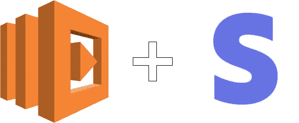
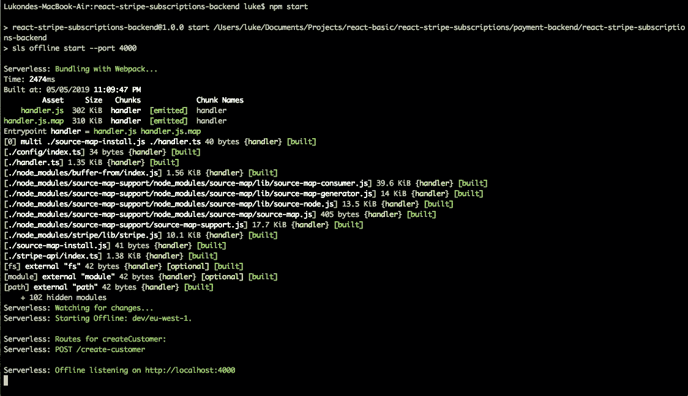

# 使用 React & AWS Lambda Pt 1:设置 Lambda 服务创建条带订阅支付

> 原文：<https://itnext.io/create-stripe-subscription-payments-using-react-aws-lambda-pt-1-setting-up-the-lambda-service-4e26501d30e0?source=collection_archive---------4----------------------->


随着 SaaS 产品继续占领世界，使用户能够轻松进行定期结算交易的网络应用程序变得越来越流行。这种在线支付处理是事件驱动架构的完美用例，就像无服务器设置提供的架构一样。

在这个由两部分组成的系列中，我将介绍如何使用[无服务器](https://serverless.com/)框架和 [AWS lambda](https://aws.amazon.com/lambda/) 来设置 Lambda 函数。然后，我们将能够向我们的 lambda 服务提交一个请求，以创建与我们在线订阅产品时所期望的相同的功能。我们的 lambda 函数将执行以下任务:

1.  为用户创建条带客户帐户
2.  为创建的客户订阅产品计划

# **创建一个条纹账户**

正如你可能已经猜到的，你将需要一个可以使用的 [Stripe](https://stripe.com/) 账户。设置不应该是一个麻烦，只是通常的注册材料。一旦您完成登录，请前往左侧菜单中的**账单**部分。您可以继续操作并单击“Billing ”,之后您会看到一个选项下拉列表，其中有一个指向**产品**页面的链接。导航到产品页面，创建一些产品和产品计划。如果你遇到一些问题，这篇短文[应该可以提供指导。](https://help.clickfunnels.com/hc/en-us/articles/360006017074-Setting-Up-A-Stripe-Subscription-Product)

在创建了几个产品和它们各自的产品计划后，点击同一个左侧菜单中的**开发者**部分。您会注意到在出现的下拉选项中有一个到 **API 键**的链接。记下你的*可公开* *密钥*和你的*秘密* *密钥*，因为你将在这个小应用程序的不同部分需要它们。

# **建立我们的 Lambda 服务**



让我们从全局安装[无服务器](https://www.npmjs.com/package/serverless)框架开始:

```
$ npm install -g serverless
```

如果您还没有一个 [AWS 帐户](https://aws.amazon.com/)，您将需要创建一个。一旦你完成了所有的设置，创建一个 [IAM](https://aws.amazon.com/iam/) 用户配置文件，并将用户凭证保存在一个安全的地方。然后，您可以使用无服务器配置文件，如下所示:

```
$ sls config credentials --provider aws --key 1234 --secret 5678
```

一旦完成，你就可以进入 lambda 所在的本地目录或文件夹。无服务器框架附带了许多很酷的模板，我们可以用它们来为我们的服务生成一些样板代码。我选择使用 **aws-nodejs-typescript** 模板**。**因此，我们的下一步是运行无服务器命令(*无服务器*或 *sls* )，这将创建一个新服务:

```
*# Create a new Serverless Service/Project*$ sls create --template aws-nodejs-typescript --path react-stripe-subscriptions-backend*# Change into the newly created directory*$ cd react-stripe-subscriptions-backend
```

此时，您应该有一个完整的无服务器应用程序结构，默认的 **handler.ts** 文件如下所示:

如果您在 IDE 或代码编辑器中看到一些林挺错误，那可能是因为我们缺少了一些依赖项，所以现在让我们来解决这个问题。我们还将安装条带节点库，这是我们的服务所需的主要模块:

```
$ npm i --save aws-lambda node stripe
```

我们希望能够在部署之前离线运行我们的服务，这样当您使用它时，您可以安装**无服务器离线**:

```
$ npm i --save-dev serverless-offline
```

如果您和我一样，喜欢使用熟悉的 CLI 命令(本例中为 npm ),您可以通过添加另一个脚本来更新您的清单文件(package.json ),这样您就能够使用 **npm start** 命令离线启动您的服务:

```
"scripts": { "start": "sls offline start --port 4000", "test": "echo \"Error: no test specified\" && exit 1"}
```

接下来，我们需要通过将 serverless-offline 列为我们的插件之一来更新我们的 **serverless.yml** 文件中的一些配置，包括我们的处理函数的一些细节和指定我们服务的区域。

```
service: name: react-stripe-subscriptions-backend# Add the serverless-webpack pluginplugins: - serverless-webpack - serverless-offline provider: name: aws runtime: nodejs8.10 region: eu-west-1 functions: createCustomer: handler: handler.createCustomer events: - http: method: post path: create-customer cors: true
```

我知道你在想什么“我们什么时候开始有趣的事情？”坚持住，我们快到了。

让我们更新当前的 handler.ts 文件，让这个 **createCustomer** 函数在我们的 yaml 配置文件中指定。该函数将接收三个参数:

1.  *stripeToken* —包含客户账单和地址详细信息的令牌
2.  *电子邮件* —创建 Stripe 客户账户的用户的电子邮件地址
3.  *产品计划* —客户正在订阅的产品计划的 id

下一步，让我们用包含函数**createCustomerAndSubscribeToPlan**的文件创建一个文件夹 a，该函数将利用条带库并处理客户和产品订阅的创建。

一旦你有了这个函数，我们的 **createCustomer** lambda 就可以运行了🎉

为了确保一切正常，您可以尝试使用 **npm start** 在本地运行它



如果你对你所看到的感到满意(在这一点上不会太多🤔)，您可以使用以下命令部署 lambda 函数:

```
$ sls deploy
```

伙计们，现在就到这里吧😃。在这篇文章的后续部分，我将一步一步地指导如何[创建一个使用我们刚刚创建的 lambda 函数的 React 前端应用](https://medium.com/@outlier.developer/create-stripe-subscription-payments-using-react-aws-lambda-pt-2-building-our-react-frontend-28a6a167f7b9)，敬请关注！

你可以在 https://github.com/LukeMwila/stripe-subscriptions-backend[的](https://github.com/LukeMwila/stripe-subscriptions-backend)找到这个帖子的代码

如果你喜欢这篇文章，请在☕️给我买杯咖啡😃。