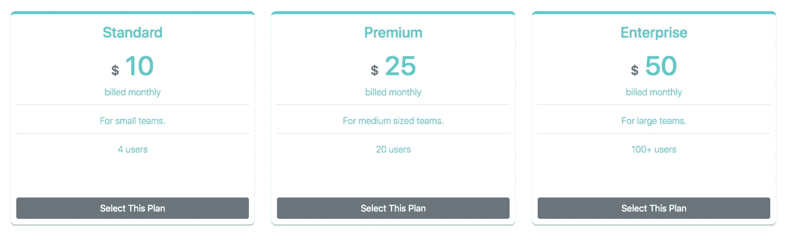
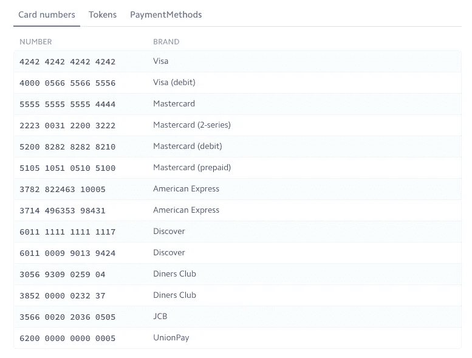

# 使用 React & AWS Lambda Pt 2 创建条带订阅支付:构建我们的 React 前端

> 原文：<https://itnext.io/create-stripe-subscription-payments-using-react-aws-lambda-pt-2-building-our-react-frontend-28a6a167f7b9?source=collection_archive---------1----------------------->


在我们开始之前，让我们快速回顾一下。我们正在构建一个基本的应用程序，模仿我们在大多数 SaaS 网站上订阅他们的特定产品计划时通常会发现的功能，我们正在使用 [Stripe](https://stripe.com/) 来处理在线支付处理。

正如我上次在提到的[，我们将使用以下技术(或技术堆栈)来构建这种体验:](/create-stripe-subscription-payments-using-react-aws-lambda-pt-1-setting-up-the-lambda-service-4e26501d30e0)

1.  [无服务器](https://serverless.com/) + [AWS Lamda](https://aws.amazon.com/lambda/) —用于部署一个云功能，该功能将在 Stripe 中为用户创建一个新的客户帐户，然后让他们订阅所选的产品计划。
2.  React —用于构建一个简单的 UI，允许我们创建自己的 Stripe 帐户并选择产品计划。

在 [**第 1 部分**](/create-stripe-subscription-payments-using-react-aws-lambda-pt-1-setting-up-the-lambda-service-4e26501d30e0) 中，我演示了如何使用无服务器框架创建 lambda 服务，如何让它在本地运行，并最终将其部署到 AWS Lambda。在这篇文章中，我们将继续用 React 构建我们的前端应用程序。

# **创建 React 应用**

我们将使用脸书的 **create-react-app** 样板来完成这项任务。您可以按照下面的命令安装它，以启动并运行 React 应用程序:

```
$ npx create-react-app react-stripe-subscriptions-frontend
$ cd react-stripe-subscriptions-frontend
$ npm start
```

既然我们已经完成了第一步，我们还需要安装一些依赖项。如果你计划使用 *npm* 作为你的包管理器，那么你应该删除你的 *yarn.lock* 文件以避免拥有 2 个锁文件。

我想利用 [**TypeScript 的**](https://www.typescriptlang.org/) 静态类型检查，并安装 [**reactstrap**](https://reactstrap.github.io/) 和 [**样式化组件**](https://www.styled-components.com/) 用于样式化。

```
$ npm  i --save bootstrap reactstrap react-stripe-checkout styled-components
$ npm i --save-dev typescript @types/react @types/react-dom @types/reactstrap @types/styled-components
```

搞定了吗？很好，现在让我们通过修改我们的 **index.js** 和 **App.js** 文件将 TypeScript 带入游戏领域。为此，将这两个文件的扩展名改为**。tsx，**，然后更新每个文件内容以匹配以下内容:

**index.tsx** 文件

```
import * as React from "react";import * as ReactDOM from "react-dom";import App from "./App";import * as serviceWorker from "./serviceWorker";/** Bootstrap */import "bootstrap/dist/css/bootstrap.css";ReactDOM.render(<App />, document.getElementById("root"));// If you want your app to work offline and load faster, you can change// unregister() to register() below. Note this comes with some pitfalls.// Learn more about service workers: https://bit.ly/CRA-PWAserviceWorker.unregister();
```

**App.tsx** 文件

```
import * as React from "react";const App: React.FC<{}> = () => { return <div>Subscribe to product</div>;};export default App;
```

一旦你完成了这些，你就可以删除不用的样板代码，比如 **index.css** 、 **App.css** 和 **logo.svg** 。我们的应用程序应该编译得很好，并且运行本地服务器应该会向 DOM 呈现一个空白页面，除了我们的 **App.tsx** 文件中的基本文本“Subscribe product”之外，什么也没有。

# **制定产品计划页面**

这没什么新奇的，但下面的页面是我们将要开发的，以及订阅这些计划中任何一个的功能。您可以添加任意数量的套餐，具体取决于您从测试帐户的 Stripe dashboard 中创建的定价计划的数量。



在 **src** 目录中，我们将有如下的文件夹结构:

```
├── [@types](http://twitter.com/types)
├── Components
├── Theme
└── Utils
```

在**主题**文件夹中，创建以下文件:

**Colors.ts**

```
const Colors = { aqua: "#33cccc", grey: "#666", lightGrey: "#ccc", red: "#cc0000"};export default Colors;
```

**索引. ts**

```
import Colors from "./Colors";export { Colors };
```

接下来，在**组件**文件夹中，创建一个 **Styles.tsx** 文件，该文件将包含我们样式化的组件。

我们希望能够处理我们的应用程序可能遇到的任何错误的显示，所以我将创建一个自定义的[钩子](https://reactjs.org/docs/hooks-custom.html) ( **ErrorHandler.tsx** )，我们将在我们的主要功能组件中使用它，然后我将创建一个表示组件( **ErrorMessage.tsx** )，它将接收显示给用户的错误消息。这两个文件都存在于**组件**文件夹中。

**ErrorHandler.tsx**

**ErrorMessage.tsx**

转到 **Utils** 文件夹，我们将创建两个文件:

1.  包含一个函数来处理对 lambda 函数的 POST 请求。
2.  Consts.ts —包含我们的 [Stripe 可发布密钥](https://support.stripe.com/questions/locate-api-keys)和我们产品计划的详细信息以及来自我们 Stripe 帐户的各自 id。 [*如果您想知道如何获得您在 Stripe 仪表板中创建的每个产品定价计划的 id，请单击此处*](https://support.quaderno.io/article/292-where-can-i-find-my-stripe-plan-id) *。*

**API.ts**

**常数 ts**

```
export type Product = { id: string; name: string; description: string; users: string; price: number;};/** Stripe publishable key */export const STRIPE_PUBLISHABLE_KEY = "";/** Stripe product plan ids */const STANDARD_PRODUCT_ID = "";const PREMIUM_PRODUCT_ID = "";const ENTERPRISE_PRODUCT_ID = "";/** Stripe product plans */export const PRODUCT_PLANS: Array<Product> = [ { id: STANDARD_PRODUCT_ID, name: "Standard", description: "For small teams.", users: "4 users", price: 10 }, { id: PREMIUM_PRODUCT_ID, name: "Premium", description: "For medium sized teams.", users: "20 users", price: 25 }, { id: ENTERPRISE_PRODUCT_ID, name: "Enterprise", description: "For large teams.", users: "100+ users", price: 50 }];
```

另一件要考虑的事情是如何处理我们从 Stripe API 得到的响应。我们不想一直在浏览器中检查日志，所以让我们安装一个软件包，它会显示通知，让我们知道我们的订阅是否成功。

```
$ npm i --save react-toast-notifications
```

在我写这篇文章的时候，这个包没有任何类型定义，所以我们需要在 **@types** 文件夹中为它创建一个“. d.ts”文件。这些文件用于为 typescript 提供类型信息。

**反应-吐司-通知. d.ts**

该文件的内容如下:

```
declare module "react-toast-notifications";
```

在我们的 **Components** 文件夹中，创建一个**subscribe product . tsx**文件，该文件将包含我们的主要组件，它将所有这些组件集合在一起。

最后但同样重要的是，让我们更新我们的 **App.tsx** 文件，并将**subscribe product**组件导入其中。我们还将把我们的应用程序包装在一个 **ToastProvider** HOC 中，它将为我们的应用程序提供上下文。

```
import * as React from "react";import { ToastProvider } from "react-toast-notifications";import SubscribeToProduct from "./Components/SubscribeToProduct";/** Styling */import { AppWrapper } from "./Components/Styles"; const App: React.FC<{}> = () => { return ( <AppWrapper> <ToastProvider placement="bottom-center"> <SubscribeToProduct /> </ToastProvider> </AppWrapper> );};export default App;
```

女士们先生们，这是我们应用程序前端的最后一笔。您可以继续运行 **npm start** 或 **yarn start** ，这取决于您为该项目使用的软件包管理器。当您使用它时，继续使用**无服务器离线**让 AWS Lambda 和 API Gateway emulation 在您本地机器的不同端口上运行。或者，您可以将请求发送到您部署的 lambda 服务。

以下是 Stripe 提供的[测试卡](https://stripe.com/docs/testing)列表，您可以在测试您的订阅功能时使用。



关于如何构建基本产品计划订阅流程的简短旅程到此结束😃。我希望它在您下次处理类似的功能时会派上用场，无论您选择的技术是否与本教程中选择的技术相匹配。

编码快乐！👨‍💻

你可以在以下网址找到这篇文章的代码:[https://github . com/LukeMwila/react-stripe-subscriptions-frontend](https://github.com/LukeMwila/react-stripe-subscriptions-frontend)

如果你喜欢这篇文章，请在这里给我买杯咖啡[☕️](https://www.buymeacoffee.com/lukemwila)😃。