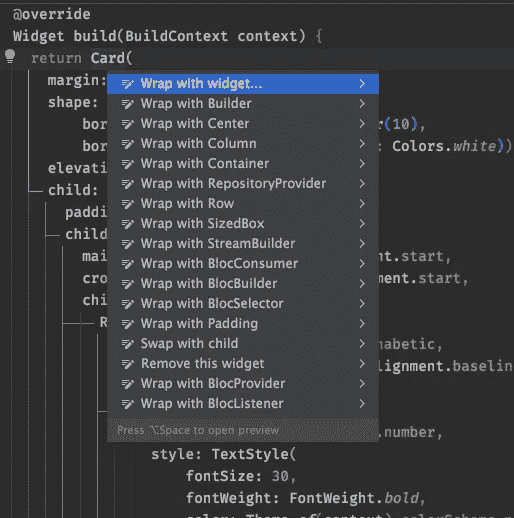
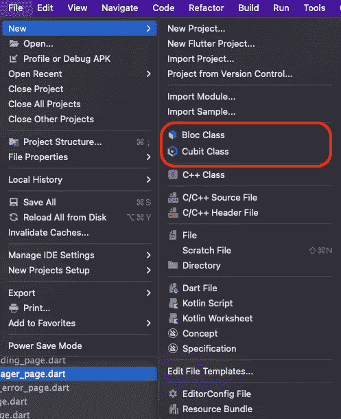
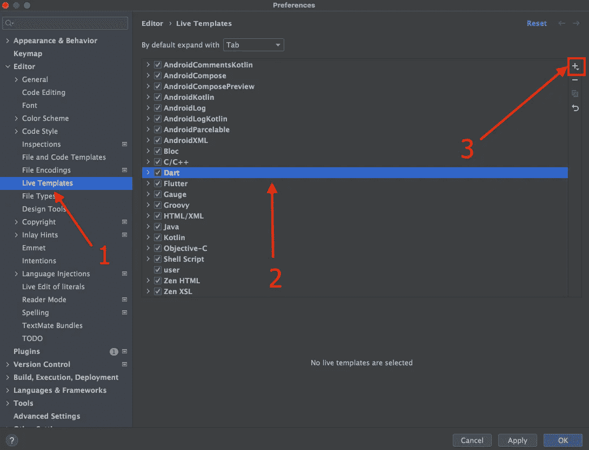
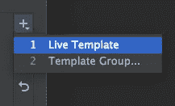
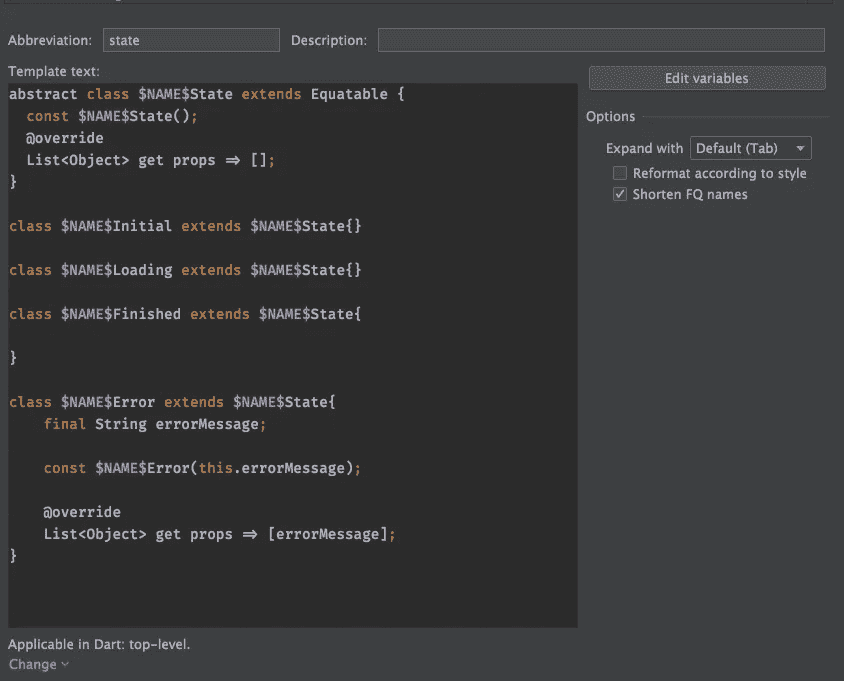

# 在 Android Studio 中创建模板，用于创建块库使用的状态类

> 原文：<https://itnext.io/create-template-in-android-studio-for-creating-state-classes-used-by-bloc-library-5cd4df474e91?source=collection_archive---------4----------------------->

**阻塞模式**是颤振中最广泛使用的状态管理模式之一。关于哪种架构模式是最好的争论永远不会结束，我们所能做的就是尝试其中的一些，看看哪种模式最适合我们的需求。我选择了**bloc**(*B*business*Lo*gic*Components*模式及其对应的 Flutter 插件( [bloc](https://pub.dev/packages/bloc) 和 [flutter_bloc](https://pub.dev/packages/flutter_bloc) )作为行业标准之一。尽管它很健壮，但它有一个很大的缺陷:样板，样板，样板…

幸运的是，有一个 [Bloc 插件](https://plugins.jetbrains.com/plugin/12129-bloc)对创建 Bloc、cubits、state 类很有帮助，甚至添加了一个内容动作来智能地添加像`RepositoryProvider`、`BlocProvider`等这样的父窗口小部件……它甚至智能地提供了`MultiRepositoryProvider`，如果你想的话，例如，包装`RepositoryProvider`等……

用 Bloc 构造包装小部件，比如`RepositoryProvider`、`BlocConsumer`、BlocBuilder、BlocSelector 等等

这实际上大大加快了编码速度。以及通过添加新文件的菜单添加新的 **Bloc/Cubit** 及其对应的状态类。

如果你选择添加`Cubit`类，让我们称之为`FetchSomethingCubit`，如果我们使用[等价的](https://pub.dev/packages/equatable)插件(我强烈推荐)，我们将得到两个类:

通常，我使用的状态是:

*   `**<CubitName>**Initial`
*   `**<CubitName>**Loading`
*   `**<CubitName>**Finished`
*   `**<CubitName>**Error`

包含错误的状态通常有一个`String`成员，它包含所描述的错误，或者您可以放置一些`enum`,用于在给定的语言环境中生成适当的消息。输入所有这些类真的很烦人，所以我们将在 Android Studio 中使用**实时模板**来加快整个过程。

如果我们在 IntelliJ Idea [网站](https://www.jetbrains.com/help/idea/using-live-templates.html)上看看，我们可以找到如下的解释:

> 使用实时模板在代码中插入常见的结构，如循环、条件、各种声明或打印语句。

现在，我找不到比为不同的 cubits 和 blocs 创建 state 类更重复的了。

所以，在 MacOS 上打开 ***首选项*** 对话框，或者如果我没说错的话在 Windows 上打开 ***设置*** (在 Mac 上: *Android Studio >首选项*，在 Windows 上:*文件>设置*(如果我对 Windows 说错了，请指正)。

首选项对话框

1.  在编辑器下的左侧窗格中选择 Live Templates。
2.  用镖选择行
3.  点击 **+** 按钮

4.选择实时模板

5.像这样在下面的表格中填写数据:

我们输入缩写`state`，模板文本将是:

重要的是点击底部的按钮 ***改变*** 并选择 ***镖>顶层*** ，因为该设置代表我们可以使用该模板的范围。

现在转到我们有两个状态类的文件，记住前缀是什么(在我们的例子中是***FetchSomething***)。删除那两个类，按 Tab 开始输入`FetchSomething`，按 ***输入*** 完成整个事情。

哦，这是我的第一篇媒体文章，所以如果我犯了一些错误或解释得不好，请原谅我。欢迎评论。:)