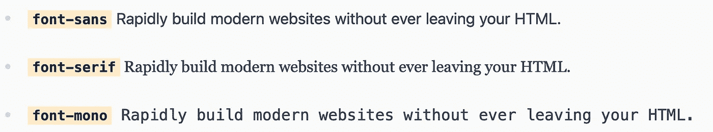
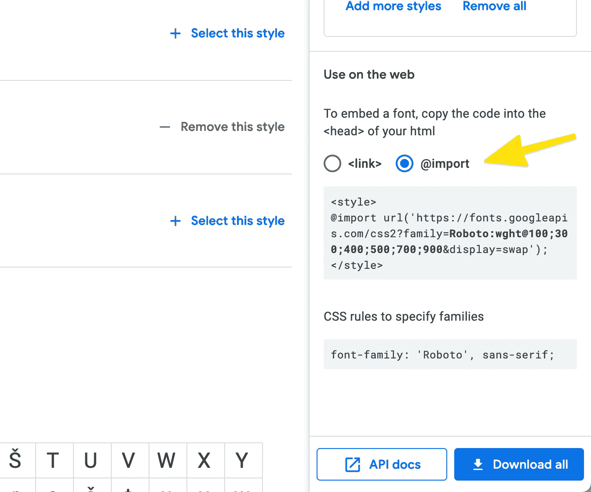
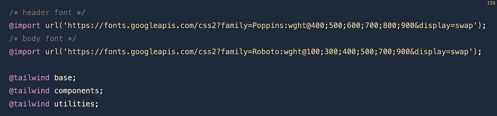
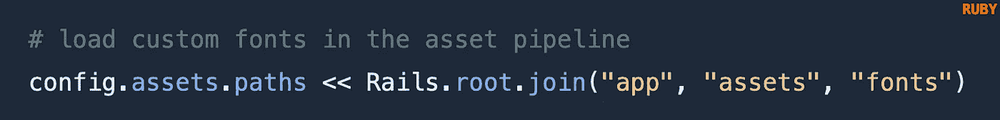
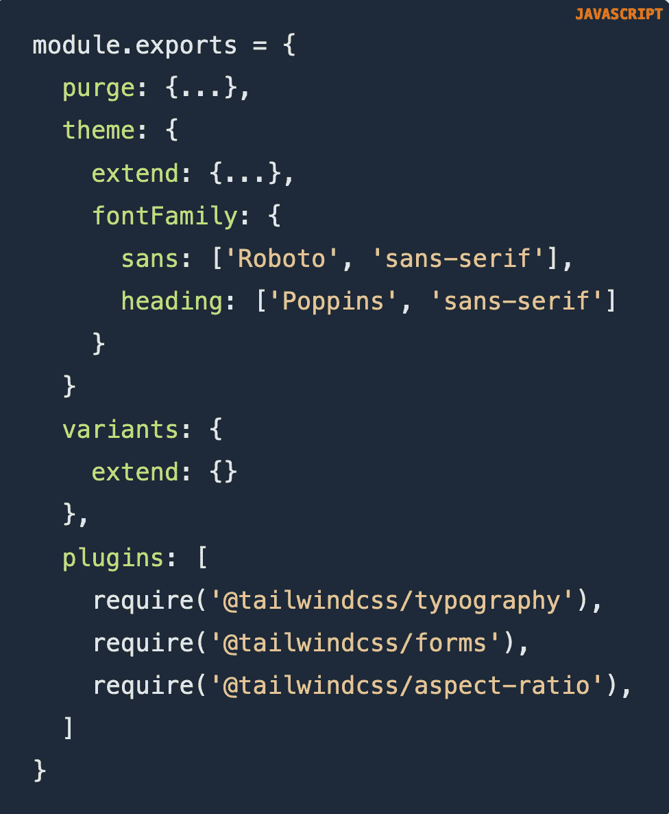
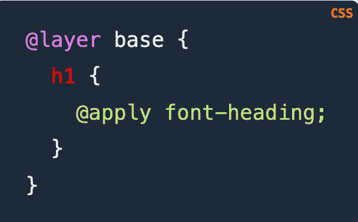

# 用定制的 CSS 字体创建独特的网站

> 原文：<https://itnext.io/create-unique-websites-with-custom-tailwind-css-fonts-d28db832261d?source=collection_archive---------3----------------------->

用本地字体或谷歌字体扩展顺风 CSS 配置

*图片来源:*[*https://www.dafont.com/barcelony.font*](https://www.dafont.com/barcelony.font)

Tailwind CSS 为开发人员提供了强大的功能，可以在短时间内构建视觉上吸引人的网站。为了给你的网站一个独特的外观和感觉，你可以选择添加新的字体到顺风配置。

> 为了给你的网站一个独特的外观和感觉，你可以选择添加新的字体到顺风配置。

[默认顺风类别](https://tailwindcss.com/docs/font-family)包括 3 种不同的字体。Font-sans 是默认字体，即使您没有显式设置 font-sans 类，它也会被应用。如果你想添加更多的字体来定制你的网站，顺风也支持你！

要使用不同的字体，您可以使用 Google fonts 中的`@import`,或者将字体导入到您的项目中。例如，当谷歌字体没有特定的字体，你在寻找。

# 1a。导入 Google 字体

访问[谷歌字体](https://fonts.google.com/)，搜索你喜欢的特定字体。选择从细(100)到粗(900)的样式变量。将 import 语句复制到 style 标记之间。

在导入顺风类的 CSS 文件中导入新字体，即 styles.css。注意，字体必须加载到文件的顶部。

# 1b。导入本地字体

为了创造更独特的东西，找一种不在谷歌字体上的吸引人的字体，比如手写的 [Barcelony](https://www.dafont.com/barcelony.font) 。

*图片来源:*[*https://www.dafont.com/barcelony.font*](https://www.dafont.com/barcelony.font)

在资产管道中创建一个字体文件夹(即资产/字体)。在“字体”文件夹中，添加一个自定义字体文件，例如:

*   `.ttf`对于 TrueType 字体
*   `.woff`为网页开放格式
*   `.otf`对于 OpenType

使用 Rails 的诀窍是显式地将新创建的字体文件夹加载到应用程序中。在`application.rb`文件中添加:

确保重新启动服务器。

接下来，将字体添加到 styles.css 文件的底部。

*   **font-family** 是将被设置到顺风配置文件中的名称。
*   **src** 是可以找到本地字体的路径。

# 2.覆盖或扩展

你可以覆盖[默认的顺风字体](https://tailwindcss.com/docs/font-family)。或者你可以扩展并添加你自己的。使用 extend 将添加新指定的字体系列，而不会覆盖 Tailwind 的整个字体堆栈。

如果您的应用程序已经构建好了，那么覆盖字体是有意义的，这样您就不需要重新访问网站上的每个段落元素来添加自定义类。

在您的 tailwind.config.js 文件中，添加选择的字体系列。

Font-sans 现在用的是 Roboto。因为 Font-sans 是默认的，所以没有必要在元素中显式包含这个类。此外，添加了一个新的字体标题类。因为 font-heading 类不存在，所以将创建它。您也可以选择将它添加到*扩展花括号*中。

字体-标题是新添加的 Poppins 字体，用于我们的标题。要应用 Poppins 字体，您可以添加到基础层，或者在需要的地方手动将该类包含在 HTML 中。

# 3.应用样式

全局应用样式。在导入顺风类的文件中，添加:

任何

# 标签现在将默认应用 Poppins 字体。注意订单的特殊性。如果你在 h1 标签本身的 HTML 中添加了一个字体类，即 font-mono，font-mono 将覆盖全局定义的字体标题类。

感谢阅读！

这篇文章对你有帮助吗？
你可能也会喜欢这篇文章:

*   [顺风 CSS 组件的 10 个开源库](https://betterprogramming.pub/10-open-source-libraries-for-tailwind-css-components-fdbcb692afa9?sk=dd45d6af5fbe04f658f8ffb53309adf9)