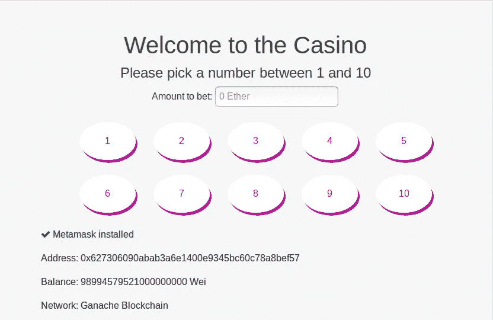
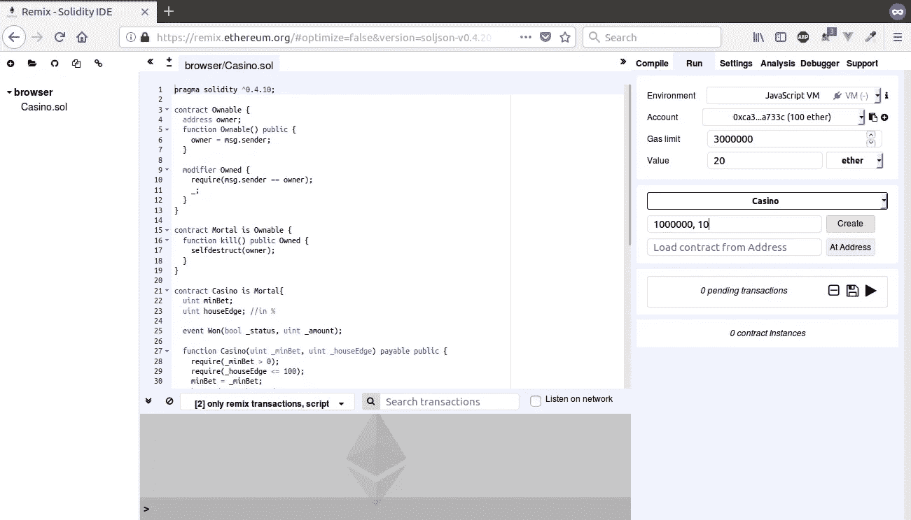
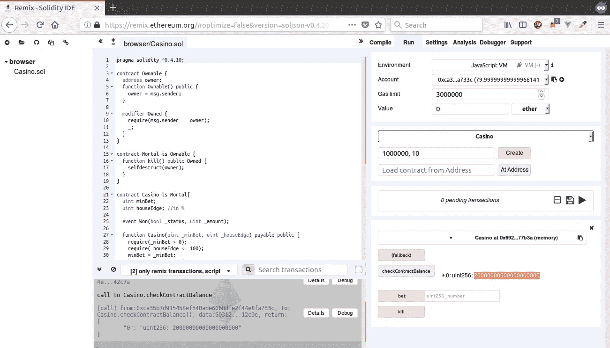
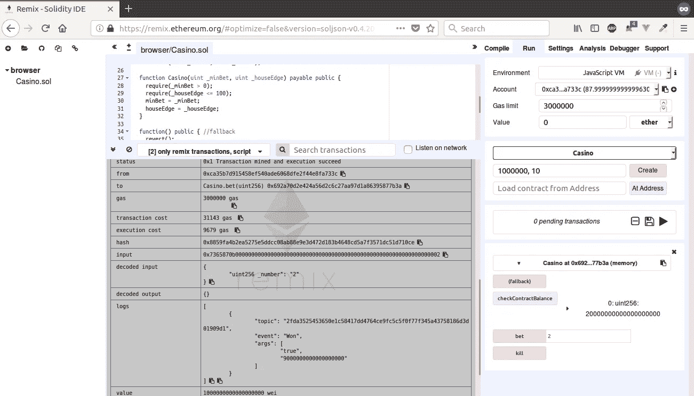

# 使用 Web3 和 Vue 创建您的第一个以太坊 dAPP。JS(第一部分)

> 原文：<https://itnext.io/create-your-first-ethereum-dapp-with-web3-and-vue-js-c7221af1ed82?source=collection_archive---------1----------------------->

[*点击这里在 LinkedIn* 上分享这篇文章](https://www.linkedin.com/cws/share?url=https%3A%2F%2Fitnext.io%2Fcreate-your-first-ethereum-dapp-with-web3-and-vue-js-c7221af1ed82)

欢迎来到另一个教程！在本教程中，我们将使用以太坊、Web3js、VueJS 和 Vuex 创建一个简单的反应式分散应用程序。您可能需要对 javascript 和 web 应用程序有所了解，才能真正喜欢本教程。如果您不知道 Vue，请不要担心，我们将在制作应用程序时简要介绍一下基础知识。

我们的应用程序很简单。用户可以在 1 到 10 之间的数字上下注。当用户猜对时，他得到他的支出 x10(减去房子的提成)。

在第一部分中，我们将回顾我们的项目设置和智能合同的创建。在第二部分中，我们将介绍 web3js API 和 VueJS/Vuex，在第三部分中，我们将把点连接起来，并将我们的应用程序连接到我们的合同。跟上，享受旅程，会很棒的。

下面是我们最终的应用程序:



我们最后的申请

# 先决条件

由于项目的简单性，我们不会使用块菌。我们将用 MetaMask 和 Remix(【https://remix.ethereum.org】)编写并部署我们的智能合约到一个测试网上。

我们首先需要的是 nodeJS 和 NPM，把它们拿到这里，然后按照你的操作系统的安装步骤:[https://nodejs.org/en/](https://nodejs.org/en/)。要检查节点是否已正确安装，请在终端窗口中运行以下命令:

```
node -v
npm -v
```

接下来，如果你还没有元掩码的话，获取它:[https://metamask.io/](https://metamask.io/)

我们的最后一个先决条件是 vue-cli，这将帮助我们轻松地建立一个 VueJS 项目:

```
npm i vue-cli -g
```

# 项目设置

我们将使用 remix 编写和部署简单的智能契约，并通过 metamask 附加组件将其部署到 Ropsten 测试网络。在我们的前端应用程序中，我们需要与之交互的只是契约地址和 *ABI* (一个 *ABI* 定义了如何在机器代码中访问数据结构或计算例程)。

我们的前端将是一个 vueJS 应用程序，我们将使用 vue-cli 生成它。我们还将使用 *web3* 与我们的合同沟通。要为我们的客户端应用程序创建主干，请遵循以下简单步骤:

1.  打开一个终端，将目录切换到您想要创建应用程序的位置。
2.  在终端窗口中键入以下命令来创建我们的项目，并通过发送垃圾信息“enter”来完成向导:

```
 vue init webpack betting-dapp
```

3.现在，我们将进入项目文件夹，安装 web3、vuex 和 font-awesome:

```
cd betting-dapp
npm i web3@^0.20.0 vuex font-awesome -s
//To start the dummy project generated by the vue-cli use 'npm start'
```

**我们没有使用 web3 1.0.0 测试版，因为在撰写本文时它与 MetaMask 不兼容。**

# 撰写我们的智能合同

在我们开始像无头鸡一样编写代码之前，我们必须首先分析我们需要哪些组件:

1.  我们需要知道契约的所有者，并有一个访问修饰符(为了简单起见，我们不考虑改变所有者)
2.  合同的所有者可以销毁合同并取回余额
3.  用户可以下注 1-10 之间的数字
4.  业主需要能够在合同创建时设置最小下注金额和房屋边界(为简单起见，创建后不可更改)

**第一步和第二步**非常简单，我们还添加了评论，这样你就可以轻松跟上了。启动[混音](http://remix.ethereum.org)让我们开始工作(文章末尾的要点链接):

```
pragma solidity ^0.4.10;contract Ownable {
 address owner;
 function Ownable() public {
//Set owner to who creates the contract
 owner = msg.sender;
 }//Access modifier 
modifier Owned {
 require(msg.sender == owner);
 _;
 }
}contract Mortal is Ownable {
//Our access modifier is present, only the contract creator can      use this function
  function kill() public Owned { 
 selfdestruct(owner);
 }
}
```

首先我们创建契约 Ownable，它的构造函数 *Ownable()* 将在创建时被调用，并将状态变量‘owner’设置为创建者的地址。我们还定义了一个访问修饰符，当我们附加的函数的调用者不是契约所有者时，它将抛出一个异常。

我们将这个功能传递到我们的凡人契约中(凡人从 Ownabe 继承)。它有一个功能，允许合同所有者(访问修改者)销毁合同，并将剩余资金返还给他。

你能走到这一步吗？你做得很好！我们几乎准备好了我们的合同。

现在，对于**步骤 3 和 4** ，我们将创建我们的赌场合同:

我们需要的第一件事是一个 minBet 和 houseEdge，可以在合同创建时设置。这是通过将参数传递给构造函数 *Casino()* 来实现的。我们将支付我们的构造函数，这样我们就可以在部署时预加载我们的合同。我们也已经实现了回退:

```
contract Casino is Mortal{
 uint minBet;
 uint houseEdge; //in %//true+amount or false+0
event Won(bool _status, uint _amount);function Casino(uint _minBet, uint _houseEdge) payable public {
 require(_minBet > 0);
 require(_houseEdge <= 100);
 minBet = _minBet;
 houseEdge = _houseEdge;
 }

function() public { //fallback
 revert();
 }
}
```

这不会做太多，所以接下来我们将添加我们的函数来下注一个数字。这个函数将生成一个随机数(不是以安全的方式！)，然后计算并发送赢得的金额。因此，在回退函数下面添加以下内容:

```
function bet(uint _number) payable public {
 require(_number > 0 && _number <= 10);
 require(msg.value >= minBet);
 uint winningNumber = block.number % 10 + 1;
 if (_number == winningNumber) {
   uint amountWon = msg.value * (100 — houseEdge)/10;
   if(!msg.sender.send(amountWon)) revert();
   emit Won(true, amountWon);
 } else {
   emit Won(false, 0);
 }
}
```

为了生成 1-10 之间的随机数，我们取当前块号并取当前块号的模数(除法余数)。这将总是产生一个介于 0-9 之间的数字，所以如果我们给它加 1，我们将得到一个介于 1-10 之间的“随机”数字。

例如:如果我们在一个新的匿名窗口中使用 javascript VM 在 remix 上部署我们的合同，并在部署后调用 bet 函数，我们将总是获得 2 作为获胜号码。这是因为第一块是#1。1 的模数是 1，加 1 等于 2。

***注意，这不是真正的随机，因为预测下一个块号很容易。要了解更多关于可靠性的随机性，请查看 https://www.youtube.com/watch?v=3wY5PRliphE*[](https://www.youtube.com/watch?v=3wY5PRliphE)**。**

*要计算赢得的金额，我们只需计算一个乘数:*

```
*bet * (100 — houseEdge)/10* 
```

*如果房子边缘是 0，我们的乘数将是 10；如果房屋边缘是 10%,乘数将是 9。*

*最后，我们将为所有者添加一个功能，以检查合同的余额，理想情况下，我们会希望为所有者添加一个撤回功能，但我们现在会离开。在您的 bet 函数下面添加以下几行:*

```
*function checkContractBalance() Owned public view returns(uint) {
  return address(this).balance
 }*
```

***伟大的作品！合同现在可以测试了！***

# *在 remix 中测试我们的合同*

*在右上角的 remix 中，单击 run 选项卡。确保环境设置为 *Javascript VM。*在值字段中输入 *20* 并从旁边的下拉菜单中选择*乙醚*而不是*魏*。这将预先加载我们与 20 Eth 的部署合同。接下来，在 create 按钮旁边输入我们的构造函数参数 *_minBet* 和 *_houseEdge* (例如 100000 wei 和 10% houseEdge)。完成后，它应该是这样的:*

**

*在点击“创建”之前，它应该是这样的。*

*现在，单击 create 按钮，合同实例应该出现在屏幕的右下角。将有四个可见的函数，点击 *getContractBalance()来检查一切是否正常。*它应该返回 *200000000000000000，*也就是我们发给它的 20 个乙醚换算成魏。你还会看到你的余额(在右上角的账户旁边)现在会比 80 以太少一点。*

**

*点击'创建'后合同余额应为 20*1e18 魏*

*好极了。一切都应该正常。如前所述，使用 javascript VM 时，第一个块将始终为 1，因此第一个中奖号码将始终为 2。我们可以通过在 value 字段中输入 1 ether 并传递 2 作为 bet 的参数来测试这一点。
按下“下注”时，我们应该会看到我们的余额再次上升，在控制台中单击“详细信息”并滚动到“日志”。我们应该看到一个我们赢了的事件:*

**

*我们刚刚赢了 9 以太！*

*好吧！我们的合同有效。在下一集，我们将在 Ropsten 测试网络上部署我们的契约，并检索契约地址和 ABI，以便在我们的客户端应用程序中使用。直到那时！*

***检出** [**第二部分**](https://medium.com/@Alt_Street/create-your-first-ethereum-dapp-with-web3-and-vue-js-part-2-52248a74d58a) **！***

*和往常一样，如果你喜欢我们的教程，欢迎你留下你的建议，感谢你的阅读和坚持！*

**ETH—*0x 6d 31 CB 338 b 5590 adafec 46462 a1 b 095 ebdc 37d 50*

*完整合同代码:[https://gist . github . com/anonymous/9bd 71 a 676 E6 f 96 f 096 b 14 a 8 AFE 6 e 368 b](https://gist.github.com/anonymous/9bd71a676e6f96f096b14a8afe6e368b)*

*更新:更新了带有*发出*前缀的调用事件，并将 *this* 转换为*地址类型*以获取平衡成员(solidity 0.4.21 版本)*

**想建立自己的想法？我们提供以太坊概念验证和众筹开发服务。**

*[](https://altstreet.io) [## Alt Street -区块链顾问

### 区块链概念证明和代币销售

altstreet.io](https://altstreet.io)*