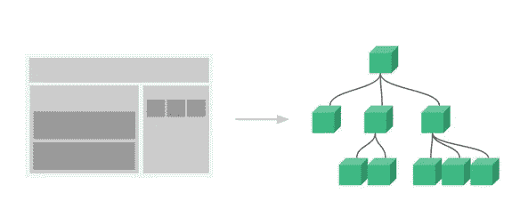
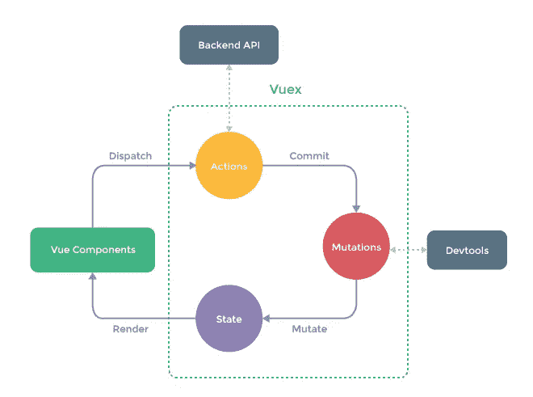
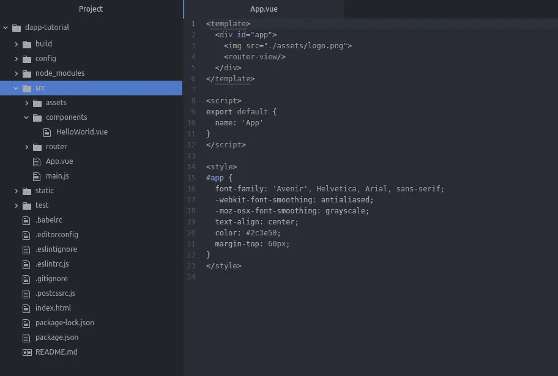
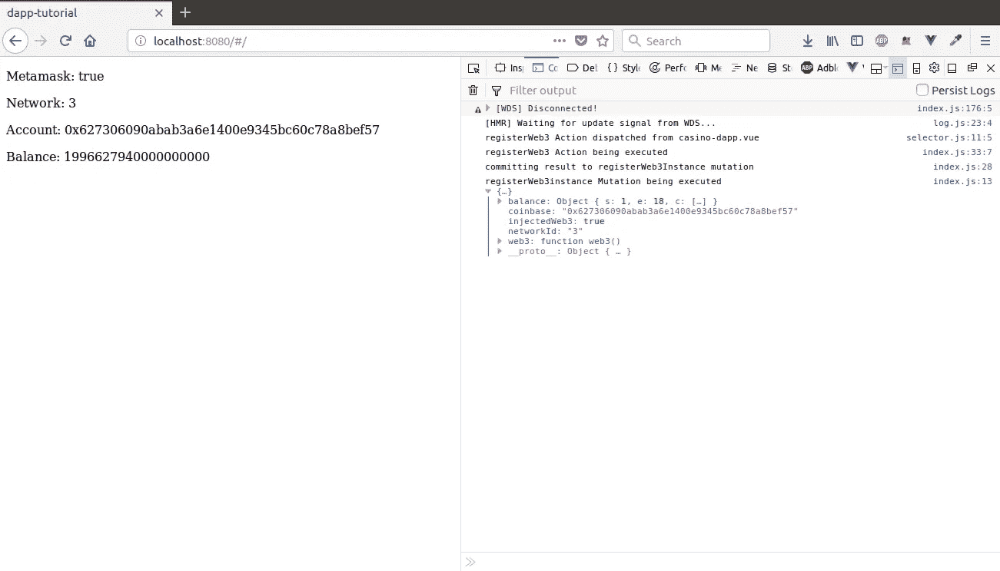

# 使用 Web3 和 Vue 创建您的第一个以太坊 dAPP。JS(第二部分)

> 原文：<https://itnext.io/create-your-first-ethereum-dapp-with-web3-and-vue-js-part-2-52248a74d58a?source=collection_archive---------4----------------------->

[*点击这里在 LinkedIn* 上分享这篇文章](https://www.linkedin.com/cws/share?url=https%3A%2F%2Fitnext.io%2Fcreate-your-first-ethereum-dapp-with-web3-and-vue-js-part-2–52248a74d58a)

欢迎回到这个令人敬畏的教程系列的第 2 部分，在这里我们动手构建我们的第一个分散式应用程序。在第二部分中，我们将介绍 VueJS 和 Vuex 的核心概念，并介绍 web3js 与 metamask 的交互。

如果你错过了第一部分，你可以在下面找到它，也可以在 Twitter 上关注我们！

# 言归正传:VueJS

VueJS 是一个用于构建用户界面的 javascript 框架。乍一看，它看起来像经典的小胡子模板，但在引擎盖下发生了很多事情，使 Vue 反应。

```
<div id=”app”>
 {{ message }}
</div>var app = new Vue({
 el: '#app',
 data: {
 message: 'Hello Vue!'
 }
})
```

这将是一个真正基本的 Vue 应用程序的结构。数据对象中的消息属性将在 id 为“app”的元素中呈现到屏幕上，当我们更改此消息时，它将在屏幕上更新而不刷新。你可以在这个 jsfiddle(打开自动运行)里面查看一下:【https://jsfiddle.net/tn1mfxwr/2/[。](https://jsfiddle.net/tn1mfxwr/2/)

VueJS 的另一个重要的关键特性是组件。组件是小的、可重用的和自包含的代码片段。本质上，一个 web 应用程序可以被抽象成一个由更小的组件组成的树。当我们开始编写前端应用程序时，这一点会变得更加清楚。



抽象成组件的网页示例。网页由三部分组成。其中两个组件有子组件。

# 国家联盟:Vuex

我们将使用 Vuex 来管理应用程序的状态。与 redux 类似，Vuex 实现了一个 store，作为我们的应用程序关于数据的“唯一真实来源”。Vuex 允许我们以可预测的方式操纵和提供应用程序使用的数据。

它的工作方式非常简单。一个**组件**在呈现时需要数据，它将**分派**一个**动作**来获取它需要的数据。获取数据的 API 调用在操作中异步发生。一旦获取数据，动作将**将该数据提交**到**突变**。然后，突变将**改变我们商店的状态**。当该组件使用的存储中的数据发生变化时，它将重新呈现。



Vuex 的状态管理模式

# **在我们继续之前……**

在第一部分中，我们通过使用 vue-cli 生成了一个 Vue 应用程序，我们还安装了我们需要的依赖项。如果你还没看过第一部分，链接在最上面。

如果你做了所有正确的事情，你的目录结构应该是这样的:



新生成的 vue 应用程序

**快速提示:如果您打算从这里复制粘贴代码块，请将 */src/* 添加到您的*中。eslintinignore*文件以避免缩进错误**

在您的终端中，您可以键入“npm start”来运行此应用程序。它将包含默认的 vue 应用程序，所以我们将首先清除它。
** *注意:我们正在使用 vue 路由器，尽管只有一条路由，我们并不需要它，但我认为在教程中保留它会很好，因为它非常简单。
* *提示:将 atom(右下角)中的语法转换为 HTML 格式。vue 文件*

是时候清理这个宝贝了:

*   在 app.vue 中，删除 img 标签并清除 style 标签之间的所有内容。
*   删除*组件/HelloWorld.vue* ，创建两个名为 casino-dapp.vue(我们的主组件)和 hello-metamask.vue(将包含我们的元掩码数据)的新文件
*   在我们新的 *hello-metamask.vue* 文件中粘贴下面的代码，它现在只在 p 标签中显示文本“hello”。

```
<template>
 <p>Hello</p>
</template><script>
export default {
 name: 'hello-metamask'
}
</script><style scoped></style>
```

*   现在，我们将 hello-metamask 组件加载到我们的主 casino-dapp 组件中，首先导入文件，然后在我们的 vue 实例中引用它，这样我们就可以将它作为标签添加到模板中。将此粘贴到 *casino-dapp.vue* 中:

```
<template>
 **<hello-metamask/>**
</template><script>
**import HelloMetamask from '@/components/hello-metamask'**
export default {
 name: 'casino-dapp',
 **components: {
 'hello-metamask': HelloMetamask
 }**
}
</script><style scoped></style>
```

*   现在，如果您打开 router/index.js，您将看到我们只有一条到根的路由，它仍然指向我们删除的 HelloWorld.vue 组件。我们需要将其更改为我们的主要赌场-dapp.vue 组件。

```
import Vue from 'vue'
import Router from 'vue-router'
**import CasinoDapp from '@/components/casino-dapp'**Vue.use(Router)export default new Router({
 routes: [
 {
 path: '/',
 **name: 'casino-dapp',
 component: CasinoDapp**
 }
 ]
})
```

关于 Vue 路由器的一点:你可以添加额外的路径并将组件绑定到它们，当你访问定义的路径时，这些将会呈现。由于 App.vue 文件中的 router-view 标记，将呈现正确的组件。

*   在 *src* 中创建一个名为 *util 的新文件夹。在这个文件夹内创建另一个名为*常量*的文件夹。创建一个名为 *networks.js* 的文件，并粘贴下面的代码。这将让我们显示以太坊网络名称，而不是它的 id，同时保持我们的代码干净。*

```
export const NETWORKS = {
 '1': 'Main Net',
 '2': 'Deprecated Morden test network',
 '3': 'Ropsten test network',
 '4': 'Rinkeby test network',
 '42': 'Kovan test network',
 '4447': 'Truffle Develop Network',
 '5777': 'Ganache Blockchain'
}
```

*   最后但同样重要的是(实际上这是目前最不重要的)，在 *src* 中创建一个名为 *store* 的新文件夹。我们将在下一节回到这个问题。

如果您在终端中运行' *npm start'* ，并在浏览器中转至 *localhost:8080* ，您应该会看到*‘Hello '*出现在屏幕上。如果是这样，你就准备好继续前进了。

# 建立我们的 Vuex 商店

在这一部分，我们将建立我们的商店。首先在我们全新的*商店*目录中创建两个文件(上一节的最后部分): *index.js* 和*state . js*；我们将从 *state.js* 开始，它是我们将要检索的数据的空白表示。

```
let state = {
 web3: {
 isInjected: false,
 web3Instance: null,
 networkId: null,
 coinbase: null,
 balance: null,
 error: null
 },
 contractInstance: null
}
export default state
```

好，现在我们将在 *index.js* 建立我们的商店。我们将导入 vuex 库并告诉 vueJS 使用它。我们将导入州并将其添加到我们的存储中。

```
import Vue from 'vue'
import Vuex from 'vuex'
import state from './state'Vue.use(Vuex)export const store = new Vuex.Store({
 strict: true,
 state,
 mutations: {},
 actions: {}
})
```

最后一步是编辑 main.js 来包含我们的存储:

```
import Vue from 'vue'
import App from './App'
import router from './router'
**import { store } from './store/'**Vue.config.productionTip = false/* eslint-disable no-new */
new Vue({
 el: '#app',
 router,
 **store**,
 components: { App },
 template: '<App/>'
})
```

做得好，给自己一个鼓励，因为这是一个很大的设置。现在，我们已经准备好通过 web3 API 获取元掩码数据，并在我们的应用程序中提供它。就要成真了！

# Web3 和元掩码入门

如前所述，为了让我们将数据放入我们的 Vue 应用程序，我们需要调度一个动作来进行异步 API 调用。我们将使用 promises 将几个调用链接在一起，并将其抽象到一个文件中。所以在 *util* 文件夹中创建一个名为 *getWeb3.js* 的新文件。粘贴下面的代码，其中包含相当多的评论，供您遵循。我们也将在代码块下面检查它。

首先要注意的是，我们使用承诺来链接我们的回调，如果你不知道承诺，请查看[链接](https://developer.mozilla.org/en-US/docs/Web/JavaScript/Reference/Global_Objects/Promise)。接下来，我们检查用户是否运行了元遮罩(或薄雾)。Metamask 注入它自己的 web3 实例，因此我们将检查 window.web3(注入的实例)不是未定义的。如果不是这样，我们将创建一个 web3 实例，用 Metamask 作为当前提供者，这样我们就不依赖于注入实例的版本。我们把新创建的实例传递给下一个承诺，在这里我们进行几个 API 调用:

*   *web 3 . version . get network()*会返回我们所连接的网络的 ID。
*   *web3.eth.coinbase()* 返回我们的节点正在挖掘的地址，当使用元掩码时，这应该是所选的帐户。
*   *web 3 . eth . get balance(<address>)*返回我们作为参数传入的地址的余额。

还记得我们说过异步 API 调用需要发生在我们的 Vuex 存储中的动作内部吗？我们现在将它连接起来，稍后再从我们的组件发送出去。在 *store/index.js* 中，我们将导入我们的 *getWeb3.js* 文件，调用它并将其提交给一个变异，该变异将把它保存到我们的存储中。

在导入语句中添加

```
import getWeb3 from '../util/getWeb3'
```

然后在动作对象中(在你的商店中)，我们将调用 *getWeb3* 和 *commit* 结果。我们正在向我们的逻辑添加一些 console.logs，这样我们就可以看到我们的流程的步骤，这将有望使整个调度-操作-提交-变异-状态更改变得更加清晰。

```
registerWeb3 ({commit}) {
      console.log('registerWeb3 Action being executed')
      getWeb3.then(result => {
        console.log('committing result to registerWeb3Instance mutation')
        commit('registerWeb3Instance', result)
      }).catch(e => {
        console.log('error in action registerWeb3', e)
      })
    }
```

现在，我们将创建我们的突变，它将我们的数据保存到我们的存储状态中。我们可以通过访问第二个参数来访问在变异中传递到提交中的数据。在*突变*对象内部添加下面的函数。

```
registerWeb3Instance (state, payload) {
 console.log('registerWeb3instance Mutation being executed', payload)
 let result = payload
 let web3Copy = state.web3
 web3Copy.coinbase = result.coinbase
 web3Copy.networkId = result.networkId
 web3Copy.balance = parseInt(result.balance, 10)
 web3Copy.isInjected = result.injectedWeb3
 web3Copy.web3Instance = result.web3
 state.web3 = web3Copy
 }
```

太好了！现在剩下要做的就是从组件中分派我们的动作，以实际检索数据并将其呈现给应用程序。为了分派我们的动作，我们将利用 [Vue 的生命周期钩子](https://vuejs.org/v2/guide/instance.html#Instance-Lifecycle-Hooks)。在我们的例子中，我们将在创建之前从主要的 casino-dapp 组件中调度我们的操作。因此，在*组件/casino-dapp.vue* 中，在名称属性下添加以下函数:

```
export default {
  name: 'casino-dapp',
 **beforeCreate () {
    console.log('registerWeb3 Action dispatched from casino-dapp.vue')
    this.$store.dispatch('registerWeb3')
  },**
  components: {
    'hello-metamask': HelloMetamask
  }
}
```

好了，现在我们将从 hello-metamask 组件中呈现这些数据，我们所有的帐户数据都将在该组件中呈现。为了从我们的存储中获取数据，我们需要将一个 getter 函数传递给 computed。然后，我们可以使用花括号引用模板中的数据。

```
<template>
 <div class='metamask-info'>
   <p>Metamask: {{ web3.isInjected }}</p>
   <p>Network: {{ web3.networkId }}</p>
   <p>Account: {{ web3.coinbase }}</p>
   <p>Balance: {{ web3.balance }}</p>
 </div>
</template><script>
export default {
 name: 'hello-metamask',
 computed: {
   web3 () {
     return this.$store.state.web3
     }
   }
}
</script><style scoped></style>
```

太好了，现在一切都正常了。在您的终端中，使用“npm start”启动项目，然后转到 localhost:8080。我们现在应该可以看到元掩码数据了。当我们打开控制台时，我们应该在 vuex 段落中描述的状态管理模式中看到来自控制台日志的消息。



如果你能做到这一步，并且一切顺利，那就做得很好，真的。这是这个系列中最难的部分。在下一部分中，我们将学习如何轮询元掩码的更改(例如，切换帐户)并将我们在第 1 部分中编写的智能契约连接到我们的应用程序。

**如果你遇到错误，你可以在 hello-metamask 分支的** [**这个 github repo**](https://github.com/kyriediculous/dapp-tutorial/tree/hello-metamask) **中找到这个部分的完整工作代码。**

**一定要看完** [**这个系列的最后一部**](https://medium.com/@Alt_Street/create-your-first-ethereum-dapp-with-web3-and-vue-js-part-3-dc4f82fba4b4) **！**

和往常一样，如果你喜欢我们的教程，欢迎你留下你的建议，感谢你的阅读和坚持！

*ETH—*0x 6d 31 CB 338 b 5590 adafec 46462 a1 b 095 ebdc 37d 50

想要建立你的想法吗？我们提供以太坊概念验证和众筹开发服务。

[](https://altstreet.io) [## Alt Street -区块链顾问

### 区块链概念证明和代币销售

altstreet.io](https://altstreet.io)