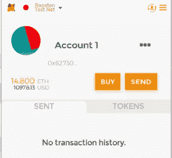
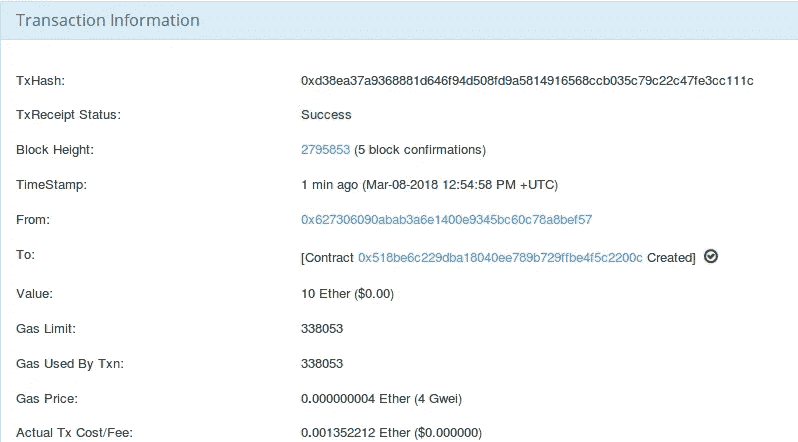
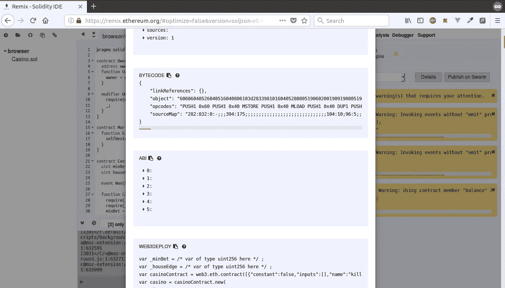
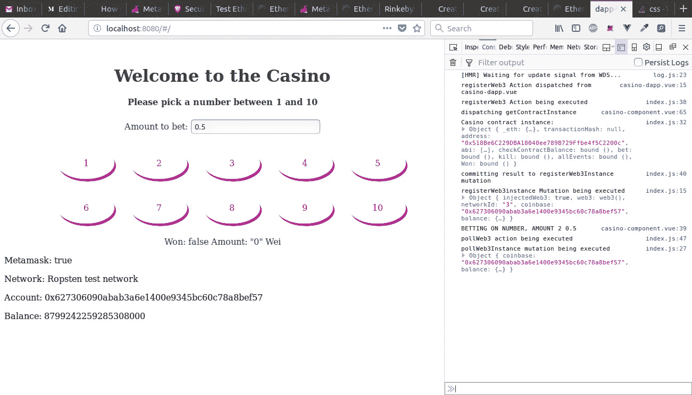
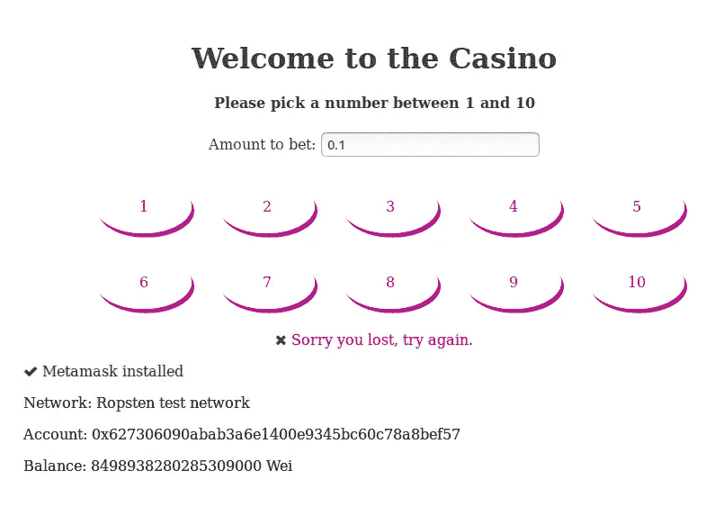

# 使用 Web3 和 Vue 创建您的第一个以太坊 dAPP。JS(第三部分)

> 原文：<https://itnext.io/create-your-first-ethereum-dapp-with-web3-and-vue-js-part-3-dc4f82fba4b4?source=collection_archive---------2----------------------->

[*点击这里在 LinkedIn* 上分享这篇文章](https://www.linkedin.com/cws/share?url=https%3A%2F%2Fitnext.io%2Fcreate-your-first-ethereum-dapp-with-web3-and-vue-js-part-3-dc4f82fba4b4)

大家好，欢迎来到这个系列的最后一部分。如果你正在收听，我们正在为以太坊区块链创建一个简单的分散式应用程序。请随意查看第 1 部分和第 2 部分！

[](/create-your-first-ethereum-dapp-with-web3-and-vue-js-c7221af1ed82) [## 使用 Web3 和 Vue 创建您的第一个以太坊 dAPP。JS(第一部分)

### 欢迎来到另一个教程！在本教程中，我们将深入创建一个简单的反应式分散应用程序…

itnext.io](/create-your-first-ethereum-dapp-with-web3-and-vue-js-c7221af1ed82) [](/create-your-first-ethereum-dapp-with-web3-and-vue-js-part-2-52248a74d58a) [## 使用 Web3 和 Vue 创建您的第一个以太坊 dAPP。JS(第二部分)

### 欢迎回到这个令人敬畏的教程系列的第 2 部分，在这里我们动手构建我们的第一个去中心化的…

itnext.io](/create-your-first-ethereum-dapp-with-web3-and-vue-js-part-2-52248a74d58a) 

# 从我们离开的地方继续

因此，在这一阶段，我们的应用程序能够从 metamask 获取我们的帐户数据并显示它。但是，当更改帐户时，如果不重新加载页面，数据不会更新。这不是最佳选择，我们希望确保这些变化能够反应性地显示出来。

我们的方法与简单注册 web3 实例略有不同。Metamask 还不支持 websockets，所以我们必须定期轮询变化。我们不希望在没有变化时调度动作，因此只有在满足某个条件(某个变化)时，我们的动作才会与它们各自的有效负载一起被调度。

可能有几种方法，这可能不是最漂亮的一种，它在严格模式的约束下工作，但是我们很好。在 *util* 文件夹中新建一个名为 *pollWeb3.js* 的文件。这是我们要做的:

*   导入 Web3，这样我们就不依赖于元掩码实例了
*   导入我们的商店，以便我们可以比较价值和调度行动，如果需要的话
*   创建我们的 web3 实例
*   设定一个时间间隔来检查地址是否改变，如果不是，检查余额是否改变
*   如果地址或余额有变化，我们将更新我们的商店。因为我们的 *hello-metamask 组件*有一个*计算属性*，所以这个数据更改是被动的

现在我们只需要在 web3Instance 初始注册后开始轮询更新。因此，打开 *store/index.js* ，导入我们的 *pollWeb3.js* 文件，并将其添加到我们的*register web 3 instance()variation*的底部，以便在状态更改后执行。

```
import pollWeb3 from '../util/pollWeb3'registerWeb3Instance (state, payload) {
 console.log('registerWeb3instance Mutation being executed', payload)
 let result = payload
 let web3Copy = state.web3
 web3Copy.coinbase = result.coinbase
 web3Copy.networkId = result.networkId
 web3Copy.balance = parseInt(result.balance, 10)
 web3Copy.isInjected = result.injectedWeb3
 web3Copy.web3Instance = result.web3
 state.web3 = web3Copy
 **pollWeb3()**
 }
```

因为我们正在调度操作，所以我们需要将它添加到我们的存储中，以及一个变异来提交更改。我们可以直接提交一个变更，但是让我们保持我们的模式一致。我们将添加一些 console.logs，以便您可以在控制台中观看精彩的过程。在 actions 对象中添加:

```
pollWeb3 ({commit}, payload) {
 console.log('pollWeb3 action being executed')
 commit('pollWeb3Instance', payload)
 }
```

现在我们只需要对我们传递的可能的两个变量进行突变

```
pollWeb3Instance (state, payload) {
 console.log('pollWeb3Instance mutation being executed', payload)
 state.web3.coinbase = payload.coinbase
 state.web3.balance = parseInt(payload.balance, 10)
 }
```

搞定了。如果我们现在更改 Metamask 中的地址或我们的余额发生变化，我们将在我们的应用程序中看到这一更新，而无需重新加载页面。当我们更改网络时，页面将重新加载，我们将从头注册一个新实例。然而，在生产中，我们希望显示一个警告，以更改我们的合同部署到的正确网络。

我知道这是一条漫长的道路，但在下一部分，我们将最终将智能合约连接到我们的应用程序。与我们已经做的相比，这实际上非常容易。

# 实例化我们的合同

我们将从编写代码开始，稍后我们将部署我们的合同并将 ABI 和地址插入到我们的应用程序中。我们几乎已经准备好创建我们期待已久的赌场组件，它具有以下功能:

*   我们需要一个输入字段，以便用户可以输入下注金额
*   我们需要按钮，代表要下注的数字，当用户点击一个数字时，他将在这个数字上下注他输入的金额。
*   点击函数将调用我们的智能合约上的 bet()函数。
*   我们将显示一个装载微调器，以显示事务正在进行中
*   当交易完成后，我们将显示用户是否已经赢得和金额

首先，我们需要我们的应用程序能够与我们的智能合同对话。我们将采用与之前相同的方式处理此事。在 *util* 文件夹中创建一个名为 *getContract.js* 的新文件。

```
import Web3 from ‘web3’
import {address, ABI} from ‘./constants/casinoContract’let getContract = new Promise(function (resolve, reject) {
 let web3 = new Web3(window.web3.currentProvider)
 let casinoContract = web3.eth.contract(ABI)
 let casinoContractInstance = casinoContract.at(address)
 // casinoContractInstance = () => casinoContractInstance
 resolve(casinoContractInstance)
})export default getContract
```

首先要注意的是，我们正在导入一个尚不存在的文件，我们将在稍后部署合同时修复它。

首先，我们通过将 ABI(我们将在后面讨论)传入 *web3.eth.contract()* ，为可靠性契约创建一个契约对象。然后我们可以在一个地址初始化这个对象。正是在这种情况下，我们可以调用我们的方法和事件。

然而，如果没有动作和突变，这是不完整的。
因此在 *casino-component.vue* 的脚本标签中添加以下内容。

```
export default {
 name: ‘casino’,
 mounted () {
 console.log(‘dispatching getContractInstance’)
 this.$store.dispatch(‘getContractInstance’)
 }
}
```

现在我们在商店里的行动和变化。首先导入我们的 *getContract.js* 文件，我相信你现在已经知道怎么做了。然后在我们创造的行动中，呼唤它:

```
getContractInstance ({commit}) {
 getContract.then(result => {
 commit(‘registerContractInstance’, result)
 }).catch(e => console.log(e))
 }
```

将结果传递给我们的突变:

```
registerContractInstance (state, payload) {
 console.log(‘Casino contract instance: ‘, payload)
 state.contractInstance = () => payload
 }
```

这将把我们的契约实例存储在商店中，供我们在组件中使用。

# 与我们的合同互动

首先，我们将向赌场组件添加一个数据属性(在导出中),这样我们就可以拥有具有反应属性的变量。这些值将是 winEvent、amount 和 pending。

```
data () {
 return {
 amount: null,
 pending: false,
 winEvent: null
 }
 }
```

现在我们将为用户点击一个数字创建 onclick 函数。这将触发我们契约上的 *bet()* 函数，显示微调器，当它接收到事件时隐藏微调器并显示事件参数。在 data 属性下添加一个名为 methods 的属性，该属性接受一个我们将在其中放置函数的对象。

我们的 *bet()* 函数采用的第一个参数是我们在契约中定义的参数 u number。 *event.target. innerHTML* 引用了我们接下来要创建的列表标签中的数字。然后是一个定义交易参数的对象，这是我们输入用户下注金额的地方。第三个参数是回调。一旦成功，我们将关注这一事件。

现在我们将为组件创建 html 和 css。复制粘贴就行了，我觉得不言自明。之后，我们将部署合同并获取 ABI 和地址。

```
<template>
 <div class=”casino”>
   <h1>Welcome to the Casino</h1>
   <h4>Please pick a number between 1 and 10</h4>
   Amount to bet: <input v-model=”amount” placeholder=”0 Ether”>
   <ul>
     <li v-on:click=”clickNumber”>1</li>
     <li v-on:click=”clickNumber”>2</li>
     <li v-on:click=”clickNumber”>3</li>
     <li v-on:click=”clickNumber”>4</li>
     <li v-on:click=”clickNumber”>5</li>
     <li v-on:click=”clickNumber”>6</li>
     <li v-on:click=”clickNumber”>7</li>
     <li v-on:click=”clickNumber”>8</li>
     <li v-on:click=”clickNumber”>9</li>
     <li v-on:click=”clickNumber”>10</li>
  </ul>
  
  <div class=”event” v-if=”winEvent”>
    Won: {{ winEvent._status }}
    Amount: {{ winEvent._amount }} Wei
  </div>
 </div>
</template><style scoped>
.casino {
 margin-top: 50px;
 text-align:center;
}
#loader {
 width:150px;
}
ul {
 margin: 25px;
 list-style-type: none;
 display: grid;
 grid-template-columns: repeat(5, 1fr);
 grid-column-gap:25px;
 grid-row-gap:25px;
}
li{
 padding: 20px;
 margin-right: 5px;
 border-radius: 50%;
 cursor: pointer;
 background-color:#fff;
 border: -2px solid #bf0d9b;
 color: #bf0d9b;
 box-shadow:3px 5px #bf0d9b;
}
li:hover{
 background-color:#bf0d9b;
 color:white;
 box-shadow:0px 0px #bf0d9b;
}
li:active{
 opacity: 0.7;
}
*{
 color: #444444;
}
</style>
```

# Ropsten 网络和元掩码(针对首次用户)

如果你不熟悉 metamask 或以太坊网络，不要担心。

1.  打开你的浏览器和 metamask 插件。接受使用条款并创建密码。
2.  将种子短语存储在安全的地方(这是为了在您丢失钱包时恢复钱包)
3.  点击“以太坊主网”，切换到 Ropsten 测试网。
4.  点击“购买”，然后点击“Ropsten Testnet 水龙头”。这是我们将得到一些免费测试醚的地方
5.  在水龙头网站上，点击“从水龙头请求 1 乙醚”几次。

当该说的都说了，该做的都做了，你的元掩码应该是这样的:



# 部署和连接

再次打开混音，我们的合同应该还在。如果不是，去[这个要点](https://gist.github.com/anonymous/6b06bef626928589e3a53a70c021ec02)复制粘贴。在 remix 的 rop 右侧，确保我们的环境设置为“Injected Web3 (ropsten)”，并选择我们的地址。

部署如[第一部分](/create-your-first-ethereum-dapp-with-web3-and-vue-js-c7221af1ed82)所示。我们在 value 字段中输入两个 Ethers 来预加载契约，输入我们的构造函数参数，然后单击 create。这一次元掩码将提示接受/拒绝事务(契约部署)。点击“接受”,等待交易完成。

当 TX 完成后，点击它，这将带您到该 TX 的 ropsten 区块链浏览器。我们可以在“收件人”栏下找到合同地址。你的当然会不同，但看起来相似。



我们的合同地址在“收件人”栏中

这给了我们地址，现在是 ABI。回到混音，切换到“编译”标签(右上角)。在我们的合同名称旁边，我们会看到一个名为“详细信息”的按钮，单击它。第四个领域是我们的 ABI。



干得好，现在我们只需从上一节创建一个尚不存在的文件。所以在 *util/constants* 文件夹中创建一个名为 *casinoContract.js* 的新文件。创建两个变量，粘贴必要的内容并导出变量，这样我们上面的导入就可以访问它们。

```
const address = ‘0x…………..’
const ABI = […]
export {address, ABI}
```

# 惊人的工作！

我们现在可以通过在终端中运行 *npm start* 并在浏览器中转至 *localhost:8080* 来测试我们的应用程序。输入一个金额，然后单击一个数字。Metamask 将提示您接受事务，微调器将启动。30 秒到 1 分钟后，我们得到第一次确认，因此事件也是如此。我们的余额改变了，所以 pollweb3 触发它的动作来更新余额:



最终结果(左)和生命周期(右)

如果你在这个系列赛中走到了这一步，我为你喝彩。我不是专业作家，所以有时阅读起来并不容易。我们应用程序的主干已经设置好了，我们只需要让它变得更加漂亮和用户友好。我们将在下一节中这样做，尽管这是完全可选的。

# 眼睛想要它的一部分

我们会很快过一遍。它只是一些 html，css 和带有 v-if/v-else 的 vue-conditional。

**在 App.vue** 中添加容器类到我们的 div 元素中，在我们的 css 中定义这个类:

```
.container {
 padding-right: 15px;
 padding-left: 15px;
 margin-right: auto;
 margin-left: auto;
}
[@media](http://twitter.com/media) (min-width: 768px) {
 .container {
 width: 750px;
 }
}
```

在 main.js 中导入我们已经安装的字体库(我知道，这不是我们需要的两个图标的最佳方式):

```
import ‘font-awesome/css/font-awesome.css’
```

在 hello-metamask.vue 中，我们将做一些改变。我们将在我们的*计算的*属性中使用 mapState 帮助器，而不是当前函数。我们还将使用 v-if 来检查*是否被注入*，并基于此显示不同的 HTML。这是最终组件的样子:

我们将使用相同的 v-if/v-else 方法来设计在 casino-component.vue 中返回的事件的样式:

```
<div class=”event” v-if=”winEvent”>
 <p v-if=”winEvent._status” id=”has-won”><i aria-hidden=”true” class=”fa fa-check”></i> Congragulations, you have won {{winEvent._amount}} wei</p>
 <p v-else id=”has-lost”><i aria-hidden=”true” class=”fa fa-check”></i> Sorry you lost, please try again.</p>
 </div>#has-won {
  color: green;
}
#has-lost {
  color:red;
}
```

最后，在我们的 *clickNumber()* 函数中，在*this . winevent = result . args*下面添加一行:

```
this.winEvent._amount = parseInt(result.args._amount, 10)
```

# 你已经到达终点了，祝贺你！

**首先，项目的完整代码现在可以在主分支下找到:【https://github.com/kyriediculous/dapp-tutorial/tree/master】[](https://github.com/kyriediculous/dapp-tutorial/tree/master)****！******

****

**赌输后的最后申请:(。**

**在我们的申请中仍然有一些注意事项。我们没有在任何地方正确处理错误，我们不需要所有的控制台日志语句，它不是一个非常漂亮的应用程序(我不是一个设计师)，等等。然而，这个应用程序做得很好。**

**希望本系列教程可以帮助您构建更多更好的分散式应用程序。我真诚地希望你能像我写作时一样喜欢阅读这篇文章。**

**我不是一个有 20 多年经验的软件工程师。因此，如果您有任何建议或改进，请随时留下您的评论。我喜欢学习新东西，尽我所能提高自己。谢了。**

**更新:[增加乙醚平衡显示](https://github.com/kyriediculous/dapp-tutorial/commit/a07edf3182a3d6c7284e830f709d79b61a40ab0e)**

****如果你喜欢这个教程，请随时在 twitter 上关注我们，访问我们的网站或者留下你的建议！****

**[](https://twitter.com/Alt_Strt) [## Alt Street (@Alt_Strt) | Twitter

### Alt 街的最新推文(@Alt_Strt)。区块链是爱情，区块链是生命。我们开发概念证明，并…

twitter.com](https://twitter.com/Alt_Strt) [](https://altstreet.io) [## Alt Street -区块链顾问

### 区块链概念证明和代币销售

altstreet.io](https://altstreet.io) 

*tip jar:ETH—*0x 6d 31 CB 338 b 5590 adafec 46462 a1 b 095 ebdc 37d 50**