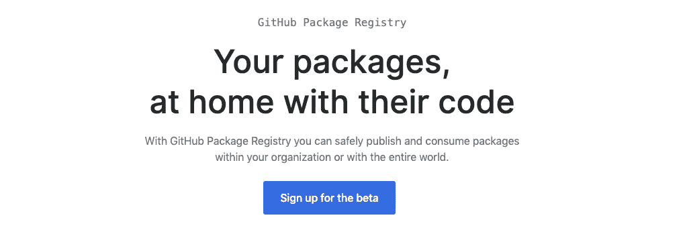
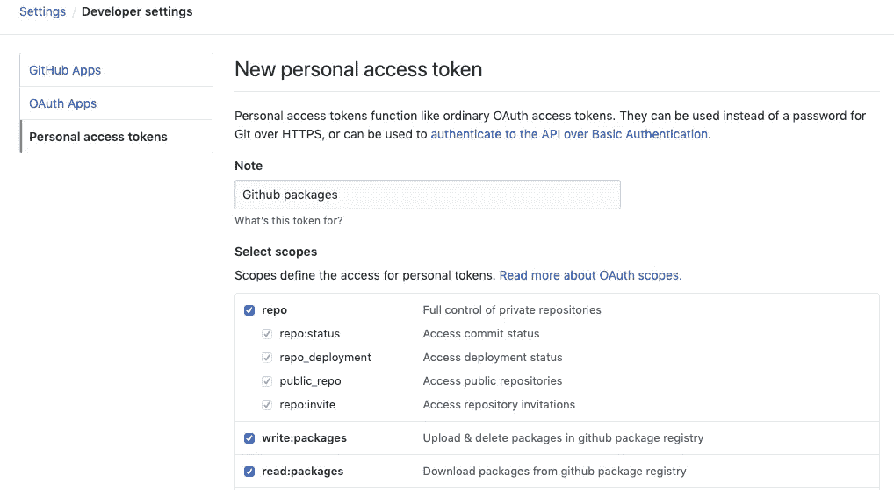
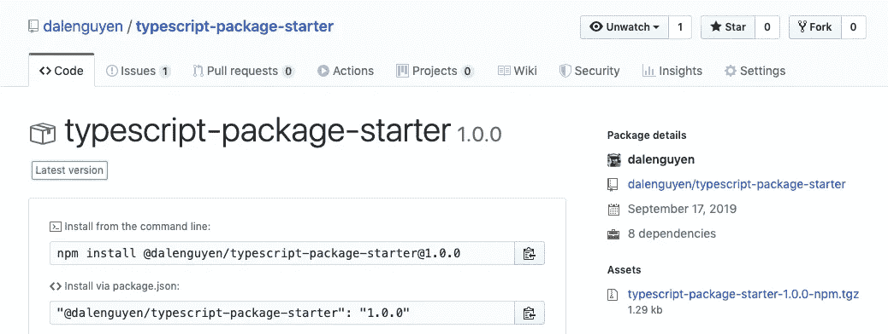

# 创建您的第一个 Github 包

> 原文：<https://itnext.io/create-your-first-github-package-9b5033d9bdd3?source=collection_archive---------4----------------------->


来源 Github.blog

Github 从 2019 年 5 月开始推出他们的 [Github 包注册表](https://github.com/features/package-registry)——一个包管理服务，就像 NPM 包一样。这意味着您可以在源代码旁边管理私有或公共包。

在我写这篇文章的时候，你仍然需要注册测试版来尝试这项新服务。



下面是创建第一个 Github 包的步骤。

**步骤 1:创建个人访问令牌**

登录你的 **Github 账号>设置>开发者设置**



**第二步:登录 npm.pkg.github.com**

```
dnguyen:~ dalenguyen$ npm login --registry=https://npm.pkg.github.comUsername: GitHub-username
Password: your-personal-access-token
Email: (this IS public) your-email@example.comLogged in as dalenguyen on https://npm.pkg.github.com/.
```

**第三步:准备你的源代码**

我已经创建了一个**类型脚本包启动器。你可以从 Github 克隆它。**

```
git clone [https://github.com/dalenguyen/typescript-package-starter.git](https://github.com/dalenguyen/typescript-package-starter.git)
```

以下是项目结构:

```
dist 
--index.js
src
--index.ts
test
--index.spec.ts
```

这个包只有一个简单的功能: **helloWorld**

```
export const helloWorld = () => 'Howdy!'
```

为了将您的包发布到 Github Package Registery，您需要添加 **publishConfig** 。否则，它会将软件包发布到 NPM 软件包注册中心。

```
{
  "name": "typescript-package-starter",
  "version": "1.0.0",
  "description": "TypeScript boilerplate for NPM or Github Packages",
  "main": "dist/index.js",
  "types": "dist/index.d.ts",
  "scripts": {
    "test": "mocha --timeout 60000 --exit -r ts-node/register test/**/*.spec.ts",
    "build": "tsc",
    "deploy": "npm publish"
  },
  "author": "Dale Nguyen",
  "license": "ISC",
  "repository": {
    "type": "git",
    "url": "git+[https://github.com/dalenguyen/typescript-package-starter.git](https://github.com/dalenguyen/typescript-package-starter.git)"
  },
  .........................
  "**publishConfig**": {
    "registry": "[https://npm.pkg.github.com/@dalenguyen](https://npm.pkg.github.com/@dalenguyen)"
  }
}
```

这样最终会创建一个包名:**@ dalen guyen/typescript-package-starter**。当您使用自己的包时，需要替换 package.json 中的用户名。

感谢 Alex——我的同事——通过添加库，您能够[将多个包发布到同一个 GitHub 库](https://help.github.com/en/articles/configuring-npm-for-use-with-github-package-registry#publishing-multiple-packages-to-the-same-github-repository)。

**第四步:把你的项目推给 Github repo**

在你准备好代码之后。推到你的 github 回购上。你必须在 Github.com 创建你的回购协议。

```
git initgit add .
git commit -m "Create first github package"
git push origin master
```

**第五步:发布你的第一个 Github 包**

运行测试，确保一切正常

```
npm test
```

部署您的第一个 Github 包

```
npm run build && npm deploy
```

瞧



**第六步:尝试安装你的第一个 Github 包**

在此之前，你需要创建一个 ***。npmrc*文件**

```
// .npmrc
@your-username:registry=https://npm.pkg.github.com
```

然后安装您的软件包:

```
dalenguyen$ npm i [@dalenguyen/typescript-package-starte](http://twitter.com/dalenguyen/typescript-package-starte)rnpm notice created a lockfile as package-lock.json. You should commit this file.
npm WARN github-packages@1.0.0 No repository field.+ typescript-package-starter@1.0.0 (as [@dalenguyen/typescript-package-starte](http://twitter.com/dalenguyen/typescript-package-starte)r)
added 1 package from 1 contributor and removed 6 packages in 2.375s
```

**第 7 步:测试你新创建的包**

```
// index.js
const starter = require('@dalenguyen/typescript-package-starter')
console.log(starter.helloWorld())
```

运行 index.js 文件

```
dalenguyen$ node index.js
Howdy!
```

现在你知道如何创建和发布你的第一个 Github 包了。在下一篇文章中，我将添加 [CI/CD 以便用](https://medium.com/@dalenguyen/continuous-integration-and-deployment-ci-cd-pipeline-with-github-package-and-github-actions-24547f98c85c) [Github 动作](https://github.com/features/actions)自动发布包。