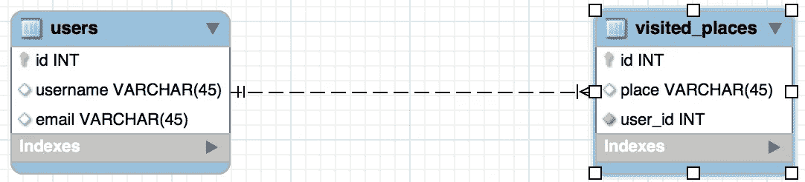
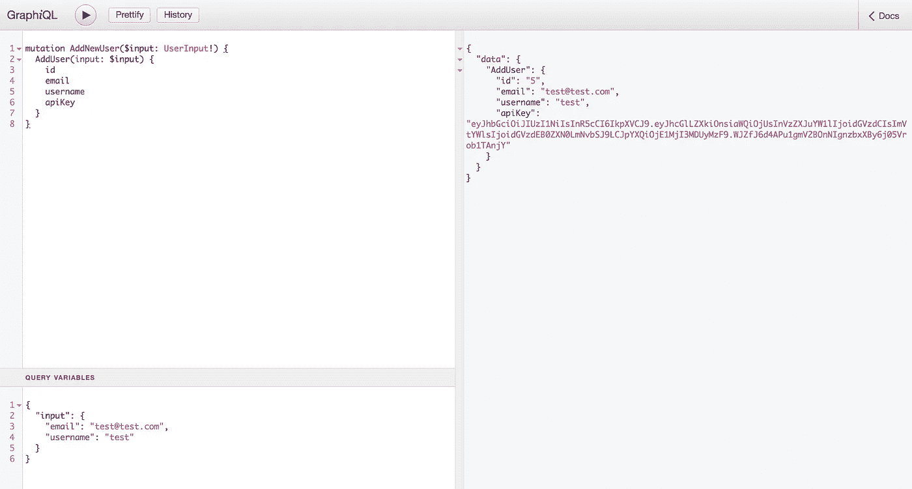
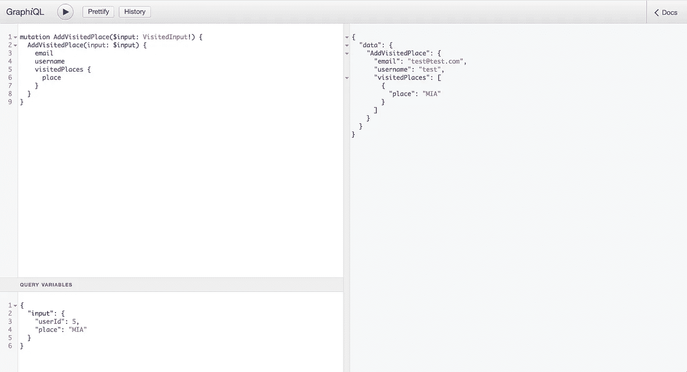
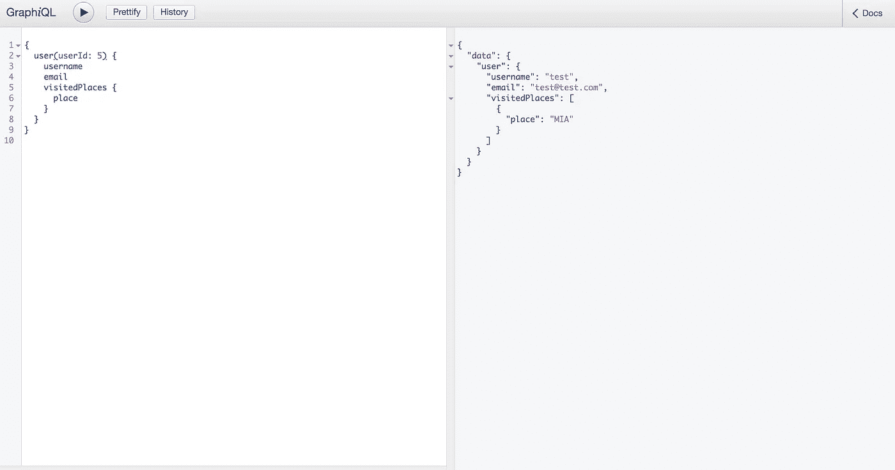

# 用 nodejs 创建您的第一个 GraphQL 应用程序，并设置一个 auth 中间件

> 原文：<https://itnext.io/create-your-first-graphql-app-and-set-an-auth-middleware-2dd841f714c2?source=collection_archive---------1----------------------->


照片由 [NASA](https://unsplash.com/photos/Q1p7bh3SHj8?utm_source=unsplash&utm_medium=referral&utm_content=creditCopyText) 在 [Unsplash](https://unsplash.com/search/photos/code?utm_source=unsplash&utm_medium=referral&utm_content=creditCopyText) 拍摄

> [点击这里在 LinkedIn 上分享这篇文章](https://www.linkedin.com/cws/share?url=https%3A%2F%2Fitnext.io%2Fcreate-your-first-graphql-app-and-set-an-auth-middleware-2dd841f714c2%3Futm_source%3Dmedium_sharelink%26utm_medium%3Dsocial%26utm_campaign%3Dbuffer)

我们将使用 [express](https://github.com/expressjs/express) 和 [pg](https://github.com/brianc/node-postgres) 创建我们的第一个 [GraphQL](https://graphql.org/) 服务器。这个想法是要有一个 GraphQL 中间件来处理所有的请求，并且在某些情况下，它会使用 [JWT](https://github.com/auth0/node-jsonwebtoken) 来验证用户是否有效。

在这种情况下，我们不打算使用[数据加载器](https://github.com/facebook/dataloader)，但如果你对它进行研究并尝试在这里实现它会很好……而且在不久的将来，会有一个新帖子使用它。

[全额回购](https://github.com/estrada9166/graphql-basics)

# **设置项目:**

首先要做的是设定我们的项目；首先，我们需要做多件事(在终端中):

为我们的项目创建一个新文件夹。

```
mkdir new-graphql-projectcd new-graphql-projectnpm init -ynpm i -s cors dotenv express express-graphql graphql jsonwebtoken pgnpm i -D nodemon standard
```

## **结构:**

```
|
|—.gitignore
|—node_modules
|—development.env
|—package.json
|—src
   |—App.js
   |—utils
   |—models
   |—schema
       |—mutations
       |—queries
       |—types
       |—index.js
```

**src/App.js:**

创建项目后，我们应该做的第一件事是创建服务器:

```
*const* express = require('express')
*const* graphqlHTTP = require('express-graphql')
*const* cors = require('cors')
*const* pg = require('pg')*const* pgPool = new pg.Pool({ database: 'mydb' })*const* app = express()*if* (process.env.NODE_ENV === 'development') {
  require('dotenv').config({ path: 'development.env' })
}app.set('port', process.env.PORT || 7000)*const* ncSchema = require('./schema')app.use('/graphql', cors(), (req, res) *=>* {
  graphqlHTTP({
    schema: ncSchema,
    graphiql: process.env.NODE_ENV === 'development',
    context: { pgPool, req }
  })(req, res)
})*const* server = app.listen(app.get('port'), () *=>* {
  console.log(`Server running -> PORT ${server.address().port}`)
})module.exports = app
```

有很多信息，所以让我们一步一步来:

1.  需要我们安装的所有外部模块

```
*const* express = require('express')
*const* graphqlHTTP = require('express-graphql')
*const* cors = require('cors')
*const* pg = require('pg')
```

2.为数据库创建一个新池。

```
*const* pgPool = new pg.Pool({ database: 'mydb' })
```

3.启动 express，设置环境变量(如果是`NODE_ENV === ‘development’`并设置端口(如果没有设置，则默认为`7000`)

```
*const* app = express()*if* (process.env.NODE_ENV === 'development') {
  require('dotenv').config({ path: 'development.env' })
}app.set('port', process.env.PORT || 7000)
```

4.导入`schema`，设置`GraphQL`为中间件:

如果这是第一次使用 GraphQL，那么如何在一个中间件中处理所有的路由可能会令人困惑；所以，有很多事情你必须首先知道:

*   有质疑，有突变。
*   当你发出一个请求时，你设置它是一个查询还是一个变异，然后 GraphQL 会处理它。
*   可以在查询或突变时调用上下文，我们将使用上下文连接到数据库并获取请求数据。
*   每个查询或变异都有一个类型，即响应请求的类型。
*   graphiql 是一个客户端进行查询和突变，建议只在开发时设置。

```
*const* ncSchema = require('./schema')app.use('/graphql', cors(), (req, res) *=>* {
  graphqlHTTP({
    schema: ncSchema,
    graphiql: process.env.NODE_ENV === 'development',
    context: { pgPool, req }
  })(req, res)
})
```

5.启动服务器:

```
*const* server = app.listen(app.get('port'), () *=>* {
  console.log(`Server running -> PORT ${server.address().port}`)
})
```

**development.env:**

```
PORT="YOUR_FAVORITE_PORT"
DATABASE_URL="YOUR_DATABASE_URL"
JWT_KEY="YOUR_JWT_KEY"
```

**package.json:**

```
"scripts": {
  "dev": "NODE_ENV=development nodemon src/App.js",
  "standard": "standard",
  "standard-fix": "standard --fix"
}
```

## models/pgdb.js:



数据库模型

```
*const* { signToken } = require('../utils')module.exports = pgPool *=>* {
  *return* {
    addNewUser ({ username, email }) {
      *return* pgPool.query(`
        insert into users (username, email)
        values ($1, $2) returning *
      `, [username, email])
      .then(res *=>* {
        *const* user = res.rows[0]
        user.apiKey = signToken(user)
        *return* user
      })
    }, addNewVisitedPlace ({ userId, place }) {
      *return* pgPool.query(`
        insert into visitedplaces (user_id, place)
        values ($1, $2) returning *
      `, [userId, place])
      .then(res *=>* {
        *return* res.rows[0]
      })
    }, getUserById (userId) {
      *return* pgPool.query(`
        select * from users where id = $1
      `, [userId])
      .then(res *=>* {
        *return* res.rows[0]
      })
    }, getVisitedPlaces (userId) {
      *return* pgPool.query(`
        select place from visitedplaces where user_id = $1
      `, [userId])
      .then(res *=>* {
        *return* res.rows
      })
    }
  }
}
```

我们需要创建 4 个查询，其中 2 个用于插入，另外 2 个用于选择。如你所见，这些是一些基本的查询，有些返回一个数组，有些只返回一行。此外，当我们创建一个新用户时，我们需要返回 apiKey，也就是我们需要使用`Bearer`作为头或者使用`access_token`作为查询传递的 API key。

## utils/index.js:

```
*const* jwt = require('jsonwebtoken')*const* signToken = str *=>* {
  *return* new Promise(resolve *=>* {
    resolve(jwt.sign({ apiKey: str }, process.env.JWT_KEY))
  })
}*const* verifyJwt = req *=>* {
  *let* token
  *if* (req.query && req.query.hasOwnProperty('access_token')) {
    token = req.query.access_token
  } *else* *if* (req.headers.authorization && req.headers.authorization.includes('Bearer')) {
    token = req.headers.authorization.split(' ')[1]
  }

  *return* new Promise((resolve, reject) *=>* {
    jwt.verify(token, process.env.JWT_KEY, (error, decoded) *=>* {
      *if* (error) reject('401: User is not authenticated')

      resolve(decoded)
    })
  })
}module.exports = { signToken, verifyJwt }
```

我们需要创建两个方法；一个是对我们创建用户时要返回的令牌进行签名，另一个是验证令牌是否得到了查询或授权头。

查询:`&access_token=<YOUR_TOKEN>`

授权:`Bearer <YOUR_TOKEN>`

# GraphQL 魔法

既然我们已经完成了需要继续的不同文件的设置，我们将从 GraphQL 的所有神奇之处开始。

## 类型:

在这里，我们定义我们希望对发出请求的用户做出什么样的响应，我们可以在这里添加一些验证，还可以定义我们要返回什么类型的数据。\

*   有不同类型的类型，我们应该从`graphql`导入，并设置什么样的数据是我们正在返回的。
*   每种类型必须是一个`GraphQLObjectType`，它将有多个属性，如名称和字段(返回时用户将获得的值)。
*   每个字段都必须有一个类型(在这里我们设置了之前导入的类型),并且它还可以有一个解析。
*   Resolve:这是一个接收 3 个参数的函数，实际的对象、参数和上下文，在 resolve 中我们可以处理不同的逻辑，比如检查令牌是否有效的 auth 中间件；同样，当我们返回一个值时，我们可以返回一个承诺而不解析它，GraphQL 会处理它。

## 架构/类型/me.js:

```
*const* { 
  GraphQLID,
  GraphQLObjectType,
  GraphQLString,
  GraphQLNonNull
} = require('graphql')*const* MeType = new GraphQLObjectType({
  name: 'Me',
  fields: () *=>* {
    *return* {
      id: { type: GraphQLNonNull(GraphQLID) },
      email: { type: GraphQLNonNull(GraphQLString) },
      username: { type: GraphQLNonNull(GraphQLString) },
      apiKey: { type: GraphQLNonNull(GraphQLString) }
    }
  }
})module.exports = MeType
```

当我们要使用 meType 时；我们可以要求查询返回:

*   email:是一个不能为空的字符串。
*   用户名:它是一个不能为空的字符串。
*   apiKey:是一个不能为空的字符串。

## schema/types/places.js:

```
*const* {
  GraphQLObjectType,
  GraphQLString,
  GraphQLNonNull,
} = require('graphql')*const* PlacesType = new GraphQLObjectType({
  name: 'Place',
  fields: () *=>* {
    *return* {
      place: { type: GraphQLNonNull(GraphQLString) },
    }
  }
})module.exports = PlacesType
```

当我们要使用 PlacesType 时；我们可以要求查询返回:

*   place:是一个不能为空的字符串。

## 模式/类型/用户. js:

```
*const* {
  GraphQLObjectType,
  GraphQLString,
  GraphQLNonNull,
  GraphQLList
} = require('graphql')*const* { verifyJwt } = require('../../utils')
*const* pgdb = require('../../models/pgdb')*const* UsersType = new GraphQLObjectType({
  name: 'Users',
  fields: () *=>* {
    *const* PlacesType = require('./places')
    *return* {
      email: { type: GraphQLNonNull(GraphQLString) },
      username: { type: GraphQLNonNull(GraphQLString) },
      visitedPlaces: {
        type: new GraphQLList(PlacesType),
        resolve: async (obj, args, { pgPool, req }) *=>* {
          *try* {
            *await* verifyJwt(req)
            *return* pgdb(pgPool).getVisitedPlaces(obj.id)
          } *catch* (err) {
            *return* []
          }
        }
      }
    }
  }
})module.exports = UsersType
```

这种型号和其他型号有点不同。

我们要求`verifyJwt`；它将用于验证我们传递的令牌是否有效，如果无效，我们将在访问过的地方返回一个空数组。

你可能注意到的另一件新事情是，我们正在使用`GraphQLList`和`resolve`。

GraphQLList 会让 GraphQL 知道我们要返回 placesType 的列表(数组)。

Resolve 将是`async/await`，因为我们想首先检查令牌是否有效，所以我们将`(obj, args, { pgPool, req })`作为参数传递，其中`obj`是我们从用户那里得到的完整响应，`pgPool`是我们在`App.js`上设置的数据库池，`req`是来自 express 的请求。然后我们验证令牌是否有效，如果有效，我们在数据库中搜索用户访问过的所有地方并返回它们。

## 查询:

查询是我们想要设置让 GraphQL 对我们的数据库执行的`/GET`的地方，我们在查询中设置我们想要给出的响应类型，因此我们可以确定我们想要共享哪些数据。

## 模式/查询/getUser.js:

```
*const* { GraphQLID, GraphQLNonNull } = require('graphql')*const* UserType = require('../types/users')
*const* pgdb = require('../../models/pgdb')module.exports = {
  type: UserType,
  description: 'This query will search for a user with userId',
  args: {
    userId: { type: new GraphQLNonNull(GraphQLID) }
  },
  resolve (obj, { userId }, { pgPool, req }) {
    *return* pgdb(pgPool).getUserById(userId)
  }
}
```

该查询将具有我们已经在类型上定义的类型；可选的描述；args 是可选的，它是一个带有查询将接收的参数的对象，而且，它必须有一个类型；并解析我们在哪里做所有的逻辑来响应，在这种情况下，查询正在等待获取`userId`，它将使用它对数据库进行查询。

## 突变:

突变是让我们将信息保存到数据库的查询。我们在突变中设置我们想要给出的响应类型，这样我们就可以确定我们想要共享哪些数据。

## schema/mutations/addUser.js:

```
*const* {
  GraphQLInputObjectType,
  GraphQLString,
  GraphQLNonNull
} = require('graphql')*const* pgdb = require('../../models/pgdb')
*const* MeType = require('../types/me')*const* UserInputType = new GraphQLInputObjectType({
  name: 'UserInput',
  fields: {
    email: { type: GraphQLNonNull(GraphQLString) },
    username: { type: GraphQLNonNull(GraphQLString) }
  }
})module.exports = {
  type: MeType,
  description: 'This mutation will create a new user and it will
    return a apiKey',
  args: {
    input: { type: new GraphQLNonNull(UserInputType) }
  },
  resolve: async (obj, { input }, { pgPool }) *=>* {
    *return* pgdb(pgPool).addNewUser(input)
  }
}
```

我们需要定义`GraphQLInputObjectType`,这是我们将在 args 上接收的类型。

## schema/mutations/addvisitedplaces . js:

```
*const* {
  GraphQLInputObjectType,
  GraphQLID,
  GraphQLString,
  GraphQLNonNull
} = require('graphql')*const* { verifyJwt } = require('../../utils')
*const* pgdb = require('../../models/pgdb')
*const* UsersType = require('../types/users')*const* VisitedInputType = new GraphQLInputObjectType({
  name: 'VisitedInput',
  fields: {
    userId: { type: GraphQLNonNull(GraphQLID) },
    place: { type: GraphQLNonNull(GraphQLString) }
  }
})module.exports = {
  type: UsersType,
  description: 'This mutation will add a new visited place',
  args: {
    input: { type: new GraphQLNonNull(VisitedInputType) }
  },
  resolve: async (obj, { input }, { pgPool, req }) *=>* {
    *await* verifyJwt(req)
    *await* pgdb(pgPool).addNewVisitedPlace(input)
    *return* pgdb(pgPool).getUserById(input.userId)
  }
}
```

首先，我们要验证令牌是否有效，然后在数据库中保存一个新的访问过的地方。验证之后，我们保存信息，然后用用户和访问过的地方的数据进行响应。如果令牌无效，它将返回一个错误`401: User is not authenticated`。

## 架构/索引. js:

```
*const* { GraphQLSchema, GraphQLObjectType } = require('graphql') *const* GetUser = require('./queries/getUser')*const* AddNewUserMutation = require('./mutations/addUser')
*const* AddVisitedPlaceMutation = require('./mutations/addVisitedPlace')*const* RootQueryType = new GraphQLObjectType({
  name: 'RootQuery',
  fields: () *=>* ({
    user: GetUser
  })
})*const* RootMutationType = new GraphQLObjectType({
  name: 'RootMutation',
  fields: () *=>* ({
    AddUser: AddNewUserMutation,
    AddVisitedPlace: AddVisitedPlaceMutation
  })
})*const* ncSchema = new GraphQLSchema({
  query: RootQueryType,
  mutation: RootMutationType
})module.exports = ncSchema
```

现在我们想定义如何使用我们的`GraphQLSchema`，因此，我们为查询创建了一个`GraphQLObjectType`,并为将在下面使用的突变创建了另一个`GraphQLObjectType`:

```
*const* ncSchema = new GraphQLSchema({
  query: RootQueryType,
  mutation: RootMutationType
})
```

# **如何测试？**

在创建了整个项目之后，我们可以开始测试它，所以请遵循下面的步骤:

`npm run dev`

在您的浏览器上，使用您设置的端口和`/graphql`打开本地主机。它将打开一个很好的客户端来测试 GraphQL。

## 添加新用户:



打开查询变量来设置变异所需的变量

```
mutation AddNewUser($input: UserInput!) {
  AddUser(input: $input) { 
    id
    email
    username
    apiKey
  }
}{
  "input": {
    "email": "[test@test.com](mailto:test@test.com)",
    "username": "test"
  }
}
```

## 添加参观过的地方:

要添加一个新的访问过的地方，您必须将从前面的变异中获得的 apiKey 设置为 query 或 header。

要设置为查询添加到 URL `&access_token=<API_KEY>`。



打开查询变量来设置变异所需的变量

```
mutation AddVisitedPlace($input: VisitedInput!) {
  AddVisitedPlace(input: $input) {
    email
    username
    visitedPlaces {
      place
    }
  }
}{
  "input": {
    "userId": 5,
    "place": "MIA"
  }
}
```

## 获取用户访问过的地点:



```
{
  user(userId: 5) {
    username
    email
    visitedPlaces {
      place
    }
  }
}
```

您可以查看完整回购[这里](https://github.com/estrada9166/graphql-basics)

GraphQL 的相关帖子:

## [在 GraphQL 上返回带有状态代码的自定义错误](https://medium.com/@estrada9166/return-custom-errors-with-status-code-on-graphql-45fca360852)