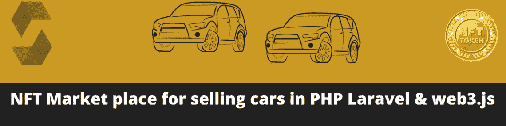
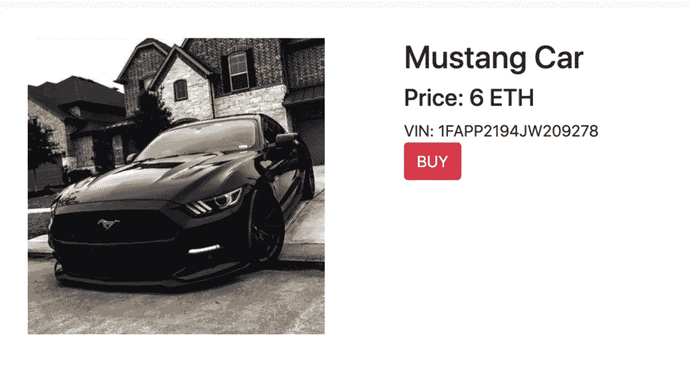
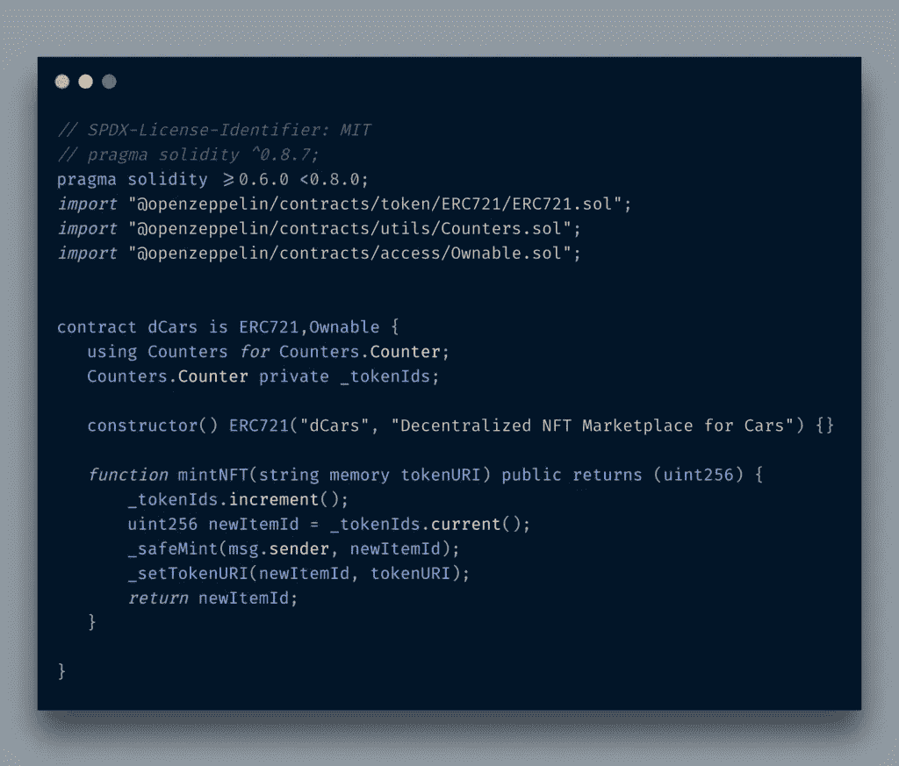
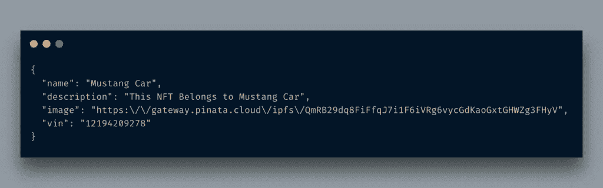
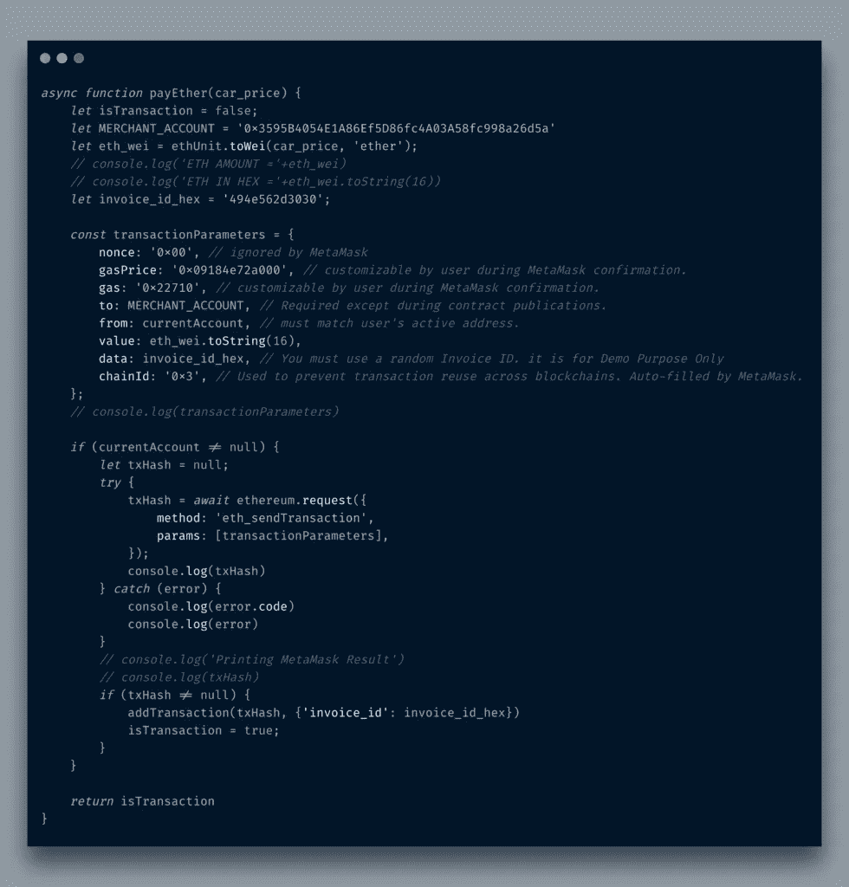
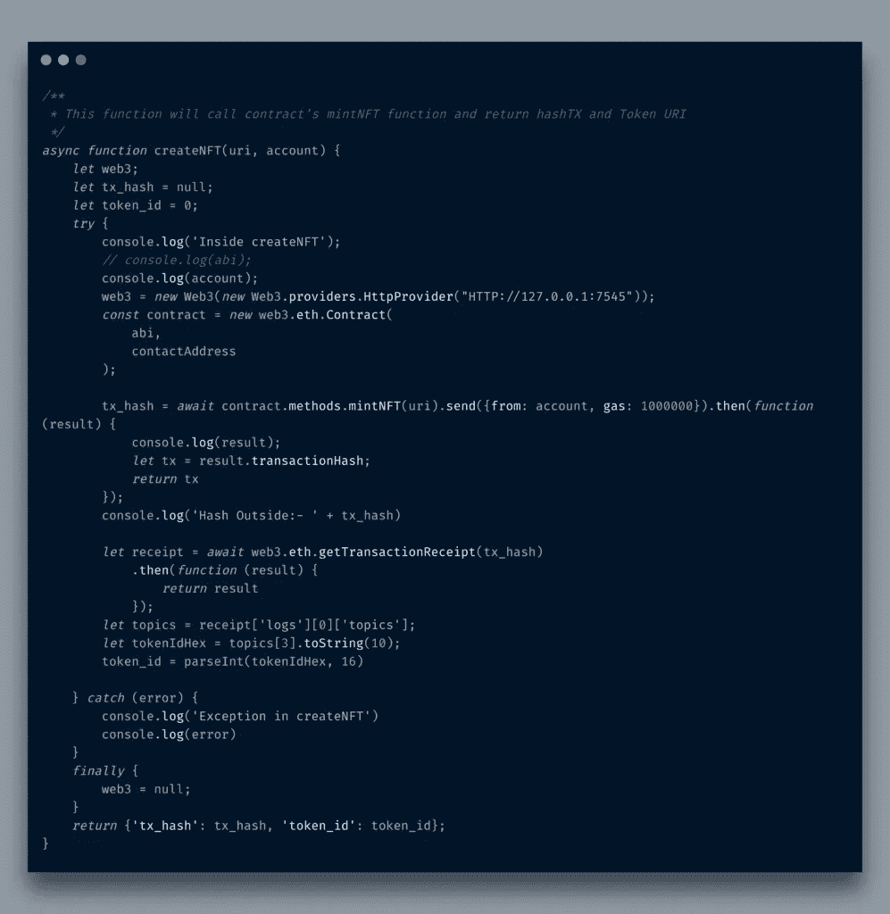
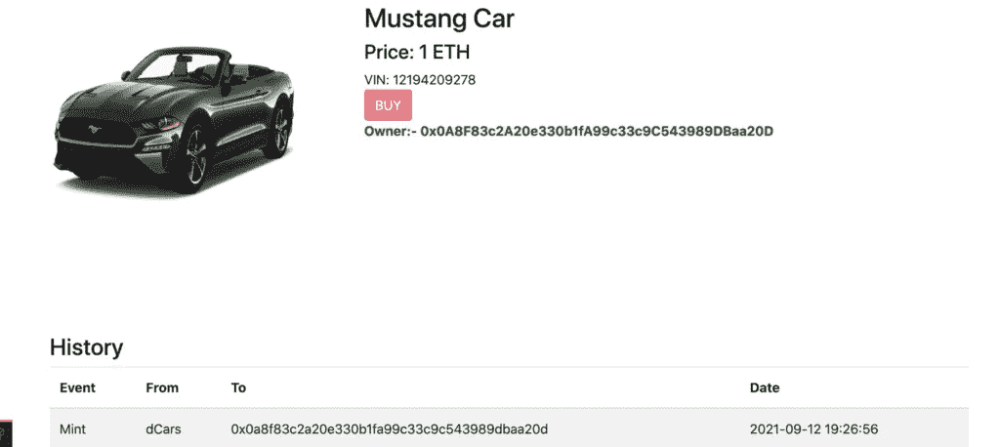

# 在 PHP Laravel 和 web3.js 中创建第一个销售汽车的 NFT 市场

> 原文：<https://itnext.io/create-your-first-nft-marketplace-for-selling-cars-in-php-laravel-and-web3-js-abcb3a027a1e?source=collection_archive---------1----------------------->



如果你对加密感兴趣，那么你很可能听说过 NFT，尤其是在发生了像[比普尔以 6900 万美元](https://www.theverge.com/2021/3/11/22325054/beeple-christies-nft-sale-cost-everydays-69-million)卖掉他的艺术品或者这个[友谊迷妹](https://www.dawn.com/news/1638372)这样的事件之后。

人们通常认为 NFT 只适合绘画之类的艺术，但事实并非如此。NFT 是独一无二的，权威的，所有权的转移。 ***我们打算用 NFT 来卖车。***

在这篇文章中，我将讨论如何铸造 ERC721 NFT 令牌，然后将它们与新的或现有的网站相结合。购买汽车的用户将支付购买汽车的金额和铸造费。我遇到了许多关于 NFT 或 ERC721 令牌的教程，但没有一个真正提供了端到端的解决方案。这非常令人沮丧，因为 NFT 本身什么都不是，除非它与一个应用程序集成在一起。在这篇文章中，我提出了一个用 PHP Laravel 和 web3.js 开发的虚构的汽车销售门户网站。正如我在之前的[文章](http://blog.adnansiddiqi.me/build-your-first-solidity-dapp-with-web3-js-and-metamask/)中所说，后端框架或语言并不重要。我将会以突出 NFT 功能及其集成的方式来编写本教程。如果你想知道为什么我使用 PHP 而不是 Python，那么， ***这只是试图打破区块链编程完全基于 Javascript 技术的禁忌。***

# 什么是 NFT？

根据[维基百科](https://en.wikipedia.org/wiki/Non-fungible_token):

> **不可替代令牌(NFT)是存储在称为区块链的数字分类账上的数据单位，它证明数字资产是唯一的，因此不可互换。** [1] NFTs 可用于表示照片、视频、音频和其他类型的数字文件。然而，对原始文件的任何副本的访问不限于 NFT 的买方。虽然任何人都可以获得这些数字项目的副本，但 NFT 在区块链上被跟踪，以向所有者提供独立于版权的所有权证明。

目前 NFT 很受欢迎。虽然大多数 NFT 都是建立在以太坊基础上的区块链，但并不局限于此。区块链像索拉纳和许多其他人也在他们各自的平台上提供 NFT。

我不打算讨论 Laravel 代码本身，因为这不是本文的范围，我也不打算通过 web3.js 讨论 Truffle/Ganache 和智能合约集成。你可以在这里阅读。最终的网站将看起来如下(*请忽略蹩脚的前端，因为我更后端的家伙！*)

dCars 演示

# 网站开发

网站的后台是用 Laravel 开发的。MySQL 已经被用来存储所有的数据，IPFS 是一个分散的图像 CDN。 [Pinata Cloud](https://www.pinata.cloud/) 提供 *pinning* 服务，实际上是用来上传 IPFS 上的所有图片。网站的流程非常简单。目前，dApps 被认为本质上是混合的，也就是说，一些功能在区块链，尤其是支付功能，其余的信息在集中的系统中。用户注册并上传他想要出售的汽车的详细信息。图像通过 Pinata API 上传，用于固定。API 返回一个散列，它和其他信息一起存储在 MySQL 数据库中。`cars`表格结构如下图所示:

```
CREATE TABLE `cars` (`id` bigint(20) unsigned NOT NULL AUTO_INCREMENT,`name` varchar(255) COLLATE utf8mb4_unicode_ci NOT NULL,`user_id` int(10) unsigned NOT NULL DEFAULT '0',`vin` varchar(255) COLLATE utf8mb4_unicode_ci NOT NULL,`price` double(8,2) NOT NULL,`url` varchar(255) COLLATE utf8mb4_unicode_ci NOT NULL,`status` tinyint(4) NOT NULL,`created_at` timestamp NULL DEFAULT NULL,`updated_at` timestamp NULL DEFAULT NULL,PRIMARY KEY (`id`)) ENGINE=InnoDB AUTO_INCREMENT=1 DEFAULT CHARSET=utf8mb4 COLLATE=utf8mb4_unicode_ci;
```

上传清单的功能如下所示:

```
public function addedCar( Request $request ) {
  $url                = $request->file( 'url' );
  $name               = $request->get( 'name' );
  $vin                = $request->get( 'vin' );
  $price              = $request->get( 'price' );
  $uploaded_file_hash = '';if ( $request->hasFile( 'url' ) ) {
   $url                = $request->file( 'url' );
   $uploaded_file_name = strtolower( str_replace( ' ', '_', $name ) );$response = Http::withHeaders( [
    'pinata_api_key'        => '72a94c9c71e9e91de6e3',
    'pinata_secret_api_key' => '19e64398c5ef83b27374ebc0984befb15510cb1b7bea63faa7db0277398cb194'
   ] )->attach( 'file', file_get_contents( $url ), $uploaded_file_name )
                   ->post( '[https://api.pinata.cloud/pinning/pinFileToIPFS'](https://api.pinata.cloud/pinning/pinFileToIPFS'), [
                   ] );
   $data     = $response->json();if ( array_key_exists( 'IpfsHash', $data ) ) {
    $uploaded_file_hash = $data['IpfsHash'];
    $size               = $data['PinSize'];if ( $size > 0 ) {
     // It is time to upload it
     $car = Car::create( [
      'name'   => $name,
      'vin'    => $vin,
      'url'    => $uploaded_file_hash,
      'price'  => $price,
      'status' => 1,
     ] );if ( $car->id > 0 ) {
      return redirect()->route( 'dashboard' );
     }}
   }
  }
 }
```

不要高兴，因为这些钥匙已经不存在了😉

上传后的汽车如下图所示:



如您所见，我在这里使用了 VIN。使用它的原因是为产品带来独特性，因为 NFT 就是关于独特性的。

# NFT 智能合同

目前，以太坊提供了两种智能合约标准: *ERC721* 和 *ERC1155* 。我用的是非常基本的 ERC721，因为它很好地满足了这个目的。我用的是 [OpenZeppelin](https://docs.openzeppelin.com/contracts/2.x/erc721) 提供的。使用现有的模板可以避免你自己想出错误的实现，而另一方面，OZ 家伙的智能合同已经被安全公司彻底审计了。 *dCars* NFT 智能合约如下图所示:



注意`dCars`正在继承 OZ guys 提供的`ERC721`合同。出于所有权和授权的目的，我也继承了`Ownable`,从而使它更安全。你可以在这里了解更多。

我只实现了 *minting* 特性，因为我通过引入`Counters`改变了默认实现，其余的功能我们已经可以使用。感谢我们的朋友*传承*。

`mintNFT`函数接受一个`tokenURI`参数，该参数实际上指向单个 NFT 的元数据。元数据如下所示。这实际上是帮助你在像 *Openseas* 这样的 NFT 市场上发现 NFT 的元数据。



# Web3js 集成

这里使用 web3.js 有两个原因:第一，要求用户支付汽车本身的价格，第二，用于造币的汽油费。我不会详细讨论从你的用户的元掩码收费 ETH，因为我在这里[讨论过](http://blog.adnansiddiqi.me/develop-your-first-decentralized-ecommerce-application-with-python-flask-and-metamask/)和铸造 NFT，它实际上是调用我在这里讨论过的`mintNFT`函数。`payEther`功能看起来如下图。



而`createNFT` JS 函数实际上是调用智能合约函数，如下图所示:



这两个函数实际上都是通过 BUY 按钮的 click 事件调用的，在交易成功后，它将信息存储在相关的 DB 表中。此后，详细信息页面将如下所示:



参观者可以看到这辆车现在的主人是谁，以及它的历史。很有可能是所有者把它转卖给他人，因为这个`transferFrom`智能合同函数将被调用，但这里没有实现。

# 结论

因此，在这篇文章中，你将了解什么是 NFT，以及作为一名开发者，你如何在现有的或新的 web 应用中实现它。这是一个不完整的项目，像倒卖功能还没有在其中实施。像往常一样，代码可以在 Github 上找到。

*原载于 2021 年 9 月 16 日*[*http://blog . adnansiddiqi . me*](http://blog.adnansiddiqi.me/create-your-first-nft-market-place-for-selling-cars-in-php-laravel-and-web3-js/)*。*