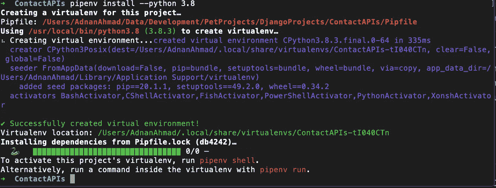
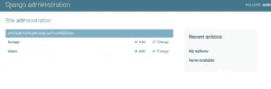
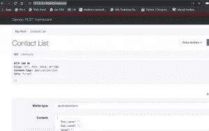
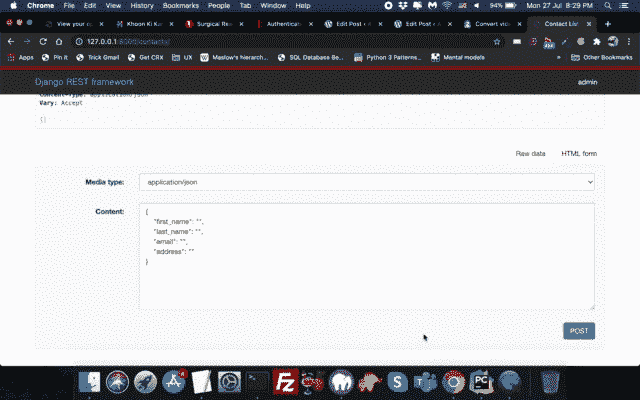

# 在 Django Rest 框架中创建您的第一个 REST API

> 原文：<https://itnext.io/create-your-first-rest-api-in-django-rest-framework-e45fa3318106?source=collection_archive---------5----------------------->


在这篇文章中，我将谈论 Django Rest 框架或 DRF。DRF 用于在 Django 中创建 RESTful APIs，以后可以被各种应用程序使用；移动、网络、桌面等。我们将讨论如何在你的机器上安装 DRF，然后为系统编写 API。

在我们讨论 DRF 之前，让我们先谈谈休息本身。

# 什么是休息

来自维基百科

> **表述性状态转移(REST)** 是一种软件架构风格，它定义了一组用于创建 Web 服务的约束。符合 REST 架构风格的 Web 服务，称为 RESTful Web 服务，提供互联网上计算机系统之间的互操作性。RESTful Web 服务允许请求系统通过使用一组统一的、预定义的无状态操作来访问和操作 Web 资源的文本表示。其他种类的 Web 服务，如 SOAP Web 服务，公开了它们自己的任意操作集。[1]

*Rest API(应用编程接口)*是一种无状态的客户端-服务器架构，使用典型的 URL 方案进行数据交换。罗伊·菲尔丁在 2000 年的著名论文中首次提出了这一观点。用于在客户机和服务器之间提供通信的 URL 通常被称为*端点*。不同的 HTTP 方法用于此目的:

*   GET:-它返回请求的数据，可以是记录列表或单个记录。
*   POST:-它创建了一个新记录。
*   PUT/PATCH:-它更新现有的记录。
*   删除；它会删除记录。

返回的数据可以是 XML、JSON 或其他格式，但前两种格式最常见。

好了，现在你已经了解了一点 REST API，我们来讨论一下 Django Rest 框架本身。

# 什么是 Django Rest 框架

Django Rest Framework 是一个用 Python 编写 RESTful APIs 的开源框架。它是基于 Django 框架的，所以对 Django 的了解是非常有益的，尽管不是必需的。

因此，我们将为联系人管理系统开发 API，用户可以使用我们的 API 来创建/更新和删除联系人。返回的数据将采用 JSON 格式。

# 安装和设置

我将使用 [Pipenv](https://pipenv-fork.readthedocs.io/en/latest/) 为我们的 API 设置开发环境。Pipenv 使隔离您的开发环境变得更加容易，不管您的机器上安装了什么。它还允许您选择一个不同的 Python 版本，无论它安装在您的机器上。它使用`Pipfile`来管理所有与项目相关的依赖项。我不打算在这里详细介绍 Pipenv，所以将只使用项目所必需的命令。

运行`pip install pipenv`可以通过 PyPy 安装 Pipenv

安装完成后，我们现在必须为我们的项目选择 Python 版本。我愿意使用 Python 3.8 版本，而不是我机器上已经安装的 Py3.7。要安装 Python 3.8，您只需运行以下命令:

`pipenv install --python 3.8`

它将如下安装:



你也可以运行`pipenv install --three`，其中三表示 Python 3.x。

安装完成后，你可以通过运行`pipenv shell`命令来激活虚拟环境

```
➜  ContactAPIs pipenv shell
Launching subshell in virtual environment…
 . /Users/AdnanAhmad/.local/share/virtualenvs/ContactAPIs-tI040CTn/bin/activate
➜  ContactAPIs  . /Users/AdnanAhmad/.local/share/virtualenvs/ContactAPIs-tI040CTn/bin/activate
```

一旦进入 shell(您将看到类似于*(contact APIs)➜contact APIs*的提示)，您将能够安装所需的库。首先，我们将通过运行以下命令来安装 Django:

`pipenv install django`

注意是 *pipenv* ，不是 pip。当你进入外壳时，你将使用`pipenv`。底层使用 pip，但所有条目都存储在`Pipfile`中。比运行`pipenv install djangorestframework`后。`Pipfile`将如下图所示:

```
[[source]]
name = "pypi"
url = "[https://pypi.org/simple](https://pypi.org/simple)"
verify_ssl = true[dev-packages][packages]
django = "*"
djangorestframework = "*"[requires]
python_version = "3.8"
```

现在我们必须创建一个 Django 项目。为了创建 Django 项目，我们将运行如下的`django-admin`命令:

`django-admin startproject contact_api .`

它将创建如下所示的目录结构:

```
(ContactAPIs) ➜  ContactAPIs tree  contact_api
contact_api
├── __init__.py
├── asgi.py
├── settings.py
├── urls.py
└── wsgi.py
```

到目前为止一切顺利，让我们看看是否可以运行本地开发服务器。运行命令`python manage.py runserver`。如果一切顺利，您应该会看到如下所示的窗口:


很美，不是吗？好的，让我们运行一些现有的迁移。为此，我们将运行命令`python manage.py migrate`。

```
(ContactAPIs) ➜  ContactAPIs python manage.py migrate  
Operations to perform:
  Apply all migrations: admin, auth, contenttypes, sessions
Running migrations:
  Applying contenttypes.0001_initial... OK
  Applying auth.0001_initial... OK
  Applying admin.0001_initial... OK
  Applying admin.0002_logentry_remove_auto_add... OK
  Applying admin.0003_logentry_add_action_flag_choices... OK
  Applying contenttypes.0002_remove_content_type_name... OK
  Applying auth.0002_alter_permission_name_max_length... OK
  Applying auth.0003_alter_user_email_max_length... OK
  Applying auth.0004_alter_user_username_opts... OK
  Applying auth.0005_alter_user_last_login_null... OK
  Applying auth.0006_require_contenttypes_0002... OK
  Applying auth.0007_alter_validators_add_error_messages... OK
  Applying auth.0008_alter_user_username_max_length... OK
  Applying auth.0009_alter_user_last_name_max_length... OK
  Applying auth.0010_alter_group_name_max_length... OK
  Applying auth.0011_update_proxy_permissions... OK
  Applying sessions.0001_initial... OK
```

Django 默认使用 Sqlite3，但是你可以通过改变设置来使用你最喜欢的 RDBMS 引擎。好了，所有与系统相关的表都创建好了。我们应该可以访问`http://127.0.0.1:8000/admin/`但是我们无法登录。我们没有任何证件，怎么能够呢？所以现在，我们将创建一个超级用户。

`python manage.py createsuperuser --email me@example.com --username admin`

它会提示您设置密码。完成后，你进入管理，你会看到一个类似如下的窗口:



现在我们将创建一个 Django 应用程序。为此，首先我将进入`contact_api`文件夹，然后运行以下命令:

```
(ContactAPIs) ➜  ContactAPIs cd contact_api 
(ContactAPIs) ➜  contact_api  django-admin startapp contact
```

之后，文件夹结构将如下所示:

```
(ContactAPIs) ➜  contact_api tree .
.
├── __init__.py
├── asgi.py
├── contact
│   ├── __init__.py
│   ├── admin.py
│   ├── apps.py
│   ├── migrations
│   │   └── __init__.py
│   ├── models.py
│   ├── tests.py
│   └── views.py
├── settings.py
├── urls.py
└── wsgi.py
```

Django 开发人员可能会发现在项目文件夹中创建应用程序并不常见，但 DRF 官方网站上推荐使用。你可以一直按照你的方式，从项目文件夹中创建一个应用程序。

现在，我们将在`INSTALLED_APPS`中包含我们的 DRF 框架和新创建的应用程序。因此，前往`contact_api`文件夹中的`settings.py`，添加如下条目:

```
INSTALLED_APPS = [
    'django.contrib.admin',
    'django.contrib.auth',
    'django.contrib.contenttypes',
    'django.contrib.sessions',
    'django.contrib.messages',
    'django.contrib.staticfiles',
    'rest_framework',
    'contact_api.contact',
]
```

注意最后两个条目。我们添加了`rest_framework`，这样我们就可以拥有 API 功能。其次，我们添加了新创建的应用程序。注意那条路。因为应用程序是在`contact_api`文件夹中创建的，所以我们必须用点符号给出完整的路径。

我们现在将为我们的 API 端点创建模型和视图。在`models.py`文件中，我们将编写我们的模型。这个模型将是通过 API 检索或插入数据的唯一责任。

```
from django.db import models# Create your models here.
class Contact(models.Model):
    first_name = models.CharField(max_length=50)
    last_name = models.CharField(max_length=50)
    email = models.CharField(max_length=50)
    address = models.CharField(max_length=100)
```

这是我们有几个字段的模型。现在应该创建迁移，然后迁移它，以便可以在 DB 文件中生成模式。我们将运行命令`python manage.py makemigrations contact`,它将产生如下输出:

```
(ContactAPIs) ➜  ContactAPIs python manage.py makemigrations contact  
Migrations for 'contact':
  contact_api/contact/migrations/0001_initial.py
    - Create model Contact
```

迁移文件已创建。是时候迁移它了！

```
(ContactAPIs) ➜  ContactAPIs python manage.py migrate               
Operations to perform:
  Apply all migrations: admin, auth, contact, contenttypes, sessions
Running migrations:
  Applying contact.0001_initial... OK
(ContactAPIs) ➜  ContactAPIs
```

除了创建以前的迁移之外，它还创建了我们刚刚创建的迁移。我们现在将在`admin.py`中注册我们的模型，以便我们可以在管理界面中与模型交互:

```
from django.contrib import admin
from .models import Contact# Register your models here.
admin.site.register(Contact)
```

如果您访问[http://127 . 0 . 0 . 1:8000/admin，](http://127.0.0.1:8000/admin,)您会在那里找到新创建的**联系人**模型。


接下来，我们将创建视图和数据序列化程序。

首先，我们将创建序列化程序。

**序列化器**帮助将模型和*查询集*转换成本地 Python 数据类型，这样它们就可以呈现为 JSON 或 XML。因为它们序列化数据，所以你总是可以将它们反序列化回模型和查询集。序列化文件将如下所示:

```
from rest_framework import serializersfrom .models import Contactclass Contactializer(serializers.HyperlinkedModelSerializer):
    class Meta:
        model = Contact
        fields = ('id', 'url', 'first_name', 'last_name', 'email', 'address')
```

在导入了必要的类之后，我们创建了一个类，并提到了我们想要序列化的类。我们还提到了我们希望公开哪些字段，从而进行序列化。

接下来，我们将创建视图，为此，我们将使用视图集。

视图集将多个视图的逻辑组合在一个类中。

现在我们必须设置我们的 API 端点，为此，我们必须做一些艰苦的工作。首先，我们必须在我们的 app 文件夹中创建一个文件`urls.py`，即`contact`文件夹。

```
from rest_framework import routers
from django.urls import path,include
from . import viewsrouter = routers.DefaultRouter()
router.register('contacts', views.ContactView)urlpatterns = [
    path('',include(router.urls))
]
```

在这里你将学习一个新概念，[路由器](https://www.django-rest-framework.org/api-guide/routers/#routers)。如果您有 Laravel、Rails 甚至 NodeJS 的背景，您应该对路由器的功能有所了解；它将请求路由到适当的资源。DRF 提供三种路由器:简单路由器、默认路由器和定制路由器。默认路由器类似于简单路由器，它返回所有与 CRUD 相关的端点以及每个记录端点的 URL 和可选的 JSON 视图。接下来，我们将视图集注册到一个根名称中，这里是 **contacts** 。因此，所有的端点都将在 API 端点中包含`contacts/`。注册后，您将使用相同的旧`include`来设置端点的路径，包括`router.urls`。在 RoR 和 Laravel 世界中，这些被称为*足智多谋的路由*，因为你不必为*创建*、*更新*、*获取、发布*和*删除*创建单独的视图和它们各自的 URL。当然，您总是可以通过添加一个方法并用一个`@action`装饰器进行装饰来添加您自己的定制端点。例如，检查以下内容:

```
[@action](http://twitter.com/action)(detail=False, methods=['get'])
    def lol(self, request, pk=None):
        return Response({'status': 'OK'})
```

在这里，我们添加了另一个自定义路由，因此当用户访问`http://127.0.0.1:8000/contacts/lol/`时，它会返回一个 JSON 响应。我们设置`detail=False`是因为它不是一个资源丰富的端点，因此只服务于单个端点。

好吧，事情不会就此结束。接下来，我们必须将我们的 API 添加到主`urls.py`中，为此我们将在`contact/urls.py`中执行以下操作

```
from django.contrib import admin
from django.urls import path,includeurlpatterns = [
    path('admin/', admin.site.urls),
    path('',include('contact_api.contact.urls')),
]
```

因此，除了管理，我们终于有我们的 API 包含在主项目的`urls.py`中，这使得它可以探索除了管理或其他应用程序 URL 的 API。

现在是品尝我们努力成果的时候了。在你的浏览器上点击[http://127 . 0 . 0 . 1:8000/contacts/](http://127.0.0.1:8000/contacts/)，你会看到如下内容:



它显示了一个添加记录和其他东西的漂亮界面。您还会看到一个额外的选项按钮，这是我们刚刚添加的自定义方法。让我们一起玩吧。我为您创建了一个动画 Gif，让您看看如何以 HTML 和 JSON 格式添加记录。记录是如何被列出的，单个记录是如何被浏览的。



当然，当你通过 CURL 或其他库直接访问它时，你不会看到所有这些基于 HTML 的界面。

```
(ContactAPIs) ➜  ContactAPIs curl [http://127.0.0.1:8000/contacts/](http://127.0.0.1:8000/contacts/)
[{"id":1,"url":"[http://127.0.0.1:8000/contacts/1/](http://127.0.0.1:8000/contacts/1/)","first_name":"Adnan","last_name":"Ahmad","email":"[adnan@mail.com](mailto:adnan@mail.com)","address":"A29 Sweet House"},{"id":2,"url":"[http://127.0.0.1:8000/contacts/2/](http://127.0.0.1:8000/contacts/2/)","first_name":"Ali","last_name":"Ahmad","email":"[ali@email.com](mailto:ali@email.com)","address":"5th Street New way Town"}]%
```

哦 BTW，可以随时访问[http://127 . 0 . 0 . 1:8000/contacts/LOL/](http://127.0.0.1:8000/contacts/lol/)LOL！！

# 结论

在本教程中，您了解了如何使用 Django Rest 框架在 Python 中创建 REST APIs。我刚刚给了你一个介绍，你还可以做更多的事情，比如在登录/密码后面保护某个 API 端点，或者使用 JWT 或其他现代认证机制。我会在接下来的文章中介绍它们。和往常一样，代码可以在 [Github](https://github.com/kadnan/django-rest-framework-api-tutorial) 上获得。

*原载于 2020 年 7 月 27 日*[*http://blog . adnansiddiqi . me*](http://blog.adnansiddiqi.me/create-your-first-rest-api-in-django-rest-framework)*。*