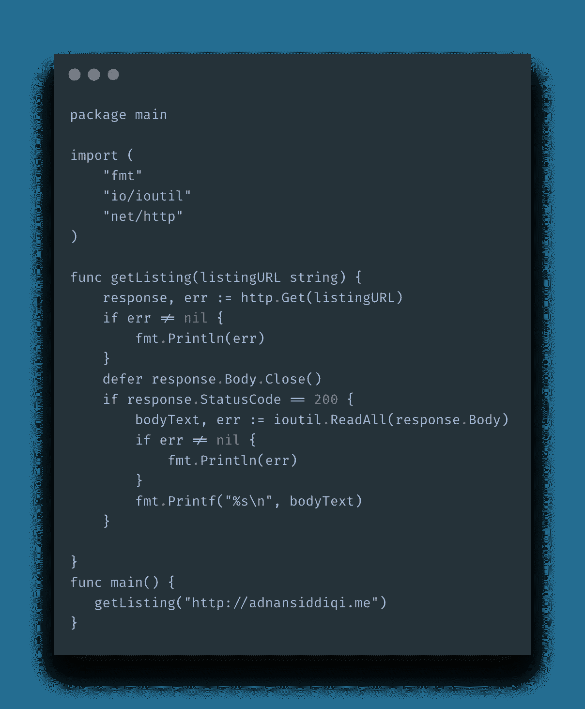
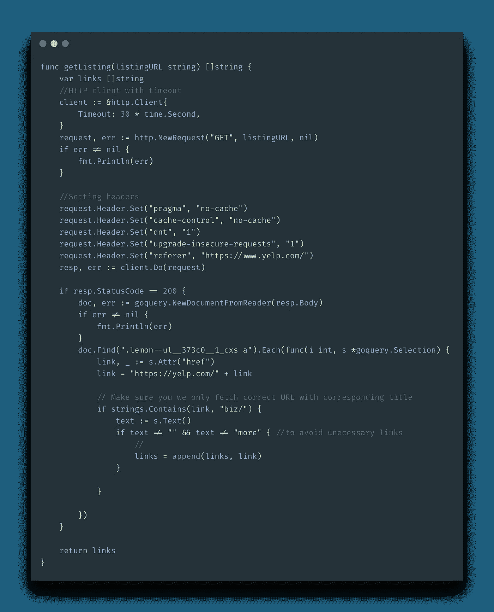
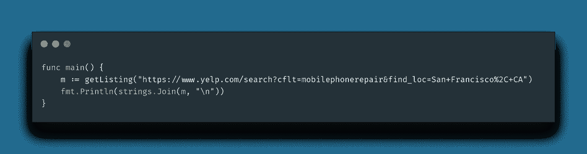

# 在 Go with goQuery 中创建您的第一个 Web scraper

> 原文：<https://itnext.io/create-your-first-web-scraper-in-go-with-goquery-2dcd45743165?source=collection_archive---------0----------------------->

我已经在这个[博客](http://blog.adnansiddiqi.me/tag/scraping/)上报道网络抓取很长时间了，但是它们大部分是用 Python 写的；无论是 Selenium 还是 Scrapy framework，都是基于 Python 语言的，但是 scraping 并不局限于特定的语言。任何为 Http 客户端和 HTML 解析器提供 API 或库的语言都能够为您提供 web 抓取工具。Go 还为你提供了编写网页抓取器的能力。Go 是一种编译和静态类型的语言，对于编写高效、快速和可扩展的 web 抓取器非常有用。感谢 *Goroutunes* 可以帮助你并行抓取数百个网页。

在这篇介绍性的文章中，我们将讨论由 Go 提供的访问网页或文件的 Http 库。我们还将讨论 **goQuery** ，一个 Http 客户端和一个类似于 jQuery 的 HTML 解析器。好了，说够了，我们来写一个基础刮刀吧。

# 转到 HTTP 库

我正在编写一个简单的 scraper，它将使用 Go 的`net/http`库来访问我的主页。我正在写作。我将使用`http.Get`访问该页面。`http.Get`是 Go 提供的默认 HTTP 客户端，默认设置。

当你运行这个程序时，它打印出我主页的 HTML 格式。函数`getListing`访问通过的 URL。为此我们使用了`http.Get`方法。导出的函数`Get`返回包含 HTTP 状态代码、响应内容本身等细节的响应对象。后来我使用了`ioutuil`的`ReadAll`来返回响应的文本。这一切都很好，但是正如我所说的,`Get`返回默认设置，您不能覆盖像 UserAgent、headers 和 timeout 这样的东西。默认的用户代理是`Go-http-client/1.1`，这对于同时检查浏览器用户代理的站点来说并不好。我们应该有一些选项来编写一个 scraper，它可以覆盖用户代理、超时，并且还允许设置代理。让我们写一个真实世界的刮刀。

# 创建 Yelp 刮刀

我们现在要在 Go/Golang 中创建一个 Yelp scraper，它将抓取旧金山*手机维修店*的 URL 列表。我们将首先建立一个*客户端*并创建一个新的*请求*。 [Goquery](https://github.com/PuerkitoBio/goquery) 将用于 HTML 解析。

首先，我们设置了一个`client`变量。由于`client`是一个`struct`变量，因此，我们使用`&`通过引用来调用它。我们将超时设置为 30 秒，这意味着它将在 30 秒后关闭连接，否则它将在死机前使用默认时间。接下来，我们通过调用`http.NewRequest`创建一个新的请求，在这个例子中，我们传递请求方法`GET`和 URL。最后一个参数设置为`nil`,因为在我们的例子中不需要。接下来，设置所需的头，然后通过调用`client.Do`方法发出请求。

一旦内容被接收，我们通过检查状态码 200 来确保，我们现在使用 *goQuery* 库来解析 HTML。

`doc, err := goquery.NewDocumentFromReader(resp.Body)`

稍后，我使用了接受 CSS 选择器并返回元素(如果有的话)的`Find`方法。然后，获取的链接被追加到一个数组中，该数组随后被返回。在主打印它们。

# 结论

这是关于在 Go 中编写网页抓取器的入门教程。Go 产生了一个编译好的程序，所以不像 Python，你可以毫不犹豫地把它分发给你的客户。也不需要安装 Go 运行时。一如既往，代码可在 [Github](https://github.com/kadnan/yelp-scraper-go) 上获得。

编写 scrapers 是一个有趣的旅程，但如果网站屏蔽了你的 IP，你可能会碰壁。作为个人，你也买不起昂贵的代理。为您提供一个负担得起的，易于使用的 API，让您刮网站没有任何麻烦。你不需要担心被屏蔽，因为 Scraper API 默认使用代理访问网站。除此之外，您也不需要担心 Selenium，因为 Scraper API 也提供了无头浏览器的功能。我也写过如何使用它。

*点击此处注册 my 或输入优惠码****Adnan 10****，即可获得* ***九折优惠*** *。如果你没有得到折扣，那么就在我的网站上通过电子邮件让我知道，我一定会帮助你。*

***打算用 Python 写一本关于 Web 抓取的书。点击*** [***这里***](https://forms.gle/YEyH4dTjeyrnB3DX9) ***给你反馈***

*原载于 2020 年 6 月 14 日*[*http://blog . adnansiddiqi . me*](http://blog.adnansiddiqi.me/create-your-first-web-scraper-in-go-with-goquery/)*。*