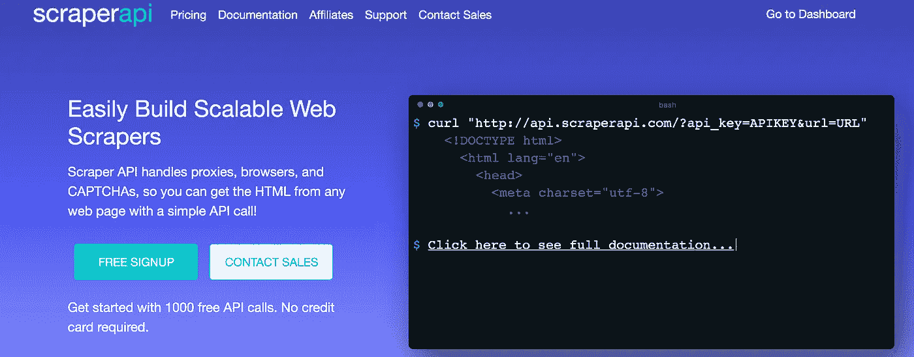
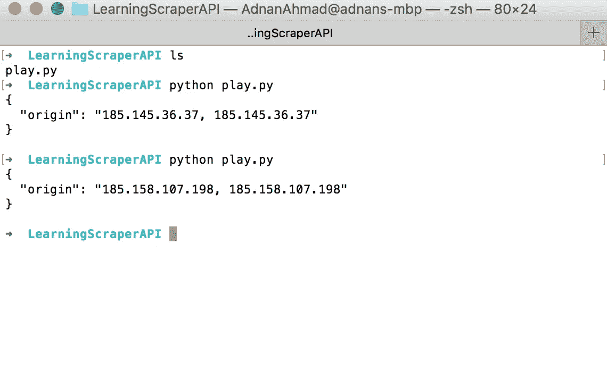
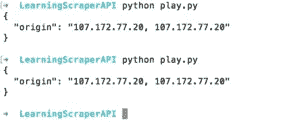

# 使用 Scraper API 和 Python 创建您的第一个 web scraper

> 原文：<https://itnext.io/create-your-first-web-scraper-with-scraper-api-and-python-a42b9f850eb6?source=collection_archive---------1----------------------->


最近，我遇到了一个工具，它可以解决你在浏览网站时通常会遇到的许多问题。这个工具叫做 [Scraper API](http://scraperapi.com/?via=adnan98) ，它提供了一个易于使用的 REST API 来轻松抓取不同类型的网站(Simple，JS enabled，Captcha 等)。在我继续之前，请允许我介绍一下 *Scraper API* 。

# 什么是刮刀 API

如果你访问他们的网站[你会发现他们的使命宣言:](https://www.scraperapi.com/?fp_ref=adnan22)

> Scraper API 处理代理、浏览器和验证码，因此您可以通过简单的 API 调用从任何网页获取 HTML！



正如它所暗示的，它为你提供了所有的东西来处理你在写文章时经常遇到的问题。

# 发展

Scraper API 提供了一个可以在任何语言中使用的 REST API。因为这篇文章与 Python 有关，所以我将主要关注使用这个工具的`requests`库。

你必须先和他们注册，作为回报，他们会给你一个 API 密匙来使用他们的平台。他们提供了 1000 个免费的 API 调用，足以测试他们的平台。此外，他们提供不同的计划，从初学者到企业，你可以在这里查看。

让我们尝试一个简单的例子，它也在[文档](https://www.scraperapi.com/documentation)中给出。

```
import requestsif __name__ == '__main__':
    API_KEY = '<YOUR API KEY>'
    URL_TO_SCRAPE = '[https://httpbin.org/ip'](https://httpbin.org/ip')payload = {'api_key': API_KEY, 'url': URL_TO_SCRAPE}r = requests.get('[http://api.scraperapi.com'](http://api.scraperapi.com'), params=payload, timeout=60)print(r.text)
```

假设您已经注册并获得了可以在[仪表盘](https://www.scraperapi.com/dashboard)上找到的 API，您可以在获得它后立即开始工作。当你运行这个程序时，它会显示你请求的 IP 地址。



你看到了吗，每次它都返回一个新的 IP 地址，很酷吧？

在某些情况下，您希望使用同一个代理给人一种感觉，好像单个用户正在访问网站的不同部分。为此，您可以在上面的`payload`变量中传递`session_number`参数。

```
URL_TO_SCRAPE = '[https://httpbin.org/ip'](https://httpbin.org/ip')
payload = {'api_key': API_KEY, 'url': URL_TO_SCRAPE,'session_number': '123'}
r = requests.get('[http://api.scraperapi.com'](http://api.scraperapi.com'), params=payload, timeout=60)
print(r.text)
```

它会产生以下结果:



你能注意到这里有相同的代理 IP 吗？

# 创建 OLX 废品收购站

就像之前的[刮相关帖子](http://blog.adnansiddiqi.me/tag/scraping/)一样，我将再次选择 OLX 来发表这篇帖子。我将首先迭代列表，然后将刮个别项目。下面是完整的代码。

```
payload = {'api_key': API_KEY, 'url': URL_TO_SCRAPE, 'session_number': '123'}r = requests.get('[http://api.scraperapi.com'](http://api.scraperapi.com'), params=payload, timeout=60)if r.status_code == 200:
        html = r.text.strip()
        soup = BeautifulSoup(html, 'lxml')
        links = soup.select('.EIR5N > a')for l in links:
            all_links.append('[https://www.olx.com.pk'](https://www.olx.com.pk') + l['href'])idx = 0if len(all_links) > 0:
            for link in all_links:
                sleep(5)
                payload = {'api_key': API_KEY, 'url': link, 'session_number': '123'}if idx > 1:
                    breakr = requests.get('[http://api.scraperapi.com'](http://api.scraperapi.com'), params=payload, timeout=60)if r.status_code == 200:
                    html = r.text.strip()
                    soup = BeautifulSoup(html, 'lxml')
                    price_section = soup.find('span', {'data-aut-id': 'itemPrice'})
                    print(price_section.text)idx += 1
```

我使用`Beautifulsoup`来解析 HTML。我在这里只提取了价格，因为目的是讲述 API 本身，而不是 *Beautifulsoup* 。如果你是 scraping 和 Python 的新手，你应该在这里看到我的帖子[。](http://blog.adnansiddiqi.me/write-your-first-web-scraper-in-python-with-beautifulsoup/)

# 结论

在这篇文章中，你学习了如何使用 Scraper API 进行抓取。无论你用这个 API 做什么，你也可以用其他方法来做；这个 API 为您提供了一切，特别是通过 Javascript 呈现页面，您需要无头浏览器，有时在远程机器上设置无头抓取会变得很麻烦。Scraper API 在打理，对个人和企业象征性收费。我工作的公司每月花费 100 美元用于代理 IP。

哦，如果你通过我的推荐链接在这里注册[或者输入促销代码 **adnan10** ，你将获得 10%的折扣。如果你没有得到折扣，那么就在我的网站上通过电子邮件让我知道，我一定会帮助你。](http://scraperapi.com/?via=adnan98)

在接下来的日子里，我会写更多关于 Scraper API 的帖子，讨论更多的特性。

*本帖原载* [*此处*](http://blog.adnansiddiqi.me/create-your-first-web-scraper-with-scraper-api-and-python/) *。*