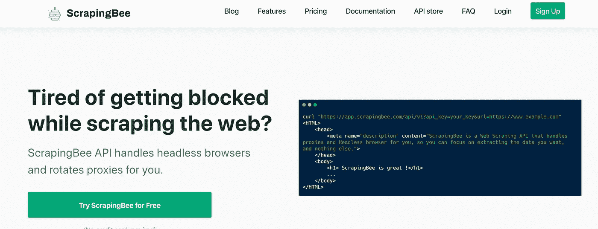
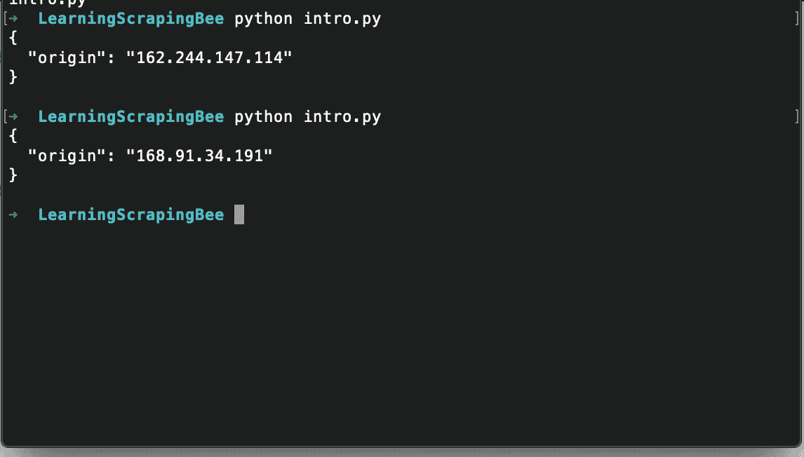
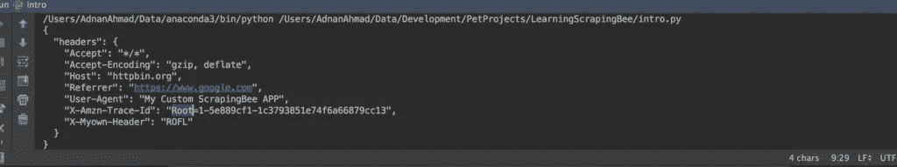

# 使用 ScrapingBee API 和 Python 创建您的第一个 web scraper

> 原文：<https://itnext.io/create-your-first-web-scraper-with-scrapingbee-api-and-python-addf0dc5df58?source=collection_archive---------3----------------------->

在这篇文章中，我将讨论另一个基于云的抓取工具，它可以解决你在抓取网站时经常遇到的问题。这个平台是由一个基于云的抓取工具 [ScrapingBee](https://www.scrapingbee.com?fpr=adnan-35) 推出的。

# 什么是废品

如果你访问他们的[网站](https://www.scrapingbee.com?fpr=adnan-35)，你会发现如下内容:

> **ScrapingBee API 处理无头浏览器，替你轮换代理。**

正如它所暗示的，它为您提供了所有的东西来处理您在编写抓取器时经常遇到的问题，尤其是代理和无头抓取的可用性。没有为 Selenium 安装 web 驱动程序，耶！

# 发展

ScrapingBee 基于 REST API，因此可以在任何编程语言中使用。因为这篇文章与 Python 有关，所以我将主要关注使用这个工具的`requests`库。

一旦你注册并得到他们的确认，他们会给你一个 API 密匙，你可以在仪表盘上看到。他们提供了 1000 个免费的 API 调用，足以测试他们的平台。此外，他们提供不同的计划，从初学者到企业，你可以在这里查看。

让我们试一个简单的例子。

执行这段代码时，您将看到如下输出:

你注意到了吗，每次它都返回一个新的 IP 地址，很酷吧？

您也可以在需要的地方传递您自己的自定义头。如果我将`URL_TO_SCRAPE`改为`https://httpbin.org/headers`，它将转储默认的标题。

所以我把 *httpbin* 的 URL 改成了显示标题。首先，我将参数`forward_headers`设置为`True`，然后覆盖现有的标题，在本例中，参数`User-Agent`为`Scn-User-Agent`。根据文档，您必须将`Scn-`设置为前缀，以覆盖现有的前缀或添加您自己的前缀。在我们的例子中，我添加了一个新的头作为`Scn-X-MyOwn-Header`。当我运行它时，它会显示以下内容:

很酷，不是吗？

# 创建 OLX 刮刀

就像之前的[刮相关帖子](http://blog.adnansiddiqi.me/tag/scraping/)一样，我将再次选择 OLX 来发表这篇帖子。我将首先迭代列表，然后将刮个别项目。下面是完整的代码。

我使用`Beautifulsoup`来解析 HTML。我在这里只提取了价格，因为目的是讲述 API 本身，而不是 *Beautifulsoup* 。如果你是 scraping 和 Python 的新手，你应该在这里看到我的帖子[。
这里我介绍了另一个参数，`country_code`，我在美国用过。这个参数确保只使用来自美国的代理，而不是任何随机的国家。无论如何，当我刮 OLX 的*药片部分*时，它打印如下:](http://blog.adnansiddiqi.me/write-your-first-web-scraper-in-python-with-beautifulsoup/)

# 结论

在这篇文章中，您了解了如何使用 ScrarpingBee API 进行抓取。无论你用这个 API 做什么，你也可以用其他方法来做；这个 API 为您提供了一切，特别是通过 Javascript 呈现页面，您需要无头浏览器，有时在远程机器上设置无头抓取会变得很麻烦。ScrarpingBee API 正在处理这个问题，并对个人和企业收取象征性的费用。我工作的公司每月花费 100 美元用于代理 IP。

哦，如果你用我的推荐链接在这里注册[或者输入促销代码 **ADNAN** ，你将获得 **10%的折扣**。如果你没有得到折扣，那么就在我的网站上通过电子邮件让我知道，我一定会帮助你。](https://www.scrapingbee.com?fpr=adnan-35)

在接下来的几天里，我会写更多关于 ScrarpingBee API 的文章，讨论更多的特性。

*原载于 2020 年 4 月 4 日*[*http://blog . adnansiddiqi . me*](http://blog.adnansiddiqi.me/create-your-first-web-scraper-with-scrapingbee-api-and-python/?utm_source=r_python_scrapingbee&utm_medium=reddit&utm_campaign=c_r_python_scrapingbee)*。*