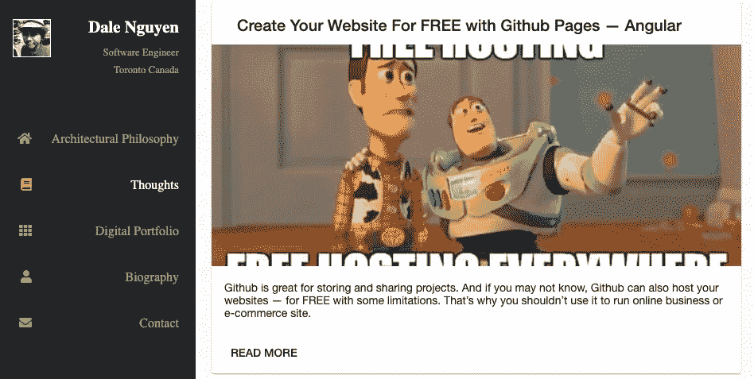
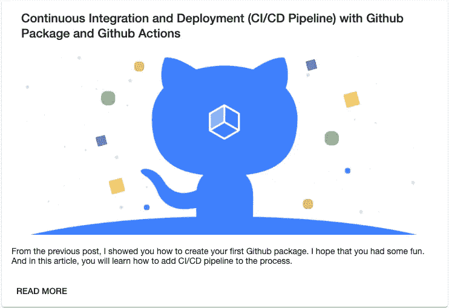
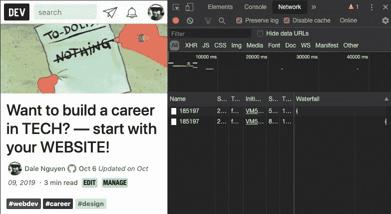

# 用 DevTO API 创建你自己的博客

> 原文：<https://itnext.io/create-your-own-blog-with-devto-api-e33701117043?source=collection_archive---------8----------------------->



[https://dalenguyen.me/blog](https://dalenguyen.me/blog)

2019 年 6 月加入 [DevTO](https://dev.to) 。这是一个非常有趣的平台，程序员可以在这里分享想法，互相帮助成长。这是一个分享和发现伟大想法、进行辩论和交朋友的在线社区。任何人都可以分享文章、问题、讨论等。只要他们有权分享他们的话。欢迎从你自己的博客交叉发帖——引用“关于”页面。

在平台上写了几个帖子，其实挺喜欢的。而且更耐人寻味的是，我发现了他们的 [**API(测试版)**](https://docs.dev.to/api/) ，这让我可以获得 JSON 格式的文章。

我知道我可以把所有的帖子从 DevTO 放到我新重建的网站上。还有一些挑战需要解决:

*   它在我的网站上应该是什么样子？
*   我如何显示“所有文章”页面？
*   如何显示文章页面？

幸运的是，我心中有数，并且已经付诸行动。这是我如何用 Angular 实现的，你可以用任何你喜欢的框架来实现。

在我的网站上应该是什么样子？

我试着让它在不同的设备上简单易读。你可以做一些研究，然后决定如何设计你自己的博客。

**如何显示“所有帖子”页面？**

我可以获取所有文章的端点是[发布的文章](https://docs.dev.to/api/#tag/articles/paths/~1articles/get)。用参数“username”可以返回我写的所有文章。

```
[https://dev.to/api/articles?username=dalenguyen](https://dev.to/api/articles?username=dalenguyen)
```

这是样品返回:

```
[
   {
      "type_of":"article",
      "id":186759,
      "title":"Create Your Website For FREE with Github Pages — Angular",
      "description":"---",
      "cover_image":"[-](https://res.cloudinary.com/practicaldev/image/fetch/s--cPfRyEm7--/c_imagga_scale,f_auto,fl_progressive,h_420,q_auto,w_1000/https://res.cloudinary.com/practicaldev/image/fetch/s--CjDFw59j--/c_imagga_scale%2Cf_auto%2Cfl_progressive%2Ch_420%2Cq_auto%2Cw_1000/https://thepracticaldev.s3.amazonaws.com/i/oz08njykv6lt2tcm95i3.jpeg)--",
      "published_at":"2019-10-09T13:19:07.906Z",
      "tag_list":[
         "angular",
         "github",
         "beginners",
         "webdev"
      ],
      "slug":"create-your-website-for-free-with-github-pages-angular-1c05",
      "path":"/dalenguyen/create-your-website-for-free-with-github-pages-angular-1c05",
      "url":"[-](https://dev.to/dalenguyen/create-your-website-for-free-with-github-pages-angular-1c05)--",
      "canonical_url":"[-](https://dev.to/dalenguyen/create-your-website-for-free-with-github-pages-angular-1c05)--",
      "comments_count":0,
      "positive_reactions_count":39,
      "published_timestamp":"2019-10-09T13:19:07Z",
      "collection_id":null,
      "user":{
         "name":"Dale Nguyen",
         "username":"dalenguyen",
         "twitter_username":null,
         "github_username":"dalenguyen",
         "website_url":"[https://dalenguyen.me](https://dalenguyen.me)",
      }
   },
--------------
]
```

它只提供基本信息，没有文章的正文。我使用的是 **id，标题，路径，描述，封面图片**。在下一节中你会知道为什么我需要 id**和**。这是我在博客上展示的方式。



对于内容，使用 HttpClient 从 API 获取 JSON 非常容易。

```
// blog.service.tstry {
      articles = await this.http.get('https://dev.to/api/articles?username=dalenguyen').toPromise()
} catch (error) {
      console.error(error)
}
```

然后用棱角分明的材质表现出来

```
// blog.component.html<div id="blog">
  <h1>Blog</h1><section id="articles" *ngIf="articles.length > 0">
    <mat-card class="example-card" *ngFor="let article of articles">
      <mat-card-header>
        <mat-card-title>{{ article.title }}</mat-card-title>
      </mat-card-header>
      
      <mat-card-content>
        <p>
          {{ article.description }}
        </p>
      </mat-card-content>
      <mat-card-actions>
        <button mat-button (click)="openPost(article)">READ MORE</button>
      </mat-card-actions>
    </mat-card>
  </section>
</div>
```

为了获取单篇文章，我将使用 id 来获取文章的内容。

```
// blog.compoment.tsopenPost(article: any) {
    this.router.navigate(['/blog', article.slug], { queryParams: { id: article.id }})
}
```

如何显示文章页面？

这是一个棘手的部分，因为我需要发出另一个请求来获取一个帖子的内容——id 就是用于这个目的的。

```
// post.service.tstry {
      article = await this.http.get('https://dev.to/api/articles/186759').toPromise()
} catch (error) {
      console.error(error)
}
```

对于 HTML 部分

```
// post.component.html<div id="post" *ngIf="article !== null">
  <header>
    <h1>{{ article.title }}</h1>
    <p>Written by {{ article.user.name }}</p>
    <p> {{ article.published_at | date }}</p>
  </header><article [innerHTML]="articleBody">
  </article>
</div>
```

对于文章中嵌入的 URL，我该如何处理？如果我只是离开它，我会导致 DevTO 网站，我真的不希望这样。所以在将 HTML 提供给前端之前，我必须将域名从 DevTo 替换到我的网站。

```
// post.component.tsprivate cleanArticleContent(html: string): string {
    return html.replace(/https:\/\/dev.to\/dalenguyen/g, '[https://dalenguyen.me/blog'](https://dalenguyen.me/blog'))
}
```

对于 id 部分，只要在 DevTO 上有嵌入的链接，就必须手动添加 Id。

```
[https://dev.to/dalenguyen/want-to-build-a-career-in-tech-start-with-your-website-44i7?id=185197](https://dev.to/dalenguyen/want-to-build-a-career-in-tech-start-with-your-website-44i7?id=185197)
```

当您打开 inspect 并转到网络选项卡时，可以找到 id。



从现在开始，你可以创建你自己的博客，它的内容将需要几个小时，直到文章可以在你的网站上显示。你可以从我的 [**Github**](https://github.com/dalenguyen/dalenguyen.github.io) 账号找到项目。