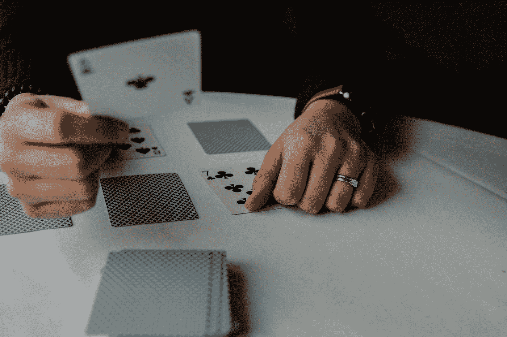
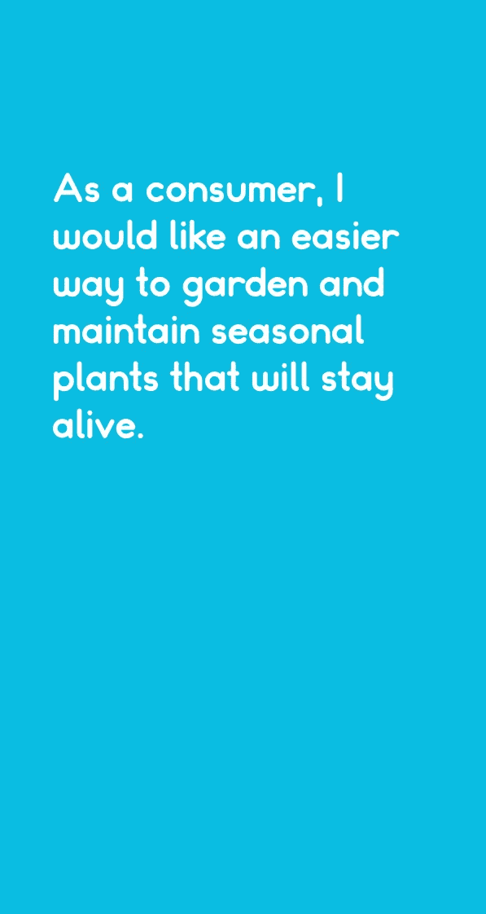

# 用无头浏览器创建你自己的卡牌游戏

> 原文：<https://itnext.io/create-your-own-card-game-with-headless-chrome-3888ceaa4b03?source=collection_archive---------2----------------------->

## 对纸牌游戏有什么想法？设计它。打印出来。卖掉它！



安德里克·朗菲尔德在 [Unsplash](https://unsplash.com?utm_source=medium&utm_medium=referral) 上拍摄的照片

在我上一篇文章中提出的头脑风暴提示和挑战的工作中，我认为这会成为一个非常有趣的纸牌游戏。

[](https://medium.com/swlh/the-business-idea-game-dbda79011b08) [## 商业创意游戏

### 让你的创造力源源不断的 25 个提示

medium.com](https://medium.com/swlh/the-business-idea-game-dbda79011b08) 

这个概念包括以用户故事的形式生成许多不同的提示，按照行业和类型对它们进行分组，并按照“扩展包”模式发布这些卡片的不同包。这个游戏可以是单人的，也可以是多人合作的，但不一定有“赢家”或“成功之路”这纯粹是为了激发创造力和思维能力。

然而，这篇文章不是关于这个游戏的概念，所以我将回到正轨。在探索创建一个纸牌游戏的想法时，我走了不同的设计和印刷途径，我相信我偶然发现了一种最大化质量和效率的方法。我发现，通过使用 JSON、HTML 模板和 headless Chrome，可以快速迭代设计，而不是使用 Adobe Illustrator、Adobe Indesign 或 Inkscape 等工具手工设计每张卡片。在本教程中，我们还将使用 Golang 作为与 Liquid template engine 结合使用的语言，但任何编程语言和模板引擎都可以使用。

整个过程是:

*   在印刷服务机构找到一副卡片的可接受尺寸
*   使用模板语言构建一个 HTML + CSS 模板(我们将使用[液体](https://shopify.github.io/liquid/)
*   创建一个程序，将参数注入模板，并通过 DevTools 协议编写 Google Chrome 脚本，对模板输出进行截图

示例代码可在此处找到:

[https://github.com/csthompson/cardbuilder](https://github.com/csthompson/cardbuilder)

## 寻找印刷服务

创建自定义纸牌游戏的第一步(当然除了设计之外)是找到一个印刷服务，因为这将定义用于构建纸牌的模板。我发现的一个很棒的服务是让玩 Cards.com 变得更容易。它有许多不同尺寸的选项，定制的盒子，甚至可以定制的小册子，包含在每一副牌中。不管使用哪种印刷服务，大多数都会提供不同尺寸的卡片组和每副卡片组中包含的卡片数量。在这个例子中，我们将使用[多米诺骨牌大小的卡牌](https://www.makeplayingcards.com/design/custom-domino-sized-cards-deck.html)。

一旦您选择了打印的形式因素和各种参数，单击“开始设计”，并为所有卡片选择自定义图像和文本。下一页提供了必要的尺寸，以及批量上传所有图像或卡片正面的实用程序。重要的部分是分辨率，对于多米诺骨牌大小的牌来说是 597x1122。这个决议将决定我们为卡片构建 HTML 模板的方式。

## 无头 Chrome 简介

谷歌 Chrome 是一款流行的网络浏览器，它提供了一个名为 [Chrome DevTools 协议](https://chromedevtools.github.io/devtools-protocol/)的编排层。这个编排层允许其他服务和应用程序“检测、检查、调试和分析 Chrome、Chrome 和其他基于 flash 的浏览器。”这意味着浏览器基本上可以通过编程来控制，以执行诸如 web 应用程序的自动化测试、抓取网站或执行[机器人流程自动化](https://en.wikipedia.org/wiki/Robotic_process_automation) (RPA)等任务。对于这个用例，我们将在无头模式(无用户界面)下使用 Chrome 获取 HTML 页面的[截图](https://developers.google.com/web/updates/2017/04/headless-chrome#screenshots)。由此产生的截图将用于我们的扑克牌。

## 控制铬

有大量不同语言的不同库可以与 Chrome DevTools 协议交互。与 Chrome DevTools 交互最流行的组合是[puppeter](https://github.com/puppeteer/puppeteer)库，这是一个 NodeJS 库。然而，我是 Golang 的忠实粉丝，我发现了令人敬畏的 chromedp 包，它使与 Chrome 的交互变得轻而易举。

## 选择模板语言

Golang 通过 text/template 和 html/template 包提供了一个令人惊叹的内置模板语言，但是我想改变一下，在这个用例中使用 Liquid templating 引擎。这个决定背后的主要原因是表明任何语言都可以用于这个用例，只要有可用的模板库(Ruby、Python、C#、Java、Javascript 等)。你可能会认为 Liquid 是驱动 [Shopify](https://www.shopify.com/) 店面的模板语言。

## 构建模板

一旦选择了模板语言，我们就可以创建实际的模板了。使用印刷服务提供的分辨率(对于此用例为 597x1122)，我们将能够定义模板的尺寸。在这个例子中，我们只是用纯色背景向卡片中添加文本，但是这样做的限制只受 HTML 和 CSS 的限制。您可以添加自定义图标，不同的形状，多个部分，图像和任何你能想到的！你可以看到下面的简单模板。

## 将值注入模板

一套扑克牌通常有多种不同类型的牌，都遵循相似的设计，但每张牌都有一套独特的属性。这种整体设计的相似性，但在特定属性上的差异使得这个过程对 HTML 模板非常有益。那么我们如何将这些特定的属性放到模板中呢？我们可以使用 JSON 文件。

一个包含 JSON 对象数组的简单文件，其中每个 JSON 对象代表一张卡片，提供了一种简单的方法来迭代设计和值，而不必每次都调整整组卡片。下面是一个示例 JSON 文件，其中每张卡都有一个名为“prompt”的属性。你会看到这些提示来自上面链接的文章。

上面的每个 JSON 对象将被用来定义一个卡片，每个卡片都有一个唯一的提示。查看模板，我们可以清楚地看到“提示”是在哪里注入的:

```
<div class="prompt">
    {{card.Prompt}}
</div>
```

我们可以让每个对象像我们喜欢的那样复杂，允许像复杂的交易或冒险游戏这样的卡片组。例如，我们甚至可以使用这种[技术](https://www.w3schools.com/css/css_image_sprites.asp)将 spritesheets 加载到卡片中。令人敬畏的精灵可以在[开放游戏艺术](https://opengameart.org/)上找到，你可以使用这个[工具](http://www.spritecow.com/)计算出每个精灵的偏移量。

既然我们已经有了模板和定义的值，我们就可以让它们发挥作用了。

## 填充模板并截图

我们的程序将负责两个主要任务。

*   填充模板并将其保存为 HTML 文件
*   用 Chrome 截取 HTML 文件的截图

Golang 有一个内置的模板引擎，但正如前面提到的，我们将使用液体，这可以通过这个包来完成:【github.com/osteele/liquid。

因为 Golang 是强类型的，所以必须预先定义卡的类型，这样我们才能正确地读取 JSON 文件。对于复杂的 JSON 对象，Python 或 Javascript 等语言可能会灵活得多。下面是我们将用来定义每张卡的简单结构:

```
type Card struct {
    Prompt string `json:"prompt"`
}
```

使用上面的结构，我们可以读取文件，将 JSON“解组”到一片卡片中，并遍历每一张卡片来填充 Liquid 模板。

让我们深入了解将使用 headless Chrome 渲染和截图 HTML 代码的代码。Chrome DevTools 允许程序覆盖视口，视口是屏幕的尺寸。以下代码大量借鉴了 Golang chromedp 包中提供的[示例代码](https://github.com/chromedp/examples/tree/master/screenshot):

我们可以看到宽度和高度被覆盖，并且应用了一个剪辑来确保我们只捕获由印刷服务定义的尺寸。

## 运行代码

下面是运行在[库](https://github.com/csthompson/cardbuilder)中找到的代码的步骤。

1.  下载并安装最新版本的 Golang[https://golang.org/doc/install](https://golang.org/doc/install)
2.  下载并安装 Git
    [https://Git-SCM . com/book/en/v2/Getting-Started-Installing-Git](https://git-scm.com/book/en/v2/Getting-Started-Installing-Git)
3.  创建一个保存代码的目录，例如:
    `mkdir -p ~/workspace/cardbuilder`
    `cd ~/workspace/cardbuilder`
4.  克隆资源库:
    `git clone [https://github.com/csthompson/cardbuilder](https://github.com/csthompson/cardbuilder)`
5.  运行程序:
    `go run main.go`

go.mod 文件应该会自动处理所有的依赖项

一旦程序运行，您应该会看到。输出目录中填充的 png 文件。如果您在运行该程序时有任何问题，请随时在下面发表评论！



## 结论

程序员经常被创造精神所困扰，总想造点什么或者做点什么。源代码可以被看作是无限创造力的工具，那么为什么不把代码用于程序之外的东西呢？通过使用 HTML、CSS、一些简单的脚本和 headless Chrome，可以很容易地创建一个卡牌游戏，并可能最终发布和用作副业。

我很想看看你能想出什么！在推特上关注我，分享你的设计:)【https://twitter.com/CooperThompson8 