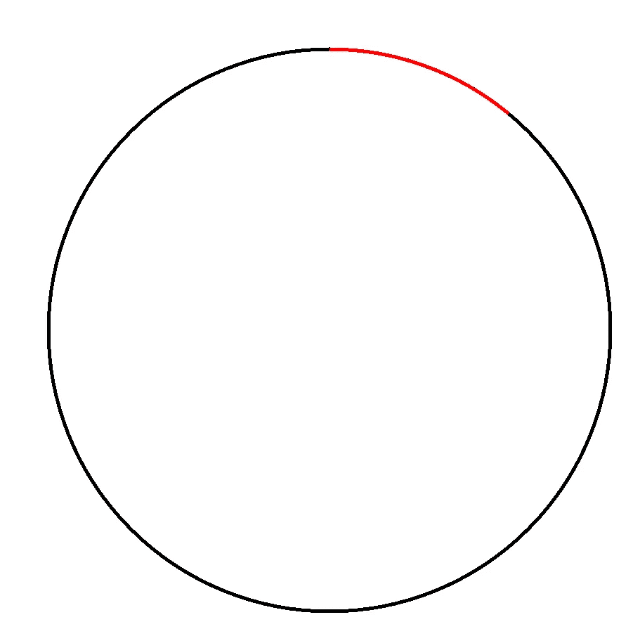
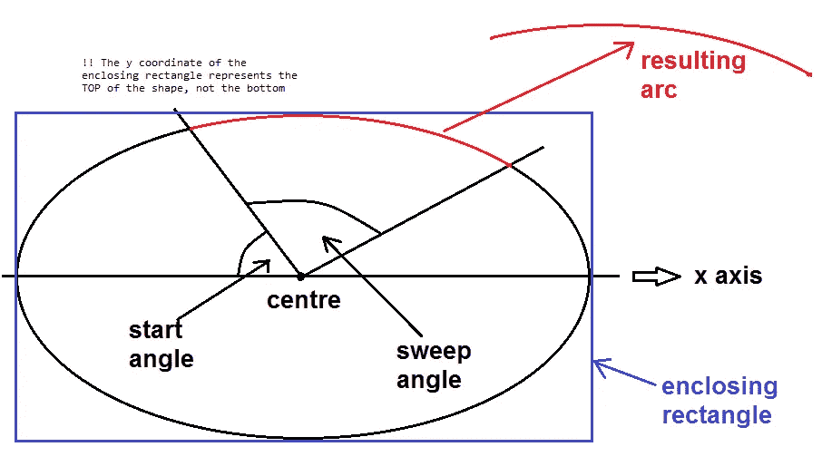
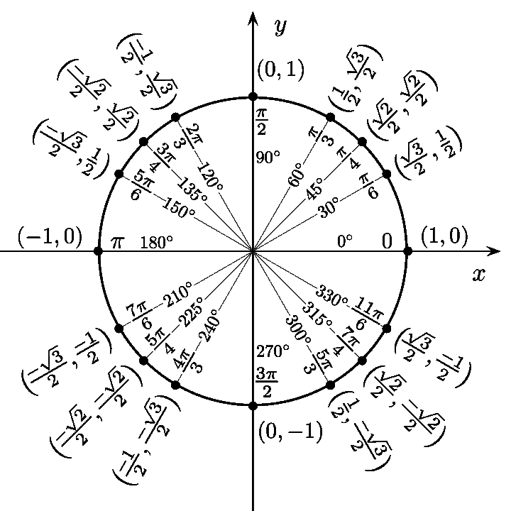
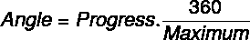

# 使用 skiasharp 创建你自己的圆形进度条

> 原文：<https://itnext.io/create-your-own-circular-progress-bar-using-skiasharp-7c3f5616a754?source=collection_archive---------2----------------------->


圆形进度条是一个非常受欢迎的控件，设计师喜欢在移动应用程序中使用，同样受欢迎的是，它不是所有移动平台(IOS、Android 和 windows)的官方 SDK 的一部分。

在本文中，我们将在不到 10 分钟的时间内实现我们自己的跨平台循环进度条:D 相信我，在我们完成之后，你会爱上数学。

# 步骤 1:安装 SkiaSharp NuGet 包

在你所有的解决方案中安装 NuGet 包。视图.表格项目

https://www.nuget.org/packages/SkiaSharp.Views.Forms

# 步骤 2:初始化 skia 视图画布

在 xaml 中添加画布视图

```
<forms:SKCanvasView x:Name="SkCanvasView" 
HeightRequest="500" 
WidthRequest="500" 
VerticalOptions="FillAndExpand" 
HorizontalOptions="FillAndExpand" />
```

现在让我们创建一个类“ProgressDrawer”这个类将负责绘制和维护我们的进度条

```
public class ProgressDrawer
    {
        private readonly SKCanvasView _canvas;
        public ProgressDrawer(SKCanvasView canvas)
        {
            _canvas = canvas;
        }
    }
```



基本上，循环过程由两部分组成

**1-代表完整进度条的背景圆圈**

**2-当前进度值的弧线(红色)**

所以我们需要在我们的类中有两个方法，一个用于圆，一个用于弧

所以我们的 ProgressDrawer 类看起来像

```
public class ProgressDrawer
    {
        private readonly SKCanvasView _canvas;public ProgressDrawer(SKCanvasView canvas)
        {
            _canvas = canvas;
        }public void DrawCircle(int radius, SKPoint center, float strokewidth, SKColor color)
        {
        }public void DrawPercentage(Circle circle, Func<float> progress, float strokewidth, SKColor color)
        {
        } }
```

# 第三步:画圈法

画一个圆只需要圆心和半径，现在，我们假设我们的圆心是(0，0)

```
public void DrawCircle(int radius, SKPoint center, float strokewidth,SKColor color)
    {
      _canvas.PaintSurface += (sender, args) =>
         {
           args.Surface.Canvas.DrawCircle(center, radius,
           new SKPaint() {
                          StrokeWidth = strokewidth,
                          Color = color,    
                          IsStroke = true});
          };         
     }
```

Skiasharp canvas 只能在 1 处理程序 PaintSurface 事件中绘制，因此我们添加了一个处理程序，它使用使用 [SKCanvas 绘制静态圆来绘制圆。画圆](https://docs.microsoft.com/en-us/dotnet/api/skiasharp.skcanvas.drawcircle?view=skiasharp-1.68.1)法。

为了更好的代码质量和以后的使用，让我们创建一个包含半径和中心点属性的圆类

```
public class Circle
    {   
        public SKPoint Center { get;}
        public  float Redius { get;}
        public Circle(float redius, SKPoint center)
        {
            Redius = redius;
            Center = center;
        }

    }
```

现在让我们重构我们的 Draw Circle 方法来使用 Circle 类

```
public void DrawCircle(Circle circle, float strokewidth, SKColor color)
        {
            _canvas.PaintSurface += (sender, args) =>
            {
                args.Surface.Canvas.DrawCircle(circle.Center,  circle.Redius,
                    new SKPaint()
                    {
                        StrokeWidth = strokewidth,
                        Color = color,
                        IsStroke = true
                    });
            };
        }
```

# 第四步:画圆弧法

```
void DrawPercentage(Circle circle,Func<float> progress, float strokewidth, SKColor color)
```

正如所料，绘制圆弧方法需要知道背景圆和进度值。



与圆不同，圆弧绘制稍微复杂一点，所以我们需要外接矩形、起始角度和扫描角度。

很可能包围矩形只是一个正方形的高度和宽度等于背景圆的直径。

## 1-封闭矩形

所以我们可以简单地在 circle 类中添加一个 Rect 属性

```
public SKRect Rect => 
                    new SKRect(
                                Center.X-Redius,
                                Center.Y-Redius,
                                Center.X+Redius,
                                Center.Y+Redius);
```

## 双起始角度

对于起始角度，由于我们想从垂直位置(12 点钟)开始，它应该是 90 度，但因为 skiasharp 角度是顺时针方向，所以我们需要将角度翻转到 270 度。



## 3-扫描角度

扫描角度是弧的起点和终点之间的角度，因此我们只需要将属于区间[0，100]的进度值映射到一个从 0 到 360 的角度。

最简单的方法就是使用这个等式



```
var angle = progress * 3.6f;
```

现在把这些放在一起，我们画圆弧的方法就是

```
public void DrawArc(Circle circle,Func<float> progress, float strokewidth, SKColor color)
        {
            _canvas.PaintSurface += (sender, args) =>
            {
                var angle = progress.Invoke() * 3.6f;
                args.Surface.Canvas.DrawArc(circle.Rect, 270, angle, false,
                    new SKPaint() {StrokeWidth = strokewidth, Color = color, IsStroke = true});
            };
        }
```

我们使用 Func <float>来表示进度，而不是将其作为一个值，因为进度值会不断变化，这个 draw 方法只被调用一次来设置事件处理程序(我相信它应该被重命名为 SetupArcDrawing)</float>

# **设置 4:重构代码**

这听起来有点有趣，但实际上不需要订阅 PrintSurface 事件两次，我们只需要订阅一次并绘制圆和弧。

中心点位置通常相对于画布大小，画布大小信息仅在 PrintSurface 事件中可用，因此正确的唯一方法是将位置计算作为 circle 类中的一个函数，并在每次 print surface 事件触发时计算位置，顺便说一下，这将使我们的进度免费响应。

> 请考虑将此类设置为可处置的，并取消订阅事件处理程序。

# 设置 5:创建依赖项属性并开始使用控件

现在我们完成了，您可以像 xaml 中的任何其他控件一样使用 CircularProgressView。

# 第六步:跟着我

请在媒体和推特上关注我

[](https://twitter.com/MCC_Ahmed) [## 艾哈迈德·福阿德

### 艾哈迈德·福阿德的最新推文(@MCC_Ahmed)。我是 PlanRadar 的一名软件工程师，目前住在维也纳…

twitter.com](https://twitter.com/MCC_Ahmed) 

如果你想支持我，请在 ko-fi.com 与我分享你的咖啡

[](https://ko-fi.com/ahmedfouad) [## 给艾哈迈德·福阿德买杯咖啡。ko-fi.com/ahmedfouad

### 我是 PlanRadar 的一名软件工程师，目前住在奥地利的维也纳。我的兴趣范围从技术到网络…

ko-fi.com](https://ko-fi.com/ahmedfouad) 

如需推荐，请阅读丹尼尔·希夫曼的《Cod 的本质》一书，无论你的编码水平如何，这本书都会帮助你用简单的方法解决复杂的编码问题。